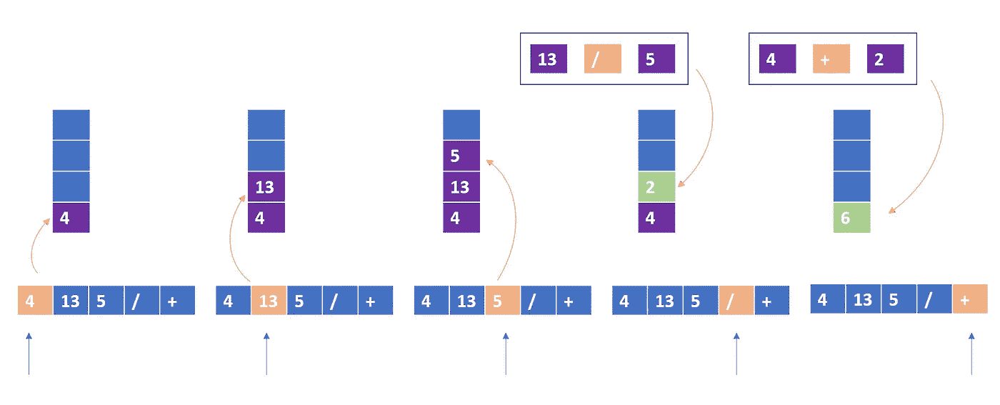

# 反向波兰符号—每日挑战五月

> 原文：<https://medium.com/nerd-for-tech/reverse-polish-notation-daily-challenge-may-f0ddadc67b5f?source=collection_archive---------28----------------------->


照片由[米哈尔·马特隆](https://unsplash.com/@michalmatlon?utm_source=unsplash&utm_medium=referral&utm_content=creditCopyText)在 [Unsplash](https://unsplash.com/s/photos/math?utm_source=unsplash&utm_medium=referral&utm_content=creditCopyText) 上拍摄

今天的问题来自每日 Leetcode 编码挑战赛——五月版。这是一个中等标签的问题。让我们看看问题陈述。

## [150](https://leetcode.com/problems/evaluate-reverse-polish-notation/) 。评估反向波兰符号

评估[反向波兰符号](http://en.wikipedia.org/wiki/Reverse_Polish_notation)中算术表达式的值。

有效的运算符有`+`、`-`、`*`和`/`。每个操作数可以是整数或其他表达式。

**注意**两个整数之间的除法应该向零截断。

## 示例:

```
**Input:** tokens = ["2","1","+","3","*"]
**Output:** 9
**Explanation:** ((2 + 1) * 3) = 9
```

## 理解问题:

从上面的例子中，我们了解到，每当我们遇到一个操作符时，最后两个元素就变成了操作数。同样，一旦我们计算出结果，这个值就成为最后一个操作数。为了跟踪操作数和计算结果，我们可以使用堆栈并将操作数保存在其中。当我们在列表中看到一个操作符时，我们弹出最后两个元素并执行所需的操作。我们还将结果放回堆栈中。



## 代码实现:

```
def evalRPN(tokens):
    stack = []
    for token in tokens:
        if token in '/+-*':
            op1 = stack.pop()
            op2 = stack.pop()
            if token == '/':
                val = op2 / op1
            elif token == '+':
                val = op2 + op1
            elif token == '-':
                val = op2 - op1
            elif token == '*':
                val = op2 * op1
            stack.append(int(val))
        else:
            stack.append(int(token))
    return stack[0]
```

## 复杂性分析:

**时间复杂度:** O(N)，我们对给定的数组做一次遍历。

**空间复杂度:** O(N)我们使用堆栈来存储操作数。

编码快乐！！