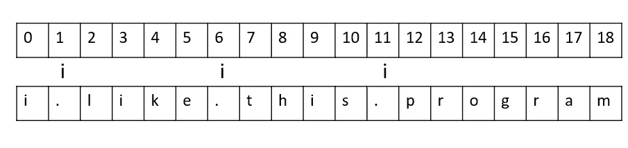
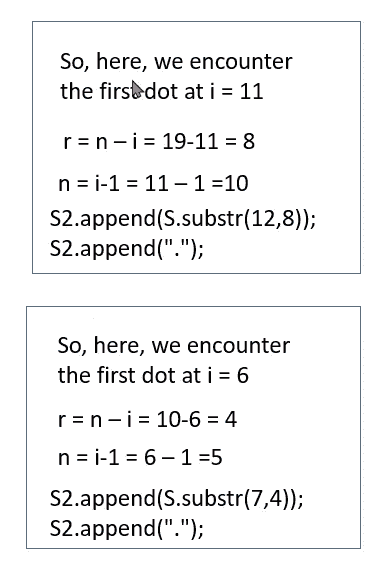

# 反转给定字符串中的单词

> 原文：<https://medium.com/nerd-for-tech/reverse-words-in-a-given-string-fabcff3edd85?source=collection_archive---------4----------------------->

用线串

**问题陈述:**

给定一个字符串 S，反转该字符串而不反转它的单个单词。单词由点分隔。

 [## 反转给定字符串中的单词|练习| GeeksforGeeks

### 输入:S = I . like . this . program . very . much 输出:much.very.program.this.like.i 解释:反转整个…

practice.geeksforgeeks.org](https://practice.geeksforgeeks.org/problems/reverse-words-in-a-given-string5459/1) 

输入:

1.  这里，他们给出了字符串 S 作为输入，其中单词由点分隔。

输出:

1.  应该返回反转的字符串，而不反转其中由点分隔的单个单词。

例如:

*   输入= S = i.like.this.program .非常非常
*   OUTPUT = much . very . program . this . like . I

我们将在这里使用的一些字符串函数如下:

1.  size()-计算字符串的大小。
2.  substr() —从给定字符串中查找字符串的一部分，即子字符串。
3.  append()-将一个字符串的字符连接到另一个字符串的末尾。

# 解决方案:

# 第一步:

1.  首先，我们将使用 size()函数找到给定字符串的大小:

**int n = s . size()；**

2.然后，我们将声明两个 int 类型的变量，即 **i** (跟踪索引)和 **r** (存储单词中由点分隔的字符数)以及一个字符串 S2。

**int I；** //跟踪字符串索引
/**字符串 S2；** //逐步存储反转后的字符串
**int r；**//存储一个字中的字符数

# 第二步:

1.  这里，我们将在这里形成主循环。我们将从最后一个遍历到第一个，因为我们必须反向。指数继续下降，直到遇到一个点。

**for(I = n-1；I>= 0；我——)**

**if(S[i] == ' . ')**

2.因此，当我们遇到一个点时，我们将使用以下代码:

r = n-I；//这给出了必须追加到 S2 中的单词的大小

n = I-1；//给出字符串的剩余大小

S2.append(S.substr(i+1，r))；

//这一行基本上是从第(i+1)个位置开始追加 r 个字符。

S2.append(" . ");

带索引的字符串

在上图中，我们可以看到我们在第 1、第 6 和第 11 个位置遇到了点。当我们从末尾开始迭代时，我们会遇到第 11 个索引。首先。

因此，当循环遇到第 11 个索引时，它会将第 12 个索引中的 8 个字符追加到 S2，并在后面追加一个“.”类似地，当循环遇到第 6 个索引时，它会将第 7 个索引中的 4 个字符追加到 S2，后者也追加了一个“.”之后。

# 第三步:

这是一个非常简单的步骤，你可以称之为第二步。对于上面的例子，从循环中出来后，n 的值将为 0。

**S2.append(S.substr(0，n+1))；** //所以它会追加从 0 到剩余大小的字符串
**返回 S2；**

这里，我们将添加反向字符串 S2 的最后一个单词，其索引实际上从输入字符串 S1 的第 0 个索引开始。因此，它将从 0 追加到字符串 S1 到 S2 的剩余大小。(在 n+1 中，添加 1，因为字符串索引从 0 开始)

最后它返回反向的 S2 字符串。

我希望你们发现这篇文章是有用和有帮助的，如果你们能给我宝贵的反馈，我会非常感激。干杯！