# 综述—使用深度卷积神经网络的模糊分类方法(模糊分类)

> 原文：<https://medium.com/nerd-for-tech/review-a-blur-classification-approach-using-deep-convolution-neural-network-blur-classification-93edf4552fd7?source=collection_archive---------6----------------------->

## 基于 CNN 的手势图像模糊分类

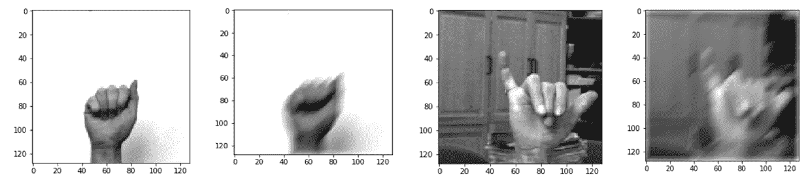

在这篇报道中，对石油和能源研究大学的**使用深度卷积神经网络的模糊分类方法**(tiwa ri iji SMD ' 20)进行了回顾。在本文中:

*   **使用 CNN 对**手势图像**进行四种模糊分类:运动、散焦、高斯和框模糊**。
*   确定准确的模糊类型对于盲图像恢复至关重要。

这是 **2020 IJISMD** 上的一篇论文。( [Sik-Ho Tsang](https://medium.com/u/aff72a0c1243?source=post_page-----93edf4552fd7--------------------------------) @中)

# 概述

1.  **模糊模型**
2.  **模糊分类框架**
3.  **实验结果**

# **1。模糊模型**

## 1.1.运动模糊

*   当**被摄物体相对于成像设备**运动时，出现运动模糊；

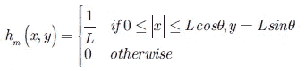

*   其中 *L* 为匀速运动模糊的模糊长度。

## 1.2.散焦模糊

*   由于**来自传感器平面**上的物体的光会聚不足而捕获的图像导致散焦模糊(或失焦):

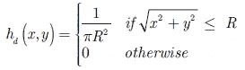

*   其中 *R* 为圆盘的半径。

## 1.3.高斯模糊

*   对于大范围的设备，如光学图像照相机、显微镜、望远镜等，模糊函数通常近似为高斯函数；

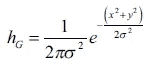

*   其中 *σ* 是具有标准偏差的高斯模糊函数。
*   有时，这种模糊也被用来模拟**散焦模糊**。

## 1.4.框模糊

*   框模糊是一种均值滤波器，其中输出图像中的每个像素都具有在输入图像的某个特定区域中定义的其相邻像素的均值。
*   大多数现有方法将模糊建模为由**恒速运动**引起的盒状模糊:

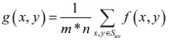

*   其中 *Suv* 是矩形模糊内核中的点集 *m* * *n* 是内核大小。

# 2.模糊分类**框架**

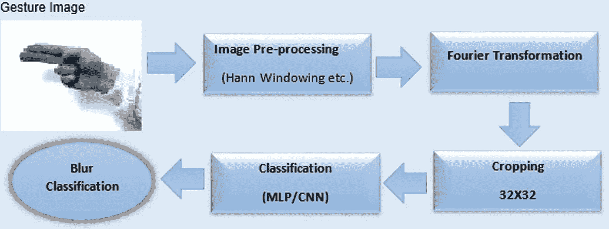

**模糊分类框架**

## 2.1.预处理&傅立叶变换&裁剪

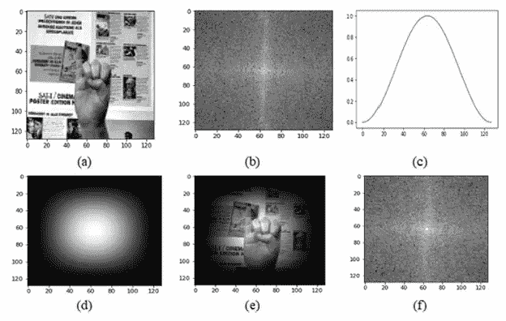

**(a)原始图像，(b)(a)的傅立叶频谱，(c)一维汉恩窗，(D)二维汉恩窗(e)汉恩窗图像，(f)(e)的傅立叶频谱**

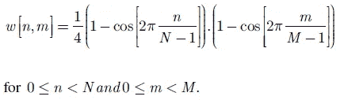

*   周期性的边界条件和图像边界之间的尖锐不连续性在频谱中形成交叉图案。
*   Haan 窗口用于避免这个问题。
*   然后，应用傅立叶变换。
*   图像被裁剪为 32×32。

## 2.2.多层感知器模型

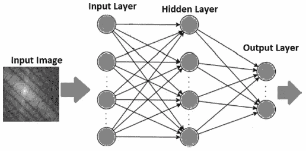

**多层感知器神经网络模型**

*   一个 MLP 用的只是**三层**即输入、隐藏和输出。
*   第一层即**输入层中的神经元是 1024 个**，输出层是 4 个，因为输入是 32 × 32 的图像，**输出是 4 × 1 的向量**，指示**四个模糊等级**。
*   考虑隐藏层中的 **500 个神经元。**

## 2.3.卷积神经网络

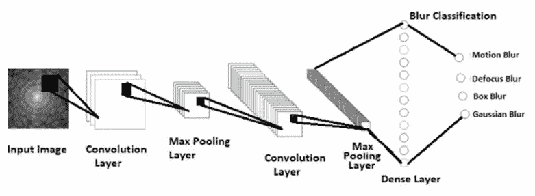

**卷积神经网络模型**

*   在通道里。作者提到用于模糊分类的 CNN 模型具有三个卷积滤波器层:64–3×3、128–3×3、512–3×3 卷积滤波器。(但是在图中，只有 2 个卷积。)
*   使用 2×2 最大池。
*   最后一层是致密层，具有 4 个单元的 softmax 激活功能。
*   [下降](https://sh-tsang.medium.com/paper-dropout-a-simple-way-to-prevent-neural-networks-from-overfitting-image-classification-a74b369b4b8e)用于减少过拟合。

# 3.实验结果

## 3.1.数据集

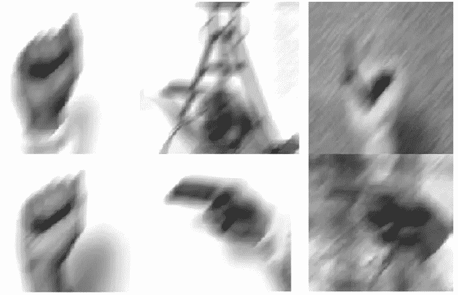

**模糊的手势图像**

*   **Triesch 手势数据库**由 **720 幅图像**组成，这些图像由 24 个不同的人在 3 个不同的背景中拍摄，每个背景包括 10 个手势。
*   使用每一类模糊分别模糊所有图像，即**运动、散焦、方框和高斯模糊**。因此，模糊图像数据库的大小为 **2880 幅图像**。

## 3.2.MLP 结果

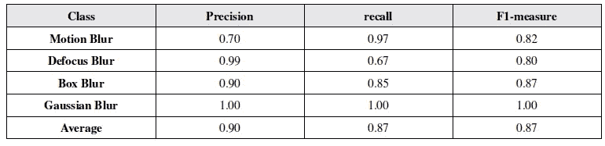

**基于多层感知器的分类模型的性能**

*   模糊图像数据集被分成训练集和验证集。
*   分别利用 70%和 30%模糊图像进行训练和验证。
*   整个图像数据集被用作训练模型的测试集。
*   (与训练集重叠的整个数据集很奇怪。)
*   模型的总体检验损失和检验精度分别为 0.22 和 0.93。

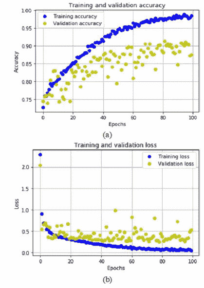

**精度曲线和损失曲线分别用于训练和验证数据。**

## 3.3.CNN 结果

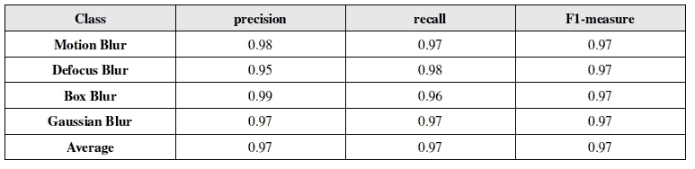

**基于卷积神经网络的分类模型的性能**

*   数据集分割与 MLP 数据集分割相同。
*   模型的总体检验损失和检验精度分别为 0.10 和 0.97。

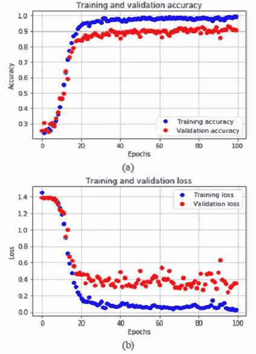

**精度曲线和损失曲线分别用于训练和验证数据。**

## 3.4.ROC 结果

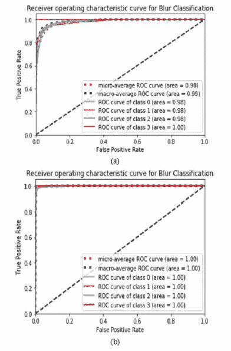

**(a)MLP 模型的 ROC 图，(CNN 模型的 ROC 图**

*   以上是中华民国的地图。

## 3.5.精确度和 SOTA 比较

*   通过 **MLP** 和 **CNN** 模型达到的平均准确率分别为 **93.0** 和 **97.0** 。
*   合成数据库也用基于**曲波变换的能量特征和基于前馈神经网络的分类模型**进行测试(Tiwari，2017)。使用该模型的平均精度为 **95.7** 。

## 参考

【2020 iji SMD】【tiwa ri iji SMD’20】
[一种使用深度卷积神经网络的模糊分类方法](https://ideas.repec.org/a/igg/jismd0/v11y2020i1p93-111.html)

## 模糊分类

**2017**[SFA](https://sh-tsang.medium.com/review-sfa-simplified-fast-alexnet-blur-classification-4121e6d813f9)】**2019**[SFA&SFGN](https://sh-tsang.medium.com/review-sfa-sfgn-simplified-fast-googlenet-blur-classification-e99a8c1f5d25)**2020**[桑达萨·SSCI ' 20](https://sh-tsang.medium.com/review-convolutional-neural-network-for-blur-images-detection-as-an-alternative-for-laplacian-7b97b6729fed)**[提瓦里·伊吉斯姆德' 20](https://sh-tsang.medium.com/review-a-blur-classification-approach-using-deep-convolution-neural-network-blur-classification-93edf4552fd7) ]**

## **[我之前的其他阅读](/@sh.tsang/overview-my-reviewed-paper-lists-tutorials-946ce59fbf9e)**