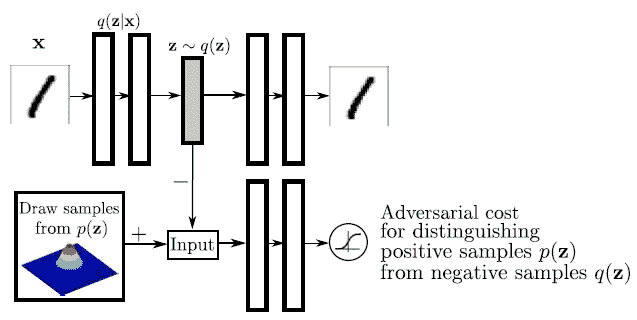
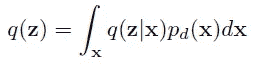
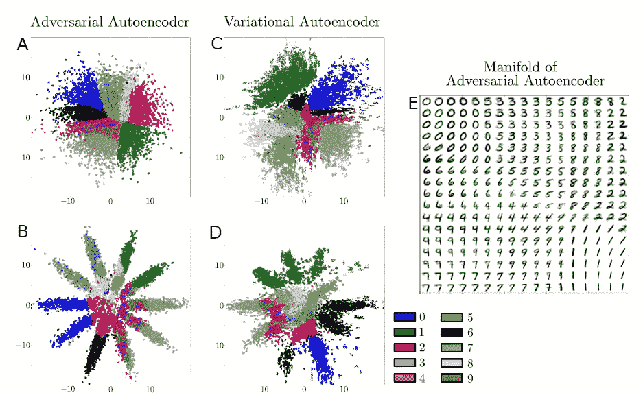
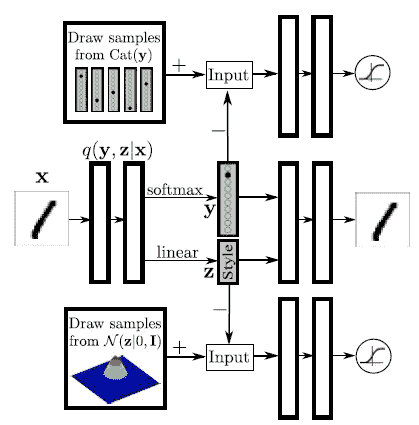
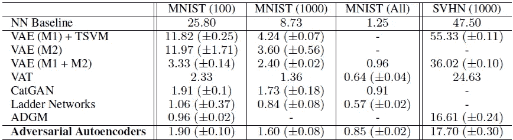
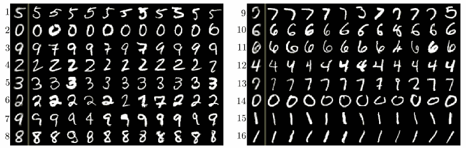
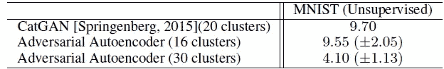
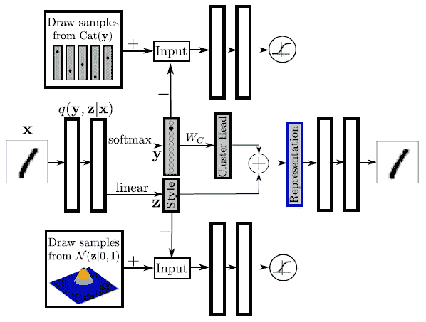
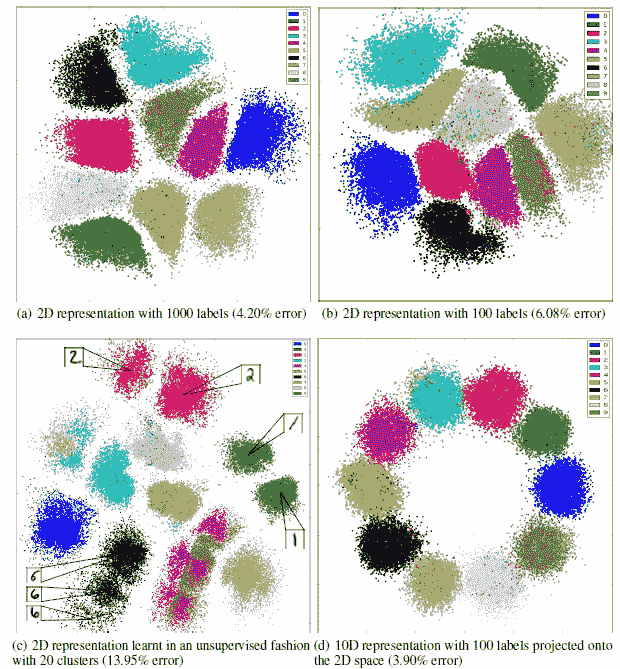

# 综述— AAE:对抗性自动编码器(GAN)

> 原文：<https://medium.com/nerd-for-tech/review-aae-adversarial-autoencoders-gan-e8fda9160542?source=collection_archive---------5----------------------->

## [**【甘】**](/@sh.tsang/review-gan-generative-adversarial-nets-gan-e12793e1fb75) 与自动编码器组合

**在这个故事中，简要回顾了多伦多大学、谷歌大脑和 OpenAI 的**对抗性自动编码器**(AAE)。仅描述了 AAE 变体。这是 Ian Goodfellow 的论文，他也是 [GAN](/@sh.tsang/review-gan-generative-adversarial-nets-gan-e12793e1fb75) 的第一作者。在本文中:**

*   **AAE 是一个使用[**GAN**](/@sh.tsang/review-gan-generative-adversarial-nets-gan-e12793e1fb75)**的概率自动编码器。****
*   ****敌对自动编码器**的解码器**学习深度生成模型，该模型在数据分发之前映射强加的。****

**这是一篇发表在 **2016 ICLR** 的论文，引用超过 **1600 次**。( [Sik-Ho Tsang](https://medium.com/u/aff72a0c1243?source=post_page-----e8fda9160542--------------------------------) @中)**

# **概述**

1.  ****AAE:网络架构****
2.  ****AAE vs VAE****
3.  ****监督 AAE****
4.  ****半监督 AAE****
5.  ****无人监管的 AAE****
6.  ****使用 AAE 进行数据可视化的降维****

# ****1。AAE:网络架构****

****

****AAE:网络架构(+:正样本，-:负样本)****

*   ****最上面一行**是一个标准的**自动编码器**，它**从一个潜在代码 *z* 重建一个图像 *x* 。****
*   ****最下面一行**图示了第二个网络，该网络被训练来有区别地**预测样本是来自自动编码器的隐藏代码还是来自用户指定的采样分布。****
*   **设 *p* ( *z* )为我们想要对代码施加的先验分布，*q*(*z*|*x*)为编码分布，*p*(*x*|*z*)为解码分布。**
*   **也设 *pd* ( *x* )为数据分布， *p* ( *x* )为模型分布。自动编码器*q*(*z*|*x*)的编码函数将自动编码器的隐藏代码向量上的 *q* ( *z* )的聚合后验分布定义为:**

****

*   **是对抗性网络引导 *q* ( *z* )匹配 *p* ( *z* )。**

> ****自动编码器试图最小化重建误差。****
> 
> **对抗网络的生成器也是**自动编码器*q*(*z*|*x*)的编码器。**编码器确保聚合后验分布能够**欺骗区别对抗网络，使其认为隐藏代码 q(z)来自真实的先验分布 p(z)。****

*   **对抗网络和自动编码器都与 SGD 一起在两个阶段**进行训练:重建阶段和正则化阶段。****
*   **重建阶段训练自动编码器。**
*   **正则化阶段训练 [GAN](/@sh.tsang/review-gan-generative-adversarial-nets-gan-e12793e1fb75) 。**

# **2.AAE 对 VAE**

****

****AAE vs VAE MNIST****

*   **保留图像的隐藏代码 *z* 符合(A/C)一个 2-D 高斯和(B/D)10 个 2-D 高斯的混合。**
*   ****A** :由 **AAE** 学习到的流形呈现出**尖锐过渡**表示编码空间已被填充且没有呈现出“孔洞”。**
*   ****C** : **VAE** 大致符合二维高斯分布的形状。然而，**没有数据点映射到编码空间的几个局部区域**，这表明 VAE 可能没有像 AAE 一样捕获数据流形。**
*   **B : AAE 成功地将聚合后验概率与先验分布进行了匹配。**
*   **相反，VAE 表现出与混合物 10 高斯的系统差异。**

# **3.监督 AAE**

****

****监督 AAE****

*   **在进入半监督 AAE 之前，尝试监督 AAE，其中**该架构将类别标签信息与图像样式信息分开。****
*   **解码器利用标识标签的独热码矢量和隐藏代码 *z* 来重建图像。**

> **这种架构迫使网络在隐藏代码 *z* 中保留所有独立于标签的信息。**

# **4.半监督 AAE**

****

****半监督 AAE****

*   **监督 AAE 进一步修改为上述半监督 AAE。**

> **AAE 的推理网络使用编码器 *q* ( *z* ， *y* | *x* )预测离散类变量 *y* 和连续潜变量 *z* 。**

*   **第一个敌对网络在标签表示上强加了分类分布。这个对立的网络确保了潜在的类变量 *y* 不携带任何样式信息。**
*   **第二个对抗网络对风格表示施加高斯分布，这确保了潜在变量 *z* 是连续的高斯变量。**
*   **对抗网络和自动编码器都在**三个阶段**中与 SGD 联合训练——重建阶段、正则化阶段和半监督分类阶段。**
*   **在**重建阶段**，自动编码器**更新编码器 *q* ( *z* ， *y* | *x* )，解码器**至最小化未标记小批量上输入的重建误差。**
*   **在**正则化阶段**中，每个敌对网络首先**更新它们的判别网络**，以将真实样本与生成的样本区分开。**
*   **然后，敌对网络**更新它们的生成器**以混淆它们的区别网络。**
*   **在**半监督分类阶段**，自动编码器更新***q*(*y*|*x*)**到**最小化已标记小批量上的交叉熵成本**。**

****

****MNIST 和 SVHN 上的半监督分类性能(错误率)****

*   **值得一提的是**所有的 AAE 模型都是端到端训练**，而半监督 VAE 模型必须一次训练一层。**

> **在具有 100 和 1000 个标签的 MNIST 数据集上，AAEs 的性能明显优于 VAEs。**

# **5.无人监管的 AAE**

****

****使用具有 16 个聚类的 AAE 对 MNIST 进行无监督聚类****

> **该架构是半监督 AAE，不同之处在于**半监督分类阶段被移除**，因此不再在任何标记的小批量上训练网络。**

*   **如上所述，倾斜的数字 1 和 6(群 16 和 11)与直的 1 和 6(群 15 和 10)放在不同的群中。**

****

****MNIST AAE 的无监督聚类性能(错误率)****

*   **一旦训练完成，对于每个聚类 *i* ，主正确标签被分配给聚类 *i* 中的所有点。然后，可以基于分配给每个聚类的类别标签来估计测试误差。**

> **如上表所示，AAE 在总共 16 个和 30 个标签的情况下分别达到了 9.55%和 4.10%的分类错误率。**

# **6.**使用 AAE 进行数据可视化的降维****

****

****使用对立的自动编码器进行降维****

> ****最终的 *n* 维度表示**通过首先**将独热标签表示映射到 *n* 维度簇头表示**和**来构建，然后将结果添加到 *n* 维度样式表示。****

*   ***n* =2 或 3 用于数据可视化。**
*   **SGD 通过附加的代价函数学习簇头，该代价函数惩罚每两个簇头之间的欧几里德距离。**

****

****半监督和无监督的 MNIST AAE 降维。****

*   **(这部分有详细内容，可以直接看论文。)**
*   **总的来说，我们可以看到 AAE 可以实现一个**干净的** **数字集群的分离。****

**本文是[甘](/@sh.tsang/review-gan-generative-adversarial-nets-gan-e12793e1fb75)使用自动编码器的早期论文。在本文中使用 VAE 的主要目的是进行半监督或无监督的学习，而不是纯粹的图像到图像的翻译或使用潜在向量合成图像。**

## **参考**

**【2016 ICLR】【AAE】
[对抗性自动编码器](https://arxiv.org/abs/1511.05644)**

## **生成对抗网络**

****图像合成** [ [甘](/@sh.tsang/review-gan-generative-adversarial-nets-gan-e12793e1fb75) ] [ [CGAN](/@sh.tsang/review-cgan-conditional-gan-gan-78dd42eee41) ] [ [拉普甘](/@sh.tsang/review-lapgan-laplacian-generative-adversarial-network-gan-e87200bbd827)[[AAE](https://sh-tsang.medium.com/review-aae-adversarial-autoencoders-gan-e8fda9160542)][[DCGAN](/@sh.tsang/review-dcgan-deep-convolutional-generative-adversarial-network-gan-ec390cded63c)][[CoGAN](https://sh-tsang.medium.com/review-cogan-coupled-generative-adversarial-networks-gan-273f70b340af)][[SimGAN](https://sh-tsang.medium.com/review-simgan-learning-from-simulated-and-unsupervised-images-through-adversarial-training-gan-86a7003add50)]
**图像到图像翻译**[[pix 2 pix](https://sh-tsang.medium.com/review-pix2pix-image-to-image-translation-with-conditional-adversarial-networks-gan-ac85d8ecead2)[[单元](https://sh-tsang.medium.com/review-unit-unsupervised-image-to-image-translation-networks-gan-4a25ced6d078)
**模糊检测**[DMENet](https://sh-tsang.medium.com/review-dmenet-deep-defocus-map-estimation-using-domain-adaptation-blur-detection-20fdcaf5e384)
**摄像头篡改检测**[曼蒂尼的 VISAPP’19](https://sh-tsang.medium.com/review-mantinis-visapp-19-generative-reference-model-and-deep-learned-features-camera-f608371c9854) **视频编码**[VC-lap gan](/@sh.tsang/reading-vc-lapgan-video-coding-oriented-laplacian-pyramid-of-generative-adversarial-networks-74daa2d23d3c)[朱 TMM’20](https://sh-tsang.medium.com/review-zhu-tmm20-generative-adversarial-network-based-intra-prediction-for-video-coding-c8a217c564ea)[钟 ELECGJ’21](https://sh-tsang.medium.com/review-zhong-elecgj21-a-gan-based-video-intra-coding-hevc-intra-9e3486dbca78)**

## **[我以前的其他论文阅读材料](https://sh-tsang.medium.com/overview-my-reviewed-paper-lists-tutorials-946ce59fbf9e)**