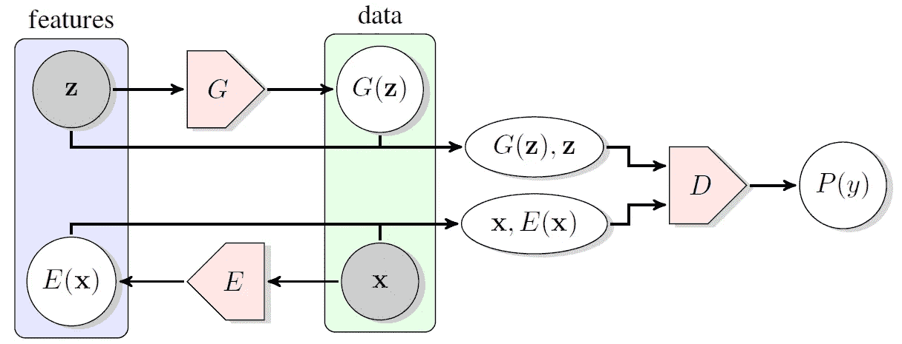
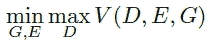
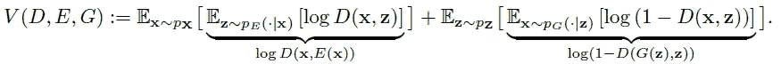
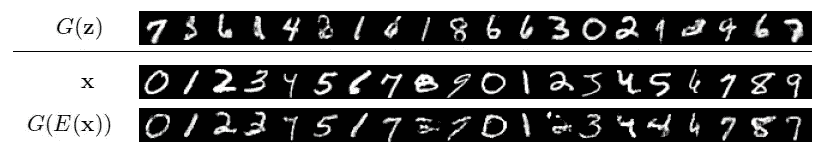
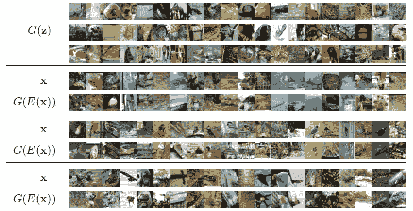
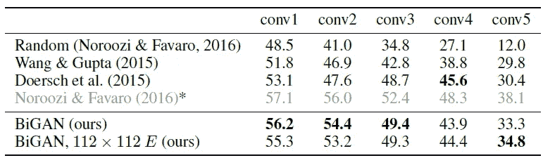
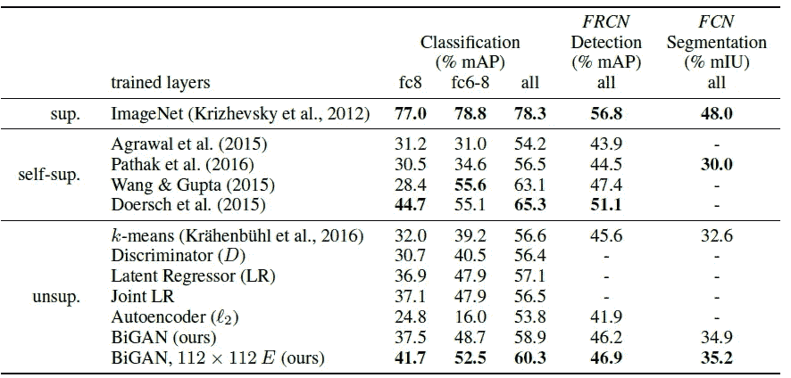

# 综述——甘比:对抗性特征学习(GAN)

> 原文：<https://medium.com/nerd-for-tech/review-bigan-adversarial-feature-learning-gan-535eb76be2ca?source=collection_archive---------5----------------------->

## 双向生成对抗网络:学习从图像空间到潜在空间的逆映射

在这个故事中，简要回顾了加州大学和德克萨斯大学的**对抗性特征学习**(甘比)。在本文中:

*   双向生成对抗网络(甘比)被设计为**学习逆** **映射的手段，即将数据投射回潜在空间。**
*   这种所得的学习特征表示对于辅助的监督辨别任务是有用的。

这是一篇发表在 **2017** **ICLR** 的论文，引用次数超过 **1100 次** **次**。( [Sik-Ho Tsang](https://medium.com/u/aff72a0c1243?source=post_page-----535eb76be2ca--------------------------------) @中)

这个想法和[阿里](https://sh-tsang.medium.com/review-ali-adversarially-learned-inference-gan-6e4677667914)是一样的，只是他们是独立提出来的，并且在同一个会议上发表(2017 ICLR)。一些报纸在谈论这个想法时会同时提到甘比和阿里。

# 概述

1.  **甘比:整体结构**
2.  **实验** **结果**

# **1。甘比:整体结构**

**甘比:整体结构**

*   除了来自标准 [GAN](/@sh.tsang/review-gan-generative-adversarial-nets-gan-e12793e1fb75) 的发生器 *G* ，**甘比还包括一个编码器 *E* ，它将数据 *x* 映射到潜在表示 *z* 。**
*   **甘比鉴别器 *D* 不仅在数据空间( *x* 对 *G* ( *z* ))中鉴别**，而且在数据和潜在空间(元组( *x* ， *E* ( *x* )对(*G*(*z*)中联合鉴别**
*   **数据空间被展平为向量并与潜在空间向量连接，然后输入到鉴别器 *D* 。**
*   **在这个上下文中，**一个潜在的表示 z 可以被认为是*x*T3 的一个“标签”，但是它是为“自由”而来的，不需要监督。****
*   **甘比培训目标被定义为最小最大目标:**

****

*   **在哪里**

****

*   **使用与 [GAN](/@sh.tsang/review-gan-generative-adversarial-nets-gan-e12793e1fb75) 相同的基于交替梯度的优化。**
*   **在一次迭代中，通过在正梯度方向上采取一个或多个步骤来更新鉴别器参数 *θD* 。**
*   **然后，编码器参数 *θE* 和发生器参数 *θG* 通过在负梯度方向上迈出一步而一起更新。**

> **被训练来预测特征的模型 *z* 给定数据 *x* 应该**学习有用的语义表示。**甘比物镜迫使编码器 *E* 这样做。**
> 
> ****为了在特定的 *z* 处欺骗鉴别器，编码器必须在该 *z* 处反转发生器，使得*E*(*G*(*z*)=*z*。****

*   **此时，对于创成式模型来说，生成高分辨率图像仍然很困难。因此，编码器可以采用更高分辨率的输入，而发生器输出和鉴别器输入保持低分辨率。**

# **2.**实验** **结果****

*   **通过首先非监督地训练它们来训练甘比，然后转移编码器的学习特征表示用于辅助监督学习任务。**

## **2.1.置换不变 MNIST**

*   **每个 28×28 数字图像必须被视为非结构化的 784D 向量。**
*   **潜在向量 *z* 是 50D 向量。**

****

****特征空间中置换不变 MNIST 测试集上的最近邻(1NN)分类准确率(%)****

*   **[AE](https://sh-tsang.medium.com/review-autoencoder-reducing-the-dimensionality-of-data-with-neural-networks-data-visualization-fc16446ae32d) 是由 *l* 2 或 *l* 1 学习的[自动编码器](https://sh-tsang.medium.com/review-autoencoder-reducing-the-dimensionality-of-data-with-neural-networks-data-visualization-fc16446ae32d)，由 Hinton 教授于 2006 年提出。**

> **包括甘比在内的所有方法的表现大致相同。鉴于 MNIST 数字相对简单，这一结果并不令人意外。**

****

****置换不变 MNIST 甘比训练的定性结果，包括生成器样本 G(z)、真实数据 x 和相应的重建 G(E(x))。****

> **生成器 *G* in 生成的数字几乎完全匹配数据分布(定性)，如上图所示。**

## **2.2.ImageNet**

*   **编码器 *E* 架构跟随 [AlexNet](/coinmonks/paper-review-of-alexnet-caffenet-winner-in-ilsvrc-2012-image-classification-b93598314160?source=post_page---------------------------) 通过第五个也是最后一个卷积层(conv5)，移除了局部响应归一化(LRN)层，并且在无监督训练时间将带有泄漏 ReLU 非线性的[批量归一化](https://sh-tsang.medium.com/review-batch-normalization-inception-v2-bn-inception-the-2nd-to-surpass-human-level-18e2d0f56651)应用于每个卷积的输出。**
*   **编码器输入图像的大小为 112×112 或 64×64。**
*   **潜在向量是 200D 向量。**

****

**【ImageNet 甘比训练的定性结果，包括生成器样本 G(z)、真实数据 x 和相应的重建 G(E(x))。**

> **如上所示，重建虽然肯定不完美，但从经验上证明了**甘比编码器 *E* 和生成器 *G* 学习近似逆映射。****

****

****ImageNet ls vrc 验证集的分类准确度(%)****

*   **上述评估是在网络的各个部分冻结或重新初始化并从头开始训练的情况下执行的。**
*   **例如，在 conv3 列中，前三个层(conv1 至 conv3)被传输和冻结，最后一个层(conv4、conv5 和完全连接的层)被重新初始化和训练，以完全监控 ImageNet 分类。**

> **甘比在这些当代视觉特征学习方法上是有竞争力的。**

## **2.3.帕斯卡 VOC**

****

****分类和** [**快速 R-CNN**](/coinmonks/review-fast-r-cnn-object-detection-a82e172e87ba?source=post_page---------------------------) **检测结果为 PASCAL VOC 2007 测试集和**[**FCN**](https://towardsdatascience.com/review-fcn-semantic-segmentation-eb8c9b50d2d1?source=post_page---------------------------)**分割结果为 PASCAL VOC 2012 验证集****

*   **评估了甘比表示到 PASCAL VOC 的可移植性。**
*   **分类模型在冻结了 [AlexNet](/coinmonks/paper-review-of-alexnet-caffenet-winner-in-ilsvrc-2012-image-classification-b93598314160?source=post_page---------------------------) 模型的各个部分的情况下进行训练。**
*   **在 fc8 列中，仅学习线性分类器(多项式逻辑回归)——在甘比的情况下，在随机初始化的全连接(fc)层 fc6 和 fc7 之上。**
*   **在 fc6–8 列中，所有三个 fc 层在所有卷积层冻结的情况下接受完全监督训练。**
*   **最后，在 all 列中，对整个网络进行“微调”。**
*   **甘比胜过其他无人监管的公司。)特征学习方法，包括基于[和](/@sh.tsang/review-gan-generative-adversarial-nets-gan-e12793e1fb75)的基线，尽管具有通用性，但与当代的自我监督(self-sup)方法**相比具有竞争力。)特定于视觉领域的特征学习方法**。**
*   **(如果感兴趣，请阅读论文了解更多详情。)**

## **参考**

**【2017 ICLR】【甘比】
[对抗性特征学习](https://arxiv.org/abs/1605.09782)**

## **生成对抗网络**

****图像合成** [ [甘](/@sh.tsang/review-gan-generative-adversarial-nets-gan-e12793e1fb75) ] [ [CGAN](/@sh.tsang/review-cgan-conditional-gan-gan-78dd42eee41) ] [ [拉普甘](/@sh.tsang/review-lapgan-laplacian-generative-adversarial-network-gan-e87200bbd827)[[AAE](https://sh-tsang.medium.com/review-aae-adversarial-autoencoders-gan-e8fda9160542)][[DCGAN](/@sh.tsang/review-dcgan-deep-convolutional-generative-adversarial-network-gan-ec390cded63c)][[CoGAN](https://sh-tsang.medium.com/review-cogan-coupled-generative-adversarial-networks-gan-273f70b340af)][[辛甘](https://sh-tsang.medium.com/review-simgan-learning-from-simulated-and-unsupervised-images-through-adversarial-training-gan-86a7003add50)][
**图像到图像的翻译**[pix 2 pix](https://sh-tsang.medium.com/review-pix2pix-image-to-image-translation-with-conditional-adversarial-networks-gan-ac85d8ecead2)[]
**模糊检测**[DMENet](https://sh-tsang.medium.com/review-dmenet-deep-defocus-map-estimation-using-domain-adaptation-blur-detection-20fdcaf5e384)
**摄像头篡改检测**[曼蒂尼的 VISAPP’19](https://sh-tsang.medium.com/review-mantinis-visapp-19-generative-reference-model-and-deep-learned-features-camera-f608371c9854) **视频编码**[VC-lap gan](/@sh.tsang/reading-vc-lapgan-video-coding-oriented-laplacian-pyramid-of-generative-adversarial-networks-74daa2d23d3c)[朱 TMM’20](https://sh-tsang.medium.com/review-zhu-tmm20-generative-adversarial-network-based-intra-prediction-for-video-coding-c8a217c564ea)[钟 ELECGJ’21](https://sh-tsang.medium.com/review-zhong-elecgj21-a-gan-based-video-intra-coding-hevc-intra-9e3486dbca78)**

## **[我以前的其他论文阅读材料](https://sh-tsang.medium.com/overview-my-reviewed-paper-lists-tutorials-946ce59fbf9e)**