# 回顾— CB 损失:基于有效样本数的类别平衡损失(图像分类)

> 原文：<https://medium.com/nerd-for-tech/review-cb-loss-class-balanced-loss-based-on-effective-number-of-samples-image-classification-3056a1a1a001?source=collection_archive---------3----------------------->

## 使用每个类别的有效样本数来重新平衡损失，优于 [RetinaNet](https://towardsdatascience.com/review-retinanet-focal-loss-object-detection-38fba6afabe4) 中的[聚焦损失](https://towardsdatascience.com/review-retinanet-focal-loss-object-detection-38fba6afabe4)

在这篇论文中，回顾了康奈尔大学、康奈尔理工大学、谷歌大脑和 Alphabet Inc .、 **CB 损耗**的**基于有效样本数的类平衡损耗。在本文中:**

*   设计了一种重新加权方案，即**使用每一类的有效样本数来重新平衡损失**，称为类平衡损失。

这是一篇在 **2019 CVPR** 超过 **200** **引文**的论文。( [Sik-Ho Tsang](https://medium.com/u/aff72a0c1243?source=post_page-----3056a1a1a001--------------------------------) @中)

# 概述

1.  **阶层失衡问题**
2.  **有效样本数**
3.  **类别平衡损失(CB 损失)**
4.  **实验结果**

# **1。阶层失衡问题**

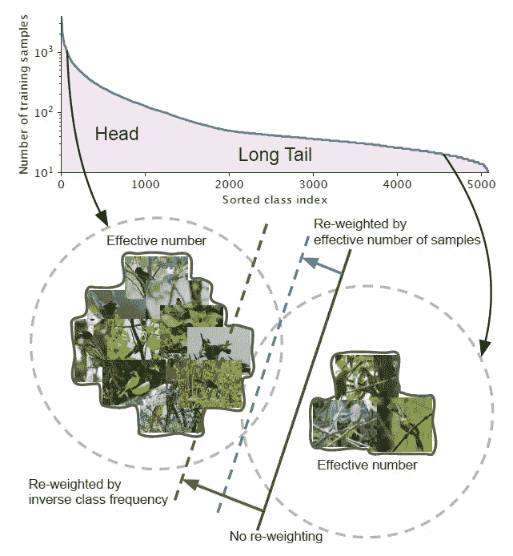

**两个类，一个来自长尾数据集的头部，一个来自尾部(iNaturalist 2017 Dataset)**

*   假设有一些职业像上面一样不平衡。
*   **Head** :指数小的类，这些类的样本数多。
*   **尾**:指数大的类，这些类的样本数较少。
*   **黑色实线**:直接在这些样本上训练的模型**偏向优势类。**
*   **红色虚线** : **通过逆类别频率对损失重新加权**可能会在具有高类别不平衡的真实世界数据上产生不良性能。
*   **蓝色虚线**:设计了一个类平衡项**通过反有效样本数重新加权损失。**

# 2.有效样本数

## 2.1.定义

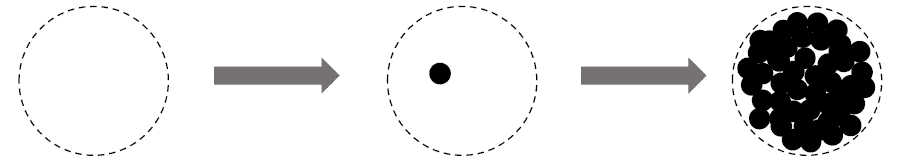

**数据间信息重叠，左:特征空间 S，中:1 个样本数据的单位体积，右:数据间信息重叠**

> 直觉上，数据越多越好。然而，由于**数据中存在信息重叠，随着样本数量的增加，模型从数据中提取的边际收益会减少。**

*   **左**:给定一个类，将该类的**特征空间中所有可能数据的集合表示为 ***S*** 。假设 *S* 的体积为 *N* 且 *N* ≥ 1。**
*   **中间**:***S*子集中的每个样品**的**单位体积为 1** ，**可能与其他样品**重叠。
*   **右**:从 *S* 中随机抽取每个子集，覆盖整个 *S* 集合。采样的数据越多， *S* 的覆盖范围就越好。
*   采样数据的预期总量随着样本数量的增加而增加，并受到 *N* 的限制。

> 因此，有效样本数被定义为预期的样本量。

*   这个想法是通过使用一个类的更多数据点来捕捉边际收益递减。
*   由于真实世界数据之间的内在相似性，随着样本数量的增长，新添加的样本很可能是现有样本的近似副本。
*   此外，用大量数据扩充来训练 CNN，所有扩充的例子也被认为与原始例子相同。
*   对于一个类， ***N*** 可以看作是**唯一原型**的数量。

## 2.2.数学公式

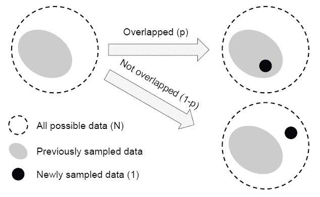

**新采样数据与先前采样数据重叠或不重叠**

*   将**样品的有效数量(预期体积)**表示为 ***En*** 。
*   为了简化问题，不考虑部分重叠的情况。
*   也就是说，**一个新采样的数据点**只能以两种方式与先前采样的数据相互作用:要么**完全在先前采样的数据集**内，概率为**p**，要么**完全在**外，概率为 1- *p* 。
*   **命题(有效数)**:*en*=(1*β^n*)/(1*β*，其中
    *β*=(*n*—1)/*n*。这个命题用**数学归纳法**证明。
*   当 *E* 1 = 1 时，没有重叠。*e*1 =(1*β^*1)/(1*β*)= 1 保持。
*   考虑有先前采样的第*n*1 个样本，并且将要采样第 *n* 个样本。现在**先前采样数据的预期量是*En*1**和**新采样的数据点有概率*p*=*E*(*N*1)/*N*与先前的样本**重叠。因此，**抽样后的期望体积*第 n 个*例子是:**

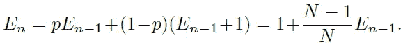

*   使用:

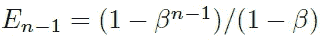

*   我们有:

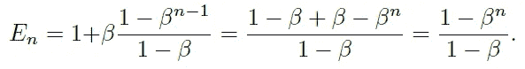

*   上述命题表明**有效样本数是 *n* 的指数函数。**
*   **超参数*β*∈【0，1】控制 *En* 随着 *n* 增加的速度。**

# **3。类别平衡损失(CB 损失)**

*   **等级平衡(CB)损失**写为:

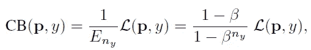

*   其中 *ny* 是地面实况类 *y* 中的样本数。
*   *β* = 0 对应不重新加权， *β* → 1 对应按逆类频率重新加权。

> 所提出的有效样本数的新概念使我们能够使用**超参数 *β* 在不重新加权和通过逆类频率重新加权之间平滑地调整类平衡项。**

*   所提出的类平衡项是**模型不可知的**和**损失不可知的**，因为它独立于损失函数 *L* 和预测的类概率 *p* 的选择。

## 3.1.类平衡 Softmax 交叉熵损失

*   给定一个分类标签为 *y* 的样本，该样本的 softmax 交叉熵(CE)损失可写为:

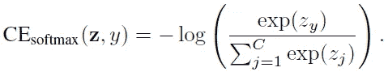

*   假设类 *y* 有 *ny* 个训练样本，**类平衡(CB) softmax 交叉熵损失**为:

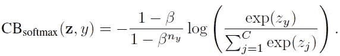

## 3.2.类平衡 Sigmoid 交叉熵损失

*   当使用 sigmoid 函数处理多类问题时，网络的每个输出 ode 都在执行一个**一对一分类**来预测目标类相对于其余类的概率。
*   在这种情况下， **Sigmoid 并没有假设类之间的互斥性。**
*   由于每个类都被认为是独立的，并且有自己的预测器，因此 sigmoid 将单标签分类与多标签预测统一起来。这是一个很好的属性，因为真实世界的数据通常有不止一个语义标签。
*   sigmoid 交叉熵(CE)损失可写为:

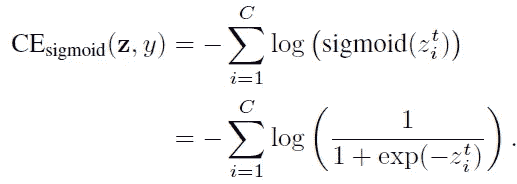

*   **类平衡(CB) sigmoid 交叉熵损失**为:

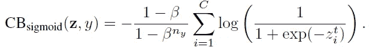

## 3.3.类平衡[局灶性丢失](https://towardsdatascience.com/review-retinanet-focal-loss-object-detection-38fba6afabe4)

*   [视网膜](https://towardsdatascience.com/review-retinanet-focal-loss-object-detection-38fba6afabe4)提出的[局灶性丢失(FL)](https://towardsdatascience.com/review-retinanet-focal-loss-object-detection-38fba6afabe4) ，降低了分类良好样本的相对丢失，聚焦于疑难样本:

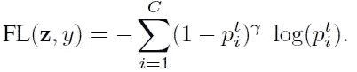

*   (如需更多详细信息，如有兴趣，请随意阅读[视网膜](https://towardsdatascience.com/review-retinanet-focal-loss-object-detection-38fba6afabe4)。)
*   **类平衡(CB)** [**局灶性丢失**](https://towardsdatascience.com/review-retinanet-focal-loss-object-detection-38fba6afabe4) 为:

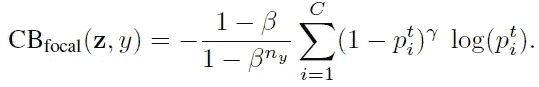

# 4.实验结果

## 4.1.数据集

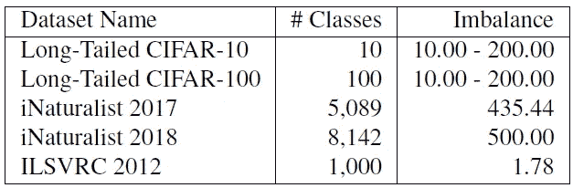

**用于评估类平衡损失有效性的数据集**

*   尝试了 5 种分别具有 10、20、50、100 和 200 失衡因子的长尾版本的 CIFS-10 和 CIFS-100。
*   非理性主义者和 ILSVRC 本质上是阶级失衡。

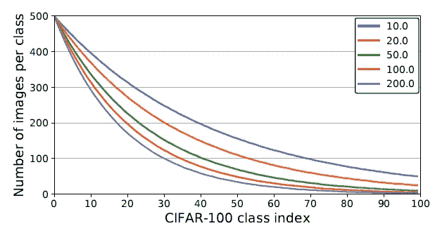

**在不同失衡因子的人工创建的长尾 CIFS-100 数据集上，每类训练样本数。**

*   上图显示了具有不同不平衡因子的每类图像的数量。

## 4.2.CIFAR 数据集

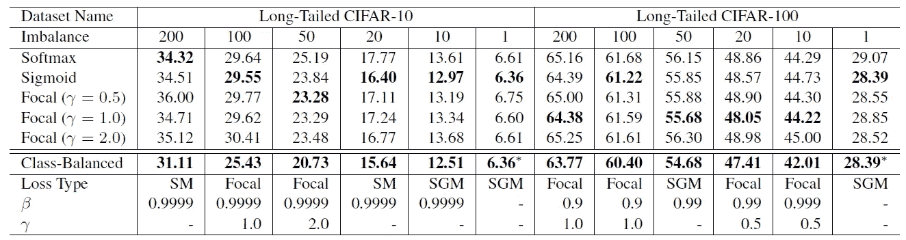

**[**RES net**](https://towardsdatascience.com/review-resnet-winner-of-ilsvrc-2015-image-classification-localization-detection-e39402bfa5d8?source=post_page---------------------------)**分类错误率-32 在长尾 CIFAR-10 和 CIFAR-100 测试集上接受了不同损失函数的训练****

*   **超参数的搜索空间为{softmax，sigmoid，focal}为损耗类型，*β*∞{ 0.9，0.99，0.999，0.9999}，*γ*∞{ 0.5，1.0，2.0}为[焦损](https://towardsdatascience.com/review-retinanet-focal-loss-object-detection-38fba6afabe4)。**
*   ****最佳 *β* 一致为 0.9999 on cipal-10**。**
*   ****但在 CIFS ar-100 上，不同失衡因子的数据集往往有不同且较小的最优 *β* 。****

**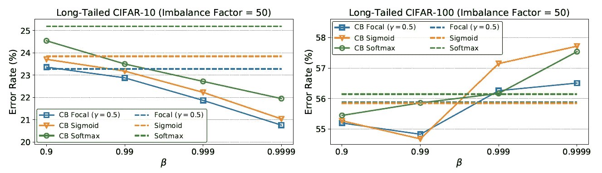**

****有无类平衡项训练时的分类错误率。****

*   **在 **CIFAR-10** 上，根据 *β* = 0.9999 重新加权时，有效样本数接近样本数。这意味着**CIFAR-10 上的最佳重新加权策略类似于通过逆类频率进行重新加权。****
*   **在 **CIFAR-100** 上，使用更大的 *β* 表现不佳，说明按逆类频率重新加权不是明智的选择。**需要一个更小的 *β* ,它具有跨类的更平滑的权重。****
*   **例如，特定鸟类的独特原型的数量应该少于一般鸟类的独特原型的数量。**由于 CIFAR-100 中的类比 CIFAR-10 更细粒度，因此与 CIFAR-10 相比，CIFAR-100 的 *N* 更小。****

## **4.3.大规模数据集**

**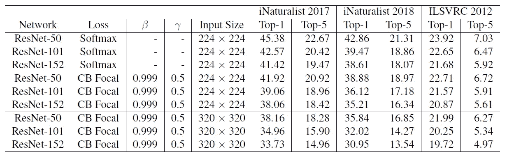**

****在所有数据集的验证集上使用不同损失函数训练的大规模数据集上的前 1 和前 5 分类错误率****

*   ****使用类平衡的** [**焦损**](https://towardsdatascience.com/review-retinanet-focal-loss-object-detection-38fba6afabe4) ，因为它更具有灵活性，并且发现 ***β* = 0.999** 和 ***γ* = 0.5** 在所有数据集上都产生合理的**良好性能**。**
*   **值得注意的是，[**【ResNet】**](https://towardsdatascience.com/review-resnet-winner-of-ilsvrc-2015-image-classification-localization-detection-e39402bfa5d8?source=post_page---------------------------)**-50 在使用类平衡** [****ResNet****](https://towardsdatascience.com/review-retinanet-focal-loss-object-detection-38fba6afabe4)****-152 和**[**ResNet**](https://towardsdatascience.com/review-resnet-winner-of-ilsvrc-2015-image-classification-localization-detection-e39402bfa5d8?source=post_page---------------------------)**-101 在 ILSVRC 2012 上使用类平衡**[**焦损**](https://towardsdatascience.com/review-retinanet-focal-loss-object-detection-38fba6afabe4) 代替 softmax 交叉熵时，能够达到与它们相当的****

**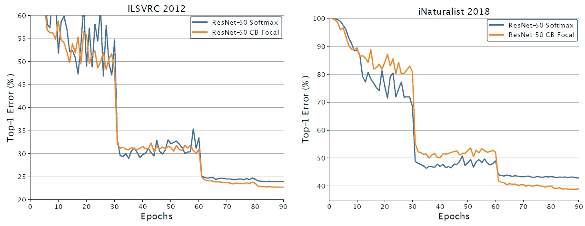**

****RES net-50 在 ILSVRC 2012(左)和 iNaturalist 2018(右)上的训练曲线。****

*   **上图显示**职业平衡的** [**焦损**](https://towardsdatascience.com/review-retinanet-focal-loss-object-detection-38fba6afabe4) **经过 60 个历元的训练后开始显现优势。****

## **参考**

**【2019 CVPR】【CB 损耗】
[基于有效样本数的类平衡损耗](https://openaccess.thecvf.com/content_CVPR_2019/papers/Cui_Class-Balanced_Loss_Based_on_Effective_Number_of_Samples_CVPR_2019_paper.pdf)**

## **图像分类**

**)(我)(们)(都)(不)(知)(道)(,)(我)(们)(还)(不)(知)(道)(,)(我)(们)(还)(有)(些)(什)(么)(情)(感)(呢)(?)(我)(们)(都)(不)(知)(道)(了)(,)(我)(们)(还)(不)(知)(道)(,)(我)(们)(还)(有)(什)(么)(情)(感)(呢)(?)(我)(们)(还)(没)(有)(什)(么)(好)(感)(,)(我)(们)(就)(没)(有)(什)(么)(情)(感)(,)(我)(们)(们)(还)(没)(有)(什)(么)(好)(的)(情)(情)(感)(。 )(我)(们)(都)(不)(知)(道)(,)(我)(们)(都)(是)(很)(强)(的)(,)(我)(们)(都)(是)(很)(强)(的)(对)(对)(对)(对)(对)(对)(对)(对)(对)(对)(对)(对)(对)(对)(对)(对)(对)(对)(对)(对)(对)(对)(对)(对)(对)(对)(对)(对)(对)(对)(对)(对)(对)(对)(对)(对)(对)(对)(对)(对)(对)(对)(对)(对)(对)(对)(对)(对)(对)(对)(对)(对)(对)(对)(对)(对)(对)(对)(对)(对)(对)(对)(对)(对)(对)(对)(对)(对)(对)(对)(对)(对)(对)(对)(对)(对)(对)( )(我)(们)(都)(不)(想)(到)(这)(些)(人)(,)(我)(们)(都)(不)(想)(要)(到)(这)(些)(人)(,)(但)(是)(这)(些)(人)(都)(不)(想)(要)(到)(这)(些)(人)(,)(我)(们)(还)(没)(想)(到)(这)(些)(事)(,)(我)(们)(就)(想)(到)(了)(这)(些)(人)(,)(我)(们)(都)(不)(想)(到)(这)(些)(人)(了)(,)(我)(们)(还)(没)(想)(到)(这)(个)(人)(,)(我)(们)(还)(没)(想)(要)(到)(这)(里)(来)(,)(我)(们)(都)(不)(想)(到)(这)(里)(去)(了)(。 )(我)(们)(都)(不)(在)(这)(些)(事)(上)(,)(我)(们)(还)(不)(在)(这)(些)(事)(上)(还)(有)(什)(么)(情)(况)(呢)(?)(我)(们)(都)(不)(在)(这)(些)(情)(况)(上)(,)(我)(们)(还)(不)(在)(这)(些)(事)(上)(有)(什)(么)(情)(况)(,)(我)(们)(还)(不)(在)(这)(些)(事)(上)(有)(什)(么)(好)(的)(情)(情)(况)(,)(我)(们)(还)(没)(有)(什)(么)(好)(的)(情)(情)(感)(。 )(我)(们)(都)(不)(想)(到)(这)(里)(来)(,)(我)(们)(都)(不)(想)(要)(到)(这)(里)(去)(了)(,)(我)(们)(还)(不)(想)(要)(到)(这)(里)(去)(,)(我)(们)(都)(不)(想)(到)(这)(里)(去)(了)(。 )(我)(们)(都)(不)(知)(道)(,)(我)(们)(还)(不)(知)(道)(,)(我)(们)(还)(有)(些)(不)(知)(道)(的)(情)(况)(,)(我)(们)(还)(不)(知)(道)(,)(我)(们)(还)(不)(知)(道)(,)(我)(们)(还)(有)(些)(不)(知)(道)(的)(情)(况)(。**

## **[我以前的其他论文阅读材料](https://sh-tsang.medium.com/overview-my-reviewed-paper-lists-tutorials-946ce59fbf9e)**