# 回顾—中心网:用于对象检测的关键点三元组(对象检测)

> 原文：<https://medium.com/nerd-for-tech/review-centernet-keypoint-triplets-for-object-detection-object-detection-26feee780efc?source=collection_archive---------6----------------------->

## D 检测物体为关键点三元组，优于 [CornerNet](https://sh-tsang.medium.com/review-cornernet-detecting-objects-as-paired-keypoints-object-detection-ffb23026291b) 、 [RefineDet](https://sh-tsang.medium.com/review-refinedet-single-shot-refinement-neural-network-for-object-detection-object-detection-5fc483449562) 、 [CoupleNet](https://sh-tsang.medium.com/review-couplenet-coupling-global-structure-with-local-parts-for-object-detection-object-d80150c5c850) 、 [RetinaNet](https://towardsdatascience.com/review-retinanet-focal-loss-object-detection-38fba6afabe4?source=post_page---------------------------) 、 [GRF-DSOD](https://sh-tsang.medium.com/review-grf-dsod-grf-ssd-improving-object-detection-from-scratch-via-gated-feature-reuse-495c11b627d3) 、 [DSOD](https://sh-tsang.medium.com/review-dsod-learning-deeply-supervised-object-detectors-from-scratch-object-detection-43393dcb31bd) 、 [DSSD](https://towardsdatascience.com/review-dssd-deconvolutional-single-shot-detector-object-detection-d4821a2bbeb5?source=post_page---------------------------) 、 [SSD](https://towardsdatascience.com/review-ssd-single-shot-detector-object-detection-851a94607d11?source=post_page---------------------------) 、 [YOLOv2](https://towardsdatascience.com/review-yolov2-yolo9000-you-only-look-once-object-detection-7883d2b02a65?source=post_page---------------------------) 、 [G-RMI](https://towardsdatascience.com/review-g-rmi-winner-in-2016-coco-detection-object-detection-af3f2eaf87e4?source=post_page---------------------------) 、

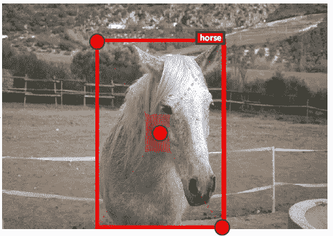

**CenterNet:用于对象检测的关键点三元组**(红色阴影区域是中心区域。)

在这个故事中，回顾了由中国科学院大学、华中科技大学、华为诺亚方舟实验室、中国科学院和程鹏实验室合作的**CenterNet:key point Triplets for Object Detection**(CenterNet)。在这个故事中:

*   中心网**将每个物体检测为三个一组的关键点**，而不是像角落网那样的一对关键点，这提高了精确度和召回率。
*   两个定制模块**级联角池**和**中心池**，这两个模块**丰富了由左上角和右下角**和**收集的信息，提供了来自中心区域**的更多可识别信息。

这是一篇在 **2019 ICCV** 超过 **380 次引用**的论文。([曾植和](https://medium.com/u/aff72a0c1243?source=post_page-----26feee780efc--------------------------------) @中)

# 概述

1.  **中心网:总体流程**
2.  **规模感知中心区域探测(CRE)**
3.  **中心池(CTP)**
4.  **梯级转角汇集(CCP)**
5.  **实验结果**

# **1。中心网:整体程序**

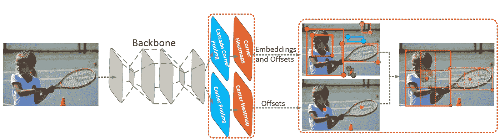

**CenterNet:网络架构**

## 1.1.网络体系结构

*   [角网](https://sh-tsang.medium.com/review-cornernet-detecting-objects-as-paired-keypoints-object-detection-ffb23026291b)用作基线。因此**主干**类似于[角网](https://sh-tsang.medium.com/review-cornernet-detecting-objects-as-paired-keypoints-object-detection-ffb23026291b)。 [**纽厄尔 ECCV【16】**](https://towardsdatascience.com/review-newell-eccv16-and-newell-pocv-16-stacked-hourglass-networks-human-pose-estimation-a9eeb76d40a5)**中使用的**堆叠沙漏网络以 52 层和 104 层为骨干。****
*   **[CornerNet](https://sh-tsang.medium.com/review-cornernet-detecting-objects-as-paired-keypoints-object-detection-ffb23026291b) 为每个对象检测一对角。**
*   **相比之下，对于 CenterNet，**每个对象使用一个中心关键点和一对角。****
*   ****基于[角网](https://sh-tsang.medium.com/review-cornernet-detecting-objects-as-paired-keypoints-object-detection-ffb23026291b)嵌入中心关键点**的热图，并预测中心关键点的偏移量。**

## **1.2.总体程序**

*   **一般检测步骤如下:**

1.  **根据得分选择**-*k*个中心关键点**。**
2.  ****相应的偏移量用于将这些中心关键点重新映射到输入图像。****
3.  **为每个边界框定义一个中心区域，并检查该中心区域是否包含中心关键点。并且**中心区域和中心关键点的类别应该相同。****
4.  ****如果在中心区域检测到中心关键点，则保留边界框。**边界框的分数由三重点的平均分数代替。**
5.  ****如果在中心区域没有检测到中心关键点，边界框将被移除。****

*   **(因为整个程序是基于 [CornerNet](https://sh-tsang.medium.com/review-cornernet-detecting-objects-as-paired-keypoints-object-detection-ffb23026291b) 。如果有兴趣，请先阅读 [CornerNet](https://sh-tsang.medium.com/review-cornernet-detecting-objects-as-paired-keypoints-object-detection-ffb23026291b) 。)**

## **1.3.损失函数**

*   **为了训练网络，使用类似于[**CornerNet**](https://sh-tsang.medium.com/review-cornernet-detecting-objects-as-paired-keypoints-object-detection-ffb23026291b)**的**损失**

**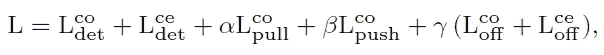**

*   **其中 *co* 表示拐角， *ce* 表示中心。**
*   **损耗基本相同，除了**有与中心关键点相关的附加项。****

# **2.规模感知中心区域探索(CRE)**

*   **边界框中中心区域的大小会影响检测结果。**
*   **小的中心区域导致小边界框的低召回率，而大的中心区域导致大边界框的低精度。**

> **一个比例敏感的中心区域，以适应边界框的大小。**
> 
> **比例感知中心区域倾向于**为小边界框**生成相对较大的中心区域，而**为大边界框**生成相对较小的中心区域。**

**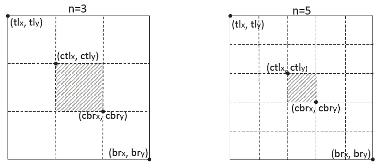**

****(a)当 n = 3 时中央区域为小包围盒。(b)对于大边界框，当 n = 5 时的中心区域。****

*   **对于包围盒 *i* ，让 *tlx* 和 *tly* 表示 *i* 的左上角坐标， *brx* 和 *bry* 表示 *i* 的右下角坐标。**
*   **对于一个中心区域 *j* ，让 *ctlx* 和*简洁地表示 *j* 左上角的坐标， *cbrx* 和 *cbry* 表示 *j* 右下角的坐标。***
*   **则 *tlx* 、 *tly* 、 *brx* 、 *bry* 、 *ctlx* 、*ctlx*、 *cbrx* 和 *cbry* 应满足以下关系:**

**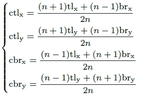**

*   **其中 *n* 为奇数，决定中心区域 *j* 的比例。**
*   **本文中， *n* 对于小于和大于 150 的包围盒比例分别设为 3 和 5，如上图。**

# **3.中心池**

**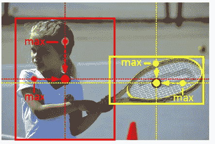**

****中心汇集取水平和垂直方向的最大值。****

*   **物体的几何中心并不总是传达非常容易辨认的视觉模式。(例如，人的头部包含强烈的视觉图案，但是中心关键点通常在人体的中间。)**
*   ****中心池用于捕捉更丰富、更易识别的视觉模式。****

**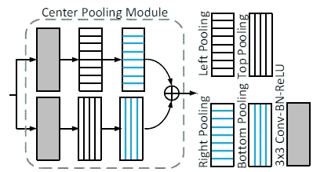**

****中心统筹****

*   **主干输出特征图，并确定特征图中的像素是否是中心关键点。**
*   ****CenterNet 找到水平和垂直方向的最大值，并将这些值相加。****
*   **通过这样做，**中心汇集有助于改进中心关键点的检测。****

> **在上面的示例中，头部和肩部在特征图上可能具有较大的值，CenterNet 找到它们，并将它们加在一起作为中心热图。**

*   **执行这些步骤是为了生成中心热图。**

# **4.级联角池(CCP)**

## **4.1.[角池**角网**角网](https://sh-tsang.medium.com/review-cornernet-detecting-objects-as-paired-keypoints-object-detection-ffb23026291b)**

**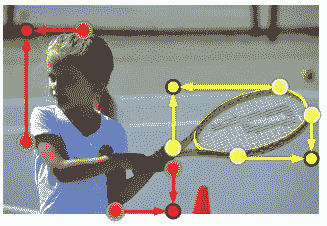**

**[**角网**](https://sh-tsang.medium.com/review-cornernet-detecting-objects-as-paired-keypoints-object-detection-ffb23026291b) **:角池只取边界方向的最大值****

*   **角点往往在物体外部，缺乏局部外观特征。这个问题也发生在 [CornerNet](https://sh-tsang.medium.com/review-cornernet-detecting-objects-as-paired-keypoints-object-detection-ffb23026291b) 中。**

> **例如，头部和肩部的边界可能分别具有比头部和肩部的中心更弱的特征响应。**

## **4.2.提议的级联角池(CCP)**

**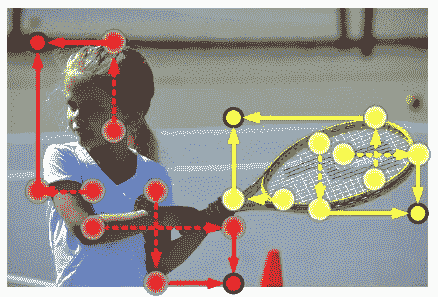**

****提出的级联角池在对象的边界方向和内部方向都取最大值****

*   **为了解决这个问题， **CenterNet 使角点能够从中心区域提取特征**，如上图所示。**

**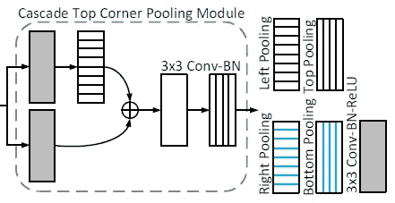**

****级联角池****

*   **级联角池**首先沿着边界寻找最大边界值**，然后**沿着边界最大值**的位置在框内寻找内部最大值。**
*   **最后，将两个最大值**相加**。**

> **通过级联角点池，角点获得对象的边界信息和视觉模式。**

# **5.实验结果**

## **5.1.消融研究**

**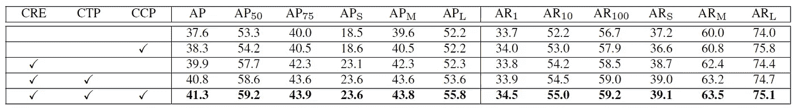**

****在 MS-COCO 验证数据集上对 centernet 511–52 的主要组件进行消融研究****

*   **测试了 CenterNet 对象检测的三个组件，即**中心区域探测(CRE)、中心池(CTP)和级联角池(CCP)** 。**
*   **基线是角网 511–52。**
*   ****全部启用时，可获得最佳结果。****

## **5.2.与 SOTA 方法的比较**

**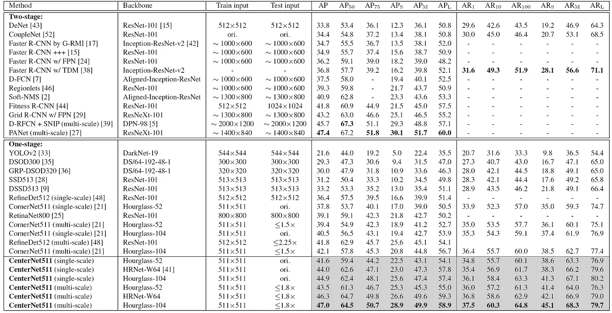**

****在 MS-COCO 测试开发数据集上与最先进方法的性能比较(%)****

*   ****CenterNet511-52** (表示输入图像的分辨率为 511 × 511，主干为沙漏-52)报告了**单尺度**测试 AP 为 **41.6%** ，比 37.8%提高了 3.8%**多尺度**测试 AP 为 **43.5%** ，比 39 提高了 4.1%**
*   **使用**更深主干**(即沙漏-104)时，在**单尺度**和**多尺度**测试下，AP 相对于 [CornerNet](https://sh-tsang.medium.com/review-cornernet-detecting-objects-as-paired-keypoints-object-detection-ffb23026291b) 的提升分别为 4.4%(从 40.5%到 **44.9%** )和 4.9%(从 42.1%到 **47.0%** )。**

> **这些结果证明了 CenterNet 的有效性。**

*   **另外，**最伟大的来自小物件。**例如，**centernet 511–52 将小物体的 AP 提高了 5.5%(单尺度)和 6.4%(多尺度)。****
*   **对于主干沙漏-104，改进分别为 6.2%(单尺度)和 8.1%(多尺度)。**

> **这一好处源于由中心关键点建模的中心信息。**
> 
> **并且 CenterNet 的表现优于 [CornerNet](https://sh-tsang.medium.com/review-cornernet-detecting-objects-as-paired-keypoints-object-detection-ffb23026291b) 、 [RefineDet](https://sh-tsang.medium.com/review-refinedet-single-shot-refinement-neural-network-for-object-detection-object-detection-5fc483449562) 、 [CoupleNet](https://sh-tsang.medium.com/review-couplenet-coupling-global-structure-with-local-parts-for-object-detection-object-d80150c5c850) 、 [RetinaNet](https://towardsdatascience.com/review-retinanet-focal-loss-object-detection-38fba6afabe4?source=post_page---------------------------) 、 [GRF-DSOD](https://sh-tsang.medium.com/review-grf-dsod-grf-ssd-improving-object-detection-from-scratch-via-gated-feature-reuse-495c11b627d3) 、 [DSOD](https://sh-tsang.medium.com/review-dsod-learning-deeply-supervised-object-detectors-from-scratch-object-detection-43393dcb31bd) 、 [DSSD](https://towardsdatascience.com/review-dssd-deconvolutional-single-shot-detector-object-detection-d4821a2bbeb5?source=post_page---------------------------) 、 [SSD](https://towardsdatascience.com/review-ssd-single-shot-detector-object-detection-851a94607d11?source=post_page---------------------------) 、 [YOLOv2](https://towardsdatascience.com/review-yolov2-yolo9000-you-only-look-once-object-detection-7883d2b02a65?source=post_page---------------------------) 、 [G-RMI](https://towardsdatascience.com/review-g-rmi-winner-in-2016-coco-detection-object-detection-af3f2eaf87e4?source=post_page---------------------------) 、 [TDM](/datadriveninvestor/review-tdm-top-down-modulation-object-detection-3f0efe9e0151?source=post_page---------------------------) 、[FPN](https://towardsdatascience.com/review-fpn-feature-pyramid-network-object-detection-262fc7482610?source=post_page---------------------------)**

## **5.3.推理速度**

*   **[**corner net**](https://sh-tsang.medium.com/review-cornernet-detecting-objects-as-paired-keypoints-object-detection-ffb23026291b)**511–104**每张图像的平均推断时间为 **300ms** ，centernet 511–104 每张图像的平均推断时间为 **340ms** 。**
*   **同时，使用沙漏-52 主干可以加快推理速度。**centernet 511–52**处理每张图像平均需要 **270ms** ，比[**CornerNet**](https://sh-tsang.medium.com/review-cornernet-detecting-objects-as-paired-keypoints-object-detection-ffb23026291b)**511–104**更快更准确。******

## **5.4.不正确的边界框缩小**

**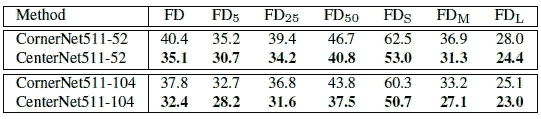**

****MS-COCO 验证数据集上**[**corner net**](https://sh-tsang.medium.com/review-cornernet-detecting-objects-as-paired-keypoints-object-detection-ffb23026291b)**和 CenterNet 的误发现率(%)比较。****

*   **[CornerNet](https://sh-tsang.medium.com/review-cornernet-detecting-objects-as-paired-keypoints-object-detection-ffb23026291b) 即使在 IoU = 0.05 的阈值下也会产生许多不正确的边界框，即[corner net](https://sh-tsang.medium.com/review-cornernet-detecting-objects-as-paired-keypoints-object-detection-ffb23026291b)511–52 和[corner net](https://sh-tsang.medium.com/review-cornernet-detecting-objects-as-paired-keypoints-object-detection-ffb23026291b)511–104 分别获得 35.2%和 32.7%的 FD 率。**

> **CenterNet 通过探索中心区域降低了所有标准下的 FD 发生率。**

*   **小边界框的 FD 率下降最多，centernet 511–52 下降了 9.5%，centernet 511–104 下降了 9.6%。**

## **5.5.误差分析**

**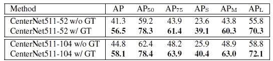**

****使用地面真值的中心关键点的误差分析。****

*   **随着中心关键点的地面真实值的使用，AP 增加了很多，这意味着仍有改进的空间。**

## **5.6.定性结果**

**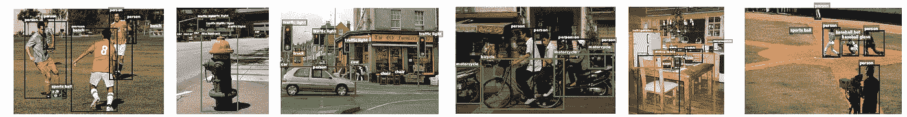**

****MS-COCO 验证数据集上的定性检测结果。仅显示分数高于 0.5 的检测。****

## **参考**

**【2019 ICCV】【CenterNet】
[CenterNet:用于对象检测的关键点三元组](https://arxiv.org/abs/1904.08189)**

## **目标检测**

****2014** : [ [过食](/coinmonks/review-of-overfeat-winner-of-ilsvrc-2013-localization-task-object-detection-a6f8b9044754?source=post_page---------------------------)][[R-CNN](/coinmonks/review-r-cnn-object-detection-b476aba290d1?source=post_page---------------------------)]
**2015**:[[快 R-CNN](/coinmonks/review-fast-r-cnn-object-detection-a82e172e87ba) ] [ [快 R-CNN](https://towardsdatascience.com/review-faster-r-cnn-object-detection-f5685cb30202?source=post_page---------------------------)][[MR-CNN&S-CNN](https://towardsdatascience.com/review-mr-cnn-s-cnn-multi-region-semantic-aware-cnns-object-detection-3bd4e5648fde?source=post_page---------------------------)][[DeepID-Net](https://towardsdatascience.com/review-deepid-net-def-pooling-layer-object-detection-f72486f1a0f6?source=post_page---------------------------)
**2016 [[GBD-网/GBD-v1&GBD-v2](https://towardsdatascience.com/review-gbd-net-gbd-v1-gbd-v2-winner-of-ilsvrc-2016-object-detection-d625fbeadeac?source=post_page---------------------------)][[SSD](https://towardsdatascience.com/review-ssd-single-shot-detector-object-detection-851a94607d11?source=post_page---------------------------)][[yolov 1](https://towardsdatascience.com/yolov1-you-only-look-once-object-detection-e1f3ffec8a89?source=post_page---------------------------)
**2017**:[[NoC](/datadriveninvestor/review-noc-winner-in-2015-coco-ilsvrc-detection-object-detection-d5cc84e372a?source=post_page---------------------------)][[G-RMI](https://towardsdatascience.com/review-g-rmi-winner-in-2016-coco-detection-object-detection-af3f2eaf87e4?source=post_page---------------------------)][[TDM](/datadriveninvestor/review-tdm-top-down-modulation-object-detection-3f0efe9e0151?source=post_page---------------------------)[[DSSD](https://towardsdatascience.com/review-dssd-deconvolutional-single-shot-detector-object-detection-d4821a2bbeb5?source=post_page---------------------------)[[yolov 2/yolo 900] [couple net](https://sh-tsang.medium.com/review-couplenet-coupling-global-structure-with-local-parts-for-object-detection-object-d80150c5c850)]
**2018**:[[yolov 3](https://towardsdatascience.com/review-yolov3-you-only-look-once-object-detection-eab75d7a1ba6?source=post_page---------------------------)][[Cascade R-CNN](/@sh.tsang/reading-cascade-r-cnn-delving-into-high-quality-object-detection-object-detection-8c7901cc7864)][[MegDet](/towards-artificial-intelligence/reading-megdet-a-large-mini-batch-object-detector-1st-place-of-coco-2017-detection-challenge-e82072e9b7f)][[stair net](/@sh.tsang/reading-stairnet-top-down-semantic-aggregation-object-detection-de689a94fe7e)][[refined et](https://sh-tsang.medium.com/review-refinedet-single-shot-refinement-neural-network-for-object-detection-object-detection-5fc483449562)][[corner net](https://sh-tsang.medium.com/review-cornernet-detecting-objects-as-paired-keypoints-object-detection-ffb23026291b)]【T78****

## **[我以前的其他论文阅读材料](https://sh-tsang.medium.com/overview-my-reviewed-paper-lists-tutorials-946ce59fbf9e)**