# 回顾— CornerNet:将对象检测为成对的关键点(对象检测)

> 原文：<https://medium.com/nerd-for-tech/review-cornernet-detecting-objects-as-paired-keypoints-object-detection-ffb23026291b?source=collection_archive---------2----------------------->

## 检测死角，胜过[屏蔽 R-CNN](/analytics-vidhya/review-mask-r-cnn-instance-segmentation-human-pose-estimation-61080a93bf4) ，[更快 R-CNN](https://towardsdatascience.com/review-faster-r-cnn-object-detection-f5685cb30202?source=post_page---------------------------) ， [CoupleNet](https://sh-tsang.medium.com/review-couplenet-coupling-global-structure-with-local-parts-for-object-detection-object-d80150c5c850) ， [G-RMI](https://towardsdatascience.com/review-g-rmi-winner-in-2016-coco-detection-object-detection-af3f2eaf87e4?source=post_page---------------------------) ， [FPN](https://towardsdatascience.com/review-fpn-feature-pyramid-network-object-detection-262fc7482610?source=post_page---------------------------) ， [TDM](/datadriveninvestor/review-tdm-top-down-modulation-object-detection-3f0efe9e0151?source=post_page---------------------------) ，[约洛夫 2](https://towardsdatascience.com/review-yolov2-yolo9000-you-only-look-once-object-detection-7883d2b02a65?source=post_page---------------------------) ， [DSOD](https://sh-tsang.medium.com/review-dsod-learning-deeply-supervised-object-detectors-from-scratch-object-detection-43393dcb31bd) ， [GRF-DSOD](https://sh-tsang.medium.com/review-grf-dsod-grf-ssd-improving-object-detection-from-scratch-via-gated-feature-reuse-495c11b627d3) ， [SSD](https://towardsdatascience.com/review-ssd-single-shot-detector-object-detection-851a94607d11?source=post_page---------------------------) ， [DSSD](https://towardsdatascience.com/review-dssd-deconvolutional-single-shot-detector-object-detection-d4821a2bbeb5?source=post_page---------------------------) ，

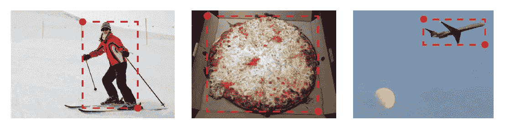

**CornerNet 检测左上角和右下角**

在这个故事中，回顾了密歇根大学的 **CornerNet:将对象检测为成对关键点**(corner net)。在本文中:

*   对象边界框被检测为**一对关键点，左上角和右下角**，消除了设计现有单级检测器中常用的一组锚框的需要。

这是一篇发表在 **2018 ECCV** 的论文，被**引用超过 900 次**。( [Sik-Ho Tsang](https://medium.com/u/aff72a0c1243?source=post_page-----ffb23026291b--------------------------------) @ Medium)

# 概述

1.  **CornerNet:网络架构**
2.  **角点检测(热图&偏移)**
3.  **角落分组(嵌入)**
4.  **角落池**
5.  **与最先进探测器的比较**

# 1.CornerNet:网络架构

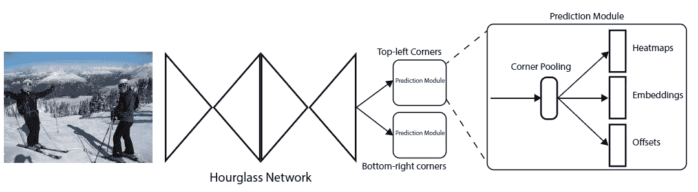

**CornerNet:网络架构**

*   [**纽维尔·ECCV‘16**](https://towardsdatascience.com/review-newell-eccv16-and-newell-pocv-16-stacked-hourglass-networks-human-pose-estimation-a9eeb76d40a5)中使用的沙漏网络，原本用于人体姿态估计，作为**骨干**。
*   使用[纽维尔·ECCV 的](https://towardsdatascience.com/review-newell-eccv16-and-newell-pocv-16-stacked-hourglass-networks-human-pose-estimation-a9eeb76d40a5)作为主干可能是因为现在 CornerNet 将**检测关键点**，类似于人类姿势估计网络的目的。

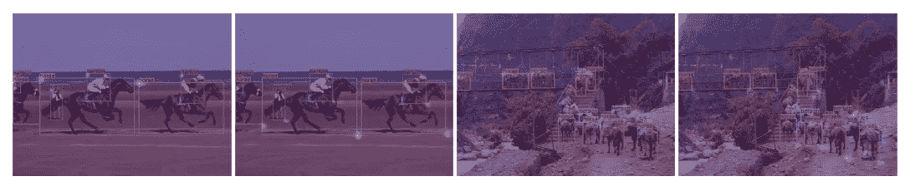

**覆盖在角落预测热图上的边界框预测的两个例子。左:**左上角热点图**，右:**右下角热点图

*   **每个关键点被预测为一个热图。**
*   **这里，角点被视为关键点。**
*   在[纽维尔·ECCV 16](https://towardsdatascience.com/review-newell-eccv16-and-newell-pocv-16-stacked-hourglass-networks-human-pose-estimation-a9eeb76d40a5)中，头部、肩膀、手掌等被视为关键点。
*   沙漏网络后面是**两个预测模块。**
*   一个模块用于**左上角**，另一个模块用于**右下角**。

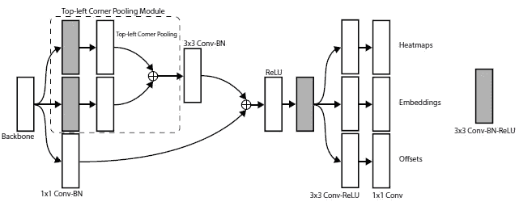

**预测热图、嵌入和偏移的多个分支。**

*   每个模块都有自己的**角池模块**，如上所示，从沙漏网络中汇集要素，然后**预测热图、嵌入和偏移。**
*   沙漏网络的**深度**为 **104** 。
*   与许多其他先进的检测器不同，只有来自整个网络最后一层的特征用于进行预测。
*   全部训练损失为:

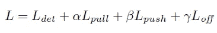

*   其中 ***Ldet* 为热图的检测损失， *Lpull* 和 *Lpush* 为嵌入损失， *Loff* 为偏移损失。**这些损失将在下文详细描述。
*   α和 *β* 设置为 0.1， *γ* 设置为 1。

# 2.拐角检测(热图和偏移)

*   每套热图有 *C* 个通道，其中 *C* 为类别数，大小为 *H* × *W* 。
*   设 *pcij* 为预测热图中类别 *c* 在位置( *i* ， *j* )处的得分，设 *ycij* 为用非标准化高斯增强的“真实”热图，类似于人的姿态估计。
*   在 [RetinaNet](https://towardsdatascience.com/review-retinanet-focal-loss-object-detection-38fba6afabe4?source=post_page---------------------------) 中使用焦点损失，检测损失 *Ldet* 为:

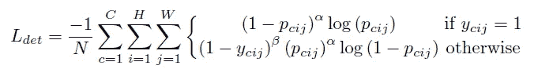

*   其中 *N* 是一幅图像中物体的数量， *α* =2， *β* =4。
*   将热图中的位置重新映射到输入图像，可能会损失一些精度，这可能会极大地影响小边界框与其地面事实的 IoU。
*   因此，在将角点位置重新映射到输入分辨率之前，会预测位置偏移来稍微调整角点位置。

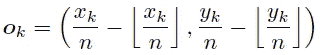

*   其中 *ok* 为偏移量， *xk* 和 *yk* 为转角 *k* 的 *x* 和 *y* 坐标。
*   使用平滑 L1 损耗，如在快速 R-CNN 中，在地面真实角点位置:

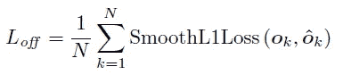

# 3.拐角分组(嵌入)

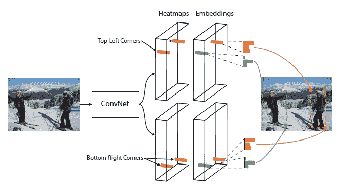

**网络被训练来预测属于同一对象的角的相似嵌入。**

*   受[纽维尔·ECCV‘16](https://towardsdatascience.com/review-newell-eccv16-and-newell-pocv-16-stacked-hourglass-networks-human-pose-estimation-a9eeb76d40a5)中的关联嵌入的启发， **CornerNet 为每个检测到的角预测一个嵌入向量，这样，如果左上角和右下角属于同一个边界框，它们的嵌入之间的距离应该很小。**
*   嵌入的实际值并不重要。**只有嵌入之间的距离被用来对角进行分组。**
*   设 *etk* 为物体 *k* 左上角的嵌入， *ebk* 为右下角的嵌入。
*   **“拉”损失**用于训练网络**将拐角**和**分组，“推”损失**用于**分离拐角**:

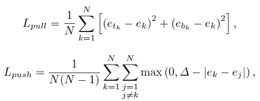

*   其中 *ek* 是 *etk* 和 *ebk* 的平均值。Δ=1.
*   与偏移损耗类似，损耗仅应用于地面真实角点位置。

**用事实代替预测的误差分析**

*   单独使用地面实况热图将 AP 从 38.5%提高到 74.0%。
*   用地面实况偏移替换预测偏移，AP 进一步增加 13.1%到 87.1%。
*   这表明，尽管在检测和分组角点方面还有很大的改进空间，但主要的瓶颈是检测角点。

# 3.角落联营

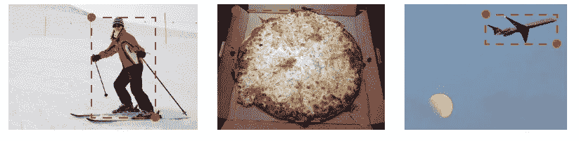

**通常没有局部证据来确定包围盒拐角的位置**

*   如上所示，通常没有局部视觉证据来证明拐角的存在。
*   角点池的提出是为了通过编码明确的先验知识来更好地定位角点。

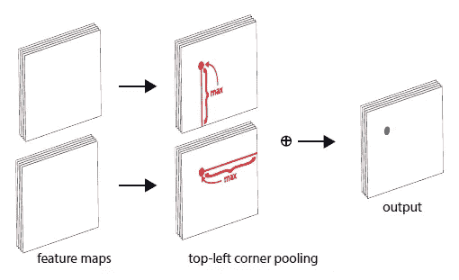

**角落汇集**

*   它可以用下面的公式表示:

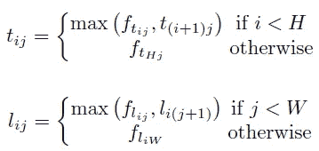

*   下面举例说明:

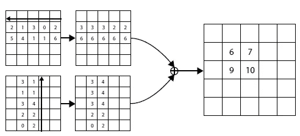

**角池示例**

*   左上角的池层可以非常高效地实现。
*   **横向最大池从右向左扫描特征图，纵向最大池从下向上扫描特征图。**
*   然后添加两个最大汇集特征图。

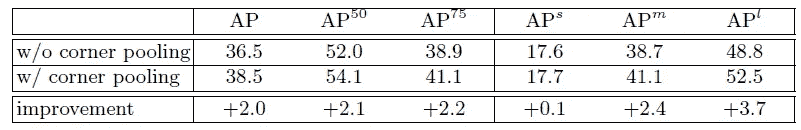

**角落里汇集着对田蜜女士的验证。**

*   有了角池，就有了显著的提高:在 AP 上提高了 2.0%，在 AP50 上提高了 2.1%，在 AP75 上提高了 2.2%。

# 4.**与最先进探测器的比较**

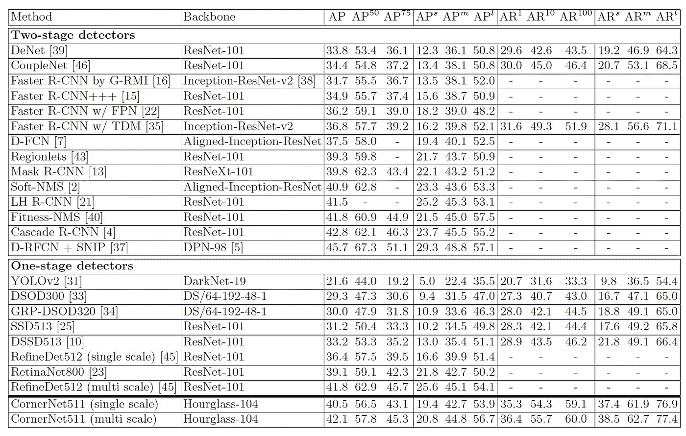

CornerNet 与其他公司在 COCO 测试开发上的对比。

*   **经过多尺度评测，CornerNet 达到了 42.1%** 的 AP，优于现有的一阶段方法，如[约洛夫 2](https://towardsdatascience.com/review-yolov2-yolo9000-you-only-look-once-object-detection-7883d2b02a65?source=post_page---------------------------) 、 [DSOD](https://sh-tsang.medium.com/review-dsod-learning-deeply-supervised-object-detectors-from-scratch-object-detection-43393dcb31bd) 、 [GRF-DSOD](https://sh-tsang.medium.com/review-grf-dsod-grf-ssd-improving-object-detection-from-scratch-via-gated-feature-reuse-495c11b627d3) 、 [SSD](https://towardsdatascience.com/review-ssd-single-shot-detector-object-detection-851a94607d11?source=post_page---------------------------) 、 [DSSD](https://towardsdatascience.com/review-dssd-deconvolutional-single-shot-detector-object-detection-d4821a2bbeb5?source=post_page---------------------------) 、 [RefineDet](https://sh-tsang.medium.com/review-refinedet-single-shot-refinement-neural-network-for-object-detection-object-detection-5fc483449562) 。
*   CornerNet 也与级联 R-CNN 等两阶段方法相竞争，并且优于[屏蔽 R-CNN](/analytics-vidhya/review-mask-r-cnn-instance-segmentation-human-pose-estimation-61080a93bf4) 、[更快 R-CNN](https://towardsdatascience.com/review-faster-r-cnn-object-detection-f5685cb30202?source=post_page---------------------------) 、 [RetinaNet](https://towardsdatascience.com/review-retinanet-focal-loss-object-detection-38fba6afabe4?source=post_page---------------------------) 和 CoupleNet。

## 参考

【2018 ECCV】【corner net】
[corner net:将物体检测为成对的关键点](https://openaccess.thecvf.com/content_ECCV_2018/papers/Hei_Law_CornerNet_Detecting_Objects_ECCV_2018_paper.pdf)

## 目标检测

**2014** : [ [过食](/coinmonks/review-of-overfeat-winner-of-ilsvrc-2013-localization-task-object-detection-a6f8b9044754?source=post_page---------------------------)][[R-CNN](/coinmonks/review-r-cnn-object-detection-b476aba290d1?source=post_page---------------------------)]
**2015**:[[快 R-CNN](/coinmonks/review-fast-r-cnn-object-detection-a82e172e87ba) ] [ [快 R-CNN](https://towardsdatascience.com/review-faster-r-cnn-object-detection-f5685cb30202?source=post_page---------------------------)][[MR-CNN&S-CNN](https://towardsdatascience.com/review-mr-cnn-s-cnn-multi-region-semantic-aware-cnns-object-detection-3bd4e5648fde?source=post_page---------------------------)][[DeepID-Net](https://towardsdatascience.com/review-deepid-net-def-pooling-layer-object-detection-f72486f1a0f6?source=post_page---------------------------)
**2016 [[GBD-网/GBD-v1&GBD-v2](https://towardsdatascience.com/review-gbd-net-gbd-v1-gbd-v2-winner-of-ilsvrc-2016-object-detection-d625fbeadeac?source=post_page---------------------------)][[SSD](https://towardsdatascience.com/review-ssd-single-shot-detector-object-detection-851a94607d11?source=post_page---------------------------)][[yolov 1](https://towardsdatascience.com/yolov1-you-only-look-once-object-detection-e1f3ffec8a89?source=post_page---------------------------)
**2017**:[[NoC](/datadriveninvestor/review-noc-winner-in-2015-coco-ilsvrc-detection-object-detection-d5cc84e372a?source=post_page---------------------------)][[G-RMI](https://towardsdatascience.com/review-g-rmi-winner-in-2016-coco-detection-object-detection-af3f2eaf87e4?source=post_page---------------------------)][[TDM](/datadriveninvestor/review-tdm-top-down-modulation-object-detection-3f0efe9e0151?source=post_page---------------------------)[[DSSD](https://towardsdatascience.com/review-dssd-deconvolutional-single-shot-detector-object-detection-d4821a2bbeb5?source=post_page---------------------------)[[yolov 2/yolo 9000] [couple net](https://sh-tsang.medium.com/review-couplenet-coupling-global-structure-with-local-parts-for-object-detection-object-d80150c5c850)]
**2018**:[[yolov 3](https://towardsdatascience.com/review-yolov3-you-only-look-once-object-detection-eab75d7a1ba6?source=post_page---------------------------)][[Cascade R-CNN](/@sh.tsang/reading-cascade-r-cnn-delving-into-high-quality-object-detection-object-detection-8c7901cc7864)][[MegDet](/towards-artificial-intelligence/reading-megdet-a-large-mini-batch-object-detector-1st-place-of-coco-2017-detection-challenge-e82072e9b7f)][[stair net](/@sh.tsang/reading-stairnet-top-down-semantic-aggregation-object-detection-de689a94fe7e)][[refined et](https://sh-tsang.medium.com/review-refinedet-single-shot-refinement-neural-network-for-object-detection-object-detection-5fc483449562)][[corner net](https://sh-tsang.medium.com/review-cornernet-detecting-objects-as-paired-keypoints-object-detection-ffb23026291b)]【T78**

## [我以前的其他论文阅读材料](https://sh-tsang.medium.com/overview-my-reviewed-paper-lists-tutorials-946ce59fbf9e)