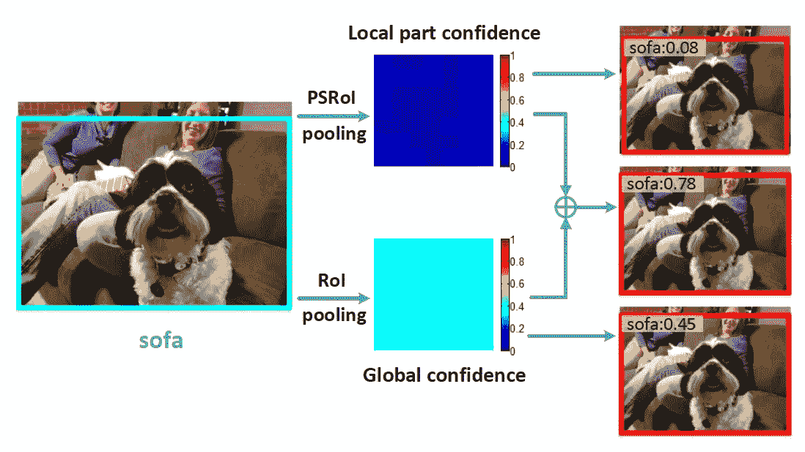
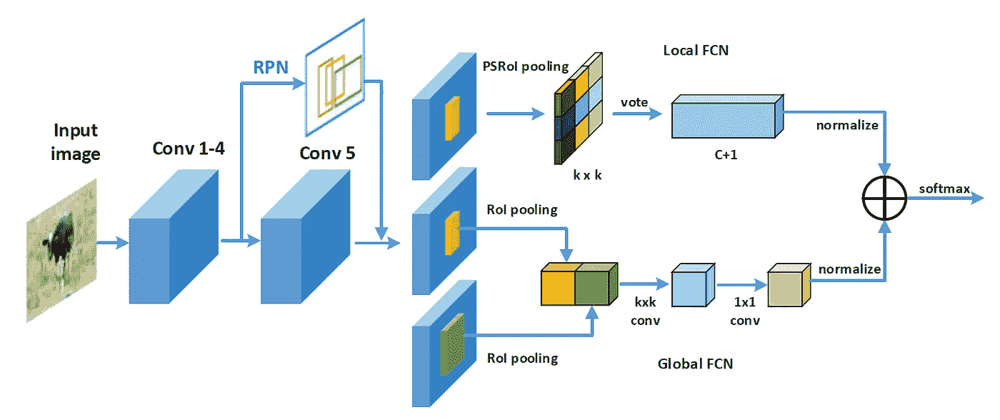
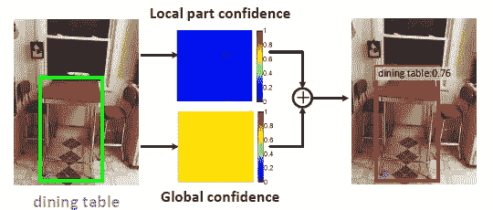
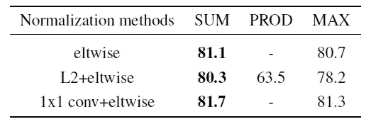
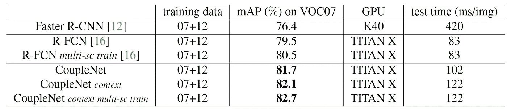
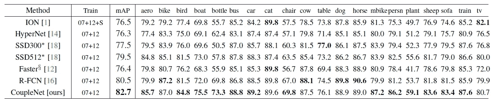
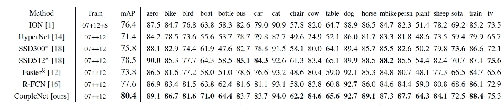
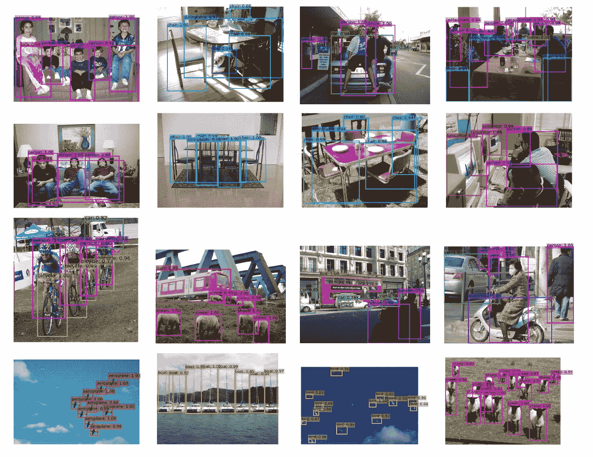

# 回顾— CoupleNet:将全局结构与局部部分耦合起来进行对象检测(对象检测)

> 原文：<https://medium.com/nerd-for-tech/review-couplenet-coupling-global-structure-with-local-parts-for-object-detection-object-d80150c5c850?source=collection_archive---------5----------------------->

## 拥有本地和全球 FCN 分支机构，捕捉本地和全球信息，胜过 [R-FCN](https://towardsdatascience.com/review-r-fcn-positive-sensitive-score-maps-object-detection-91cd2389345c?source=post_page---------------------------) ，[更快 R-CNN](https://towardsdatascience.com/review-faster-r-cnn-object-detection-f5685cb30202?source=post_page---------------------------) ， [SSD](https://towardsdatascience.com/review-ssd-single-shot-detector-object-detection-851a94607d11?source=post_page---------------------------) ，& [ION](https://towardsdatascience.com/review-ion-inside-outside-net-2nd-runner-up-in-2015-coco-detection-object-detection-da19993f4766?source=post_page---------------------------) 。

**通过结合局部和全局信息进行物体检测的玩具示例**

在这个故事里，回顾了中国科学院、中国科学院大学、南京审计大学、印第安纳大学的 **CoupleNet:耦合全局结构与局部结构进行物体检测**(couple net)。在本文中:

*   区域提议网络(RPN)获得的对象提议被输入到由两个分支组成的**耦合模块**。
*   一个分支采用**位置敏感感兴趣区域(PSRoI)池**捕获**物体的局部信息**。
*   另一种采用 **RoI 汇集**来编码**全局和上下文信息**。

这是一篇发表在 **2017 ICCV** 的论文，引用超过 **130 次**。( [Sik-Ho Tsang](https://medium.com/u/aff72a0c1243?source=post_page-----d80150c5c850--------------------------------) @中)

# 概述

1.  **CoupleNet:网络架构**
2.  **实验结果**

# **1。CoupleNet:网络架构**

**CoupleNet:网络架构**

*   ImageNet 预训练 [ResNet](https://towardsdatascience.com/review-resnet-winner-of-ilsvrc-2015-image-classification-localization-detection-e39402bfa5d8?source=post_page---------------------------) -101 作为主干，去掉了最后的平均池层和 fc 层。
*   然后，每份提案都流向两个不同的分支机构:当地的 FCN 和全球的 FCN。
*   最后，全局和局部 FCN 的输出耦合在一起作为对象的最终得分。

## 1.1.当地 FCN

*   一组**部分敏感得分图**通过追加一个 1×1 卷积层与 ***k* ( *C* + 1)通道**，其中 *k* 是指我们将物体分成 *k* × *k* 局部(*k*= 7)*C*+1 是物体类别数加上背景。
*   **对于每个类别，总共有 *k* 个通道**，每个通道负责对对象的特定部分进行编码。
*   类别的最终得分是通过对 k 个回答进行投票来确定的。
*   **平均池**用于投票。然后，获得 **a ( *C* + 1)-d 向量**，其指示对象属于每个类别的概率。

**本地 FCN 使用的直观描述**

> 如上图，例如:对于被截断的人，人们很难从全局描述中得到强有力的回应。**局部 FCN 可以有效捕捉几个特定部位**，比如人的鼻子、嘴巴等。

## 1.2.全球 FCN

*   除了常规的 RoI 合并(全局 FCN 的黄色区域)之外，**多插入一个 RoI 合并层(全局 FCN 的绿色区域)**作为上下文区域，以提取对象的全局结构描述。
*   具体来说，**该上下文区域比原始提议的大小大两倍。**
*   然后，从原始区域和上下文区域汇集的特征 RoI 被连接在一起。
*   核大小分别为 *k* × *k* 和 1×1(*k*设为默认值 7)的两个卷积层用于进一步抽象 RoI 的全局表示。
*   最后，1×1 卷积的输出被送入分类器，其输出也是一个( *C* + 1)-d 向量。

**全球 FCN 使用的直观描述**

> **对于那些具有简单空间结构并且在包围盒中包含大量背景**的物体，例如餐桌，**全局 FCN 有助于捕捉全局上下文**以提高检测性能。

## 1.3.耦合结构

**不同归一化操作和耦合方法的效果。**

*   要合并本地 FCN 和全球 FCN，有许多方法。
*   发现使用 **1×1 卷积来重新标度响应**，比 L2 归一化好得多。
*   这是因为 L2 归一化减少了不同类别之间的输出差距，从而导致更小的得分差距，降低了准确性。
*   **元素式求和**即使采用不同的归一化方法，也总能获得最佳性能。
*   对于元素方面的产品，它甚至在训练期间也不稳定。
*   对于逐元素最大值，它在某种程度上相当于网络中的集合模型。所以，作者也与合奏比较。

**情侣网 vs 模联**

*   模型集合带来的提升(第 4 & 5 行)不到 1 分。远远小于 CoupleNet (81.7%)。
*   另一方面，CoupleNet 享受**端到端**培训，并且**不需要培训多个型号**，因此**大大减少了培训时间**。

## 1.4.复杂性

*   整个网络是完全卷积的。
*   全球分公司可以算是轻量级[更快的 R-CNN](https://towardsdatascience.com/review-faster-r-cnn-object-detection-f5685cb30202?source=post_page---------------------------) 。RoI 方式子网的深度仅为 2。
*   计算复杂度远小于深度为 10 的基于 [ResNet](https://towardsdatascience.com/review-resnet-winner-of-ilsvrc-2015-image-classification-localization-detection-e39402bfa5d8?source=post_page---------------------------) 的[更快 R-CNN](https://towardsdatascience.com/review-faster-r-cnn-object-detection-f5685cb30202?source=post_page---------------------------) 系统中的子网。
*   因此，CoupleNet 可以有效地执行推理，其运行速度比 [R-FCN](https://towardsdatascience.com/review-r-fcn-positive-sensitive-score-maps-object-detection-91cd2389345c?source=post_page---------------------------) 稍慢，但比[更快的 R-CNN](https://towardsdatascience.com/review-faster-r-cnn-object-detection-f5685cb30202?source=post_page---------------------------) 快得多。

# 2.实验结果

## 2.1.帕斯卡 VOC 2007

**与** [**的对比更快 R-CNN**](https://towardsdatascience.com/review-faster-r-cnn-object-detection-f5685cb30202?source=post_page---------------------------) **与** [**R-FCN**](https://towardsdatascience.com/review-r-fcn-positive-sensitive-score-maps-object-detection-91cd2389345c?source=post_page---------------------------) **使用**[**ResNet**](https://towardsdatascience.com/review-resnet-winner-of-ilsvrc-2015-image-classification-localization-detection-e39402bfa5d8?source=post_page---------------------------)**-101。**

*   模型在 VOC 2007 trainval 和 VOC 2012 trainval(“07+12”)的联合集上训练，并在 VOC 2007 测试集上评估。
*   **没有上下文区域和没有多尺度训练的 CoupleNet 已经比有或没有多尺度训练的** [**更快 R-CNN**](https://towardsdatascience.com/review-faster-r-cnn-object-detection-f5685cb30202?source=post_page---------------------------) **，和**[**R-FCN**](https://towardsdatascience.com/review-r-fcn-positive-sensitive-score-maps-object-detection-91cd2389345c?source=post_page---------------------------)**。**
*   结合上下文区域和多尺度训练，CoupleNet 获得了更高的 82.7%的 mAP。

**PASCAL VOC 2007 测试集的结果**

*   **CoupleNet 也优于其他 SOTA 方法**，如 [ION](https://towardsdatascience.com/review-ion-inside-outside-net-2nd-runner-up-in-2015-coco-detection-object-detection-da19993f4766?source=post_page---------------------------) 和 [SSD](https://towardsdatascience.com/review-ssd-single-shot-detector-object-detection-851a94607d11?source=post_page---------------------------) 。

## 2.2.帕斯卡 VOC 2012

**PASCAL VOC 2012 测试集的结果**

*   CoupleNet 获得 80.4%的顶图，比 [R-FCN](https://towardsdatascience.com/review-r-fcn-positive-sensitive-score-maps-object-detection-91cd2389345c?source=post_page---------------------------) 高 2.8 分。

> 不使用测试阶段的额外招数， **CoupleNet 是第一个 mAP 高于 80%的。**

*   下面显示了 CoupleNet 的一些检测示例:

**PASCAL VOC 2012 测试集上 CoupleNet 的检测实例**

## 2.3.可可女士

**COCO 2015 测试开发结果**

*   CoupleNet 在 80k 训练集和 40k 验证集的并集上进行训练，并在 20k 测试开发集上进行测试。
*   当在单个尺度中测试时，利用从{480，576，672，768，864}中随机采样的尺度进行多尺度训练。
*   **单尺度 CoupleNet 已经取得了 33.1%的成绩，领先**[**R-FCN**](https://towardsdatascience.com/review-r-fcn-positive-sensitive-score-maps-object-detection-91cd2389345c?source=post_page---------------------------)**3.9 个点。**
*   此外，多尺度训练进一步提高了 34.4%的成绩。
*   观察到数据集越有挑战性，提升越多(例如，VOC07 的 2.2%，VOC12 的 2.8%，以及 COCO 的 4.5%)。

## 参考

【2017 ICCV】【couple net】
[couple net:耦合全局结构和局部结构进行物体检测](https://arxiv.org/abs/1708.02863)

## 目标检测

**2014** : [ [过食](/coinmonks/review-of-overfeat-winner-of-ilsvrc-2013-localization-task-object-detection-a6f8b9044754?source=post_page---------------------------)][[R-CNN](/coinmonks/review-r-cnn-object-detection-b476aba290d1?source=post_page---------------------------)]
**2015**:[[快 R-CNN](/coinmonks/review-fast-r-cnn-object-detection-a82e172e87ba) ] [ [快 R-CNN](https://towardsdatascience.com/review-faster-r-cnn-object-detection-f5685cb30202?source=post_page---------------------------)][[MR-CNN&S-CNN](https://towardsdatascience.com/review-mr-cnn-s-cnn-multi-region-semantic-aware-cnns-object-detection-3bd4e5648fde?source=post_page---------------------------)][[DeepID-Net](https://towardsdatascience.com/review-deepid-net-def-pooling-layer-object-detection-f72486f1a0f6?source=post_page---------------------------)
**2016 [[GBD-网/GBD-v1&GBD-v2](https://towardsdatascience.com/review-gbd-net-gbd-v1-gbd-v2-winner-of-ilsvrc-2016-object-detection-d625fbeadeac?source=post_page---------------------------)][[SSD](https://towardsdatascience.com/review-ssd-single-shot-detector-object-detection-851a94607d11?source=post_page---------------------------)][[yolov 1](https://towardsdatascience.com/yolov1-you-only-look-once-object-detection-e1f3ffec8a89?source=post_page---------------------------)
**2017**:[[NoC](/datadriveninvestor/review-noc-winner-in-2015-coco-ilsvrc-detection-object-detection-d5cc84e372a?source=post_page---------------------------)][[G-RMI](https://towardsdatascience.com/review-g-rmi-winner-in-2016-coco-detection-object-detection-af3f2eaf87e4?source=post_page---------------------------)][[TDM](/datadriveninvestor/review-tdm-top-down-modulation-object-detection-3f0efe9e0151?source=post_page---------------------------)[[DSSD](https://towardsdatascience.com/review-dssd-deconvolutional-single-shot-detector-object-detection-d4821a2bbeb5?source=post_page---------------------------)[[yolov 2/yolo 9000] [couple net](https://sh-tsang.medium.com/review-couplenet-coupling-global-structure-with-local-parts-for-object-detection-object-d80150c5c850)]
**2018**:[[yolov 3](https://towardsdatascience.com/review-yolov3-you-only-look-once-object-detection-eab75d7a1ba6?source=post_page---------------------------)][[Cascade R-CNN](/@sh.tsang/reading-cascade-r-cnn-delving-into-high-quality-object-detection-object-detection-8c7901cc7864)][[MegDet](/towards-artificial-intelligence/reading-megdet-a-large-mini-batch-object-detector-1st-place-of-coco-2017-detection-challenge-e82072e9b7f)][[stair net](/@sh.tsang/reading-stairnet-top-down-semantic-aggregation-object-detection-de689a94fe7e)]
**2019**:[[DCN v2](/towards-artificial-intelligence/review-dcnv2-deformable-convnets-v2-object-detection-instance-segmentation-3d8a18bee2f5)**

## [我以前的其他论文阅读材料](https://sh-tsang.medium.com/overview-my-reviewed-paper-lists-tutorials-946ce59fbf9e)