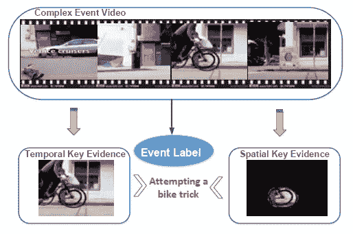
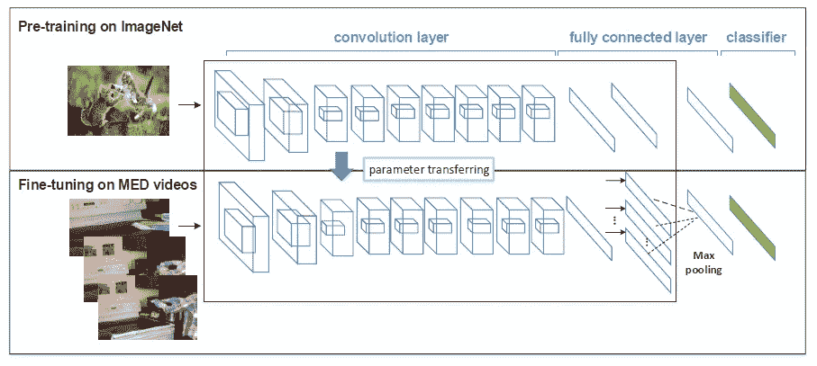
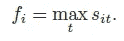
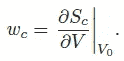
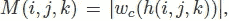
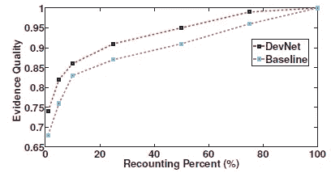
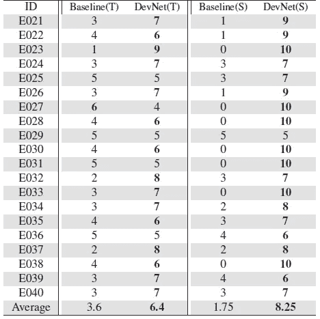
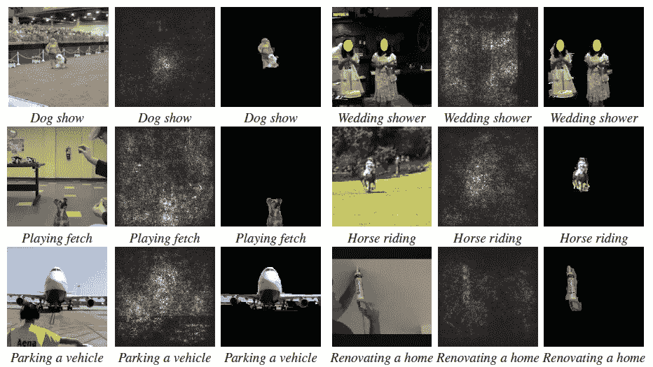

# 回顾— DevNet:用于多媒体事件检测和证据叙述的深度事件网络(视频分类)

> 原文：<https://medium.com/nerd-for-tech/review-devnet-deep-event-network-for-multimedia-event-detection-and-evidence-recounting-video-140ded103d01?source=collection_archive---------11----------------------->

## [AlexNet](/coinmonks/paper-review-of-alexnet-caffenet-winner-in-ilsvrc-2012-image-classification-b93598314160?source=post_page---------------------------) -Like 网络与 [SPPNet](/coinmonks/review-sppnet-1st-runner-up-object-detection-2nd-runner-up-image-classification-in-ilsvrc-906da3753679?source=post_page---------------------------) 中的**空间金字塔池层进行视频分类**

给定一个测试视频，DevNet 不仅提供事件标签，还提供时空关键证据。

在这篇报道中，回顾了由清华大学、香港科技大学、悉尼科技大学和卡内基梅隆大学共同开发的**DevNet:Deep Event Network for Multimedia Event Detection and Evidence returning**(DevNet)。

> **事件**是比概念更高级别的视频序列的语义抽象，并且通常**由多个概念组成。**
> 
> 一个长的无约束视频**可能包含很多不相关的信息**甚至同一个事件标签可能包含**大的类内变化**。

在本文中:

*   **深度事件网络(DevNet)** ，旨在**同时检测预定义事件并提供关键的时空证据。**
*   **可以生成时空显著图**来定位关键证据。
*   这是第一篇使用 CNN 完成上述任务的论文。

这是一篇发表在 **2015 CVPR** 的论文，被引用超过 **280 次**。( [Sik-Ho Tsang](https://medium.com/u/aff72a0c1243?source=post_page-----140ded103d01--------------------------------) @中)

# 概述

1.  **DevNet:网络架构**
2.  **基于梯度的时空显著图**
3.  **实验结果**

# **1。DevNet:网络架构**

**DevNet:网络架构**

## 1.1.预训练

*   CNN 类似于 [AlexNet](/coinmonks/paper-review-of-alexnet-caffenet-winner-in-ilsvrc-2012-image-classification-b93598314160?source=post_page---------------------------) ，包含 **9 个卷积层**和 **3 个全连接层。**
*   在这两部分之间，采用了一个起源于 [SPPNet](/coinmonks/review-sppnet-1st-runner-up-object-detection-2nd-runner-up-image-classification-in-ilsvrc-906da3753679?source=post_page---------------------------) 的**空间金字塔池层**。
*   权重层配置为:conv 64-conv 192-conv 384-conv 384-conv 384-conv 384-conv 384-conv 384-conv 384-full 4096-full 4096-full 1000。
*   前两个全连接层之后是一个[压差](https://sh-tsang.medium.com/paper-dropout-a-simple-way-to-prevent-neural-networks-from-overfitting-image-classification-a74b369b4b8e)层，其[压差](https://sh-tsang.medium.com/paper-dropout-a-simple-way-to-prevent-neural-networks-from-overfitting-image-classification-a74b369b4b8e)为 0.5。
*   在 ImageNet 预训练后，在 ILSVRC2014 验证集上，网络达到了 29.7%/10.5%的前 1/前 5 分类误差。

## **1.2。DevNet:微调**

*   然后，**soft max 分类器和预训练网络的最后全连接层**被**移除**。
*   为了将图像级特征聚集到视频级表示中，**交叉图像最大池**被应用于**融合来自同一视频内所有关键帧**的第二全连接层的输出:

*   其中 *sit* 是关键帧 *t* 特征向量的第 *i* 维， *fi* 是视频级特征向量 *f* 的第 *i* 维。
*   softmax loss 被更合适的 ***c* -way 独立逻辑回归**代替，其为每个事件类别产生**检测分数。**
*   这种跨图像最大池化后的视频级表示作为事件检测任务的特征。
*   简而言之，**支持向量机**和具有 chi^2 核的核岭回归(KR)被用作**事件分类器。**

# 2.基于梯度的时空显著图

*   我们的事件叙述方法的主要思想是，给定一个已学习的检测 DevNet 和一个感兴趣的类，原始输入图像通过**反向传递**来跟踪，通过它我们可以找到**每个像素如何影响指定事件类**的最终检测分数。
*   然而，类得分 *Sc* ( *V* )是 *V* 的高度非线性函数，因此 *Sc* ( *V* )是通过在 *V* 0:

*   其中 *x* 是视频 *V* 的矢量化形式。 *Sc* ( *V* )为检测分数。
*   用**表示 *Sc* ( *V* )相对于 *V* 在 *V* 0** 点的导数为:

*   给定属于事件类别 *c* 的视频，其具有尺寸为 *p* × *q* 的 *k* 个关键帧，计算空间和时间关键证据。
*   **每个关键帧**中每个像素的显著性得分可以计算为:

*   其中 *h* ( *i* ， *j* ， *k* )是第 *k* 关键帧的第 *i* 行第 *j* 列图像像素对应的 *wc* 元素的索引。
*   因此，**对于每个事件类别，可以为视频中的每个像素**导出单个类别特定的显著性分数。
*   在获得时空显著性图之后，**对关键帧内所有像素的显著性分数进行平均**，以获得**关键帧级显著性分数**。
*   然后，对关键帧级别的显著性分数进行**排序**以获得信息关键帧。
*   对于**排名靠前的关键帧**，使用**显著性分数**作为指导，应用**图割**算法**分割空间显著区域**。

# 3.实验结果

## 3.1.资料组

*   使用 NIST TRECVID 2014 多媒体事件检测数据集。
*   该数据集包含长度、质量和分辨率差异很大的无约束网络视频。
*   它还配有针对 **20 个事件类别的**地面实况视频级注释**。**
*   按照 100EX 评估程序，使用 3 个不同的分区进行评估:

1.  **背景**，包含不属于任何目标事件的大约 **5000 个背景视频。**
2.  **100EX** ，包含**每个事件**的 100 个正面视频，作为**训练集**。
3.  **包含**23954 个视频**的 MEDTest** 被用作**测试集**。

## 3.2.事件检测结果

*   最小归一化检测成本(MinNDC)和平均精度(AP)被用作每个事件的度量。
*   简而言之，不同的成本值被分配给漏检和虚警。
*   较低的 MinNDC 或较高的 AP 和 mAP 值指示较好的检测性能。

**事件检测结果与改进的密集轨迹 Fisher 向量(IDTFV)比较。**

*   通过对所有事件进行平均，与最先进的 IDTFV 浅层特征相比，提议的基于 CNN 的 DevNet 在平均精度(mAP) **方面有 **5.86%的改进**。**

## 3.3.证据重新计数结果

**证据质量与重新计票百分比的比较。**

*   使用了两个标准。

1.  **证据质量**，衡量本地化的关键证据能够在多大程度上让法官相信视频中发生了特定事件。
2.  **重新计数百分比**，衡量视频片段相对于整个视频的紧凑程度。

*   一些志愿者被要求担任评估者。评估者首先分别看到 1、5、10、25、50、75 和 100%的测试视频。他们投票决定显示的关键帧是否能让他们相信这是一个正面的范例。
*   如图所示， **DevNet 可以将重新计票百分比降低 15%到 25%，以获得与基线方法相同的证据质量。**这证实了 DevNet 为用户快速准确地掌握视频事件的基本概念提供了相当好的证据。

**事件重新计数结果与基线方法的比较。t 表示时间关键证据，S 表示空间关键证据。**

*   上表总结了评估者的偏好。
*   DevNet 对大多数事件来说更好。

**DevNet 生成的事件重新计票结果。从左到右是顶部一个时间关键证据、空间显著图和空间关键证据。**

*   上面还显示了一些可视化结果。

## 参考

[2015 CVPR][DevNet]
[DevNet:用于多媒体事件检测和证据叙述的深度事件网络](https://www.cv-foundation.org/openaccess/content_cvpr_2015/papers/Gan_DevNet_A_Deep_2015_CVPR_paper.pdf)

## 视频分类

**2014**[深度视频](https://sh-tsang.medium.com/paper-deep-video-large-scale-video-classification-with-convolutional-neural-network-video-585c36c4f042)**2015**[DevNet](https://sh-tsang.medium.com/review-devnet-deep-event-network-for-multimedia-event-detection-and-evidence-recounting-video-140ded103d01)[C3D](https://sh-tsang.medium.com/paper-c3d-learning-spatiotemporal-features-with-3d-convolutional-networks-video-classification-72b49adb4081)**2017**[P3D](https://sh-tsang.medium.com/paper-p3d-pseudo-3d-residual-networks-video-classification-action-recognition-d1dd13638d7c)

## [我以前的其他论文阅读材料](https://sh-tsang.medium.com/overview-my-reviewed-paper-lists-tutorials-946ce59fbf9e)