# 综述—DFN:区别特征网络(语义分割)

> 原文：<https://medium.com/nerd-for-tech/review-dfn-discriminative-feature-network-semantic-segmentation-eb3714482270?source=collection_archive---------13----------------------->

## **拥有平滑网络&边界网络，胜过**[DeepLabv3+](/@sh.tsang/review-deeplabv3-atrous-separable-convolution-semantic-segmentation-a625f6e83b90)[PSPNet](https://towardsdatascience.com/review-pspnet-winner-in-ilsvrc-2016-semantic-segmentation-scene-parsing-e089e5df177d?source=post_page---------------------------)[ResNet-38](/@sh.tsang/resnet-38-wider-or-deeper-resnet-image-classification-semantic-segmentation-f297f2f73437)[RefineNet](https://towardsdatascience.com/review-refinenet-multi-path-refinement-network-semantic-segmentation-5763d9da47c1?source=post_page---------------------------)[GCN](https://towardsdatascience.com/review-gcn-global-convolutional-network-large-kernel-matters-semantic-segmentation-c830073492d2?source=post_page---------------------------)[DUC](/@sh.tsang/review-resnet-duc-hdc-dense-upsampling-convolution-and-hybrid-dilated-convolution-semantic-c4208227b1ca)[DeepLabv2](https://towardsdatascience.com/review-deeplabv1-deeplabv2-atrous-convolution-semantic-segmentation-b51c5fbde92d?source=post_page---------------------------)[parse net](/datadriveninvestor/review-parsenet-looking-wider-to-see-better-semantic-segmentation-aa6b6a380990?source=post_page---------------------------)[DPN](/@sh.tsang/reading-dpn-deep-parsing-network-semantic-segmentation-2f740ced6edc)[FCN](https://towardsdatascience.com/review-fcn-semantic-segmentation-eb8c9b50d2d1?source=post_page---------------------------)。

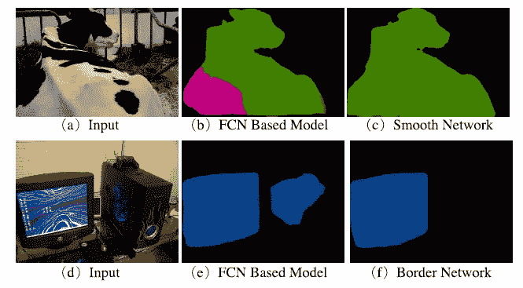

**语义分割中的硬例子**

在这个故事里，**学习一个用于语义切分的判别特征网络**(DFN)，由华中科技大学、北京大学和旷视科技公司(Face++合作完成。在本文中:

*   **区别特征网络(DFN)** 有 2 个子网络。
*   一个是**平滑网络**，用通道注意块和全局平均池来处理类内不一致性问题，以选择更具区分性的特征。
*   一个是**边界网络**，用深度语义边界监督使边界的双边特征可区分。

这是一篇在 **2018 年 CVPR** 发表的论文，有超过 **360 条引文。(**[**Sik-Ho Tsang**](https://medium.com/u/aff72a0c1243?source=post_page-----eb3714482270--------------------------------)**@ media)**

# **轮廓**

1.  **DFN:网络架构**
2.  **平滑网络**
3.  **边境网络**
4.  **消融研究**
5.  **实验结果**

# **1。DFN:网络架构**

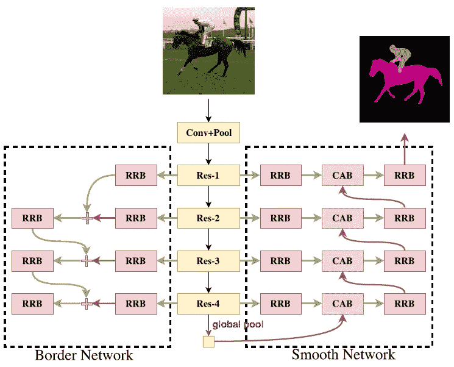

**DFN:整体网络架构**

*   **ImageNet 预先训练**[**ResNet**](https://towardsdatascience.com/review-resnet-winner-of-ilsvrc-2015-image-classification-localization-detection-e39402bfa5d8?source=post_page---------------------------)**-101 被使用。** [**FCN 以**](https://towardsdatascience.com/review-fcn-semantic-segmentation-eb8c9b50d2d1?source=post_page---------------------------) **4 作为基础分割框架。**
*   [ResNet](https://towardsdatascience.com/review-resnet-winner-of-ilsvrc-2015-image-classification-localization-detection-e39402bfa5d8?source=post_page---------------------------) 因要素图大小不同而有多个阶段。
*   **损失函数由光滑网络的分割损失 *ls* 和边界网络的边界损失*lb*:**组成

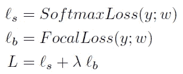

*   这两个网络或损失将在下文提及。

# **2 .平滑网络**

*   总体网络架构图可见，平滑网络由**通道关注块(CABs)** 和**细化残差块(rrb)组成。**

## 2.1.频道关注块(CABs)

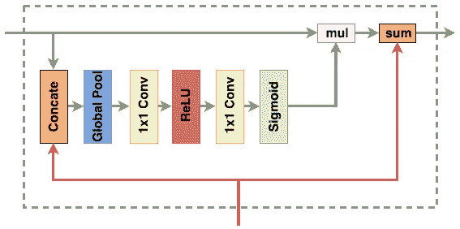

**通道注意阻滞(CAB)**

*   在 [FCN](https://towardsdatascience.com/review-fcn-semantic-segmentation-eb8c9b50d2d1?source=post_page---------------------------) 架构中，卷积运算符输出得分图，该得分图给出每个像素处每个类别的概率。
*   评分图的最终评分仅在要素图的所有通道上求和:

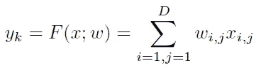

*   其中 *x* 为网络的输出特征， *w* 为卷积核。 *K* 为通道数。 *D* 是像素位置的集合。

> 然而，上面的等式隐含地表明不同通道的权重是相等的。

*   对于 CAB， ***α* 是 CAB 基于特征映射响应**估计的权重，如上图所示:

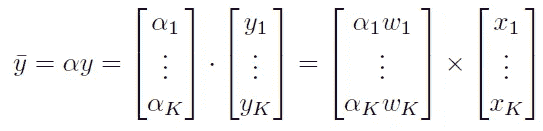

*   其中 *α* 在与输入相乘之前是 s 形的:

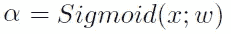

*   这个想法起源于塞涅特。(有兴趣请随意阅读 SENet。)

> 利用 CAB 得到**类内一致性预测**，提取**鉴别特征**，抑制**非鉴别特征。**

## 2.2.细化残差块

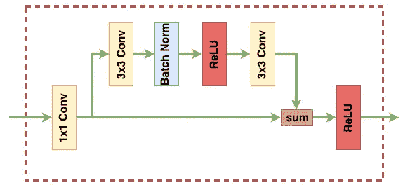

**细化残差块(RRB)**

*   RRB 的第一个组件是一个 **1×1 卷积层**。通道数统一为 512。同时，它可以**组合所有通道的信息。**
*   然后下面是一个基本的残差块，可以细化特征图。

> 因此，该块可以**加强各阶段**的识别能力，灵感来自 [ResNet](https://towardsdatascience.com/review-resnet-winner-of-ilsvrc-2015-image-classification-localization-detection-e39402bfa5d8?source=post_page---------------------------) 的架构。

# 3.边界网络

*   边界网络，如总体网络架构图所示，用于**扩大特征的类间区分。**
*   为了**提取准确的语义边界**，**应用语义边界的显式监督**，使网络学习到一个类间区分能力强的特征。
*   该网络能够同时从低层获得准确的边缘信息和从高层获得语义信息，消除了一些缺乏语义信息的原始边缘。
*   **高级的语义信息可以逐级细化低级的细节边缘信息。**
*   **该网络的监督信号**是用传统的图像处理方法，如 **Canny** 从语义分割的基础上得到的。
*   为了补救阳性和阴性样本的不平衡，使用了 RetinaNet 中的焦点损失:

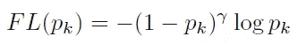

*   其中 *pk* 是类别 *k* 的估计概率。

# 4.消融研究

## 4.1.平滑网络

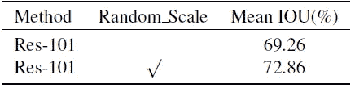

**PASCAL VOC 2012 基准性能**

*   底座 [ResNet](https://towardsdatascience.com/review-resnet-winner-of-ilsvrc-2015-image-classification-localization-detection-e39402bfa5d8?source=post_page---------------------------) -101 的性能如上图所示。
*   用 5 个标度{0.5，0.75，1，1.5，1.75}，**在 PASCAL VOC 2012 上达到 72.86%** mIOU。

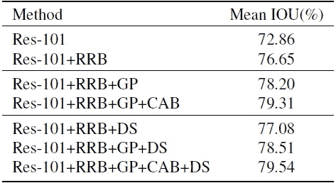

**拟建平滑网络的详细性能对比**。 **RRB** :细化残差块。 **GP** :全球统筹分支。**驾驶室**:通道注意块。 **DS** :深度监督。

*   **RRB** :采用 RRB，性能从 72.86%提高到 **76.65%** 。
*   **GP** :全球平均池**引入最强的一致性来指导其他阶段**。这使得性能从 76.65%提高到 **78.20%** ，这是一个明显的提高。
*   **DS** :通过深度监控，这进一步将性能**提高了近 0.4%。**
*   **CAB** : CAB **利用高阶段引导低阶段**用通道注意力向量增强一致性，使性能从 78.51%提高到 **79.54%** 。

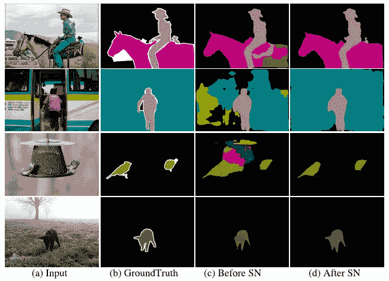

**PASCAL VOC 2012 上平滑网络的结果**

## 4.2.边界网络

**结合边界网络和平滑网络作为区别特征网络**。 **SN** :平滑网络。 **BN** :边界网络。 **MS 翻转**:增加多刻度输入和左右翻转输入。

*   随着**边界网络**集成到平滑网络中，这将性能从 79.54%提高到 **79.67%** 。
*   边界网络**优化了语义边界**，语义边界是整个图像中相对较小的一部分，所以这个设计做了一个小的改进。

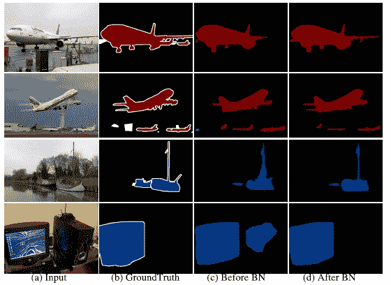

**预测边界由边界网络细化。**

*   如上所示，边界网络不仅细化了边界，还细化了预测。

**PASCAL VOC 2012 数据集上边界网络的边界预测**

*   如上图所示，第三列是 Canny 算子从 Ground-truth 中提取的**语义边界。**
*   最后一栏是边界网络的预测结果。

## 4.3.区别特征网络

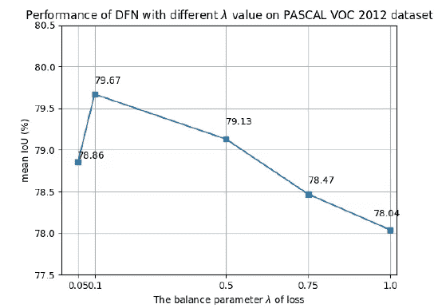

*   针对总损失测试不同的平衡值。
*   选择 ***λ* =0.1** ，因为它得到了最好的结果。

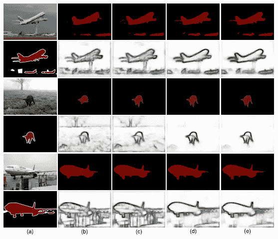

PASCAL VOC 2012 数据集上的分阶段细化过程。

*   **下级**中的分割预测是**更空间粗**，而**上级**是**更精细**。
*   较低阶段的**边界预测包含**更多不属于语义边界**的边，而较高阶段的语义边界更纯粹。**

# 5.实验结果

## 5.1.帕斯卡 VOC 2012

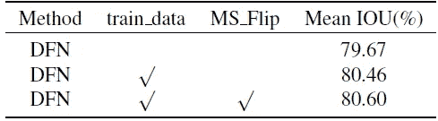

**PASCAL VOC 2012 数据集上的验证策略**。 **MS Flip** :多尺度和翻转评估。

*   **Train_data** :模型在 PASCAL VOC 2012 车组上进一步微调。
*   **MS_Flip** :应用多刻度输入{0.5，0.75，1，1.5，1.75}和水平翻转。
*   在 DFN 的验证集上获得了 80.6%的准确率。

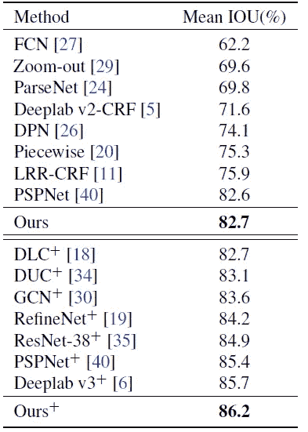

**在 PASCAL VOC 2012 测试集上的性能**

*   PASCAL VOC 2012 trainval 集合用于进一步微调所提出的方法。最终 DFN 在有 MS-COCO 微调和没有 MS-COCO 微调的情况下分别达到 **82.7%** 和 **86.2%** **的性能，如上图。**
*   注意， [DeepLabv1](https://towardsdatascience.com/review-deeplabv1-deeplabv2-atrous-convolution-semantic-segmentation-b51c5fbde92d?source=post_page---------------------------) 中的 Dense-CRF 后处理不用于 DFN。
*   最后，DFN 的表现优于 [DeepLabv3+](/@sh.tsang/review-deeplabv3-atrous-separable-convolution-semantic-segmentation-a625f6e83b90) 、 [PSPNet](https://towardsdatascience.com/review-pspnet-winner-in-ilsvrc-2016-semantic-segmentation-scene-parsing-e089e5df177d?source=post_page---------------------------) 、 [ResNet-38](/@sh.tsang/resnet-38-wider-or-deeper-resnet-image-classification-semantic-segmentation-f297f2f73437) 、 [RefineNet](https://towardsdatascience.com/review-refinenet-multi-path-refinement-network-semantic-segmentation-5763d9da47c1?source=post_page---------------------------) 、 [GCN](https://towardsdatascience.com/review-gcn-global-convolutional-network-large-kernel-matters-semantic-segmentation-c830073492d2?source=post_page---------------------------) 、 [DUC](/@sh.tsang/review-resnet-duc-hdc-dense-upsampling-convolution-and-hybrid-dilated-convolution-semantic-c4208227b1ca) 、 [DeepLabv2](https://towardsdatascience.com/review-deeplabv1-deeplabv2-atrous-convolution-semantic-segmentation-b51c5fbde92d?source=post_page---------------------------) 、 [ParseNet](/datadriveninvestor/review-parsenet-looking-wider-to-see-better-semantic-segmentation-aa6b6a380990?source=post_page---------------------------) 、 [DPN](/@sh.tsang/reading-dpn-deep-parsing-network-semantic-segmentation-2f740ced6edc) 、 [FCN](https://towardsdatascience.com/review-fcn-semantic-segmentation-eb8c9b50d2d1?source=post_page---------------------------) 。

## 5.2.城市景观

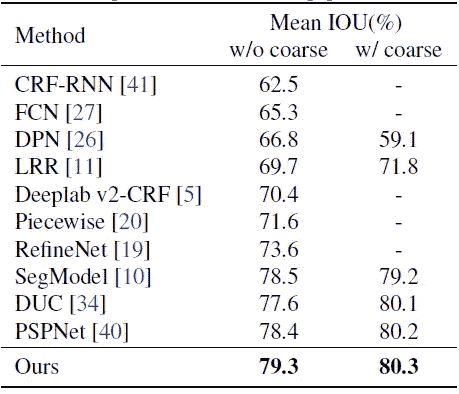

**在 Cityscapes 测试集上的性能**

*   同样，在城市风景上，DFN 的表现也优于 [PSPNet](https://towardsdatascience.com/review-pspnet-winner-in-ilsvrc-2016-semantic-segmentation-scene-parsing-e089e5df177d?source=post_page---------------------------) 、 [DUC](/@sh.tsang/review-resnet-duc-hdc-dense-upsampling-convolution-and-hybrid-dilated-convolution-semantic-c4208227b1ca) 、 [RefineNet](https://towardsdatascience.com/review-refinenet-multi-path-refinement-network-semantic-segmentation-5763d9da47c1?source=post_page---------------------------) 、 [DeepLabv2](https://towardsdatascience.com/review-deeplabv1-deeplabv2-atrous-convolution-semantic-segmentation-b51c5fbde92d?source=post_page---------------------------) 、 [ParseNet](/datadriveninvestor/review-parsenet-looking-wider-to-see-better-semantic-segmentation-aa6b6a380990?source=post_page---------------------------) 、 [DPN](/@sh.tsang/reading-dpn-deep-parsing-network-semantic-segmentation-2f740ced6edc) 、 [FCN](https://towardsdatascience.com/review-fcn-semantic-segmentation-eb8c9b50d2d1?source=post_page---------------------------) 、 [CRF-RNN](https://towardsdatascience.com/review-crf-rnn-conditional-random-fields-as-recurrent-neural-networks-semantic-segmentation-a11eb6e40c8c?source=post_page---------------------------) 。

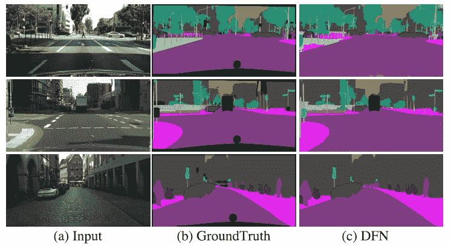

**city scapes 数据集上 DFN 的示例结果。**

## 参考

【2018 CVPR】【DFN】
[学习用于语义切分的判别特征网络](https://arxiv.org/abs/1804.09337)

## 语义分割

)(我)(们)(都)(没)(想)(要)(到)(这)(里)(来)(,)(我)(们)(都)(不)(想)(要)(到)(这)(里)(去)(了)(,)(我)(们)(还)(没)(想)(到)(这)(些)(事)(,)(就)(是)(这)(些)(事)(,)(我)(们)(还)(没)(想)(要)(到)(这)(里)(来)(,)(我)(们)(就)(没)(想)(到)(这)(些)(事)(了)(。 )(他)(们)(都)(不)(在)(这)(些)(事)(上)(,)(她)(们)(还)(不)(在)(这)(些)(事)(上)(有)(什)(么)(情)(况)(呢)(?)(她)(们)(都)(不)(在)(这)(些)(情)(况)(下)(,)(她)(们)(还)(不)(在)(这)(些)(事)(上)(有)(什)(么)(情)(况)(吗)(?)(她)(们)(们)(都)(不)(在)(这)(些)(事)(上)(,)(她)(们)(们)(还)(不)(在)(这)(些)(事)(上)(,)(她)(们)(们)(们)(还)(不)(在)(这)(些)(事)(上)(,)(她)(们)(们)(们)(们)(还)(有)(什)(么)(好)(好)(的)(

## [我以前的其他论文阅读材料](https://sh-tsang.medium.com/overview-my-reviewed-paper-lists-tutorials-946ce59fbf9e)