# 复习— EncNet:语义分割的上下文编码(语义分割)

> 原文：<https://medium.com/nerd-for-tech/review-encnet-context-encoding-for-semantic-segmentation-semantic-segmentation-9f6f1a4d5010?source=collection_archive---------9----------------------->

## U sing **Context 编码模块，优于** [PSPNet](https://towardsdatascience.com/review-pspnet-winner-in-ilsvrc-2016-semantic-segmentation-scene-parsing-e089e5df177d?source=post_page---------------------------) 和 [DeepLabv3](https://towardsdatascience.com/review-deeplabv3-atrous-convolution-semantic-segmentation-6d818bfd1d74?source=post_page---------------------------) ， [FCN](https://towardsdatascience.com/review-fcn-semantic-segmentation-eb8c9b50d2d1?source=post_page---------------------------) ， [DilatedNet](https://towardsdatascience.com/review-dilated-convolution-semantic-segmentation-9d5a5bd768f5?source=post_page---------------------------) ， [DeepLabv2](https://towardsdatascience.com/review-deeplabv1-deeplabv2-atrous-convolution-semantic-segmentation-b51c5fbde92d?source=post_page---------------------------) ， [CRF-RNN](https://towardsdatascience.com/review-crf-rnn-conditional-random-fields-as-recurrent-neural-networks-semantic-segmentation-a11eb6e40c8c?source=post_page---------------------------) ， [DeconvNet](https://towardsdatascience.com/review-deconvnet-unpooling-layer-semantic-segmentation-55cf8a6e380e?source=post_page---------------------------) ， [DPN](/@sh.tsang/reading-dpn-deep-parsing-network-semantic-segmentation-2f740ced6edc) ，[RefineNet](https://towardsdatascience.com/review-refinenet-multi-path-refinement-network-semantic-segmentation-5763d9da47c1?source=post_page---------------------------)&[ResNet](/@sh.tsang/resnet-38-wider-or-deeper-resnet-image-classification-semantic-segmentation-f297f2f73437)

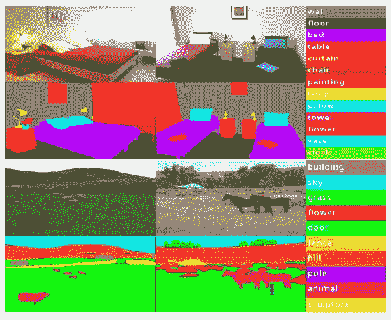

基于场景上下文缩小可能类别的列表使得标记更加容易。

在这个故事中，对 Rutgers 大学、亚马逊公司、SenseTime 和香港中文大学的(EncNet)的**语义分割的上下文编码进行了评述。在本文中:**

*   **引入了上下文编码模块**，该模块**捕获场景**的语义上下文，并选择性地突出显示依赖于类别的特征图。
*   比如上图中的**套房场景**很少会有马，但更有可能会有椅子、床、窗帘等。在这种情况下，这个模块有助于**突出椅子、床和窗帘。**

这是一篇发表在 **2018 CVPR** 的论文，引用超过 **500 次**。( [Sik-Ho Tsang](https://medium.com/u/aff72a0c1243?source=post_page-----9f6f1a4d5010--------------------------------) @中)

# 概述

1.  **上下文编码模块**
2.  **语义编码丢失**
3.  **语义分割结果**
4.  **图像分类结果**

# **1。上下文编码模块**

**上下文编码模块&语义编码损失(SE-loss)**

## 1.1.整体架构

*   给定一幅输入图像，用**一个预先训练好的**[**ResNet**](https://towardsdatascience.com/review-resnet-winner-of-ilsvrc-2015-image-classification-localization-detection-e39402bfa5d8?source=post_page---------------------------)**提取出大小为*C*×*H*×*W*的密集卷积特征图。**
*   **建议的**上下文编码模块**在顶部，包括**编码层**被设计为捕获编码语义并预测以这些编码语义为条件的缩放因子。**
*   **这些学习到的因素选择性地突出显示依赖于类别的特征图(用颜色可视化)。**
*   **在另一个分支中，使用**语义编码损失(SE-loss)** 来调整训练，这使得上下文编码模块预测场景中类别的存在。**
*   **最后，上下文编码模块的表示被馈送到最后的卷积层，以进行逐像素预测。**

## **1.2.编码层(由 Deep TEN 提出)**

**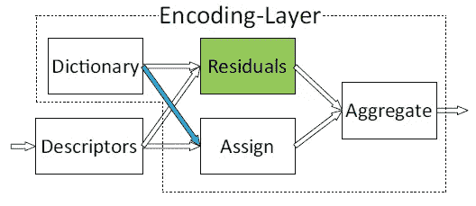**

****编码层(深十层)。在本文中，描述符是输入特征图****

*   **编码层将形状为 *C* × *H* × *W* 的输入特征图视为一组*C*-维输入特征 *X* = { *x* 1，…， *xN* }，其中 *N* 是由 *H* × *W* 给出的特征总数， 其中**学习**一个固有的**码本 *D*** = { *d* 1、…、 *dK* }包含 *K* 个码字(视觉中心)和**一组视觉中心***S***= {*S*1、…、*sK*****
*   ***在本文中，编码层中的码字数量 *K* 为 32。***
*   ***首先，通过从每个 *dk* 中减去每个 *xi* 得到剩余 *rik* :***

***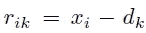***

*   ***考虑用于将描述符分配给码字的分配权重。硬分配为每个描述符 *xi* 提供单个非零分配权重，其对应于最近的码字。***
*   ***硬分配没有考虑码字的模糊性，也使得模型不可微。***
*   *****软权重分配**通过为每个码字分配一个描述符来解决这个问题。***

***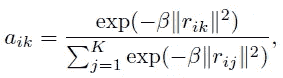***

*   ***其中 *β* 为平滑因子。***
*   ***实际上，平滑因子是可以学习的，即 *sk* :***

***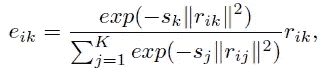***

*   ***通过如下汇总，得到 *ek* :***

***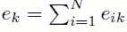***

*   ***其中 *N* 是由 *H* × *W* 给出的特征总数，如上所述。***
*   ***然后，应用聚合:***

***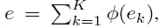***

*   ***其中 *ϕ* 为批量规格化和 ReLU。***

## ***1.3.特征图注意***

*   *****使用编码层之上的全连接层**和作为激活函数的 **sigmoid** ，其输出预测的特征图缩放因子:***

***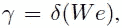***

*   ***其中 *W* 表示层权重，𝛿是 sigmoid 函数。***
*   *****在输入特征图 *X* 和缩放因子γ之间应用通道式乘法⊗** ，以获得模块输出:***

***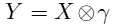***

*   ***使用双线性插值对输出预测进行 8 次上采样，以计算损耗。***

> ***作为所提出的方法的效用的一个直观示例，**考虑强调天空场景中飞机的概率，但不强调车辆的概率。*****

# *****2。语义编码损失*****

***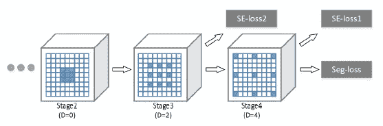***

*****扩张策略和损失*****

*   ***没有全局信息，网络可能难以理解上下文。***

> *****语义编码损失(SE-loss)** 迫使网络以非常小的额外计算成本**理解全局语义信息。*****

*   ***具有 sigmoid 激活函数的附加全连接层建立在编码层之上，以对场景中对象类别的存在进行单独预测，并利用**二进制交叉熵损失进行学习。*****
*   ***与每像素损失不同， **SE-loss 同等考虑大小物体。**因此，小物体的分割常常得到改进。***
*   ***SE 损耗被添加到基本网络的第 3 级和第 4 级**。*****
*   ***SE-loss 的基本事实是从基本事实分割掩模直接生成的，没有任何附加注释。***

# *****3。语义分割结果*****

## ***3.1.PASCAL 环境下的消融研究***

***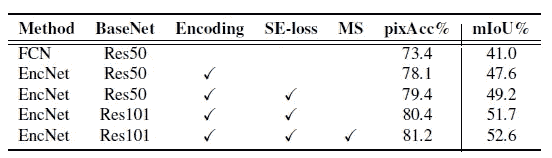***

*****PASCAL 环境数据集的消融研究*****

*   ***与基线 FCN 相比，**简单地在顶部添加上下文编码模块**产生结果 **78.1/47.6 (pixAcc 和 mIoU)** ，***

***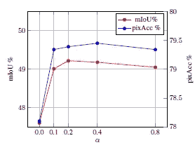***

*****权重对 SE-loss 的影响*α******

*   ***为了研究 **SE 损失**的影响，我们测试了 SE 损失 *α* ={0.0，0.1，0.2，0.4，0.8}的不同**权重**，我们发现 ***α* = 0.2 产生最佳性能。*****

***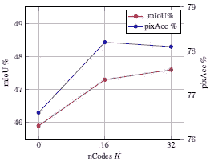***

*****码字数量的影响*K******

*   ***此外，**超过码字数量 *K* = 32，改进达到饱和** ( *K* = 0 表示使用全局平均池代替)。***
*   *****更深的预训练网络**提供了更好的特征表示，EncNet 在 mIoU 中使用[**ResNet**](https://towardsdatascience.com/review-resnet-winner-of-ilsvrc-2015-image-classification-localization-detection-e39402bfa5d8?source=post_page---------------------------)**-101**获得了**额外 2.5%的改进。*****
*   ***最后，**多尺度评测**得出我们的最终分数 **81.2% pixAcc 和 52.6% mIoU** ，包括背景在内是 51.7%。***

## ***3.2.关于 PASCAL-Context 的结果***

***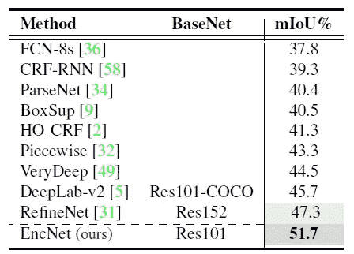***

*****PASCAL 上下文数据集上的分割结果*****

*   ***所提出的 EncNet 在不使用 COCO 预训练或更深的模型( [ResNet](https://towardsdatascience.com/review-resnet-winner-of-ilsvrc-2015-image-classification-localization-detection-e39402bfa5d8?source=post_page---------------------------) -152)的情况下优于先前最先进的方法。***

## ***3.3.PASCAL VOC 2012 的结果***

***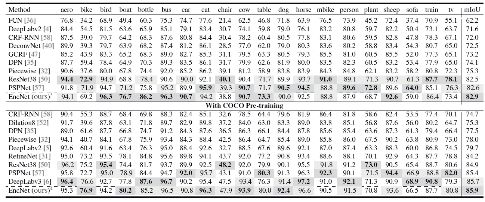***

*****PASCAL VOC 2012 测试集的结果*****

*   ***如上图所示，EncNet 获得了 85.9% mIoU 的最佳结果。***
*   ***与最先进的 [PSPNet](https://towardsdatascience.com/review-pspnet-winner-in-ilsvrc-2016-semantic-segmentation-scene-parsing-e089e5df177d?source=post_page---------------------------) 和 [DeepLabv3](https://towardsdatascience.com/review-deeplabv3-atrous-convolution-semantic-segmentation-6d818bfd1d74?source=post_page---------------------------) 方法相比，EncNet 具有更低的计算复杂度。***
*   ***也优于 [FCN](https://towardsdatascience.com/review-fcn-semantic-segmentation-eb8c9b50d2d1?source=post_page---------------------------) 、[扩容网](https://towardsdatascience.com/review-dilated-convolution-semantic-segmentation-9d5a5bd768f5?source=post_page---------------------------)、[深拉布 v2](https://towardsdatascience.com/review-deeplabv1-deeplabv2-atrous-convolution-semantic-segmentation-b51c5fbde92d?source=post_page---------------------------) 、 [CRF-RNN](https://towardsdatascience.com/review-crf-rnn-conditional-random-fields-as-recurrent-neural-networks-semantic-segmentation-a11eb6e40c8c?source=post_page---------------------------) 、[解扩网](https://towardsdatascience.com/review-deconvnet-unpooling-layer-semantic-segmentation-55cf8a6e380e?source=post_page---------------------------)、 [DPN](/@sh.tsang/reading-dpn-deep-parsing-network-semantic-segmentation-2f740ced6edc) 、 [RefineNet](https://towardsdatascience.com/review-refinenet-multi-path-refinement-network-semantic-segmentation-5763d9da47c1?source=post_page---------------------------) 、 [ResNet-38](/@sh.tsang/resnet-38-wider-or-deeper-resnet-image-classification-semantic-segmentation-f297f2f73437) 。***

## ***3.4.ADE20K 上的结果***

***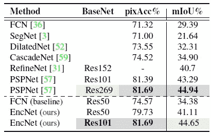***

*****ade 20k 验证集上的分割结果*****

*   ***EncNet-101 使用浅得多的基础网络实现了与最先进的 [PSPNet](https://towardsdatascience.com/review-pspnet-winner-in-ilsvrc-2016-semantic-segmentation-scene-parsing-e089e5df177d?source=post_page---------------------------) -269 相当的结果。***

***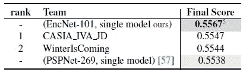***

*****ade 20k 测试集的结果*****

*   ***EncNet 最终得分为 0.55675，超过 PSP-Net-269(2016 年第一名)和 COCO Place Challenge 2017 的所有参赛作品。***

# ***4.图像分类结果***

***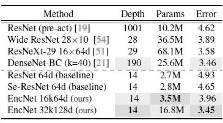***

*****比较 CIFAR-10** 上的模型深度、参数数量(M)、测试误差(%)***

*   ***上下文编码模块也可以插入图像分类网络。***
*   ***使用一个浅 14 层 [ResNet](https://towardsdatascience.com/review-resnet-winner-of-ilsvrc-2015-image-classification-localization-detection-e39402bfa5d8?source=post_page---------------------------) 作为基线。***
*   ***在 [SENet](https://towardsdatascience.com/review-senet-squeeze-and-excitation-network-winner-of-ilsvrc-2017-image-classification-a887b98b2883?source=post_page---------------------------) 中，SE 模块被添加到每个 Resblock 的顶部。***
*   ***类似地，**提出的上下文编码模块也可以添加到每个 Resblock 之上。*****
*   ***具有上下文编码模块的 14 层浅网络在 CIFAR10 数据集上实现了 **3.45%的错误率**，如上表所示，其性能可与最先进的方法相媲美，如 [WRN](https://towardsdatascience.com/review-wrns-wide-residual-networks-image-classification-d3feb3fb2004?source=post_page---------------------------) 、 [ResNeXt](https://towardsdatascience.com/review-resnext-1st-runner-up-of-ilsvrc-2016-image-classification-15d7f17b42ac?source=post_page---------------------------) 和 [DenseNet](https://towardsdatascience.com/review-densenet-image-classification-b6631a8ef803?source=post_page---------------------------) 。***

## ***参考***

***【2018 CVPR】【EncNet】
[语义切分的上下文编码](http://openaccess.thecvf.com/content_cvpr_2018/papers/Zhang_Context_Encoding_for_CVPR_2018_paper.pdf)***

## ***语义分割***

***)(我)(们)(都)(没)(想)(要)(到)(这)(里)(来)(,)(我)(们)(都)(不)(想)(要)(到)(这)(里)(去)(了)(,)(我)(们)(还)(没)(想)(到)(这)(些)(事)(,)(就)(是)(这)(些)(事)(,)(我)(们)(还)(没)(想)(要)(到)(这)(里)(来)(,)(我)(们)(就)(没)(想)(到)(这)(些)(事)(了)(。 )(我)(们)(都)(不)(在)(这)(些)(事)(上)(了)(,)(我)(们)(都)(不)(在)(这)(些)(事)(上)(了)(,)(我)(们)(还)(不)(在)(这)(些)(事)(上)(,)(我)(们)(还)(不)(在)(这)(些)(事)(上)(有)(什)(么)(情)(况)(呢)(,)(我)(们)(还)(不)(在)(这)(些)(事)(上)(有)(什)(么)(情)(况)(,)(我)(们)(还)(没)(有)(什)(么)(好)(的)(情)(感)(。 )(我)(们)(都)(不)(知)(道)(,)(我)(们)(还)(不)(知)(道)(,)(我)(们)(还)(不)(知)(道)(,)(我)(们)(还)(不)(知)(道)(,)(我)(们)(还)(不)(知)(道)(。***

## ***[我以前的其他论文阅读材料](https://sh-tsang.medium.com/overview-my-reviewed-paper-lists-tutorials-946ce59fbf9e)***