# 综述——GRF-DSOD 和 GRF-SSD:通过门控特征重用(物体检测)从零开始改进物体检测

> 原文：<https://medium.com/nerd-for-tech/review-grf-dsod-grf-ssd-improving-object-detection-from-scratch-via-gated-feature-reuse-495c11b627d3?source=collection_archive---------7----------------------->

## 胜过 [DSOD](https://sh-tsang.medium.com/review-dsod-learning-deeply-supervised-object-detectors-from-scratch-object-detection-43393dcb31bd) 、 [DSSD](https://towardsdatascience.com/review-dssd-deconvolutional-single-shot-detector-object-detection-d4821a2bbeb5?source=post_page---------------------------) 、[SSD](https://towardsdatascience.com/review-ssd-single-shot-detector-object-detection-851a94607d11?source=post_page---------------------------)**、** [R-FCN](https://towardsdatascience.com/review-r-fcn-positive-sensitive-score-maps-object-detection-91cd2389345c?source=post_page---------------------------) 、[速度更快 R-CNN](https://towardsdatascience.com/review-faster-r-cnn-object-detection-f5685cb30202?source=post_page---------------------------) 、 [DCN / DCNv1](https://towardsdatascience.com/review-dcn-deformable-convolutional-networks-2nd-runner-up-in-2017-coco-detection-object-14e488efce44?source=post_page---------------------------) 、 [FPN](https://towardsdatascience.com/review-fpn-feature-pyramid-network-object-detection-262fc7482610?source=post_page---------------------------) 参数更少

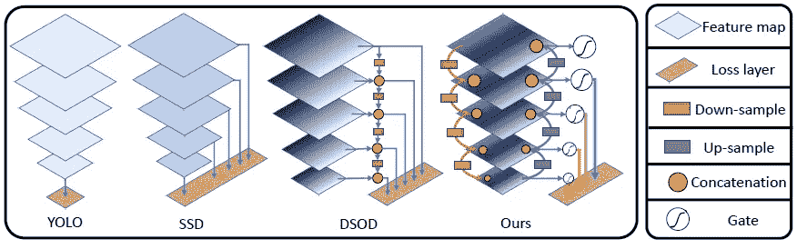

**提议的 GFR-DSOD 概述**

在这篇论文中，对卡耐基梅隆大学、伊利诺伊大学厄巴纳-香槟分校、IBM Research AI、麻省理工学院-IBM Watson AI 实验室、谷歌 AI & UMass Amherst 和史蒂文斯理工学院的**通过门控特征重用**从零开始改进物体检测(GRF-DSOD & GRF-SSD)进行了综述。在本文中:

*   提出了**门控特征重用(GFR)模块**，以使挤压和激励能够**自适应地增强或减弱监督**。
*   一个**特征金字塔结构**将丰富的空间和语义特征压缩到一个预测层中，其中**加强了特征表示**并且**减少了要学习的参数数量**。
*   值得注意的是，该网络可以从刮擦开始训练，不需要 ImageNet 预训练。

这是 **2019 BMVC** 的一篇论文。( [Sik-Ho Tsang](https://medium.com/u/aff72a0c1243?source=post_page-----495c11b627d3--------------------------------) @中)

# 概述

1.  **迭代特征再利用**
2.  **门控自适应重新校准**
3.  **功能重用为******和** [**SSD**](https://towardsdatascience.com/review-ssd-single-shot-detector-object-detection-851a94607d11?source=post_page---------------------------)**
4.  ****实验结果****

# **1.迭代特征再利用**

**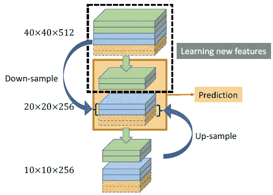**

****说明迭代特征金字塔的构建模块****

*   **如 [DSOD](https://sh-tsang.medium.com/review-dsod-learning-deeply-supervised-object-detectors-from-scratch-object-detection-43393dcb31bd) (第一图)所示，生成不同比例尺的特征图**大比例尺特征图被下采样并与当前特征图连接。****
*   **这里，除了下采样的特征图之外，**小尺度特征图也被上采样并与当前特征图连接。****
*   **下采样路径主要由一个最大池层(内核大小=2×2，步距=2)和一个 conv 层(内核大小=1×1，步距=1)组成，以减少通道尺寸。**
*   **上采样路径通过双线性上采样以及随后的 conv 层(内核大小= 1×1，步长= 1)来执行去卷积操作。**
*   **利用粗分辨率和细分辨率特征，**引入具有 1×1 conv 层加上 3×3 conv 层的瓶颈块来学习新特征。****
*   ****参数数量是**[**DSOD**](https://sh-tsang.medium.com/review-dsod-learning-deeply-supervised-object-detectors-from-scratch-object-detection-43393dcb31bd)**的三分之一。****

**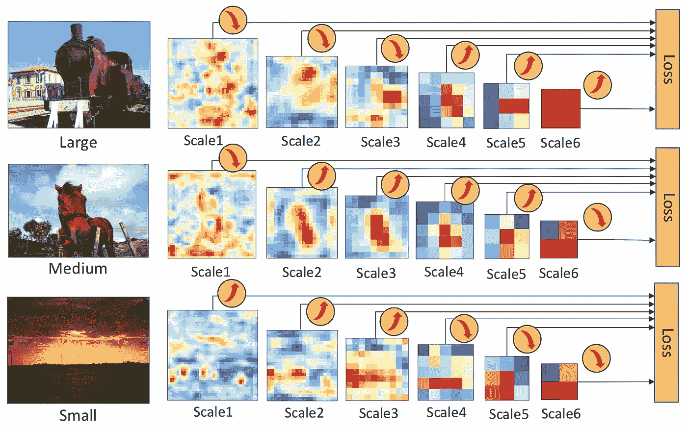**

> ****通过上采样和下采样，可以将不同比例的特征图连接在一起，以检测不同大小的对象，如上所示。****

# **2.门控自适应重新校准**

**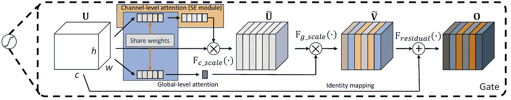**

****说明一个门的结构，包括:(一)通道级关注；㈡全球一级的关注；以及(iii)身份映射。****

## **2.1.通道级注意力**

*   **使用 SENet 中的挤压和激励模块。**
*   ****挤压**阶段可以表述为 *U* 上的**全局汇集操作**:**

**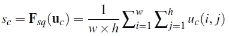**

*   ****激发**阶段是**两个全连接层**加上一个**s 形**激活；**

**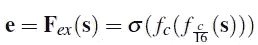**

*   **其中 *σ* 是 sigmoid 函数。**
*   **那么，~ *U* 的计算公式为:**

**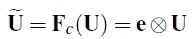**

**其中⨂表示逐信道乘法。**

## **2.2.全球层面的关注**

*   **全局注意力以 *s* (挤压阶段的输出)为输入，只生成一个元素。**

**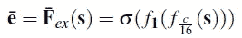**

*   **其中 *e* 为全球关注度。**
*   **最后，~ *V* 的计算公式为:**

**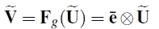**

## **2.3.身份映射**

*   **执行逐元素加法运算以获得最终输出:**

**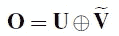**

# **3. [DSOD](https://sh-tsang.medium.com/review-dsod-learning-deeply-supervised-object-detectors-from-scratch-object-detection-43393dcb31bd) 和[固态硬盘](https://towardsdatascience.com/review-ssd-single-shot-detector-object-detection-851a94607d11?source=post_page---------------------------)的特性复用**

*   **所提出的方法是一种**通用解决方案**，用于在基于深度卷积神经网络的检测器内构建迭代特征金字塔和门，因此非常容易应用于现有框架。**

## **3.1.GRF-DSOD**

*   **为 [DSOD](https://sh-tsang.medium.com/review-dsod-learning-deeply-supervised-object-detectors-from-scratch-object-detection-43393dcb31bd) 调整门控特征重用有两个步骤。**
*   **首先，迭代特征重用是为了替换 [DSOD](https://sh-tsang.medium.com/review-dsod-learning-deeply-supervised-object-detectors-from-scratch-object-detection-43393dcb31bd) 预测层中的密集连接。**
*   **接下来，在每个预测层中添加门。**

## **3.2.GRF 固态硬盘**

*   **对于 [SSD](https://towardsdatascience.com/review-ssd-single-shot-detector-object-detection-851a94607d11?source=post_page---------------------------) ，进行类似操作得到 GFR-SSD。具体来说， [SSD](https://towardsdatascience.com/review-ssd-single-shot-detector-object-detection-851a94607d11?source=post_page---------------------------) 中的多余层被替换为预测层中的 GFR 结构和级联门。**

# **4.实验结果**

*   **值得注意的是，该网络可以从刮擦开始训练，不需要 ImageNet 预训练。**
*   **对于 VOC 2007，使用 VOC 2007 trainval 和 VOC 2012 trainval(“07+12”)的联合来训练网络，并在 VOC 2007 测试集上进行测试。**
*   **对于 VOC 2012，使用 VOC 2012 trainval 和 VOC 2007 trainval + test 对网络进行训练，并在 VOC 2012 测试集上进行测试。**
*   **对于 COCO，训练集中有 80k 个图像，验证集中有 40k 个图像，测试集中有 20k 个图像(测试开发)。**

## **4.1.PASCAL VOC 2007 上的烧蚀实验**

**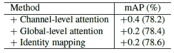**

****PASCAL VOC 2007 上的闸门结构设计烧蚀实验****

*   **在采用渠道注意、全局注意和身份映射后，我们分别获得了 0.4%、0.2%和 0.2%的增益。**

**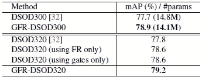**

****PASCAL VOC 2007 上的烧蚀实验****

*   **没有门的**特征金字塔的结果(78.6%)与 GFR-DSOD320(第 6 行)相当，与基线(77.8%)相比提高了 0.8%。****
*   **这表明我们的特征重用结构对提高最终检测性能有很大贡献。**
*   **添加没有迭代特征金字塔的门的**的结果(78.6%)也优于基线结果 0.8% mAP。****

**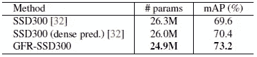**

****[**SSD**](https://towardsdatascience.com/review-ssd-single-shot-detector-object-detection-851a94607d11?source=post_page---------------------------)**300 的烧蚀实验从零开始******

*   ****还有， **GFR 结构帮助原有的**[**SSD**](https://towardsdatascience.com/review-ssd-single-shot-detector-object-detection-851a94607d11?source=post_page---------------------------)**大幅度提升性能。******

## ****4.2.PASCAL VOC 2007 年和 2012 年的结果****

*   ****在第二个表中，GFR-DSOD 达到 79.2%，比基线方法 [DSOD](https://sh-tsang.medium.com/review-dsod-learning-deeply-supervised-object-detectors-from-scratch-object-detection-43393dcb31bd) (77.8%)要好。****

****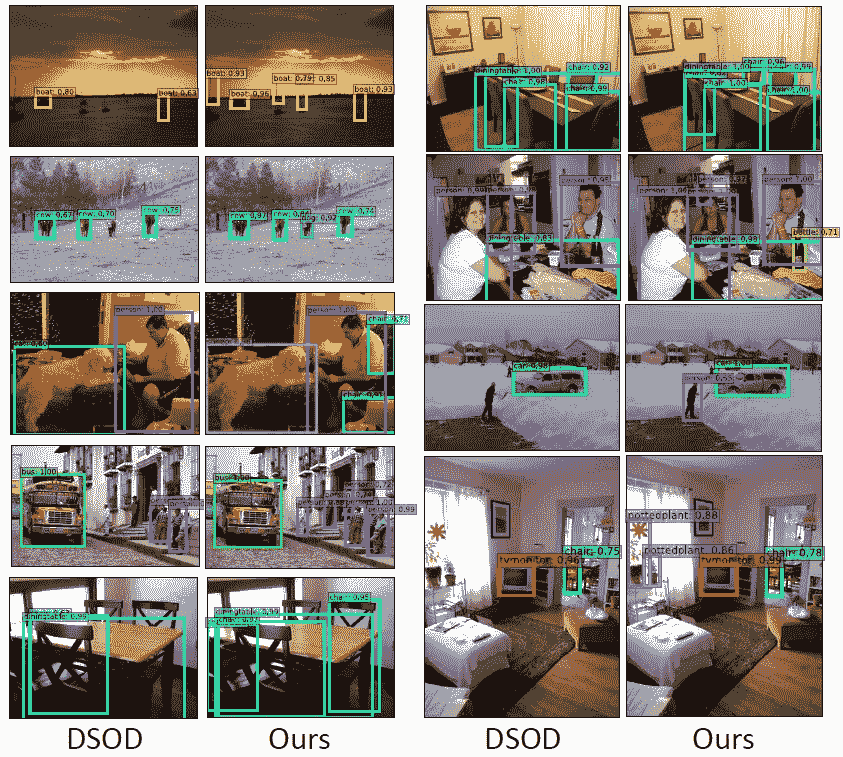****

******VOC 2007 测试集上的检测实例有**[**DSOD**](https://sh-tsang.medium.com/review-dsod-learning-deeply-supervised-object-detectors-from-scratch-object-detection-43393dcb31bd)**/GFR-DSOD 型号******

*   ****所提出的方法在小物体和密集场景上都取得了更好的结果。****

****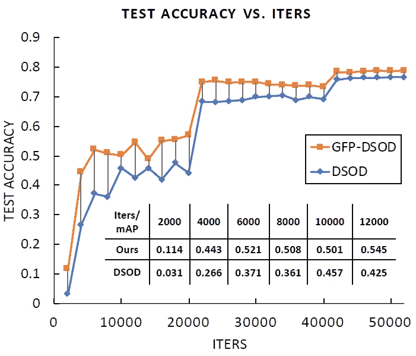****

******收敛速度比较******

*   ****因此，GFR-DSOD 比 DSOD 的收敛速度相对快 38%。****
*   ****对于推理时间，使用 **300×300** 输入，完整的 **GFR-DSOD** 可以在批量为 1 的单个 Titan X GPU 上以 **17.5 fps** 运行图像。速度类似于 [DSOD](https://sh-tsang.medium.com/review-dsod-learning-deeply-supervised-object-detectors-from-scratch-object-detection-43393dcb31bd) 300，预测结构密集。****
*   ****当输入尺寸放大到 **320×320** 时，速度下降到 **16.7 fps** 和 **16.3 fps** (默认框更多)。****
*   ****作为对比， [SSD](https://towardsdatascience.com/review-ssd-single-shot-detector-object-detection-851a94607d11?source=post_page---------------------------) 321 运行速度为 11.2 fps， [DSSD](https://towardsdatascience.com/review-dssd-deconvolutional-single-shot-detector-object-detection-d4821a2bbeb5?source=post_page---------------------------) 321 运行速度为 9.5 fps，采用 [ResNet](https://towardsdatascience.com/review-resnet-winner-of-ilsvrc-2015-image-classification-localization-detection-e39402bfa5d8?source=post_page---------------------------) -101 骨干网。方法比这两个竞争对手快多了。****
*   ****在 PASCAL VOC 2012 Comp3 挑战赛上，GFR-DSOD 的结果(72.5%)比之前最先进的 [DSOD](https://sh-tsang.medium.com/review-dsod-learning-deeply-supervised-object-detectors-from-scratch-object-detection-43393dcb31bd) (70.8%)高出 1.7% mAP。****
*   ****加入 VOC 2007 作为训练数据后，得到了 77.5%的 mAP。****

## ****4.3.可可小姐的结果****

****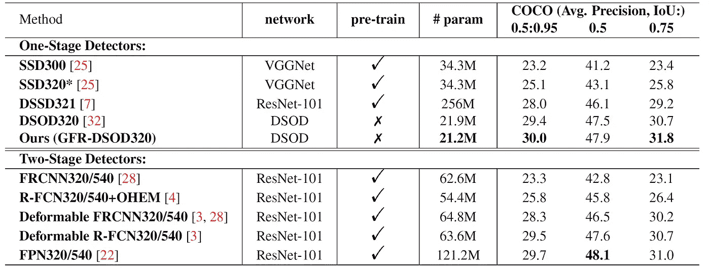****

******在 MS COCO 2015 测试开发装置上比较两级检测器。******

*   ****GFR-DSOD 可以用更少的参数(21.2 米对 21.9 米)实现比基准方法[**DSOD**](https://sh-tsang.medium.com/review-dsod-learning-deeply-supervised-object-detectors-from-scratch-object-detection-43393dcb31bd)**【30.0%对 29.4%)更高的**性能。********
*   ****结果与[FPN](https://towardsdatascience.com/review-fpn-feature-pyramid-network-object-detection-262fc7482610?source=post_page---------------------------)320/540【22】(30.0%对 29.7%)不相上下，但**模型的参数只有**[**【FPN**](https://towardsdatascience.com/review-fpn-feature-pyramid-network-object-detection-262fc7482610?source=post_page---------------------------)**的 1/6。******
*   ****所以，最终，GFR-DSOD 在{0.5:0.95} mAP 上胜过 [DSOD](https://sh-tsang.medium.com/review-dsod-learning-deeply-supervised-object-detectors-from-scratch-object-detection-43393dcb31bd) 、 [DSSD](https://towardsdatascience.com/review-dssd-deconvolutional-single-shot-detector-object-detection-d4821a2bbeb5?source=post_page---------------------------) 、 [SSD](https://towardsdatascience.com/review-ssd-single-shot-detector-object-detection-851a94607d11?source=post_page---------------------------) 、 [R-FCN](https://towardsdatascience.com/review-r-fcn-positive-sensitive-score-maps-object-detection-91cd2389345c?source=post_page---------------------------) 、[更快 R-CNN](https://towardsdatascience.com/review-faster-r-cnn-object-detection-f5685cb30202?source=post_page---------------------------) 、 [DCN / DCNv1](https://towardsdatascience.com/review-dcn-deformable-convolutional-networks-2nd-runner-up-in-2017-coco-detection-object-14e488efce44?source=post_page---------------------------) 和 [FPN](https://towardsdatascience.com/review-fpn-feature-pyramid-network-object-detection-262fc7482610?source=post_page---------------------------) 。****

## ****参考****

****【2019 BMVC】【GRF-DSOD & GRF-SSD】
[通过门控特征重用从零开始改进对象检测](https://arxiv.org/abs/1712.00886)****

## ****目标检测****

******2014** : [ [过食](/coinmonks/review-of-overfeat-winner-of-ilsvrc-2013-localization-task-object-detection-a6f8b9044754?source=post_page---------------------------)][[R-CNN](/coinmonks/review-r-cnn-object-detection-b476aba290d1?source=post_page---------------------------)]
**2015**:[[快 R-CNN](/coinmonks/review-fast-r-cnn-object-detection-a82e172e87ba?source=post_page---------------------------) ] [ [更快 R-CNN](https://towardsdatascience.com/review-faster-r-cnn-object-detection-f5685cb30202?source=post_page---------------------------)][[MR-CNN&S-CNN](https://towardsdatascience.com/review-mr-cnn-s-cnn-multi-region-semantic-aware-cnns-object-detection-3bd4e5648fde?source=post_page---------------------------)][[DeepID-Net](https://towardsdatascience.com/review-deepid-net-def-pooling-layer-object-detection-f72486f1a0f6?source=post_page---------------------------)
**2016 **GBD-v1&GBD-v2[[SSD](https://towardsdatascience.com/review-ssd-single-shot-detector-object-detection-851a94607d11?source=post_page---------------------------)][[yolov 1](https://towardsdatascience.com/yolov1-you-only-look-once-object-detection-e1f3ffec8a89?source=post_page---------------------------)
**2017**:[[NoC](/datadriveninvestor/review-noc-winner-in-2015-coco-ilsvrc-detection-object-detection-d5cc84e372a?source=post_page---------------------------)][[G-RMI](https://towardsdatascience.com/review-g-rmi-winner-in-2016-coco-detection-object-detection-af3f2eaf87e4?source=post_page---------------------------)][[TDM](/datadriveninvestor/review-tdm-top-down-modulation-object-detection-3f0efe9e0151?source=post_page---------------------------)][[DSSD](https://towardsdatascience.com/review-dssd-deconvolutional-single-shot-detector-object-detection-d4821a2bbeb5?source=post_page---------------------------)[[yolov 2/yolo 9000](https://towardsdatascience.com/review-yolov2-yolo9000-you-only-look-once-object-detection-7883d2b02a65?source=post_page---------------------------)]
**2018**:[[yolov 3](https://towardsdatascience.com/review-yolov3-you-only-look-once-object-detection-eab75d7a1ba6?source=post_page---------------------------)][[Cascade R-CNN](/@sh.tsang/reading-cascade-r-cnn-delving-into-high-quality-object-detection-object-detection-8c7901cc7864)][[MegDet](/towards-artificial-intelligence/reading-megdet-a-large-mini-batch-object-detector-1st-place-of-coco-2017-detection-challenge-e82072e9b7f)][[stair net](/@sh.tsang/reading-stairnet-top-down-semantic-aggregation-object-detection-de689a94fe7e)]
**2019**:[[DCN v2](/towards-artificial-intelligence/review-dcnv2-deformable-convnets-v2-object-detection-instance-segmentation-3d8a18bee2f5)][[反思 ImageNet 前期培训【T7](https://sh-tsang.medium.com/review-rethinking-imagenet-pre-training-image-classification-object-detection-semantic-683f6575a2be)********

## **[我以前的其他论文阅读材料](https://sh-tsang.medium.com/overview-my-reviewed-paper-lists-tutorials-946ce59fbf9e)**