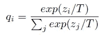
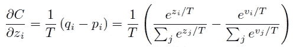
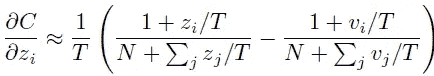
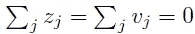
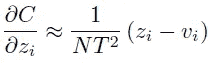
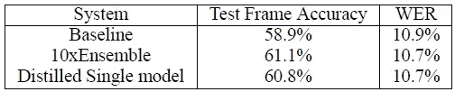
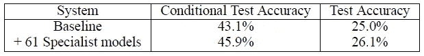
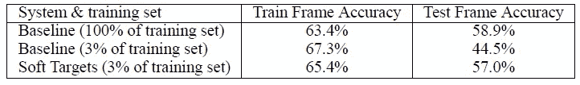

# 回顾—模型提取:提取神经网络中的知识(图像分类)

> 原文：<https://medium.com/nerd-for-tech/review-model-distillation-distilling-the-knowledge-in-a-neural-network-image-classification-48ce0c81618a?source=collection_archive---------12----------------------->

## 使用蒸馏获得较小的模型。在 JFT 数据集上对 AlexNet 进行更快的训练。

**蒸馏温度更高**

在这个故事中，简要回顾了谷歌公司的**在神经网络**中提取知识。这是辛顿教授的论文。

> 模型集成是提高模型性能的一种简单方法。然而，这可能是计算昂贵的，尤其是如果单个模型是大型神经网络。

*   在本文中，模型集合中的知识被提取到单个模型中。

这是一篇发表在 **2014 NIPS** 的论文，引用次数超过 **5000 次**。( [Sik-Ho Tsang](https://medium.com/u/aff72a0c1243?source=post_page-----48ce0c81618a--------------------------------) @中)

# 概述

1.  **模型蒸馏的更高温度**
2.  **实验结果**

# 1.模型蒸馏的更高温度

## 1.1.软目标的温度更高

*   神经网络通常通过使用“softmax”输出层来产生类别概率，该输出层通过将 *zi* 与其他逻辑进行比较，将为每个类别计算的逻辑 *zi* 转换成概率 *qi* :

*   其中 *T* 是通常设置为 1 的温度。

> **使用较高的值为 *T* 在类上产生较柔和的概率分布。**这很有用，因为**学习函数的大部分信息存在于软目标中非常小概率的比率中。**

*   例如，一个版本的 2 可能被给定 10^-6 是 3 的概率，而 10^−9 是 7 的概率，而对于另一个版本，可能正好相反。这是定义数据的丰富相似性结构的有价值的信息(即，它表明哪些 2 看起来像 3，哪些看起来像 7)。
*   **通过在转移集上训练知识，并对转移集中的每个案例使用软目标分布(*T*T>1)**，将知识转移到提取的模型，该转移集是通过使用 softmax 中具有高温的笨重模型产生的。
*   当训练蒸馏模型时使用相同的高温，但是在它已经被训练之后，它使用温度 *T* 为 1。

## 1.2.梯度的计算

*   转移集中的每个案例相对于提取模型的每个 logit， *zi* 贡献一个**交叉熵梯度**， ***dC* / *dzi* 。**
*   如果笨重模型具有产生软目标概率 *pi* 的逻辑值 *vi* ，并且转移训练在温度 *T* 下完成，则梯度由下式给出:

*   如果温度与 logits 值相比较高，则可近似为:

*   假设逻辑 *z* 和 *v* 已经过零均值化:

*   梯度可以进一步简化为:

*   后来发现，当提取的模型太小而不能捕获笨重模型中的所有知识时，中间温度工作得最好。

# **2。实验结果**

## 2.1.MNIST

*   具有**两个隐藏层**的单个大型神经网络 **1200 在所有 60，000 个训练案例上校正线性隐藏单元**。 [**辍**](https://sh-tsang.medium.com/paper-dropout-a-simple-way-to-prevent-neural-networks-from-overfitting-image-classification-a74b369b4b8e) 用。本网实现了 **67 测试错误**。
*   一个更小的网用**两个隐层**对 **800 个线性隐单元**和**不正则化**实现了 **146 个错误**。
*   如果在 20 的**温度下，仅通过增加匹配由大网产生的软目标的额外任务来调整小网，它实现了 **74 个测试误差**。**

> 这表明软目标可以将大量知识转移到提取的模型中。

*   当蒸馏网络在其两个隐藏层中的每一层都有 300 个或更多的单元时，所有高于 8 的温度都给出了相当相似的结果。但是，当这一数字急剧减少到每层 30 个单位时，在 2.5 到 4 的范围内的温度比更高或更低的温度要好得多。

## 2.2.语音识别

**帧分类准确率和误字率(WER)**

*   使用具有 **8 个隐藏层**的架构，每个隐藏层包含 **2560 个校正线性单元**和具有 14，000 个标签(HMM 目标 ht)的最终 softmax 层。
*   输入是 26 帧 40 个 Mel 缩放的滤波器组系数，每帧提前 10ms，我们预测第 21 帧的 HMM 状态。
*   **参数**总数约为 **85M** 。
*   为了训练 DNN 声学模型，我们使用了大约 2000 小时的口语数据，这产生了大约 7 亿个训练样本。该系统在我们的开发集上实现了 58.9% 的**帧精度和 10.9%** 的**误码率(WER)。**
*   **由于目标函数中的不匹配，集成对 WER 的最终目标给出了较小的改进**(在 23K 字测试集上)，但是再次地，**由集成实现的 WER 的改进被转移到提取的模型。**

## 2.3.JFT

**JFT 开发集上的分类准确率(前 1)**

*   JFT 是一个谷歌内部数据集，有 1 亿张带标签的图片，有 1.5 万个标签。
*   [AlexNet](/coinmonks/paper-review-of-alexnet-caffenet-winner-in-ilsvrc-2012-image-classification-b93598314160?source=post_page---------------------------) 需要用 6 个月的时间进行培训。等待几年来训练一个模型的集合不是一个选项。
*   **一种方法是使用“专家”模型，每个模型都在**数据上进行训练，这些数据在来自类的**易混淆子集的示例中高度丰富(就像不同类型的蘑菇)。**
*   培养 61 名专科模特，每名 300 节课。
*   在测试时，我们可以使用通才模型的预测来决定哪些专家是相关的，并且只需要运行这些专家。

> 这个想法是，当我们有更多的专家负责某一特定类别时，准确性可以得到提高。同时，训练时间可以更短，因为训练独立的专家模型非常容易并行化。

*   请随意阅读报纸了解更多细节。

## 2.4.作为正则化的软目标

**帧分类准确率和误字率(WER)**

*   许多有用的信息可以在软目标中携带，这些信息不可能用单个硬目标进行编码。
*   只有 3%的数据(大约 2000 万个例子)，用硬目标训练基线模型会导致严重的过度拟合。

> **软目标允许新模型仅从 3%的训练集中进行推广。**

*   软目标是通过在全训练集上训练获得的。

## 参考

【2014 NIPS】【蒸馏】
[在神经网络中蒸馏知识](https://arxiv.org/abs/1503.02531)

## 图像分类

)(我)(们)(都)(不)(知)(道)(,)(我)(们)(还)(不)(知)(道)(,)(我)(们)(还)(有)(些)(什)(么)(情)(感)(呢)(?)(我)(们)(都)(不)(知)(道)(了)(,)(我)(们)(还)(不)(知)(道)(,)(我)(们)(还)(有)(什)(么)(情)(感)(呢)(?)(我)(们)(还)(没)(有)(什)(么)(好)(感)(,)(我)(们)(就)(没)(有)(什)(么)(情)(感)(,)(我)(们)(们)(还)(没)(有)(什)(么)(好)(的)(情)(情)(感)(。 )(我)(们)(都)(不)(知)(道)(,)(我)(们)(都)(是)(很)(强)(的)(,)(我)(们)(都)(是)(很)(强)(的)(对)(对)(对)(对)(对)(对)(对)(对)(对)(对)(对)(对)(对)(对)(对)(对)(对)(对)(对)(对)(对)(对)(对)(对)(对)(对)(对)(对)(对)(对)(对)(对)(对)(对)(对)(对)(对)(对)(对)(对)(对)(对)(对)(对)(对)(对)(对)(对)(对)(对)(对)(对)(对)(对)(对)(对)(对)(对)(对)(对)(对)(对)(对)(对)(对)(对)(对)(对)(对)(对)(对)(对)(对)(对)(对)(对)(对)( )(我)(们)(都)(不)(想)(到)(这)(些)(人)(,)(我)(们)(都)(不)(想)(要)(到)(这)(些)(人)(,)(但)(是)(这)(些)(人)(都)(不)(想)(要)(到)(这)(些)(人)(,)(我)(们)(还)(没)(想)(到)(这)(些)(事)(,)(我)(们)(就)(想)(到)(了)(这)(些)(人)(,)(我)(们)(都)(不)(想)(到)(这)(些)(人)(了)(,)(我)(们)(还)(没)(想)(到)(这)(个)(人)(,)(我)(们)(还)(没)(想)(要)(到)(这)(里)(来)(,)(我)(们)(都)(不)(想)(到)(这)(里)(去)(了)(。 )(我)(们)(都)(不)(在)(这)(些)(事)(上)(,)(我)(们)(还)(不)(在)(这)(些)(事)(上)(还)(有)(什)(么)(情)(况)(呢)(?)(我)(们)(都)(不)(在)(这)(些)(情)(况)(上)(,)(我)(们)(还)(不)(在)(这)(些)(事)(上)(有)(什)(么)(情)(况)(,)(我)(们)(还)(不)(在)(这)(些)(事)(上)(有)(什)(么)(好)(的)(情)(情)(况)(,)(我)(们)(还)(没)(有)(什)(么)(好)(的)(情)(情)(感)(。 )(我)(们)(都)(不)(想)(到)(这)(里)(来)(,)(我)(们)(都)(不)(想)(要)(到)(这)(里)(去)(了)(,)(我)(们)(还)(不)(想)(要)(到)(这)(里)(去)(,)(我)(们)(都)(不)(想)(到)(这)(里)(去)(了)(。 )(我)(们)(都)(不)(知)(道)(,)(我)(们)(还)(不)(知)(道)(,)(我)(们)(还)(有)(些)(不)(知)(道)(的)(情)(况)(,)(我)(们)(还)(不)(知)(道)(,)(我)(们)(还)(不)(知)(道)(,)(我)(们)(还)(是)(不)(知)(道)(,)(我)(们)(还)(不)(知)(道)(。

## [我以前的其他论文阅读材料](https://sh-tsang.medium.com/overview-my-reviewed-paper-lists-tutorials-946ce59fbf9e)