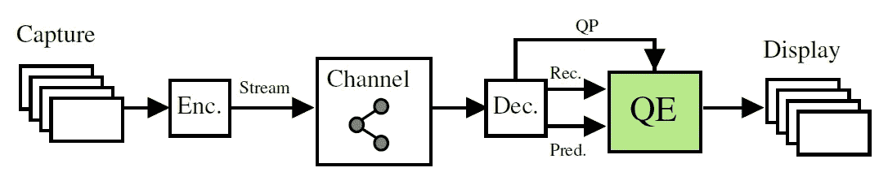
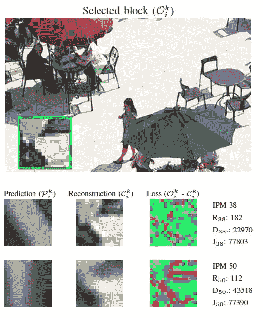
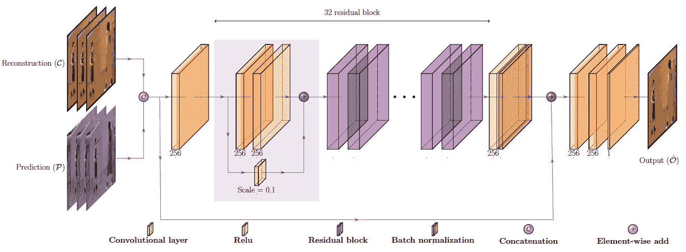
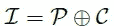
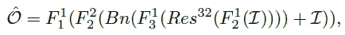
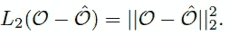

# 回顾—纳西里·VCIP 20:使用 CNN (VVC 滤波)提高 VVC 的预测感知质量

> 原文：<https://medium.com/nerd-for-tech/review-nasiri-vcip20-prediction-aware-quality-enhancement-of-vvc-using-cnn-vvc-filtering-88350fb01e2?source=collection_archive---------11----------------------->

## 受 [EDSR](https://sh-tsang.medium.com/review-edsr-mdsr-enhanced-deep-residual-networks-for-single-image-super-resolution-super-4364f3b7f86f) 启发的网络，以帧内预测信号为附加输入，**在 Y、U、V 分量上平均 BD-Rate 增益分别为 6.7%、12.6%、14.5%**。

**VVC 质量提升(QE)框架**

在这个故事中，由 IRT b < > com、雷恩大学、INSA 雷恩大学和 AVIWEST 共同撰写的**使用 CNN** (纳西里·VCIP 20)对 VVC 的预测感知质量增强进行了回顾。在本文中:

*   卷积神经网络(CNN)至**在解码**后增强 VVC 编码帧的质量，以减少低比特率伪像。
*   **帧内预测信息也用于训练。**

这是 2020 年 VCIP 的一篇论文。( [Sik-Ho Tsang](https://medium.com/u/aff72a0c1243?source=post_page-----88350fb01e2--------------------------------) @中)

# 概述

1.  **帧内编码和压缩伪像之间的关系，以及动机**
2.  **提议的网络架构**
3.  **实验结果**

# 1.**帧内编码和压缩伪像之间的关系，以及动机**

**16×16 块 k 及其两个最佳 IPM(I = 38，50)，具有相似的成本，但不同的率失真权衡导致不同的压缩损失模式**

在 VVC 有 67 种帧内预测模式(IPM ),代表 65 种角度 IPM，加上 DC 和平面。

> 严格的比特率限制可能会导致这样的情况:使块的 R-D 成本最小化的最佳 IPM**不一定是对块纹理建模最准确的 IPM。**

*   从上面的例子可以看出，尽管它们的研发成本相似，**这两种 IPM 产生非常不同的重建信号，具有不同类型的压缩损失模式。**
*   这种行为**是由于所选模式的两种不同研发权衡**。

> **针对块**、帧或整个序列**的质量增强(QE)任务可能会受到由编码器确定的编码模式(例如 IPM)** 的不同选择的显著影响。
> 
> 这种假设是本工作中使用帧内预测信息来训练质量增强网络的主要动机。

# **2。提议的网络架构**

**使用预测和重构信号作为输入的所提出方法的网络架构**

*   这个网络的灵感来自于 [EDSR](https://sh-tsang.medium.com/review-edsr-mdsr-enhanced-deep-residual-networks-for-single-image-super-resolution-super-4364f3b7f86f) 。
*   第一卷积层通过级联接收**重构 *C* 和预测帧 *P* 作为输入。**

*   在下一步骤中，在一个卷积层之后，使用了 **32 个相同的残差块(**[**ResNet**](https://towardsdatascience.com/review-resnet-winner-of-ilsvrc-2015-image-classification-localization-detection-e39402bfa5d8?source=post_page---------------------------)**)**，每个残差块由两个卷积层组成，并且在它们之间有一个 **ReLU** 层。
*   [**批量归一化**](https://sh-tsang.medium.com/review-batch-normalization-inception-v2-bn-inception-the-2nd-to-surpass-human-level-18e2d0f56651) 应用于剩余块之后。
*   **在第一个和最后一个剩余块的输入之间使用一个长跳跃连接**。
*   **使用剩余块后的两个以上卷积层**。
*   最后，最后的卷积层具有一个特征图，该特征图**构造输出帧^ *O* 。**

*   其中 *F* 1()和 *F* 2()为 3×3×256 卷积层，分别有和没有 ReLU 激活层。
*   *F* 3()是一个 3×3×1 的卷积层，ReLU。
*   相对于原始帧 O 的 L2 范数被用作训练阶段的成本函数:

*   **不同 QPs 中每个组件的一个网络用上述网络架构训练**。
*   使用两个图像数据集 **DIV2K** 和 **Flickr2K** 进行训练。
*   VTM-5.0 与全帧内配置一起使用，使用 6 个 qp，在 22 和 47 之间。
*   使用 64×64 贴片，每批 32 片。
*   在训练结束时，**针对 6 个 qp 中的 **3 个组件，共获得 36 个训练模型**。**

# **3。实验结果**

**BD-率(%)**

*   **在 CTC QP 范围**，所提出的方法可以在 Y、U 和 V 分量上分别实现 6.7%、12.6%和 14.5%的平均 BD-rate 增益**。**
*   在 Y、U 和 V 分量上，具有预测信号**的所提出的方法分别优于没有预测信号的所提出的方法 0.9%、8.1%和 4.8%。**
*   与其他两个 JVET 解决方案相比，所提出的方法显示出显著的增益。
*   **在伪影明显更强的高 QP 范围**，所提出的方法可以在 Y、U 和 V 分量上分别实现 8.3%、15.8%和 16.2%的平均 BD-rate 增益。
*   对于 U 和 v，使用预测信号实现的 BD-rate 增益相对较高。这是因为在 VVC，有先进的色度编码工具来利用冗余。此类工具的示例包括带色度缩放的亮度映射(LMCS)、联合 Cb-Cr 残差编码(JCCR)、交叉分量线性建模(CCLM)和称为亮度导出模式(DM)的特定色度 IPM。

## 参考

【2020 VCIP】【纳西里·VCIP 20】
[使用 CNN 的 VVC 预测感知质量增强](https://ieeexplore.ieee.org/document/9301884)

## 编解码器过滤

)(我)(们)(都)(不)(知)(道)(,)(我)(们)(还)(不)(能)(说)(什)(么)(话)(,)(我)(们)(还)(不)(能)(说)(出)(什)(么)(话)(,)(我)(们)(还)(不)(能)(说)(出)(什)(么)(话)(,)(我)(们)(还)(不)(能)(说)(什)(么)(,)(我)(们)(还)(不)(能)(说)(什)(么)(,)(我)(们)(还)(不)(能)(说)(什)(么)(,)(我)(们)(还)(不)(能)(说)(什)(么)(,)(我)(们)(还)(不)(能)(说)(什)(么)(。 )(他)(们)(都)(不)(在)(这)(些)(事)(上)(,)(她)(们)(还)(不)(在)(这)(些)(事)(上)(有)(什)(么)(情)(况)(呢)(?)(她)(们)(都)(不)(在)(这)(些)(情)(况)(下)(,)(她)(们)(还)(不)(在)(这)(些)(事)(上)(有)(什)(么)(情)(况)(吗)(?)(她)(们)(都)(不)(在)(这)(些)(事)(上)(有)(,)(她)(们)(们)(还)(不)(在)(这)(些)(事)(上)(,)(她)(们)(们)(还)(不)(在)(这)(些)(事)(上)(有)(什)(么)(好)(的)(情)(情)(况)(。 )(他)(们)(都)(不)(在)(这)(些)(事)(上)(,)(她)(们)(还)(不)(在)(这)(些)(事)(上)(有)(什)(么)(情)(况)(呢)(?)(她)(们)(都)(不)(在)(这)(些)(事)(上)(,)(她)(们)(还)(不)(在)(这)(些)(事)(上)(还)(有)(什)(么)(情)(况)(,)(她)(们)(还)(不)(在)(这)(些)(事)(上)(还)(有)(什)(么)(情)(情)(况)(呢)(,)(她)(们)(们)(还)(没)(有)(什)(么)(好)(的)(情)(感)(。 )(我)(们)(都)(不)(知)(道)(,)(我)(们)(都)(是)(很)(好)(的)(,)(我)(们)(都)(是)(很)(好)(的)(。

## [我以前的其他论文阅读材料](https://sh-tsang.medium.com/overview-my-reviewed-paper-lists-tutorials-946ce59fbf9e)