# 综述——Pelee:移动设备上的实时目标检测系统

> 原文：<https://medium.com/nerd-for-tech/review-pelee-a-real-time-object-detection-system-on-mobile-devices-65fa30fa93c2?source=collection_archive---------7----------------------->

## Pelee =提议的 PeleeNet 作为主干+修改的 [SSD](https://towardsdatascience.com/review-ssd-single-shot-detector-object-detection-851a94607d11?source=post_page---------------------------) 作为对象检测网络(图像分类&对象检测)

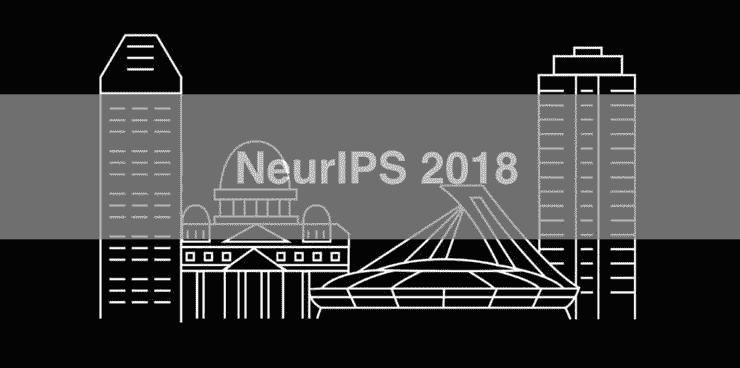

在这个故事中，对西安大略大学的 **Pelee:一个移动设备上的实时物体检测系统**(Pelee&PeleeNet)进行了回顾。在本文中:

*   **PeleeNet** 被提出，它只使用**常规卷积**，是**DenseNet******架构的变体，用于移动设备。****
*   ******Pelee** ，以 PeleeNet 为骨干，以**改进型**[**SSD**](https://towardsdatascience.com/review-ssd-single-shot-detector-object-detection-851a94607d11?source=post_page---------------------------)**为目标检测网络，成为一款高速目标检测器。(这就像 YOLO 物体探测网络，他们使用暗网作为主干。)******

******这是一篇发表在 **2018 NeurIPS** 的论文，被引用超过 **200 次**。( [Sik-Ho Tsang](https://medium.com/u/aff72a0c1243?source=post_page-----65fa30fa93c2--------------------------------) @中)******

# ****概述****

1.  ******PeleeNet:修改后的**[**DenseNet**](https://towardsdatascience.com/review-densenet-image-classification-b6631a8ef803?source=post_page---------------------------)****
2.  ******Pelee:修改过的** [**SSD**](https://towardsdatascience.com/review-ssd-single-shot-detector-object-detection-851a94607d11?source=post_page---------------------------)****
3.  ******PeleeNet:网络架构******
4.  ******骨盆网:消融研究******
5.  ******PeleeNet:图像分类结果******
6.  ******Pelee:物体检测结果******

# ****1. **PeleeNet:改良型** [DenseNet](https://towardsdatascience.com/review-densenet-image-classification-b6631a8ef803?source=post_page---------------------------)****

*   ****在 PeleeNet 中修改了 [DenseNet](https://towardsdatascience.com/review-densenet-image-classification-b6631a8ef803?source=post_page---------------------------) 的多个位置。****

## ******1.1。双向密集层******

****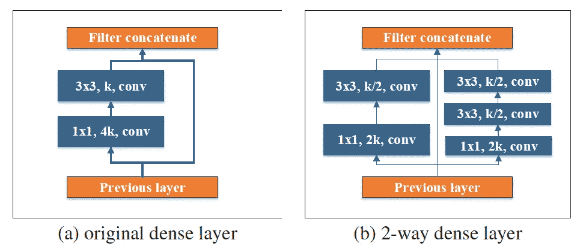****

******双向密集层结构******

*   ****由 [GoogLeNet](/coinmonks/paper-review-of-googlenet-inception-v1-winner-of-ilsvlc-2014-image-classification-c2b3565a64e7) ，**一个双向致密层**激发得到不同规模的感受野，如上。****
*   ******该层的一种方式**使用**一个 3×3 的内核大小。******
*   ******该层的另一种方式**使用**两个堆叠的 3×3 卷积**来学习大对象的视觉模式。****

## ****1.2.茎块****

****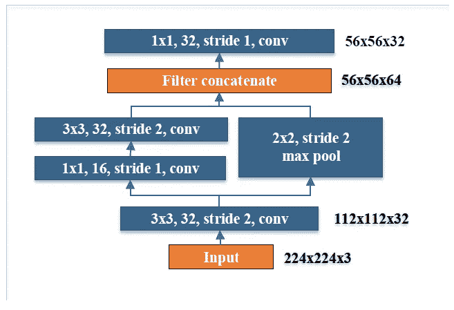****

******阀杆块的结构******

*   ****受 [Inception-v4](https://towardsdatascience.com/review-inception-v4-evolved-from-googlenet-merged-with-resnet-idea-image-classification-5e8c339d18bc?source=post_page---------------------------) 和 [DSOD](https://sh-tsang.medium.com/review-dsod-learning-deeply-supervised-object-detectors-from-scratch-object-detection-43393dcb31bd) 、**的启发，如上所述，在第一个致密层之前设计了一个具有成本效益的阀杆块**。****
*   ****这个词干块可以**在不增加太多计算成本的情况下有效提高特征表达能力**。****

## ****1.3.瓶颈层中的动态通道数****

****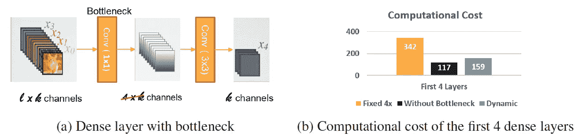****

******瓶颈层动态通道数******

*   ****在 [DenseNet](https://towardsdatascience.com/review-densenet-image-classification-b6631a8ef803?source=post_page---------------------------) 中，对于前几个密集层，瓶颈通道的数量远大于其输入通道的数量，这意味着对于这些层来说，瓶颈层增加了计算成本而不是降低了成本。****
*   ****为了保持架构的一致性，**瓶颈层**仍然添加到所有密集层，但是数量**根据输入形状动态调整**，**保证通道数量不超过输入通道。******
*   ****实验表明，与原有的 [DenseNet](https://towardsdatascience.com/review-densenet-image-classification-b6631a8ef803?source=post_page---------------------------) 结构相比，这种方法在对精度影响不大的情况下**可以节省高达 28.5%的计算成本。******

## ****1.4.无压缩过渡层****

*   ****[DenseNet](https://towardsdatascience.com/review-densenet-image-classification-b6631a8ef803?source=post_page---------------------------) 提出的压缩因子伤害了特征表达。****
*   ******在过渡层中，输出通道的数量始终保持与输入通道的数量相同。******

## ****1.5.复合函数****

*   ****使用后激活(Conv- [BN](https://sh-tsang.medium.com/review-batch-normalization-inception-v2-bn-inception-the-2nd-to-surpass-human-level-18e2d0f56651) -ReLU)代替 [DenseNet](https://towardsdatascience.com/review-densenet-image-classification-b6631a8ef803?source=post_page---------------------------) 中使用的预激活。****
*   ****在这种情况下， [BN](https://sh-tsang.medium.com/review-batch-normalization-inception-v2-bn-inception-the-2nd-to-surpass-human-level-18e2d0f56651) 可以在推理阶段与卷积层合并，这样可以大大加快速度。****
*   ****为了补偿这种变化对精度造成的负面影响，当**使用浅而宽的网络结构**时**，在最后一个密集块**后增加一个 1×1 卷积层，以获得更强的表示能力。****

# ******2。Pelee:修改过的** [SSD](https://towardsdatascience.com/review-ssd-single-shot-detector-object-detection-851a94607d11?source=post_page---------------------------)****

*   ****PeleeNet 中修改了多处 [SSD](https://towardsdatascience.com/review-ssd-single-shot-detector-object-detection-851a94607d11?source=post_page---------------------------) 。****

## ****2.1.特征地图选择****

****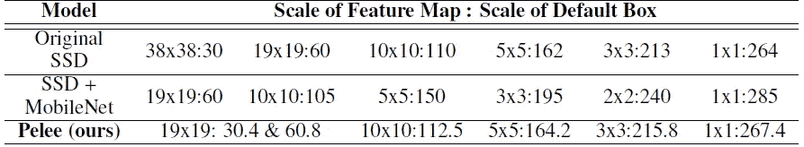****

******特征地图和默认框的比例******

*   ****精心挑选的一套 **5 比例尺特征图(19×19、10×10、5×5、3×3、1×1)。******
*   ****为了降低计算成本，我们不使用 38×38 的特征图。****

## ****2.2.残差预测块****

****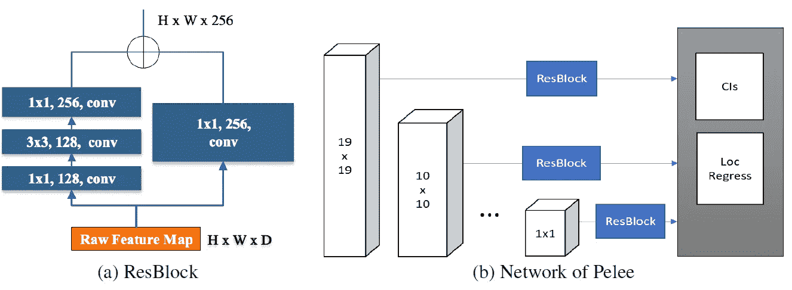****

******残差预测块******

*   ****对于用于检测的每个特征图，**在进行预测之前构建残差块(ResBlock)。******

## ****2.3.用于预测的小卷积核****

*   ****残差预测块使得**应用 1×1 卷积核来预测类别分数和盒子偏移量成为可能。******
*   ****实验表明，使用 1×1 核的模型**与使用 3×3 核的模型**的精度几乎相同。****
*   ****然而， **1×1 核减少了 21.5%的计算量。******

# ****3.PeleeNet:网络架构****

****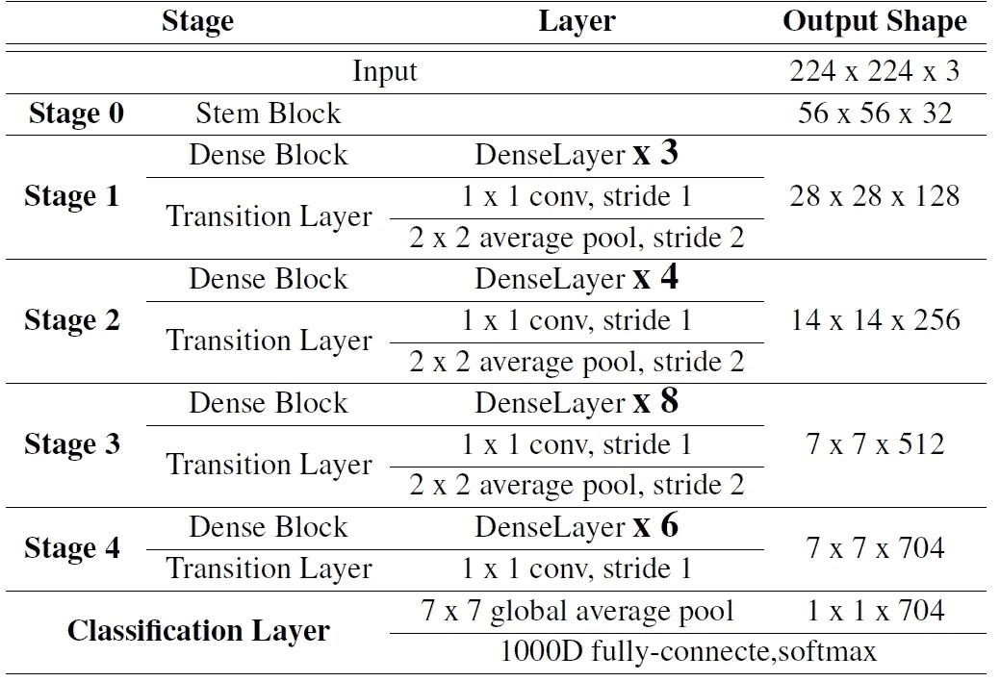****

******PeleeNet 架构概述******

*   ****整个网络由**一个词干块**和**四级特征提取器组成。******
*   ****除了最后一个阶段，每个阶段的最后一层是步长为 2 的平均池层。****
*   ****前两个阶段的层数被特别控制在可接受的范围内。****

# ****4.PeleeNet:消融研究****

*   ****根据斯坦福犬使用的 ImageNet，ILSVRC 2012 的子集。这些图像是**犬种**的图像。训练数据和验证数据都是从 ILSVRC 2012 数据集中精确复制的。****
*   ******类别数量** : **120******
*   ******训练**图像数量:**150466******
*   ******验证**图像数量:**6000******

****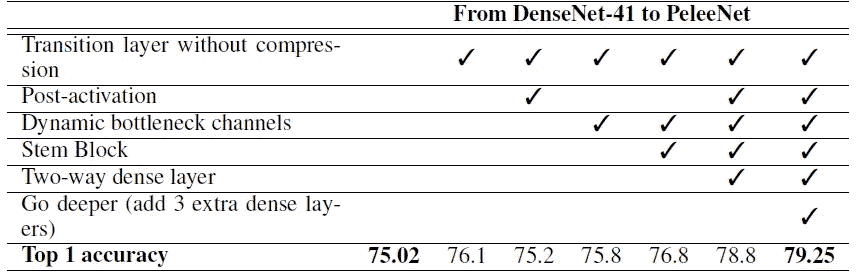****

******各种设计选择和组件对性能的影响******

*   ****一个名为 [DenseNet](https://towardsdatascience.com/review-densenet-image-classification-b6631a8ef803?source=post_page---------------------------) -41 的类似 [DenseNet](https://towardsdatascience.com/review-densenet-image-classification-b6631a8ef803?source=post_page---------------------------) 的网络被用作基线。该型号与最初的 [DenseNet](https://towardsdatascience.com/review-densenet-image-classification-b6631a8ef803?source=post_page---------------------------) 有两处不同:****

1.  ****第一个是第一 conv 层的参数。第一 conv 层上有 24 个通道**而不是 64 个**，并且**内核大小**也从 7×7 变为 3×3 。****
2.  ****第二个是**调整每个密集块中的层数以满足计算预算。******

*   ****综合所有设计选择后， **PeleeNet 在 Stanford Dogs** 上达到 79.25%的准确率，比[**DenseNet**](https://towardsdatascience.com/review-densenet-image-classification-b6631a8ef803?source=post_page---------------------------)**-41**在**更少的计算开销下，准确率提高了**4.23%。********

# ****5。图像分类结果****

## **5.1.ImageNet**

**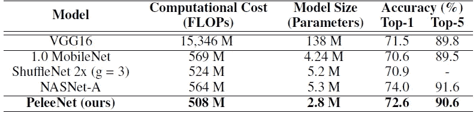**

****ImageNet ils vrc 2012 的结果****

*   **PeleeNet 比[**mobilenetv 1**](https://towardsdatascience.com/review-mobilenetv1-depthwise-separable-convolution-light-weight-model-a382df364b69?source=post_page---------------------------)**和**[**shuffle net V1**](https://towardsdatascience.com/review-shufflenet-v1-light-weight-model-image-classification-5b253dfe982f?source=post_page---------------------------)**【在**不超过模型大小**的 66%的情况下，实现了**更高的精度和**更低的计算成本。********
*   **PeleeNet 的模型尺寸只有 [VGG](/coinmonks/paper-review-of-vggnet-1st-runner-up-of-ilsvlc-2014-image-classification-d02355543a11?source=post_page---------------------------) 16 的 1/49。**

## **5.2.**NVIDIA TX2 上的速度****

**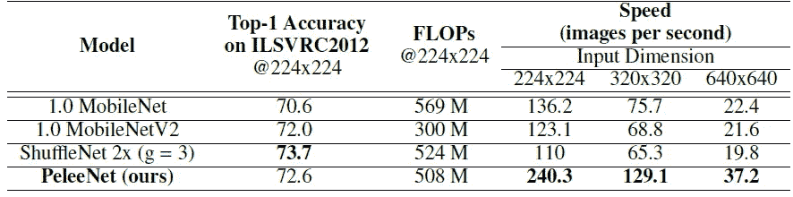**

****NVIDIA TX2 上的速度(越大越好)基准测试工具采用 NVIDIA TensorRT4.0 库构建。****

*   **PeleeNet 比 TX2 上的 MoibleNetV1、[**mobilenet v2**](https://towardsdatascience.com/review-mobilenetv2-light-weight-model-image-classification-8febb490e61c?source=post_page---------------------------)**快得多。****

**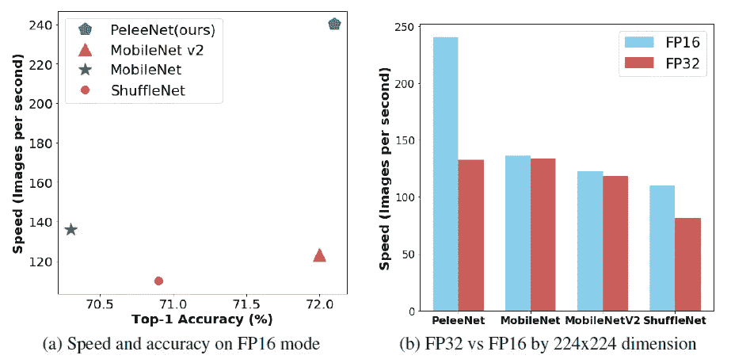**

****NVIDIA TX2 上的速度****

*   ****使用半精度浮点(FP16)，PeleeNet 在 FP16 模式下的运行速度比在 FP32 模式下快 1.8 倍。****
*   **相比之下，用深度方向可分离卷积构建的网络很难受益于 TX2 半精度(FP16)推理引擎。在 FP16 模式下运行的 [MobileNetV1](https://towardsdatascience.com/review-mobilenetv1-depthwise-separable-convolution-light-weight-model-a382df364b69?source=post_page---------------------------) 和 [MobileNetV2](https://towardsdatascience.com/review-mobilenetv2-light-weight-model-image-classification-8febb490e61c?source=post_page---------------------------) 的速度与在 FP32 模式下运行的速度几乎相同。**

## **5.3.iPhone 8 上的速度**

**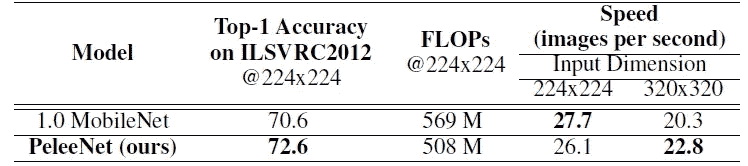**

****iPhone 8 上的速度(越大越好)基准测试工具是用 CoreML 库构建的****

*   **类似地，PeleeNet 以较小的模型尺寸获得较高的精度。**

# **6.**物体检测结果****

## **6.1.各种设计选择的效果**

**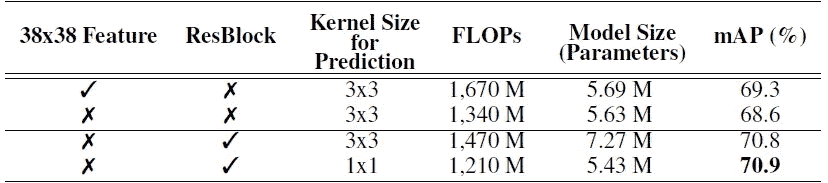**

****各种设计选择对性能的影响****

*   **具有**残差预测块**的模型实现了比没有残差预测块的模型高 2.2% 的**。****
*   **使用 1×1 核函数预测的模型精度与使用 3×3 核函数预测的模型精度几乎相同。然而， **1×1 核减少了 21.5%的计算量和 33.9%的模型规模。****

## **6.2.帕斯卡 VOC 2007**

**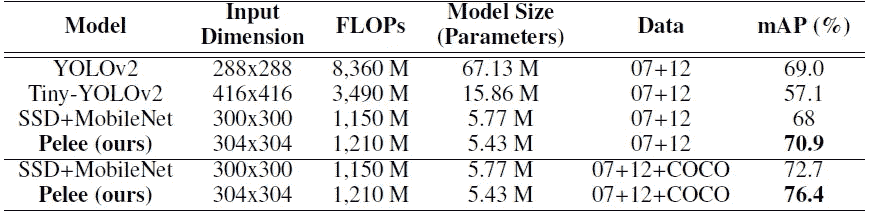**

****PASCAL VOC 2007 的结果****

*   **Pelee 的精度比 Tiny [YOLOv2](https://towardsdatascience.com/review-yolov2-yolo9000-you-only-look-once-object-detection-7883d2b02a65?source=post_page---------------------------) 高 13.8%，比[SSD](https://towardsdatascience.com/review-ssd-single-shot-detector-object-detection-851a94607d11?source=post_page---------------------------)+[MobileNetV1](https://towardsdatascience.com/review-mobilenetv1-depthwise-separable-convolution-light-weight-model-a382df364b69?source=post_page---------------------------)高 2.9%。**
*   **它甚至高于[yolov 2](https://towardsdatascience.com/review-yolov2-yolo9000-you-only-look-once-object-detection-7883d2b02a65?source=post_page---------------------------)–288 的计算量，而其计算量仅为[yolov 2](https://towardsdatascience.com/review-yolov2-yolo9000-you-only-look-once-object-detection-7883d2b02a65?source=post_page---------------------------)–288 的 14.5%。**
*   **当我们采用在第 3.3 节中描述的 COCO trainval35k 上训练的模型并在 07+12 数据集上对其进行微调时，Pelee 实现了 76.4%的 mAP。**

## **6.3.真实设备上的速度**

**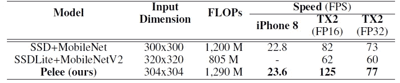**

****真实设备上的速度****

*   **虽然 Pelee 中使用的残差预测块增加了计算成本，但 Pelee 在 iPhone 上和 FP32 模式下的 TX2 上运行速度仍然比 [SSD](https://towardsdatascience.com/review-ssd-single-shot-detector-object-detection-851a94607d11?source=post_page---------------------------) +MobileNetV1 快。**
*   **还有，Pelee 在 FP16 模式下相对于 [SSD](https://towardsdatascience.com/review-ssd-single-shot-detector-object-detection-851a94607d11?source=post_page---------------------------) +MobileNetV1 和[SSD](https://towardsdatascience.com/review-ssd-single-shot-detector-object-detection-851a94607d11?source=post_page---------------------------)Lite+[MobileNetV2](https://towardsdatascience.com/review-mobilenetv2-light-weight-model-image-classification-8febb490e61c?source=post_page---------------------------)有更大的速度优势。**
*   **我们提出的物体检测系统 Pelee 可以在 iPhone 8 上运行 **23.6 FPS，在 NVIDIA TX2** 上运行 **125 FPS，精度很高。****

## **6.4.椰子树**

**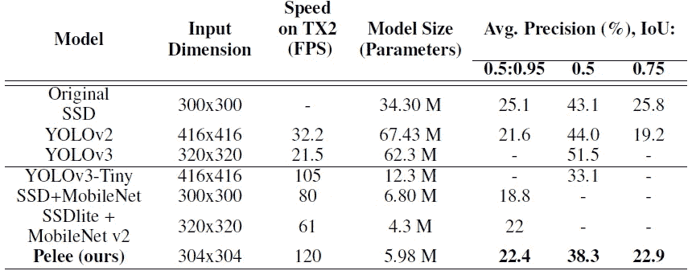**

****COCO 测试结果-dev2015****

*   **Pelee 不仅比[SSD](https://towardsdatascience.com/review-ssd-single-shot-detector-object-detection-851a94607d11?source=post_page---------------------------)+[MobileNetV1](https://towardsdatascience.com/review-mobilenetv1-depthwise-separable-convolution-light-weight-model-a382df364b69?source=post_page---------------------------)更准确，而且在 mAP @ 0.5:0.95 和 mAP@0.75 两种情况下都比 [YOLOv2](https://towardsdatascience.com/review-yolov2-yolo9000-you-only-look-once-object-detection-7883d2b02a65?source=post_page---------------------------) 更准确。**
*   **同时，Pelee 的速度比 [YOLOv2](https://towardsdatascience.com/review-yolov2-yolo9000-you-only-look-once-object-detection-7883d2b02a65?source=post_page---------------------------) 快 3.7 倍，模型尺寸小 11.3 倍。**

## **参考**

**【2018 neur IPS】【Pelee & PeleeNet】
[Pelee:移动设备上的实时物体检测系统](https://arxiv.org/abs/1804.06882)**

## **图像分类**

**)(我)(们)(都)(不)(知)(道)(,)(我)(们)(都)(是)(很)(强)(的)(,)(我)(们)(都)(是)(很)(强)(的)(对)(对)(对)(对)(对)(对)(对)(对)(对)(对)(对)(对)(对)(对)(对)(对)(对)(对)(对)(对)(对)(对)(对)(对)(对)(对)(对)(对)(对)(对)(对)(对)(对)(对)(对)(对)(对)(对)(对)(对)(对)(对)(对)(对)(对)(对)(对)(对)(对)(对)(对)(对)(对)(对)(对)(对)(对)(对)(对)(对)(对)(对)(对)(对)(对)(对)(对)(对)(对)(对)(对)(对)(对)(对)(对)(对)(对)( )(他)(们)(都)(不)(在)(这)(些)(事)(上)(,)(我)(们)(还)(不)(在)(这)(些)(事)(上)(有)(什)(么)(情)(况)(?)(我)(们)(都)(不)(在)(这)(些)(情)(况)(下)(,)(我)(们)(还)(没)(有)(什)(么)(情)(况)(,)(我)(们)(还)(有)(什)(么)(情)(况)(呢)(?)(我)(们)(都)(没)(有)(什)(么)(情)(况)(,)(我)(们)(还)(没)(有)(什)(么)(好)(好)(的)(情)(感)(。 )(我)(们)(都)(不)(想)(到)(这)(些)(人)(,)(我)(们)(都)(不)(想)(到)(这)(些)(人)(,)(我)(们)(还)(不)(想)(到)(这)(些)(人)(,)(我)(们)(都)(不)(想)(到)(这)(些)(人)(,)(但)(我)(们)(还)(没)(想)(到)(这)(些)(人)(,)(我)(们)(还)(没)(想)(到)(这)(些)(事)(,)(我)(们)(就)(没)(想)(要)(到)(这)(个)(人)(,)(我)(们)(们)(都)(想)(要)(到)(这)(里)(去)(了)(,)(我)(们)(都)(不)(想)(到)(这)(里)(去)(。**

## **目标检测**

**…
**2018** : [ [约洛夫 3](https://towardsdatascience.com/review-yolov3-you-only-look-once-object-detection-eab75d7a1ba6?source=post_page---------------------------) ] [ [级联 R-CNN](/@sh.tsang/reading-cascade-r-cnn-delving-into-high-quality-object-detection-object-detection-8c7901cc7864)][[MegDet](/towards-artificial-intelligence/reading-megdet-a-large-mini-batch-object-detector-1st-place-of-coco-2017-detection-challenge-e82072e9b7f)][[stair net](/@sh.tsang/reading-stairnet-top-down-semantic-aggregation-object-detection-de689a94fe7e)][[refined et](https://sh-tsang.medium.com/review-refinedet-single-shot-refinement-neural-network-for-object-detection-object-detection-5fc483449562)][[corner net](https://sh-tsang.medium.com/review-cornernet-detecting-objects-as-paired-keypoints-object-detection-ffb23026291b)][[Pelee&PeleeNet](https://sh-tsang.medium.com/review-pelee-a-real-time-object-detection-system-on-mobile-devices-65fa30fa93c2)
**2019**:[**

## **[我以前的其他论文阅读材料](https://sh-tsang.medium.com/overview-my-reviewed-paper-lists-tutorials-946ce59fbf9e)**