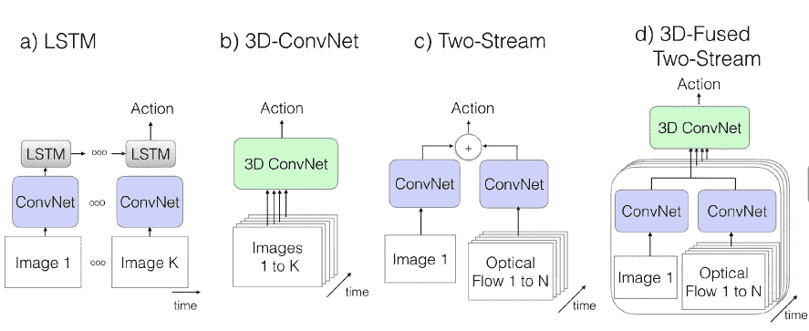
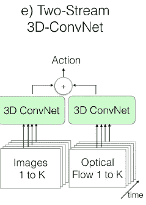
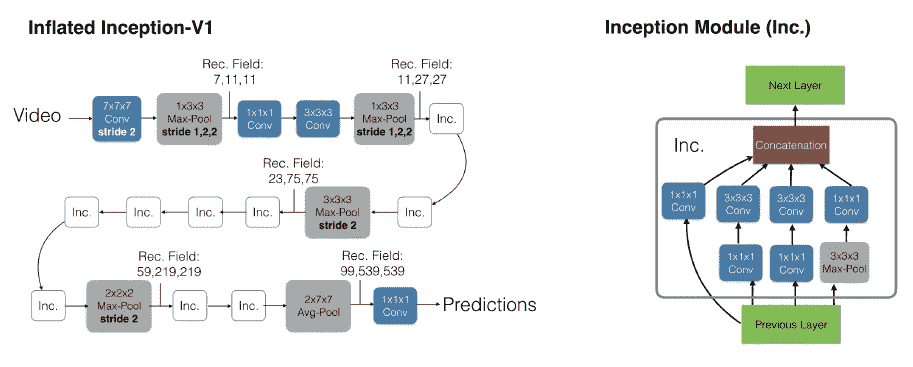
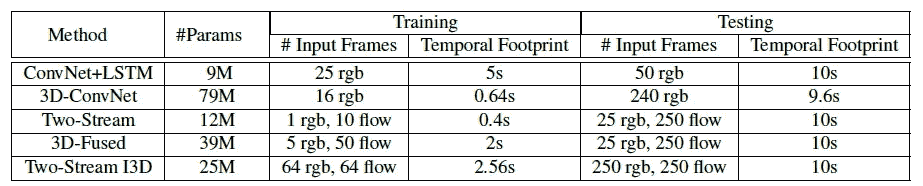
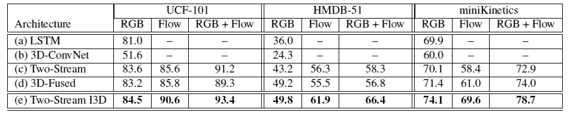
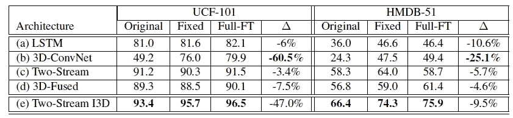
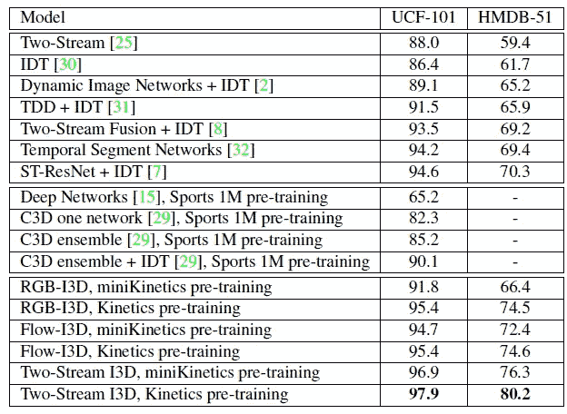

# I3D 评论:行动认可？新模型和动力学数据集(视频分类)

> 原文：<https://medium.com/nerd-for-tech/review-quo-vadis-action-recognition-a-new-model-and-the-kinetics-dataset-video-classification-a7535aa8bf48?source=collection_archive---------8----------------------->

## 使用膨胀的 [GoogLeNet/Inception-V1](/coinmonks/paper-review-of-googlenet-inception-v1-winner-of-ilsvlc-2014-image-classification-c2b3565a64e7) 进行双流 3D ConvNets，表现优于 [**深度视频**](https://sh-tsang.medium.com/paper-deep-video-large-scale-video-classification-with-convolutional-neural-network-video-585c36c4f042) **，** [**双流 ConvNet**](https://sh-tsang.medium.com/review-two-stream-convnet-spatial-and-temporal-networks-video-classification-10d3f848c0fa) **，**[**TSN**](https://sh-tsang.medium.com/review-tsn-temporal-segment-network-video-classification-16a2819462f5)**，** [**C3D**](https://sh-tsang.medium.com/paper-c3d-learning-spatiotemporal-features-with-3d-convolutional-networks-video-classification-72b49adb4081) 等。

这些演员是要亲吻对方，还是他们已经这样做了？

在这个故事里， **Quo Vadis，动作识别？回顾了 DeepMind 和牛津大学的一个新模型和动力学数据集**(I3D)。在本文中:

*   **双流膨胀 3D ConvNet (I3D)** 基于 2D ConvNet 膨胀设计:**过滤器和池内核扩展到 3D。**
*   **学习无缝时空特征**，同时利用成功的 ImageNet 架构设计，甚至它们的参数。

这是一篇发表在 **2017 CVPR** 的论文，引用超过 **3000 次**。( [Sik-Ho Tsang](https://medium.com/u/aff72a0c1243?source=post_page-----a7535aa8bf48--------------------------------) @中)

# 概述

1.  **现有网络架构**
2.  ****【I3D】****
3.  ****提议的双流膨胀 3D ConvNets (I3D)****
4.  ****动力学人体动作视频数据集****
5.  ****实验结果****

# ****1。先前的网络架构****

****

****现有网络架构****

## ****1.1。天真的方法****

*   **这可以通过使用它们从每一帧中独立提取特征，然后在整个视频中汇集它们的预测来实现。**
*   **这符合单词袋图像建模方法的**精神，但尽管在实践中很方便，但它存在完全**忽略时间结构**的问题(例如，模型可能无法区分开门和关门)。这就是故事顶部第一个数字中的问题。****

## **1.2.(a) ConvNet+LSTM**

*   **为了处理上述问题，**在** [**盗梦空间-V1**](/coinmonks/paper-review-of-googlenet-inception-v1-winner-of-ilsvlc-2014-image-classification-c2b3565a64e7) 的最后一个平均池层后增加了一个 [**批量归一化**](https://sh-tsang.medium.com/review-batch-normalization-inception-v2-bn-inception-the-2nd-to-surpass-human-level-18e2d0f56651) 的 LSTM 层，有 512 个隐藏单元。**
*   ****分类器顶部增加一个全连通层**。**

## ****1.3。(b) 3D-ConvNet****

*   **本文实现的**是**[**C3D**](https://sh-tsang.medium.com/paper-c3d-learning-spatiotemporal-features-with-3d-convolutional-networks-video-classification-72b49adb4081)**的一个小变种，它有 **8 个卷积层，5 个池层，2 个全连通层**在顶部。****
*   ****该模型的输入是 112 × 112 像素裁剪的短 16 帧剪辑，与原始实施方案相同。****
*   ****与[29]不同的是，[批量归一化](https://sh-tsang.medium.com/review-batch-normalization-inception-v2-bn-inception-the-2nd-to-surpass-human-level-18e2d0f56651)在所有卷积和全连接层之后使用。****

## ****1.4.(c) (d)使用 2D-康文网络/三维康文网络的双流网络****

*   ******最近的一个扩展【8】**在最后一个网络卷积层之后融合空间和流流。****
*   ****在本文中，作者用[盗梦空间-V1](/coinmonks/paper-review-of-googlenet-inception-v1-winner-of-ilsvlc-2014-image-classification-c2b3565a64e7) 作为主干来近似他们。****
*   ****网络的输入是相隔 10 帧采样的 **5 个连续的 RGB 帧**，以及**相应的光流片段。******
*   ****[盗梦空间-V1](/coinmonks/paper-review-of-googlenet-inception-v1-winner-of-ilsvlc-2014-image-classification-c2b3565a64e7) 最后一个平均池层之前的空间和运动特征**(5×7×7 特征网格，对应时间、x、y 维度)经过一个 3 × 3 × 3 的 3D 卷积层**和 512 个输出通道**，之后是 3×3×3 的 3D max-pooling 层**和最后的全连接层**。******

# ****2.**膨胀 3D 网络技术(I3D)******

********

******提议的膨胀 3D ConvNet (I3D)******

*   ****要将 2D ConvNet 转换成 3D 对应物，需要一些技巧或需要注意一些问题。****

## ****2.1.膨胀 2D ConvNets 到三维****

*   ****从 2D 架构开始，膨胀所有的过滤器和池内核，过滤器通常是方形的，并使它们成为立方的— *N* × *N* 过滤器变成*N*×*N*×*N*。****

## ****2.2.从 2D 滤镜引导 3D 滤镜****

*   ****通过将图像重复复制到视频序列中，可以将其转换为(无聊的)视频。****
*   ****由于线性，这可以通过沿时间维度重复 2D 滤波器的权重 N 次来实现，并且通过除以 N 来重新调整它们。****
*   ****通过这样做，逐点非线性图层以及平均和最大池图层的输出与 2D 的情况相同。****

## ****2.3.感受野在空间、时间和网络深度上的增长****

*   ****然而，当考虑时间时，对称的**感受野**不一定是最佳的——这应当**取决于帧速率和图像尺寸。******
*   ****如果它在时间上相对于空间增长过快，它可能会合并来自不同对象的边缘，破坏早期特征检测，而如果**它增长过慢，它可能无法很好地捕捉场景动态。******
*   ****对于本文中的模型，输入视频以每秒 25 帧进行处理；发现**在前两个 max-pooling 层不执行临时池是有帮助的。******

# ****3.提议的双流膨胀三维飞机(I3D)****

********

******膨胀的** [**盗梦空间——V1**](/coinmonks/paper-review-of-googlenet-inception-v1-winner-of-ilsvlc-2014-image-classification-c2b3565a64e7)**架构(左)及其详细的盗梦子模块(右)。******

*   ******以上显示了充气的** [**盗梦空间-V1**](/coinmonks/paper-review-of-googlenet-inception-v1-winner-of-ilsvlc-2014-image-classification-c2b3565a64e7) **及其对应的盗梦模块。******
*   ****一个 I3D 网络针对 **RGB** 输入进行训练，另一个针对**流量**输入进行训练。****
*   ****发现具有双流配置是有价值的，其中一个 I3D 网络在 RGB 输入上训练，另一个在携带优化的平滑流信息的流输入上训练。****
*   ****两个网络**被分别训练**和**在测试时平均它们的预测。******

********

******模型的参数数量和时间输入大小******

*   ****最后，对上述模型进行了测试。****

# ****4.动力学人体动作视频数据集****

## ****4.1.Kintetics****

*   ****在该数据集中，动作类列表包括:**个人动作(单数)**，例如:画画、喝酒、大笑、出拳；**人与人之间的动作**，例如拥抱、亲吻、握手；**人-物动作**，如拆礼物、割草、洗碗。****
*   ****数据集有 **400 个人体动作类**，每个类有 **400 个或更多的剪辑**，每个剪辑来自一个独特的视频。**剪辑持续 10s 左右**，没有未剪辑的视频。****
*   ******测试装置**包括**每类**100 个夹子。(该数据集的更多详细信息见[16]。)****

## ****4.2.微观动力学****

*   ****在本文中，**是一个比全动力学**更小的数据集，称为 miniKinetics。****
*   ****这是数据集的早期版本，只有**213 个类，共有 12 万个剪辑跨越三个分割**，一个用于**训练**，每类**150–1000 个剪辑**，一个用于**验证**，每类 **25 个剪辑**，一个用于**测试**，每类 **75 个剪辑**。****
*   ****MiniKinetics 支持更快的实验，并且在完整动力学数据集之前可用。****

# ****5.实验结果****

## ****5.1.不同的模型架构****

********

******架构对比:(左)在 UCF-101 的 split 1 上进行训练和测试；(中)在 HMDB-51 的 split 1 上进行训练和测试；(右)微型动力学的培训和测试。******

*   ****可以看出，**所提出的新 I3D 模型在所有数据集中表现最佳，具有 RGB、flow 或 RGB+flow 模态。******

## ****5.2.使用微型动力学进行预训练的效果****

********

******在 UCF-101 和 HMDB-51 测试集上的性能(两个测试集的分割 1 ),适用于在 miniKinetics 上进行了预训练的架构******

*   ******原**:UCF-101/HMDB-51 次列车****
*   ******固定**:来自 miniKinetics 的特性，最后一层在 UCF-101 / HMDB-51 上训练。****
*   ******全英尺**:微型动力学预训练，在 UCF-101 / HMDB-51 上进行端到端微调****
*   ****δ表示原始分类与全英尺和固定的最佳分类之间的错误分类差异百分比。****
*   ****明显的结果是**所有架构都受益于固定或全英尺**的预培训。****

## ****5.3.SOTA 比较****

********

******与最先进的 UCF-101 和 HMDB-51 数据集进行比较，平均分为三次。******

*   ****单独的所提出的 **RGB-I3D 或 RGB-流模型中的任一个，当在动力学上被预训练时，通过任何模型或模型组合胜过所有先前公开的性能，例如** [**深度视频**](https://sh-tsang.medium.com/paper-deep-video-large-scale-video-classification-with-convolutional-neural-network-video-585c36c4f042) **(深度网络)** [**双流 ConvNet**](https://sh-tsang.medium.com/review-two-stream-convnet-spatial-and-temporal-networks-video-classification-10d3f848c0fa) **、**[**TSN**](https://sh-tsang.medium.com/review-tsn-temporal-segment-network-video-classification-16a2819462f5)**、******
*   ******提议的**组合双流架构**大大扩大了相对于以前模型的优势，使 UCF-101 的**总体性能达到 97.9，HMDB-51 的**达到 80.2，与以前最好的模型相比**分别对应 57%和 33%的错误分类减少**。******

## ****参考****

****【2017 CVPR】【I3D】
[Quo Vadis，动作识别？新模型和动力学数据集](https://arxiv.org/abs/1705.07750)****

## ****视频分类/动作识别****

******2014**[深度视频](https://sh-tsang.medium.com/paper-deep-video-large-scale-video-classification-with-convolutional-neural-network-video-585c36c4f042)[双流 ConvNet](https://sh-tsang.medium.com/review-two-stream-convnet-spatial-and-temporal-networks-video-classification-10d3f848c0fa)**2015**[DevNet](https://sh-tsang.medium.com/review-devnet-deep-event-network-for-multimedia-event-detection-and-evidence-recounting-video-140ded103d01)[C3D](https://sh-tsang.medium.com/paper-c3d-learning-spatiotemporal-features-with-3d-convolutional-networks-video-classification-72b49adb4081)**2016**[TSN](https://sh-tsang.medium.com/review-tsn-temporal-segment-network-video-classification-16a2819462f5)**2017**[时态建模方法](https://sh-tsang.medium.com/review-temporal-modeling-approaches-for-large-scale-youtube-8m-video-understanding-video-6a9af865e7fc)[4 时态建模方法【T21](https://sh-tsang.medium.com/review-revisiting-the-effectiveness-of-off-the-shelf-temporal-modeling-approaches-for-26ac83422242)****

## ****[我以前的其他论文阅读材料](https://sh-tsang.medium.com/overview-my-reviewed-paper-lists-tutorials-946ce59fbf9e)****