# Review — RefineDet:用于对象检测的单次细化神经网络(对象检测)

> 原文：<https://medium.com/nerd-for-tech/review-refinedet-single-shot-refinement-neural-network-for-object-detection-object-detection-5fc483449562?source=collection_archive---------7----------------------->

## 胜过 [CoupleNet](https://sh-tsang.medium.com/review-couplenet-coupling-global-structure-with-local-parts-for-object-detection-object-d80150c5c850) 、 [DCN](https://towardsdatascience.com/review-dcn-deformable-convolutional-networks-2nd-runner-up-in-2017-coco-detection-object-14e488efce44?source=post_page---------------------------) 、 [RetinaNet](https://towardsdatascience.com/review-retinanet-focal-loss-object-detection-38fba6afabe4?source=post_page---------------------------) 、 [G-RMI](https://towardsdatascience.com/review-g-rmi-winner-in-2016-coco-detection-object-detection-af3f2eaf87e4?source=post_page---------------------------) 、 [FPN](https://towardsdatascience.com/review-fpn-feature-pyramid-network-object-detection-262fc7482610?source=post_page---------------------------) 、 [TDM](/datadriveninvestor/review-tdm-top-down-modulation-object-detection-3f0efe9e0151?source=post_page---------------------------) 、[快 R-CNN](https://towardsdatascience.com/review-faster-r-cnn-object-detection-f5685cb30202?source=post_page---------------------------) 、[快 R-CNN](/coinmonks/review-fast-r-cnn-object-detection-a82e172e87ba) 、 [OHEM](https://sh-tsang.medium.com/review-ohem-training-region-based-object-detectors-with-online-hard-example-mining-object-ad791ad87612) 、[约洛夫 2](https://towardsdatascience.com/review-yolov2-yolo9000-you-only-look-once-object-detection-7883d2b02a65?source=post_page---------------------------) 、[约洛夫 1](https://towardsdatascience.com/yolov1-you-only-look-once-object-detection-e1f3ffec8a89?source=post_page---------------------------) 、

在这篇报道中，回顾了由中国科学院、中国科学院大学和 GE 全球研究院合作的(RefineDet)**单次细化神经网络用于目标检测。在本文中:**

*   提出了 RefineDet，它由两个相互连接的模块组成，即**锚细化模块(ARM)** 和**对象检测模块(ODM)** 。
*   **ARM 过滤掉负面锚**以减少分类器的搜索空间，**粗略调整锚的位置和大小。**
*   **ODM** 将提炼后的锚点作为 ARM 的输入，进一步改进回归和**预测多类标签**。

这是一篇发表在 **2018 CVPR** 的论文，引用超过 **670 次**。( [Sik-Ho Tsang](https://medium.com/u/aff72a0c1243?source=post_page-----5fc483449562--------------------------------) @中)

# 概述

1.  网络架构
2.  **锚点细化模块(ARM)**
3.  **物体检测模块(ODM)**
4.  **传输连接块(TCB)**
5.  **损失函数&推断**
6.  **实验结果**

# 1.RefineDet:网络架构

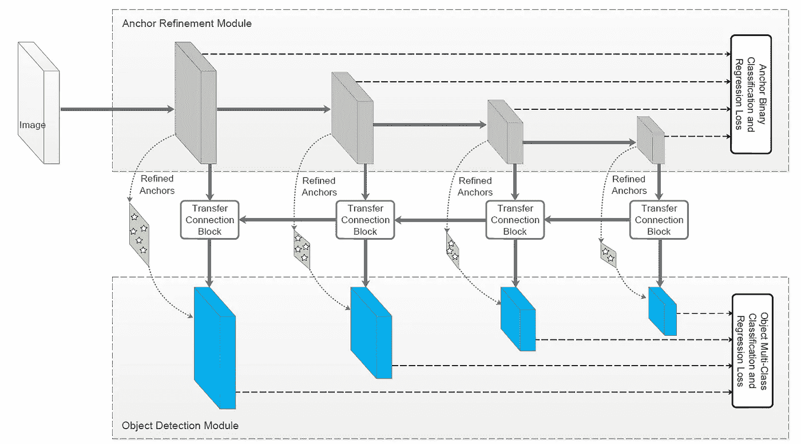

**RefineDet:网络架构**

*   与 [SSD](https://towardsdatascience.com/review-ssd-single-shot-detector-object-detection-851a94607d11?source=post_page---------------------------) 类似，RefineDet **产生固定数量的边界框** **和分数**来指示这些框中不同类别对象的存在，**之后是非最大抑制(NMS)** 来产生最终结果。
*   RefineDet 由两个相互连接的模块组成，即**锚点细化模块(ARM)** 和**对象检测模块(ODM)。**
*   ILSVRC CLS-LOC 预训练 [VGG](/coinmonks/paper-review-of-vggnet-1st-runner-up-of-ilsvlc-2014-image-classification-d02355543a11?source=post_page---------------------------) -16 和 [ResNet](https://towardsdatascience.com/review-resnet-winner-of-ilsvrc-2015-image-classification-localization-detection-e39402bfa5d8?source=post_page---------------------------) -101 作为主干。
*   (主干部分末尾有一些小的修改/细化，请随意看论文。)

## 1.1.两步级联回归

*   如前所述， **ARM 过滤掉负面锚点**以减少分类器的搜索空间，**粗略调整锚点的位置和大小。**
*   **ODM** 将提炼后的锚点作为 ARM 的输入，进一步 **r 改进回归**和**预测多类标签**。

## 1.2.锚的设计和匹配

*   **总步长为 8、16、32 和 64 像素的 4 个特征层**用于处理不同比例的对象。
*   每个要素层都与一个特定的锚定比例和 3 个纵横比相关联。
*   (本文与 [SSD](https://towardsdatascience.com/review-ssd-single-shot-detector-object-detection-851a94607d11?source=post_page---------------------------) 高度相关，有兴趣请阅读 [SSD](https://towardsdatascience.com/review-ssd-single-shot-detector-object-detection-851a94607d11?source=post_page---------------------------) 。)

# 2.一个 **nchor 细化模块(** ARM)

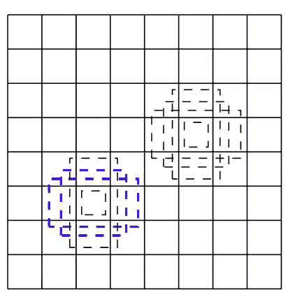

**[**SSD**](https://towardsdatascience.com/review-ssd-single-shot-detector-object-detection-851a94607d11?source=post_page---------------------------)中预定义的锚框**

*   **在 [SSD](https://towardsdatascience.com/review-ssd-single-shot-detector-object-detection-851a94607d11?source=post_page---------------------------) 中有预定义的锚盒，具有固定位置、比率和大小。(有兴趣请随意看 [SSD](https://towardsdatascience.com/review-ssd-single-shot-detector-object-detection-851a94607d11?source=post_page---------------------------) 。)**

> **ARM 的目的是**移除负锚点**以便**减少分类器的搜索空间**并且**粗略调整锚点**的位置和大小以便为后续回归器提供更好的初始化。**

*   **具体来说， ***n 个*锚框**与特征图上每个规则划分的单元相关联。**
*   **在每个特征映射单元，**预测细化锚框**的四个偏移。**
*   ****两个置信度得分**用于指示那些框中前景对象的存在。**

## **2.1.负锚过滤**

*   ****如果其负置信度大于预设阈值(即，经验上为 0.99)，则在训练 ODM 时丢弃锚盒。**很确定是后台。**
*   **因此，只有细化的硬负锚定框和细化的正锚定框被传递来训练 ODM。**

# ****3。对象检测模块(ODM)****

*   **在获得精化锚盒之后，精化锚盒被传递到 ODM 中的相应特征地图。**

> **ODM 的目标是**回归精确的对象位置**和**基于细化的锚点预测多类标签**。**

*   **具体来说，计算 ***c* 类得分**和 **4 个物体相对于精化锚盒的精确偏移量**，为每个精化锚盒产生 ***c* + 4 个输出，完成检测任务。****

## **3.1.硬负开采**

*   **硬负挖掘用于减轻极端的前景-背景类别不平衡。**
*   ****选择一些损失值最高的负锚盒，使负锚和正锚的比例低于 3 : 1** ，而不是使用所有的负锚或者在训练中随机选择负锚。**

# **4.**传输连接块(TCB)****

**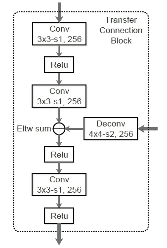**

****传输连接块(TCB)****

*   **TCB 将特征从 ARM 转换到 ODM 进行检测。**
*   **TCBs 是**通过将高层特征**添加到转移特征中来整合大规模上下文，以提高检测精度。**
*   **为了匹配它们之间的维度，**反卷积操作用于放大高级特征图**和**以元素方式对它们求和。****

# **5.损失函数和推理**

## **5.1.损失函数**

*   **因此，RefineDet 的损失函数由两部分组成，即**臂的损失**和**ODM 的损失**。**
*   **对于手臂，给每个锚点分配一个二进制类别标签(是否为对象),并同时回归其位置和大小以获得细化的锚点。**
*   **此后，具有小于阈值的负置信度的精炼锚被传递到 ODM，以进一步预测对象类别和准确的对象位置和大小。**
*   **损失函数是:**

**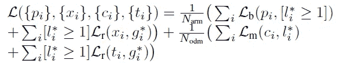**

*   **其中 ***Narm*** 和 ***Nodm*** 分别是 arm 和 ODM 中正锚的**号。****
*   ****二元分类损失 *Lb*** 是两个类(对象对非对象)的交叉熵/对数损失**
*   ****多类分类损失*Lm*是多类置信度上的软最大损失。****
*   **类似于[快速 R-CNN](/coinmonks/review-fast-r-cnn-object-detection-a82e172e87ba) ，平滑 L1 损耗被用作**回归损耗*Lr*。****
*   **[ *李* * ≥ 1]表示对负锚点忽略回归损失。**

## **5.2.推理**

*   **ARM 首先过滤掉负置信度得分大于阈值 0.99 的规则平铺锚。**
*   **ODM 接管这些改进的锚点，并输出每幅图像的前 400 个高置信度检测。**
*   **应用具有每类 0.45 的 jaccard 重叠的 NMS。**
*   **保留每幅图像的前 200 个高置信度检测，以产生最终的检测结果。**

# **6.实验结果**

## **6.1.消融研究**

**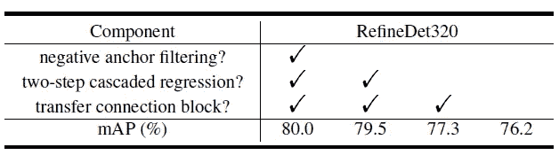**

****VOC 2007 测试集上各种设计的有效性****

*   **所有模型都在 VOC 2007 和 VOC 2012 trainval 集合上进行训练，并在 VOC 2007 测试集合上进行测试。**

> **在低维输入(即 320×320)的情况下，RefineDet 使用上述所有技术生成了 **80.0%的地图**，这是**第一个使用如此小的输入图像实现 80%以上地图的方法。****

## **6.2.PASCAL VOC 2007 和 2012**

**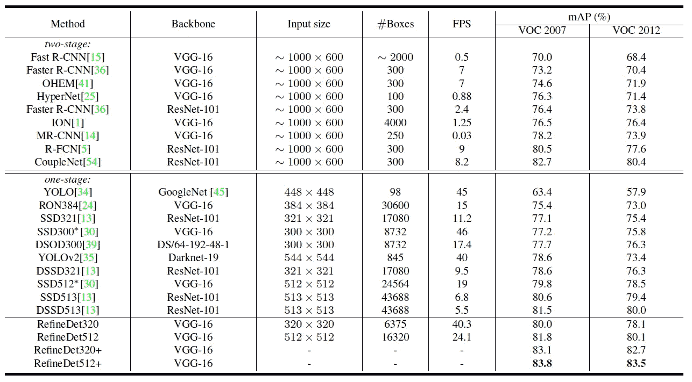**

****PASCAL VOC 2007 年& 2012 年**检测结果**

## **6.2.1.VOC 2007**

*   **在 VOC 2007 上，通过使用更大的输入尺寸 512×512，**refined 512**实现了 **81.8% mAP** ，超过了 [SSD](https://towardsdatascience.com/review-ssd-single-shot-detector-object-detection-851a94607d11?source=post_page---------------------------) 和 [DSSD](https://towardsdatascience.com/review-dssd-deconvolutional-single-shot-detector-object-detection-d4821a2bbeb5?source=post_page---------------------------) 。**
*   **与两阶段方法相比，RefineDet512 的性能优于除 [CoupleNet](https://sh-tsang.medium.com/review-couplenet-coupling-global-structure-with-local-parts-for-object-detection-object-d80150c5c850) 之外的大多数方法。**
*   ****通过多尺度测试策略，RefineDet 实现了 83.1%(refined t320+)和 83.8%(refined t512+)的映射**，比最先进的方法好得多。**
*   **RefineDet 在 **24.8ms (40.3 FPS)** 和 **41.5ms (24.1 FPS)** 中处理一幅图像，输入尺寸分别为 **320×320** 和 **512×512** 。**

> **RefineDet 是**第一个在 PASCAL VOC 2007 上实现 80%以上 mAP** 检测精度的实时方法。**

*   ****RefineDet 在特征图上关联更少的锚盒**(例如， [SSD](https://towardsdatascience.com/review-ssd-single-shot-detector-object-detection-851a94607d11?source=post_page---------------------------) 512 中的 24564 个锚盒与 RefineDet512 中的 16320 个锚盒相比)。**
*   **只有 [YOLOv1](https://towardsdatascience.com/yolov1-you-only-look-once-object-detection-e1f3ffec8a89?source=post_page---------------------------) 和 [SSD](https://towardsdatascience.com/review-ssd-single-shot-detector-object-detection-851a94607d11?source=post_page---------------------------) 300 比 RefineDet320 略快，但精度比 RefineDet 差 16.6%和 2.5%。**

**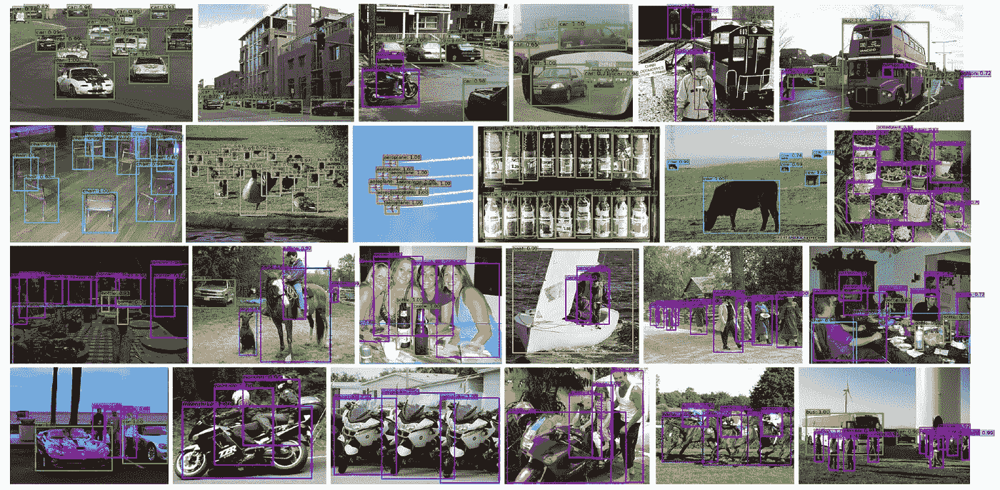**

****refined 512 在 PASCAL VOC 2007 测试集上的定性结果****

## **6.2.2.VOC 2012**

*   **对于 VOC 2012，所有方法都在 VOC 2007 和 VOC 2012 trainval 集合加上 VOC 2007 测试集合上训练，并在 VOC 2012 测试集合上测试。**
*   ****refined t320**获得最高 **78.1%的 mAP** ，这**甚至优于大多数那些使用大约 1000×600 输入大小的两阶段方法**。**
*   **使用输入尺寸 **512×512** ，RefineDet 将 mAP 提高到 **80.1%** ，超过所有一阶段方法的**，仅略低于 [CoupleNet](https://sh-tsang.medium.com/review-couplenet-coupling-global-structure-with-local-parts-for-object-detection-object-d80150c5c850) 。****
*   **通过多尺度测试，RefineDet 获得了 82.7%(refined t320+)和 83.5%(refined t512+)的最新地图。**

**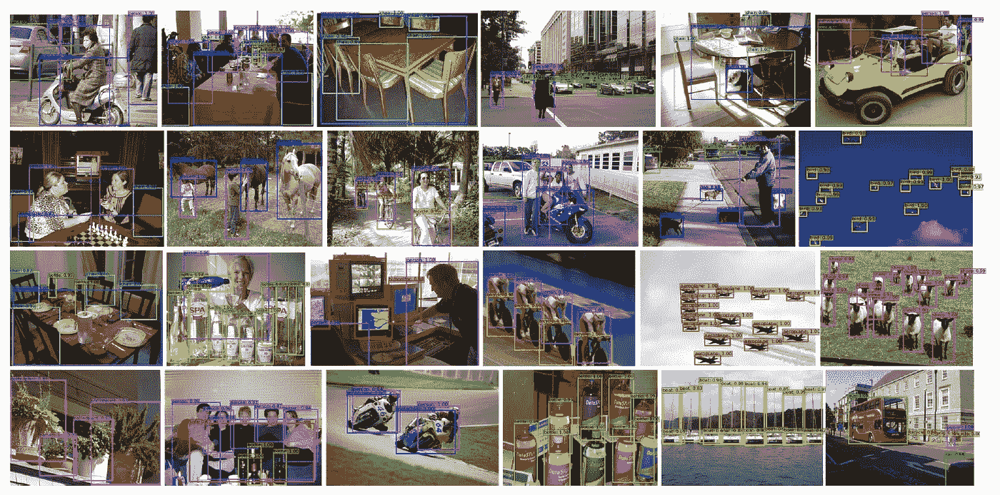**

****refined 512 在 PASCAL VOC 2012 测试集上的定性结果****

## **6.3.可可女士**

**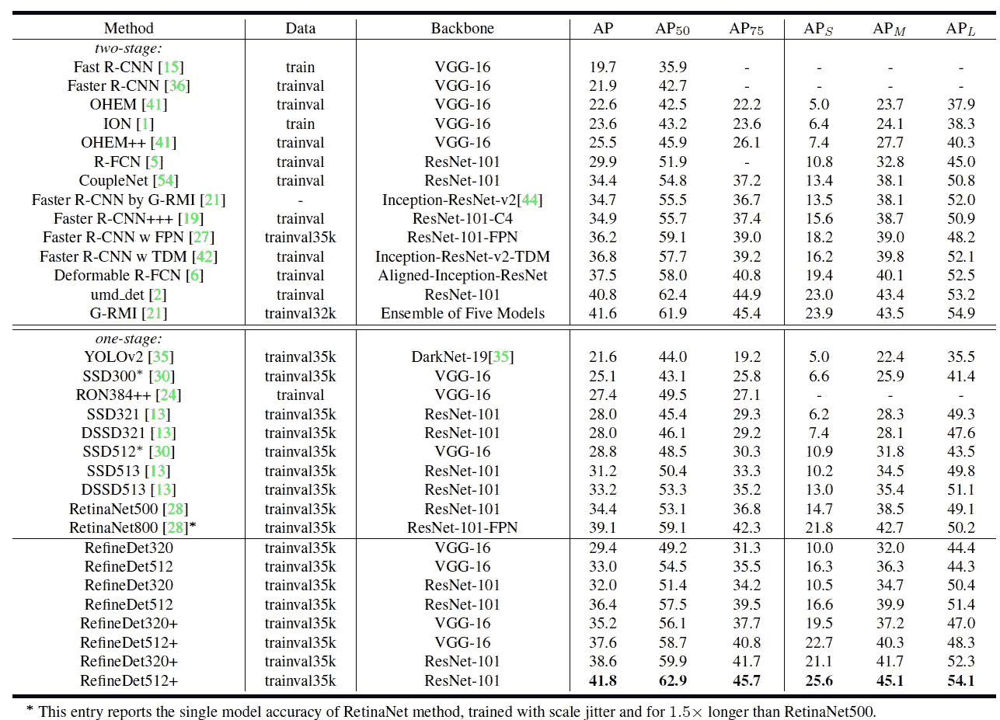**

****在 MS COCO 测试开发装置上的检测结果****

*   **这里也使用了基于 ResNet -101 的 RefineDet。**
*   **trainval35k 集用于训练，结果由测试开发评估服务器进行评估。**
*   ****用** [**VGG**](/coinmonks/paper-review-of-vggnet-1st-runner-up-of-ilsvlc-2014-image-classification-d02355543a11?source=post_page---------------------------) **-16 提炼出的 t320 产生了 29.4%的 AP** ，优于所有其他基于 [VGG](/coinmonks/paper-review-of-vggnet-1st-runner-up-of-ilsvlc-2014-image-classification-d02355543a11?source=post_page---------------------------) -16 的方法(例如 [SSD](https://towardsdatascience.com/review-ssd-single-shot-detector-object-detection-851a94607d11?source=post_page---------------------------) 512 和 [OHEM](https://sh-tsang.medium.com/review-ohem-training-region-based-object-detectors-with-online-hard-example-mining-object-ad791ad87612) ++)。**
*   ****refined t320 与**[**ResNet**](https://towardsdatascience.com/review-resnet-winner-of-ilsvrc-2015-image-classification-localization-detection-e39402bfa5d8?source=post_page---------------------------)**-101 达到 32.0% AP，RefineDet512 达到 36.4% AP，超过了除 [TDM](/datadriveninvestor/review-tdm-top-down-modulation-object-detection-3f0efe9e0151?source=post_page---------------------------) 、可变形 R-FCN ( [DCN](https://towardsdatascience.com/review-dcn-deformable-convolutional-networks-2nd-runner-up-in-2017-coco-detection-object-14e488efce44?source=post_page---------------------------) )、 [RetinaNet](https://towardsdatascience.com/review-retinanet-focal-loss-object-detection-38fba6afabe4?source=post_page---------------------------) 800、umd_det、 [G-RMI](https://towardsdatascience.com/review-g-rmi-winner-in-2016-coco-detection-object-detection-af3f2eaf87e4?source=post_page---------------------------) 之外的大多数检测方法**所有这些方法都使用大得多的输入图像进行训练和测试。**

> **通过多尺度测试，RefineDet 的最佳性能为 41.8%，这是最先进的，超过了所有已发表的两阶段和一阶段方法。**

**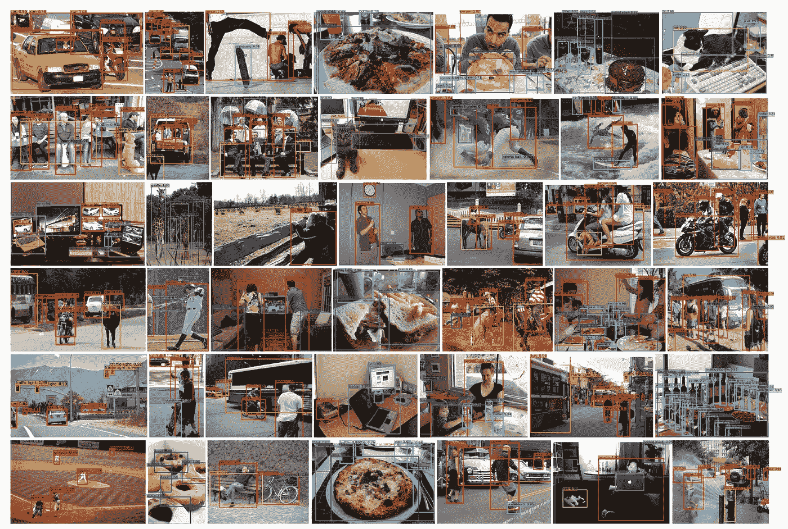**

****MS COCO 测试开发装置上 RefineDet512 的定性结果****

## **6.4.针对 PASCAL VOC 微调 MS COCO 模型**

**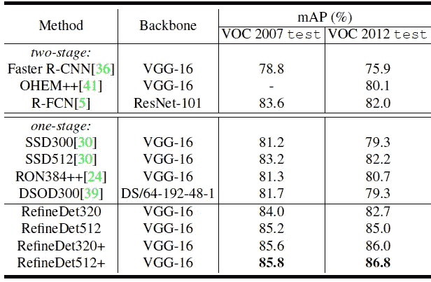**

****PASCAL VOC 数据集上的检测结果****

*   **通过微调在 MS COCO 上预训练的检测模型，RefineDet 在 **VOC 2007 测试集**上实现了 84.0% mAP(refined t320)和**85.2% mAP**(**refined t512**)，在 **VOC 2012 测试上实现了 82.7% mAP(refined t320)和**85.0% mAP**(**refined t512**)****
*   **使用**多尺度测试**后，检测准确率分别提升至 85.6%、85.8%、86.0%和 **86.8%** 。**

> **基于 [VGG](/coinmonks/paper-review-of-vggnet-1st-runner-up-of-ilsvlc-2014-image-classification-d02355543a11?source=post_page---------------------------) -16 的单一型号 RefineNet512+目前在 VOC 2012 排行榜上排名前五。**

## **参考**

**【2018 CVPR】【RefineDet】
[单镜头细化神经网络用于物体检测](https://arxiv.org/abs/1711.06897)**

## **目标检测**

****2014** : [ [过食](/coinmonks/review-of-overfeat-winner-of-ilsvrc-2013-localization-task-object-detection-a6f8b9044754?source=post_page---------------------------)][[R-CNN](/coinmonks/review-r-cnn-object-detection-b476aba290d1?source=post_page---------------------------)]
**2015**:[[快 R-CNN](/coinmonks/review-fast-r-cnn-object-detection-a82e172e87ba) ] [ [快 R-CNN](https://towardsdatascience.com/review-faster-r-cnn-object-detection-f5685cb30202?source=post_page---------------------------)][[MR-CNN&S-CNN](https://towardsdatascience.com/review-mr-cnn-s-cnn-multi-region-semantic-aware-cnns-object-detection-3bd4e5648fde?source=post_page---------------------------)][[DeepID-Net](https://towardsdatascience.com/review-deepid-net-def-pooling-layer-object-detection-f72486f1a0f6?source=post_page---------------------------)
**2016 [[GBD-网/GBD-v1&GBD-v2](https://towardsdatascience.com/review-gbd-net-gbd-v1-gbd-v2-winner-of-ilsvrc-2016-object-detection-d625fbeadeac?source=post_page---------------------------)][[SSD](https://towardsdatascience.com/review-ssd-single-shot-detector-object-detection-851a94607d11?source=post_page---------------------------)][[yolov 1](https://towardsdatascience.com/yolov1-you-only-look-once-object-detection-e1f3ffec8a89?source=post_page---------------------------)
**2017**:[[NoC](/datadriveninvestor/review-noc-winner-in-2015-coco-ilsvrc-detection-object-detection-d5cc84e372a?source=post_page---------------------------)][[G-RMI](https://towardsdatascience.com/review-g-rmi-winner-in-2016-coco-detection-object-detection-af3f2eaf87e4?source=post_page---------------------------)][[TDM](/datadriveninvestor/review-tdm-top-down-modulation-object-detection-3f0efe9e0151?source=post_page---------------------------)[[DSSD](https://towardsdatascience.com/review-dssd-deconvolutional-single-shot-detector-object-detection-d4821a2bbeb5?source=post_page---------------------------)[[yolov 2/yolo 9000] [couple net](https://sh-tsang.medium.com/review-couplenet-coupling-global-structure-with-local-parts-for-object-detection-object-d80150c5c850)]
**2018**:[[yolov 3](https://towardsdatascience.com/review-yolov3-you-only-look-once-object-detection-eab75d7a1ba6?source=post_page---------------------------)][[Cascade R-CNN](/@sh.tsang/reading-cascade-r-cnn-delving-into-high-quality-object-detection-object-detection-8c7901cc7864)][[MegDet](/towards-artificial-intelligence/reading-megdet-a-large-mini-batch-object-detector-1st-place-of-coco-2017-detection-challenge-e82072e9b7f)][[stair net](/@sh.tsang/reading-stairnet-top-down-semantic-aggregation-object-detection-de689a94fe7e)][[refined et](https://sh-tsang.medium.com/review-refinedet-single-shot-refinement-neural-network-for-object-detection-object-detection-5fc483449562)
**2019******

## **[我以前的其他论文阅读材料](https://sh-tsang.medium.com/overview-my-reviewed-paper-lists-tutorials-946ce59fbf9e)**