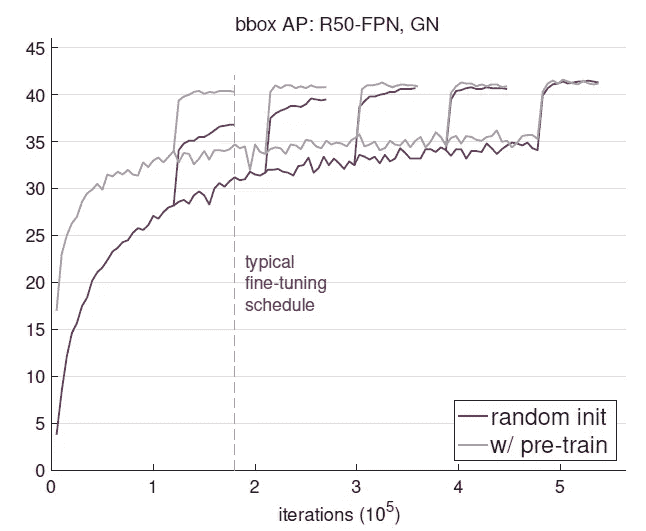
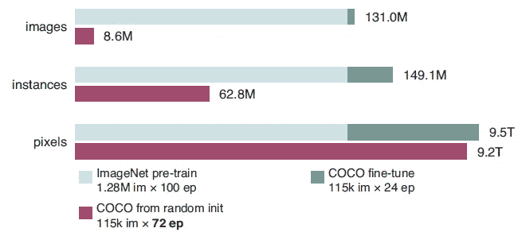
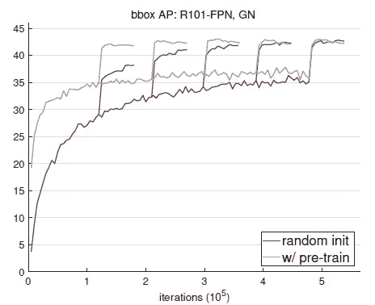
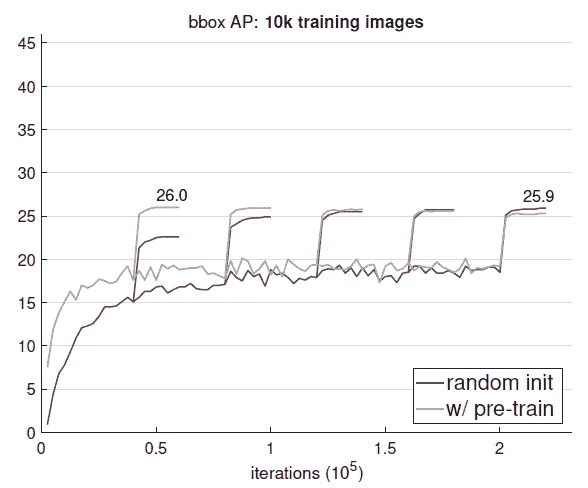

# 回顾—重新思考 ImageNet 预培训(对象检测、语义分割)

> 原文：<https://medium.com/nerd-for-tech/review-rethinking-imagenet-pre-training-image-classification-object-detection-semantic-683f6575a2be?source=collection_archive---------2----------------------->

## 从头开始培训不比 ImageNet 预培训差

**模型，**[**ResNet**](https://towardsdatascience.com/review-resnet-winner-of-ilsvrc-2015-image-classification-localization-detection-e39402bfa5d8?source=post_page---------------------------)**50-**[**FPN**](https://towardsdatascience.com/review-fpn-feature-pyramid-network-object-detection-262fc7482610?source=post_page---------------------------)**使用** [**GN**](https://sh-tsang.medium.com/review-group-norm-gn-group-normalization-image-classification-5f7fe0f58eb6) **，从随机初始化训练出来的需要更多的迭代才能收敛，但收敛到的解并不比微调对应的差。**

在这个故事里，简单回顾了脸书 AI Research (FAIR)的**反思 ImageNet 前期培训**。

> 许多论文都是从零开始进行预培训，而不是培训。然而，预先训练好的知识转移到其他计算机视觉任务中真的有用吗？

在这个故事中，发现了一些事实:

*   **来自随机初始化的训练惊人地健壮**，即使在以下情况下，结果仍然成立:(I)仅使用 10%的训练数据，(ii)用于更深更广的模型，以及(iii)用于多个任务和指标。
*   **ImageNet 预训练**在训练初期加速收敛，但**不一定提供正则化或提高最终目标任务精度**。

这是一篇发表在 **2019 ICCV** 的论文，被引用超过 **350 次**。( [Sik-Ho Tsang](https://medium.com/u/aff72a0c1243?source=post_page-----683f6575a2be--------------------------------) @中)

(实验设置上有很多细节，让实验公平。为了使故事简短，我会跳过一些细节和结果。如果有兴趣，请随时访问该文件。)

# 概述

1.  **训练图像数量&设置**
2.  **从零开始训练，以匹配准确度**
3.  **用较少的数据从零开始训练**
4.  **讨论**

# 1.训练图像和设置的数量

## 1.1.涉及的训练图像数量

**在所有训练迭代期间看到的图像、实例和像素的总数，用于预训练+微调(绿色条)与随机初始化(紫色条)。**

*   **典型的 ImageNet 预训练** **涉及超过一百万幅图像**迭代一百个时期。除了从这种大规模数据中学习任何语义信息之外，**预训练模型还学习了低级特征。**
*   另一方面，**当从头开始训练**时，模型必须学习低级和高级语义，因此**可能需要更多迭代**才能很好地收敛。
*   如上所示，**如果计算图像级样本，从头开始的情况比其微调对应的情况看到的样本少得多。**
*   实际上，如果我们计算像素级样本，样本数只会更接近。

## 1.2.设置

*   [用](/analytics-vidhya/review-mask-r-cnn-instance-segmentation-human-pose-estimation-61080a93bf4) [ResNet](https://towardsdatascience.com/review-resnet-winner-of-ilsvrc-2015-image-classification-localization-detection-e39402bfa5d8?source=post_page---------------------------) 屏蔽 R-CNN ，用 [ResNeXt](https://towardsdatascience.com/review-resnext-1st-runner-up-of-ilsvrc-2016-image-classification-15d7f17b42ac?source=post_page---------------------------) 加特征金字塔网络( [FPN](https://towardsdatascience.com/review-fpn-feature-pyramid-network-object-detection-262fc7482610?source=post_page---------------------------) )主干。
*   GN /SyncBN 用于替换所有‘冻结 BN’。SyncBN 就是在多个 GPU 下使用 BN。
*   用 **90k 迭代**(即， **1×调度**’)或 **180k 迭代**(‘**2×调度**’)将模型微调为所谓的“ **6×** **调度**”，其中有 **540k 迭代**。

# 2.从头开始训练以匹配准确度

**在 COCO val2017 上学习 APbbox 的曲线使用** [**遮罩 R-CNN**](/analytics-vidhya/review-mask-r-cnn-instance-segmentation-human-pose-estimation-61080a93bf4) **用 R101-**[**FPN**](https://towardsdatascience.com/review-fpn-feature-pyramid-network-object-detection-262fc7482610?source=post_page---------------------------)**和** [**GN**](https://sh-tsang.medium.com/review-group-norm-gn-group-normalization-image-classification-5f7fe0f58eb6)

*   **典型的微调时间表(2×)适用于预训练模型**以接近最优。**但是这些时间表对于从零开始训练的模特**来说是不够的，如果只是短期训练就显得逊色了。

> 如果使用 5 倍或 6 倍的时间表，从零开始训练的模型可以赶上它们的微调对应物。当它们收敛到一个最优值时，它们的检测 AP 不会比它们的微调对应物差。

# 3.用更少的数据从头开始训练

**10k COCO 图像训练**

*   使用 10k COCO 图像的较小训练集(即，小于完整 COCO 集的 1/10)。
*   有预训练的模型，60k 迭代达到 26.0 AP，但训练多了有轻微退化。

> 从零开始训练的对应模型在 220k 迭代时具有 25.9 AP，这是相对准确的。

# **4。讨论**

*   以上实验也引发了作者的以下讨论。

## 4.1.ImageNet 前期培训有必要吗？

*   **不**，如果我们有足够的目标数据。
*   这表明**收集目标数据的注释(而不是预训练数据)对于提高目标任务性能更有用**。

## 4.2.ImageNet 有用吗？

*   **是**。
*   ImageNet 预训练缩短了研究周期，**更容易获得令人鼓舞的结果，**和**从预训练权重进行微调比从头开始收敛更快。**

## 4.3.大数据有帮助吗？

*   **是**。
*   但是，如果我们考虑到收集和清理数据的额外工作，一个通用的大规模、分类级别的预训练集**并不理想。**
*   如果大规模分类级预训练的增益成指数递减，**在目标域中收集数据将更有效。**

## 4.4.我们应该追求普遍代表性吗？

*   **是的。**
*   作者认为**学习普遍表象是一个值得称赞的目标。**
*   这项研究表明，社区在评估预先训练的特征时应该更加小心。

## 参考

【2019 ICCV】【反思 ImageNet 预训】
[反思 ImageNet 预训](https://arxiv.org/abs/1811.08883)

## 目标检测

**2014** : [ [过食](/coinmonks/review-of-overfeat-winner-of-ilsvrc-2013-localization-task-object-detection-a6f8b9044754?source=post_page---------------------------)][[R-CNN](/coinmonks/review-r-cnn-object-detection-b476aba290d1?source=post_page---------------------------)]
**2015**:[[快 R-CNN](/coinmonks/review-fast-r-cnn-object-detection-a82e172e87ba?source=post_page---------------------------) ] [ [快 R-CNN](https://towardsdatascience.com/review-faster-r-cnn-object-detection-f5685cb30202?source=post_page---------------------------)][[MR-CNN&S-CNN](https://towardsdatascience.com/review-mr-cnn-s-cnn-multi-region-semantic-aware-cnns-object-detection-3bd4e5648fde?source=post_page---------------------------)][[DeepID-Net](https://towardsdatascience.com/review-deepid-net-def-pooling-layer-object-detection-f72486f1a0f6?source=post_page---------------------------)
**2016 **GBD-v1&GBD-v2[[SSD](https://towardsdatascience.com/review-ssd-single-shot-detector-object-detection-851a94607d11?source=post_page---------------------------)][[yolov 1](https://towardsdatascience.com/yolov1-you-only-look-once-object-detection-e1f3ffec8a89?source=post_page---------------------------)
**2017**:[[NoC](/datadriveninvestor/review-noc-winner-in-2015-coco-ilsvrc-detection-object-detection-d5cc84e372a?source=post_page---------------------------)][[G-RMI](https://towardsdatascience.com/review-g-rmi-winner-in-2016-coco-detection-object-detection-af3f2eaf87e4?source=post_page---------------------------)][[TDM](/datadriveninvestor/review-tdm-top-down-modulation-object-detection-3f0efe9e0151?source=post_page---------------------------)][[DSSD](https://towardsdatascience.com/review-dssd-deconvolutional-single-shot-detector-object-detection-d4821a2bbeb5?source=post_page---------------------------)[[yolov 2/yolo 9000](https://towardsdatascience.com/review-yolov2-yolo9000-you-only-look-once-object-detection-7883d2b02a65?source=post_page---------------------------)] [[Cascade R-CNN](/@sh.tsang/reading-cascade-r-cnn-delving-into-high-quality-object-detection-object-detection-8c7901cc7864)][[MegDet](/towards-artificial-intelligence/reading-megdet-a-large-mini-batch-object-detector-1st-place-of-coco-2017-detection-challenge-e82072e9b7f)][[stair net](/@sh.tsang/reading-stairnet-top-down-semantic-aggregation-object-detection-de689a94fe7e)]
**2019**:[[DCN v2](/towards-artificial-intelligence/review-dcnv2-deformable-convnets-v2-object-detection-instance-segmentation-3d8a18bee2f5)][[反思 ImageNet 前期培训](https://sh-tsang.medium.com/review-rethinking-imagenet-pre-training-image-classification-object-detection-semantic-683f6575a2be) ]****

## 实例分割

**2014–2015**:[[SDS](/datadriveninvestor/review-sds-simultaneous-detection-and-segmentation-instance-segmentation-80b2a8ce842b?source=post_page---------------------------)][[Hypercolumn](https://towardsdatascience.com/review-hypercolumn-instance-segmentation-367180495979?source=post_page---------------------------)][[deep Mask](https://towardsdatascience.com/review-deepmask-instance-segmentation-30327a072339?source=post_page---------------------------)
**2016**:[[sharp Mask](https://towardsdatascience.com/review-sharpmask-instance-segmentation-6509f7401a61?source=post_page---------------------------)][[multipath net](https://towardsdatascience.com/review-multipath-mpn-1st-runner-up-in-2015-coco-detection-segmentation-object-detection-ea9741e7c413?source=post_page---------------------------)][[MNC](https://towardsdatascience.com/review-mnc-multi-task-network-cascade-winner-in-2015-coco-segmentation-instance-segmentation-42a9334e6a34?source=post_page---------------------------)][[instance fcn](https://towardsdatascience.com/review-instancefcn-instance-sensitive-score-maps-instance-segmentation-dbfe67d4ee92?source=post_page---------------------------)
**2017【T21**

## [我以前的其他论文阅读材料](https://sh-tsang.medium.com/overview-my-reviewed-paper-lists-tutorials-946ce59fbf9e)