# 综述— SEFCNN:一种用于视频编码中环路滤波的可切换深度学习方法(HEVC 滤波)

> 原文：<https://medium.com/nerd-for-tech/review-sefcnn-a-switchable-deep-learning-approach-for-in-loop-filtering-in-video-coding-hevc-ebaff10dd535?source=collection_archive---------11----------------------->

## 用网络概念 [VDSR](https://towardsdatascience.com/review-vdsr-super-resolution-f8050d49362f?source=post_page---------------------------) 和[SENet](https://towardsdatascience.com/review-senet-squeeze-and-excitation-network-winner-of-ilsvrc-2017-image-classification-a887b98b2883?source=post_page---------------------------)**，**胜过 [VRCNN](/@sh.tsang/review-vrcnn-variable-filter-size-residue-learning-cnn-codec-post-processing-4a8a337ea73c) ， [RHCNN](/@sh.tsang/review-rhcnn-residual-highway-convolutional-neural-network-codec-post-processing-f9b617795a61) ，和 [MLSDRN](/@sh.tsang/review-mlsdrn-multi-channel-long-short-term-dependency-residual-network-codec-filtering-d97537ca8e45)

在这篇论文中，**对杭州师范大学、Visionular Inc .和长安大学提出的用于视频编码中的环路内滤波的可切换深度学习方法**(SEFCNN)进行了评述。在本文中:

*   **挤压激励滤波 CNN**，设计有两个子网:**特征提取(FEX)子网**和**特征增强(FEN)子网**。
*   **针对不同类型的帧**，使用 FEX 和分**训练不同的模型**。
*   最后，**提出了一种自适应增强机制**，该机制**可在基于 CNN 的方法和传统方法**之间切换。

这是 **2020 TCVST** 中的一篇论文，其中 TCVST 的**高影响因子为 4.133** 。( [Sik-Ho Tsang](https://medium.com/u/aff72a0c1243?source=post_page-----ebaff10dd535--------------------------------) @中)

# 概述

1.  **SEFCNN:网络架构**
2.  **模型训练策略**
3.  **实验结果**

# **1。SEFCNN:网络架构**

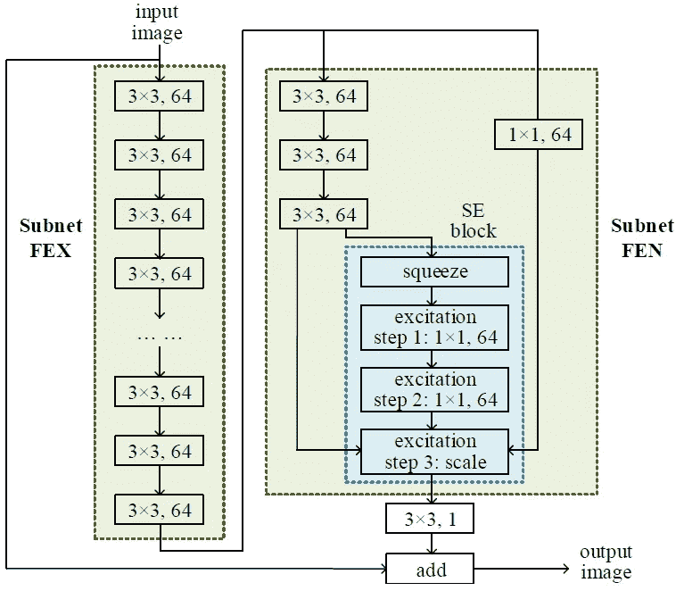

**SEFCNN:网络架构**

*   在 H.265/HEVC 中，SEFCNN 是一个可选的环路滤波器。
*   SEFCNN 由两个子网组成，即低层特征提取(FEX)网和高层特征增强(FEN)网。
*   **每个子网都可以单独调用和训练。**
*   **长同一性跳跃连接**然后被直接添加到残差以生成输出图像。

## 1.1.子网 FEX

*   该网络的灵感来自于 [VDSR](https://towardsdatascience.com/review-vdsr-super-resolution-f8050d49362f?source=post_page---------------------------) 的成功。
*   输入数据**经过 *N* 叠加层**转换成高级特征。
*   对于每个卷积层，我们将内核大小设置为 3×3，并使用 64 个滤波器。

## 1.2.子网 FEN

*   在 FEN 中，左分支用于剩余学习，右分支用作跳过连接。
*   在左分支的开始，3 个卷积层被级联以获得信道的高级特征。
*   然后，执行源于 [**SENet**](https://towardsdatascience.com/review-senet-squeeze-and-excitation-network-winner-of-ilsvrc-2017-image-classification-a887b98b2883?source=post_page---------------------------) 的**挤压激励(SE)模块**，以进一步增强网络的代表性。
*   因此，它包括两个步骤，挤压和激励。
*   通过对输入 *U* 应用全局平均池(GAP)来采用挤压步骤:

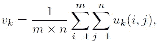

*   接下来，激励过程被设计成通过调整有用通道的相应权重参数来强调有用通道。2 卷积层首先被引入用于非线性映射。

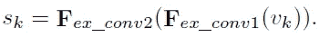

*   最后，输入 *U* 的每个通道由 *sk* 进行加权和重新校准。

> **SE 块可以有效整理和强化信息丰富的特征图。**

*   (如果有兴趣，请随时访问 [SENet](https://towardsdatascience.com/review-senet-squeeze-and-excitation-network-winner-of-ilsvrc-2017-image-classification-a887b98b2883?source=post_page---------------------------) 。)
*   最后，添加正确的分支:

*   其中 *bk* 通过 1×1 卷积计算。

# **2。模型训练策略**

## 2.1.不同 QP 的特定型号

*   具有较高 QP 的重建帧通常质量较低，并且包含更多伪像。
*   换句话说，不同的模型被训练用于不同的 QP 水平。

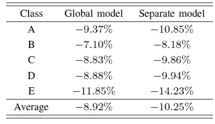

**BD-率(%)**

*   **全球模型**:所有 qp 的一个模型。
*   **独立车型**:一个车型对应一个 QP，优于全球车型。

## 2.2.不同 QP 的分级 CNN 结构

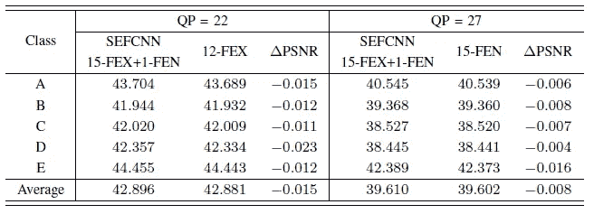

**BD-比率(%)**

*   简而言之，根据上述结果，在**高比特率场景**中 **QP 等于 22 或 27，仅涉及子网 FEX。**
*   在**低比特率场景**，其中 **QP 等于 32 或 37，启动整个 SEFCNN。**
*   相对于 SEFCNN，子网 FEX 具有更少的层数和参数，有效地降低了计算负担。

## 2.3.不同帧类型的分层 CNN 模型

*   I 帧的特点是纹理和方向。
*   相反，**从运动估计中获得 P 和 B 帧的预测样本。**
*   除了预测值，**I、P 和 B 帧的残差值也具有不同的特征**，因为不同的帧类型在前向/反向变换和量化过程中采用不同的编码工具。显然，它们在环路滤波问题上的拟合函数是不同的。

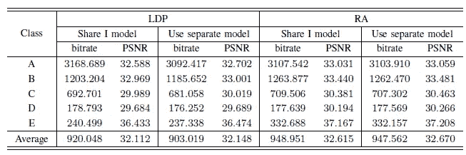

**QP 37 的比特率和 PSNR**

*   **为 P 帧训练单独的模型实现了平均 0.036 dB 的 PSNR 增益**和**，相应的比特率降低了 1.851%** ，而对于 **B 帧**，**增益为 0.055 dB，比特率也略有下降。**

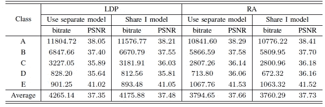

**QP 27 的比特率和 PSNR**

*   在 QP = 27 时，共享单一模型更好。

> **当 QP 37 或 32 岁时，为了追求更高的性能，为每种镜架类型训练了一个单独的模特。当 QP 是 27 或 22 时，I 模型在 I、P 和 B 帧之间共享。**

## 2.4.CU 级可切换增强

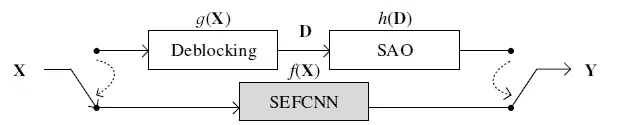

**CU 级可切换增强**

*   基本思想仅仅是增强将来很少被参考的帧或者帧内预测样本没有被增强的区域。
*   **sef CNN 的使用取决于各种配置下帧顺序中的相对时间位置。** SEFCNN 基于大量结果启用。更多细节请参考论文。

# **3。实验结果**

## 3.1.与 [VRCNN](/@sh.tsang/review-vrcnn-variable-filter-size-residue-learning-cnn-codec-post-processing-4a8a337ea73c) 的比较

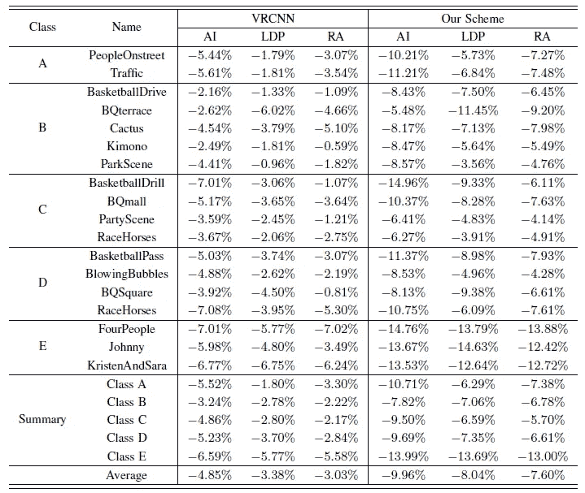

**BD-率(%)**

*   **在 AI 配置中，SEFCNN 获得了 9.96%的 BD-rate 降低，而**[**VR CNN**](/@sh.tsang/review-vrcnn-variable-filter-size-residue-learning-cnn-codec-post-processing-4a8a337ea73c)**只有 3.03%的增益。**
*   对于帧间编码，SEFCNN 实现了 8.04%和 7.60%的 BD-rate 减少，并且 [VRCNN](/@sh.tsang/review-vrcnn-variable-filter-size-residue-learning-cnn-codec-post-processing-4a8a337ea73c) 的对应值在 LDP 和 RA 中分别是 3.38%和 4.85%。

## 3.2.与 [RHCNN](/@sh.tsang/review-rhcnn-residual-highway-convolutional-neural-network-codec-post-processing-f9b617795a61) 的比较

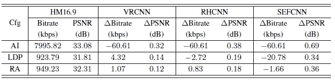

**QP 的比特率和 PSNR = 37**

*   **SEFCNN 比** [**RHCNN**](/@sh.tsang/review-rhcnn-residual-highway-convolutional-neural-network-codec-post-processing-f9b617795a61) 分别高出 0.306 dB、0.154 dB、0.181 dB，更别提比特率的降低了。

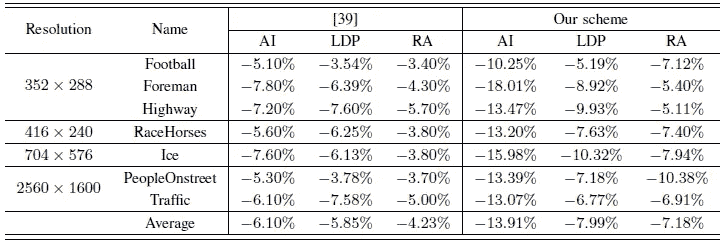

**使用 HM-12.0 的 BD-Rate(%)**

*   同样，提出的 SEFCNN 优于 RHCNN。

## 3.3.与 [MLSDRN](/@sh.tsang/review-mlsdrn-multi-channel-long-short-term-dependency-residual-network-codec-filtering-d97537ca8e45) 的比较

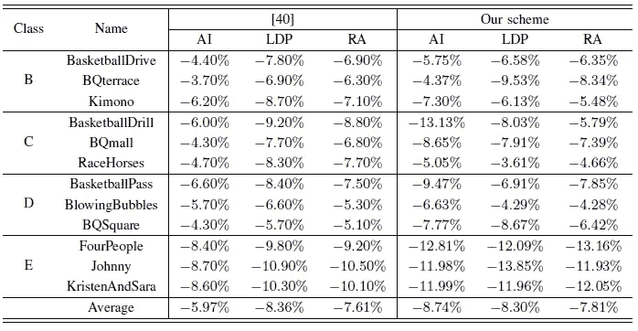

**使用 HM-7.0 的 BD-速率(%)**

*   再次，提出的 **SEFCNN 优于**[**MLSDRN**](/@sh.tsang/review-mlsdrn-multi-channel-long-short-term-dependency-residual-network-codec-filtering-d97537ca8e45)【40】。

## 3.4.复杂性分析

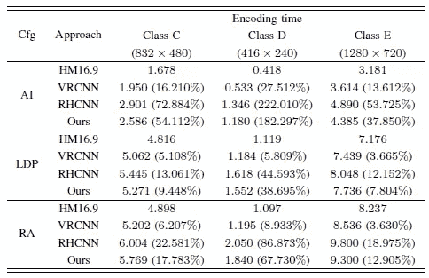

**编码器复杂度分析**

*   在低视频分辨率下，如 416×240，SEFCNN 的编码时间不超过 HM16.9 的两倍。
*   **当视频分辨率提高到 1280×720 时，帧内和帧间编码的额外运行时间分别不超过 38%和 19%。**

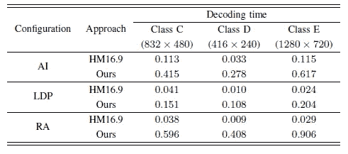

**解码器复杂度分析**

*   还有如上所述的解码时间测量。

文中有大量的实验。如果有兴趣，请随时访问该文件。

## 参考

【2020 TCS vt】【sef CNN】
[一种用于视频编码中环路内滤波的可切换深度学习方法](https://ieeexplore.ieee.org/document/8801877)

## 编解码器过滤

)(我)(们)(都)(不)(知)(道)(,)(我)(们)(还)(不)(能)(说)(什)(么)(话)(,)(我)(们)(还)(不)(能)(说)(出)(什)(么)(话)(,)(我)(们)(还)(不)(能)(说)(出)(什)(么)(话)(,)(我)(们)(还)(不)(能)(说)(什)(么)(,)(我)(们)(还)(不)(能)(说)(什)(么)(,)(我)(们)(还)(不)(能)(说)(什)(么)(,)(我)(们)(还)(不)(能)(说)(什)(么)(,)(我)(们)(还)(不)(能)(说)(什)(么)(。 )(他)(们)(都)(不)(在)(这)(些)(事)(上)(,)(她)(们)(还)(不)(在)(这)(些)(事)(上)(有)(什)(么)(情)(况)(呢)(?)(她)(们)(都)(不)(在)(这)(些)(情)(况)(下)(,)(她)(们)(还)(不)(在)(这)(些)(事)(上)(有)(什)(么)(情)(况)(吗)(,)(她)(们)(还)(有)(什)(么)(情)(况)(呢)(?)(她)(们)(们)(都)(不)(在)(这)(些)(事)(上)(,)(她)(们)(们)(还)(没)(有)(什)(么)(好)(的)(情)(情)(感)(。 )(他)(们)(都)(不)(在)(这)(些)(事)(上)(,)(她)(们)(还)(不)(在)(这)(些)(事)(上)(有)(什)(么)(情)(况)(?)(她)(们)(都)(不)(在)(这)(些)(事)(上)(有)(什)(么)(情)(况)(吗)(?)(她)(们)(都)(不)(在)(这)(些)(事)(上)(有)(什)(么)(情)(况)(,)(她)(们)(还)(有)(什)(么)(情)(况)(呢)(?)(她)(们)(们)(都)(不)(在)(这)(些)(事)(上)(,)(她)(们)(们)(还)(没)(有)(什)(么)(好)(好)(的)(情)(感)(。 )(我)(们)(都)(不)(知)(道)(,)(我)(们)(还)(不)(知)(道)(,)(我)(们)(还)(有)(些)(不)(知)(道)(的)(情)(况)(,)(我)(们)(还)(不)(知)(道)(,)(我)(们)(还)(不)(知)(道)(,)(我)(们)(还)(有)(些)(不)(知)(道)(的)(情)(况)(。

## [我以前的其他论文阅读材料](https://sh-tsang.medium.com/overview-my-reviewed-paper-lists-tutorials-946ce59fbf9e)