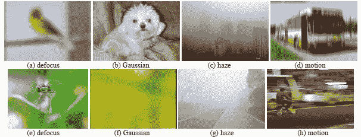
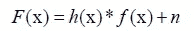
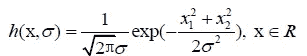
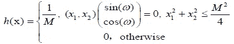
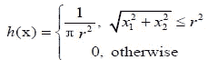
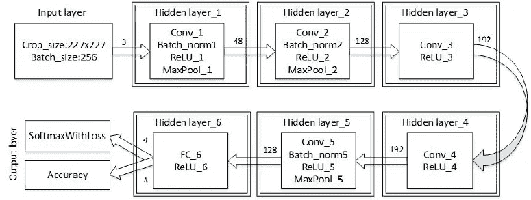
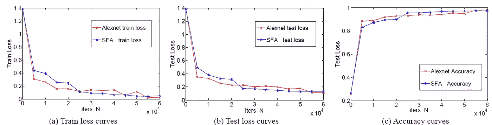
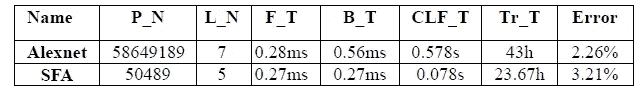
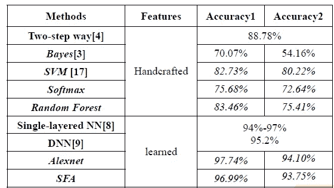

# 回顾 SFA:简化-快速-AlexNet(模糊分类)

> 原文：<https://medium.com/nerd-for-tech/review-sfa-simplified-fast-alexnet-blur-classification-4121e6d813f9?source=collection_archive---------13----------------------->

## 使用简化的 [AlexNet](/coinmonks/paper-review-of-alexnet-caffenet-winner-in-ilsvrc-2012-image-classification-b93598314160?source=post_page---------------------------) 进行模糊图像分类

**模糊图像样本**

在这个故事里，**基于深度学习的模糊图像分类**，(SFA)，被回顾。在本文中:

*   **简化-快速-AlexNet (SFA)** 设计用于分类图像是否被**散焦模糊**、**高斯模糊**、**模糊**或**运动模糊**模糊。

这是 **2017 IST** 的一篇论文。([曾植和](https://medium.com/u/aff72a0c1243?source=post_page-----4121e6d813f9--------------------------------) @中)

# 概述

1.  **图像模糊建模的简要概述**
2.  **简化快速 AlexNet (SFA):网络架构**
3.  **数据集**
4.  **实验结果**

# **1。图像模糊建模概述**

*   图像模糊问题可视为从高质量图像到低质量模糊图像的**图像退化过程**:

*   其中 *F* 表示退化图像， *f* 为无损图像， ***h*** 备注**模糊核**又名**点扩散函数**，*表示卷积算子， *n* 表示附加噪声，这里 *n* 为高斯白噪声。

## 1.1.高斯模糊

*   在遥感和卫星成像等许多实际应用中，高斯核函数被视为**大气湍流**的核函数:

*   其中， *σ* 为核半径， *R* 为通常满足 3 *σ* 准则的支撑区域。

## 1.2.运动模糊

*   运动模糊是另一个要考虑的模糊，它是由目标和摄像机之间的**相对线性运动引起的:**

*   其中 *M* 表示以像素为单位的运动长度，而 *ω* 表示运动方向和 *x* 轴之间的角度。

## 1.3.散焦模糊

*   散焦模糊是日常生活中最常见的，可以用**柱面函数**来建模:

*   其中 *r* 表示与散焦程度成比例的模糊半径。

## 1.4.薄雾模糊

*   雾霾模糊是由**自然雾气**的干扰造成的。由于现实生活中存在大量的样本，并且易于收集用于实验应用，因此本文没有使用任何 PSF 来模拟雾霾模糊。

# **2。简化快速 AlexNet (SFA):网络架构**

**简化快速 AlexNet (SFA):网络架构**

*   有 **5 个卷积层**和 **1 个全连通层**。
*   **[**Alex net**](/coinmonks/paper-review-of-alexnet-caffenet-winner-in-ilsvrc-2012-image-classification-b93598314160?source=post_page---------------------------)**每个卷积层的输出数按 0.5 的比例压缩。**这样做的原因是，在 2012 年 ImageNet 分类竞赛中，四种模糊类型分类是一项比较数千个图像类别的相对简单的任务。**
*   **另一方面，[**【Alex net**](/coinmonks/paper-review-of-alexnet-caffenet-winner-in-ilsvrc-2012-image-classification-b93598314160?source=post_page---------------------------)**的原模型去掉了**的前两个 FCs，以增强快速性和实时性，因为 FCs 中存储了 80%以上的参数。******
*   ****[**批量归一化**](https://sh-tsang.medium.com/review-batch-normalization-inception-v2-bn-inception-the-2nd-to-surpass-human-level-18e2d0f56651) **在 1、2、5 层使用**代替原来的局部响应归一化。****
*   ******输入**:输入图像尺寸为 227×227×3。****
*   ******第一层** : Conv_1: 48 个大小为 11×11 的核，步长为 4 个像素，填充为 0；MaxPool_1:大小为 3×3 的内核，步幅为 2 个像素，pad 为 0。得到 48×27×27 的特征图作为输出。****
*   ******第二层** : Conv_2 使用 5×5 的内核，1 像素的步长和 2 像素的填充；MaxPool_2:大小为 3×3 的内核，步长为 1 个像素，填充为 0。****
*   ******第三层** : Conv_3:大小为 5×5 的内核，步长为 1 像素，填充为 2 像素。****
*   ******第四层** : Conv_4 为:大小为 3×3 的内核，步长为 2 个像素，填充为 0。****
*   ******第五层** : Conv_5:大小为 3×3 的内核，步长为 1 像素，填充为 1；MaxPool_5:大小为 3×3 的内核，步幅为 2 个像素，pad 为 0。****
*   ******第 6 层**:全连通层和 ReLU。****
*   ****因此，SFA 的不同隐藏层的数据流如下:227×227×3 > 27×27×48 > 13×13×128 > 13×13×192 > 13×13×192 > 6×6×128 > 1×1×4。****
*   ******用的是 Caffe** 。****

# ****3.数据集****

## ****3.1.训练数据集****

*   ******20 万个 128×128×3 的全局模糊面片**用于训练。****
*   ****简而言之，这些补丁是从应用于牛津建筑数据集和加州理工学院 101 数据集的合成高斯模糊、运动模糊和散焦模糊中裁剪出来的，也是从在线网站收集的真实薄雾模糊图像中裁剪出来的。****

## ****3.2.测试数据集 1****

*   ****选择 Berkeley 数据集 200 图像和 Pascal VOC 2007 数据集作为测试数据集。****
*   ****总共**获得 22，240 个全局模糊测试样本片**，其中 5560 个雾度模糊图像片具有与训练样本相同的来源。****

## ****3.3.测试数据集 2****

*   ****构建由 **10，080 个自然全局模糊图像片**组成的数据集。这些样本都是从与训练数据集中的模糊样本相同的网站上收集的。****

# ****4.实验结果****

## ****4.1.损耗曲线和精度曲线****

********

******损耗曲线&**[**AlexNet**](/coinmonks/paper-review-of-alexnet-caffenet-winner-in-ilsvrc-2012-image-classification-b93598314160?source=post_page---------------------------)**和 SFA** 的精度曲线****

*   ******虽然**[**Alex net**](/coinmonks/paper-review-of-alexnet-caffenet-winner-in-ilsvrc-2012-image-classification-b93598314160?source=post_page---------------------------)**和 SFA 两个模型的细节不同，但是损失和精度都达到了相近的值**，这表明两个模型的性能在分类精度标准上是相当的。****

## ****4.2.与 [AlexNet](/coinmonks/paper-review-of-alexnet-caffenet-winner-in-ilsvrc-2012-image-classification-b93598314160?source=post_page---------------------------) 的比较****

********

******与** [**的对比 AlexNet**](/coinmonks/paper-review-of-alexnet-caffenet-winner-in-ilsvrc-2012-image-classification-b93598314160?source=post_page---------------------------)****

*   ******P_N** :型号参数编号。****
*   ******L_N** :模型深度。****
*   ******F_T** :单幅图像的正向传播时间。****
*   ******B_T** :单幅图像的误差反向传播时间。****
*   ******CLF_T** :识别单幅图像的时间。****
*   ******Tr_T** :模型训练时间。****
*   ******错误**:测试数据集 1 的分类错误率。****

> ****[AlexNet](/coinmonks/paper-review-of-alexnet-caffenet-winner-in-ilsvrc-2012-image-classification-b93598314160?source=post_page---------------------------) 的 P_N 大约是 SFA 的 1000 倍。****
> 
> ****SFA 的 CLF T 比 [AlexNet](/coinmonks/paper-review-of-alexnet-caffenet-winner-in-ilsvrc-2012-image-classification-b93598314160?source=post_page---------------------------) 节省 0.5s，表明 SFA 更适合实际应用。****
> 
> ****SFA 的总训练时间不到一天，然而， [AlexNet](/coinmonks/paper-review-of-alexnet-caffenet-winner-in-ilsvrc-2012-image-classification-b93598314160?source=post_page---------------------------) 需要大约两天。****
> 
> ****SFA 的分类错误率只比 [AlexNet](/coinmonks/paper-review-of-alexnet-caffenet-winner-in-ilsvrc-2012-image-classification-b93598314160?source=post_page---------------------------) 大 0.0105。****

## ****4.3.SOTA 比较****

********

*   ****两步法[4]、单层神经网络[8]和 DNN [9]的分类精度来自原始文章。(这很奇怪，因为数据集是不同的。但可以理解的是，重新实施可能是不可能的。)****
*   ****精度 1 是对测试数据集 1 的测试，精度 2 是对测试数据集 2 的测试。****
*   ****基于特征的学习方法的预测准确率(> 90%)总体上优于基于特征的学习方法(<90%) whose features are handcrafted.****
*   ******)。SFA 在模拟测试数据集上的分类准确率为 96.99%** ，略低于 AlexNet 的 97.74%，但仍优于 DNN 模型的 95.2%。****
*   ****此外，SFA 在自然模糊数据集上的最佳性能为 93.75%，略低于 94.10%，但**SFA 的快速性和实时性明显优于**[**Alex net**](/coinmonks/paper-review-of-alexnet-caffenet-winner-in-ilsvrc-2012-image-classification-b93598314160?source=post_page---------------------------)**。******

## ****参考****

****【2017 ISA】【SFA】
[基于深度学习的模糊图像分类](https://ieeexplore.ieee.org/document/8261503/)****

## ****模糊分类****

****[ [SFA](https://sh-tsang.medium.com/review-sfa-simplified-fast-alexnet-blur-classification-4121e6d813f9)****

## ****[我以前的其他读物](/@sh.tsang/overview-my-reviewed-paper-lists-tutorials-946ce59fbf9e)****