# 审查-单位:无监督的图像到图像的翻译网络(甘)

> 原文：<https://medium.com/nerd-for-tech/review-unit-unsupervised-image-to-image-translation-networks-gan-4a25ced6d078?source=collection_archive---------7----------------------->

## **在共享潜在空间假设下，**扩展[科根](https://sh-tsang.medium.com/review-cogan-coupled-generative-adversarial-networks-gan-273f70b340af)，在领域适应性上优于[科根](https://sh-tsang.medium.com/review-cogan-coupled-generative-adversarial-networks-gan-273f70b340af)

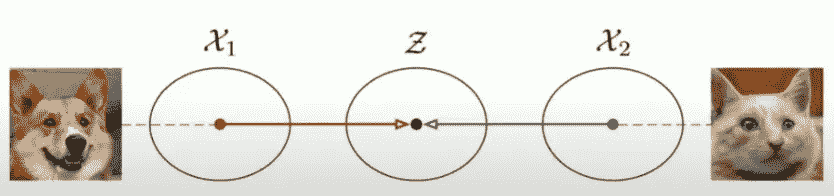

**共享潜在空间 Z**

在这个故事中，回顾了 NVIDIA 的**无监督图像到图像翻译网络**(单元)。在本文中:

*   **作出共享潜在空间假设**，其假设不同域中的一对对应图像可以被映射到共享潜在空间中的同一潜在表示。
*   **通过共享潜在空间进行图像到图像的转换。**(此时，没有成对的例子显示如何将一个图像翻译成另一个域中的相应图像。)

这是一篇发表在 **2017 NIPS** 的论文，引用超过 **1500 次**。([曾植和](https://medium.com/u/aff72a0c1243?source=post_page-----4a25ced6d078--------------------------------) @中)

# 概述

1.  **共享潜在空间假设**
2.  **单位:框架**
3.  **培训损失**
4.  **图像到图像的翻译结果**
5.  **域适配结果**

# **1。共享潜在空间假设**

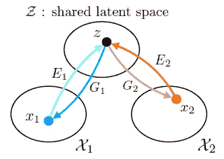

**共享潜在空间假设**

> 假设，**对于分别来自两个不同域 *X* 1 和 *X* 2 的任意给定图像对 *x* 1 和 *x* 2，在共享潜在空间 *Z* 中存在一个共享潜在代码 *z* 。**

*   ***E* 1** 和 ***E* 2** 是 2 个**编码函数，将图像映射为潜码。**
*   ***G* 1** 和 ***G* 2** 为 2 **生成函数，将潜码映射到图像。**

# **2。单位:框架**

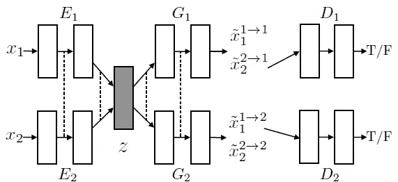

**单位:框架**

## 2.1.变分自动编码器(VAE)

*   编码器-发电机对 **{ *E* 1， *G* 1}** 构成了 *X* 1 域的 VAE，称为 **VAE1** 。

> **VAE1 首先通过编码器 *E* 1** 将输入图像 *x* 1 映射到潜在空间 *Z* 中的代码，然后**通过生成器 *G* 1 对代码的随机扰动版本进行解码以重构输入图像。**

*   假设**潜在空间 *Z*** 中的分量是**条件独立的且具有单位方差的高斯型。**
*   同样， **{ *E2* ， *G2* }** 构成了 *X* 2: **VAE2** 的 VAE。
*   对于自重建，即 *X* 1 → *X* 1 和 *X* 2 → *X* 2 到 *Z* ，称为图像重建流。
*   **该图像重建流可以被监督训练**，因为存在地面真相。

## 2.2.重量共享约束

> *E* 1、 *E* 2、 *G* 1 和 *G* 2 使用 CNNs 并使用**权重共享约束(虚线)**实现共享潜在空间假设，其中**最后几层(高级层)的连接权重在 *E* 1 和 *E* 2** 中被捆绑(用虚线表示)并连接

*   重量共享约束最初来自 [CoGAN](https://sh-tsang.medium.com/review-cogan-coupled-generative-adversarial-networks-gan-273f70b340af) 。因此，作者实际上是在扩展 [CoGAN](https://sh-tsang.medium.com/review-cogan-coupled-generative-adversarial-networks-gan-273f70b340af) 用于图像到图像的翻译。
*   共享潜在空间约束隐含了来自 CycleGAN 的循环一致性约束。
*   通过对抗训练，可以使用上述方法进行图像到图像的翻译。

## 2.3.[甘](/@sh.tsang/review-gan-generative-adversarial-nets-gan-e12793e1fb75)

*   生成对抗网络有两个: **GAN1 = { *D* 1、 *G* 1}** 和 **GAN2 = { *D* 2、 *G* 2}** 。
*   对于从第一个域采样的真实图像， *D* 1 应该输出 true，而对于 *G* 1 产生的图像，应该输出 false。
*   *G* 1 生成的图像可以有两个来源，一个是重建()，一个是翻译([甘](/@sh.tsang/review-gan-generative-adversarial-nets-gan-e12793e1fb75))。
*   对于图像到图像的转换，即 *X* 1 → *X* 2 和 *X* 2 → *X* 1 到 *Z* ，称为图像转换流。
*   与自我重建相反，**该图像翻译流是对手训练的**。

## 2.4.循环一致性

*   **可以在所提出的框架中实施**循环一致性约束，以**进一步正则化**不适定的无监督图像到图像的翻译问题。
*   产生的信息处理流被称为**循环重构流。**

> (由于有和[甘](/@sh.tsang/review-gan-generative-adversarial-nets-gan-e12793e1fb75)，文中使用了更多的数学表达式，例如如何基于输入图像绘制潜在向量。如果感兴趣，请阅读该文件。)

# 3.**培训损失**

*   VAE1、VAE2、GAN1 和 GAN2 的图像重建流、图像平移流和循环重建流被**联合训练**:

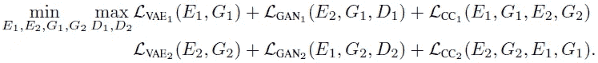

## 3.1.图像重建流

*   **VAE** 的损失函数是带有正则项的**负对数似然:**

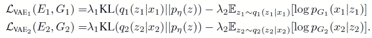

*   **KL 散度项惩罚潜在代码的分布与先前分布的偏差。**
*   这是 VAE 相当大的损失。(请随意阅读[教程——什么是变分自动编码器？](https://jaan.io/what-is-variational-autoencoder-vae-tutorial/))

## 3.2.图像翻译流

*   [**GAN**](/@sh.tsang/review-gan-generative-adversarial-nets-gan-e12793e1fb75) **损耗**是有条件的 GAN ( [CGAN](/@sh.tsang/review-cgan-conditional-gan-gan-78dd42eee41) )损耗，因为 *z* 是基于输入图像 *x* :

*   它们分别用于**确保翻译后的图像类似于目标域中的图像**。

## **3.3。循环重建流**

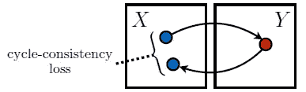

**图来自 CycleGAN(我们这里可以把 X 当 X1，Y 当 X2，或者把 X 当 X2，Y 当 X1。)**

*   一个**类似 VAE 的目标函数**用于**模拟循环一致性约束**:

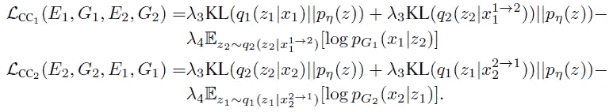

*   其中**负对数似然客观项确保两次翻译的图像与输入图像相似。**
*   **KL 项惩罚在循环重构流**中偏离先前分布的潜在码(因此，有两个 KL 项)。
*   *λ* 0 = 10， *λ* 3 = *λ* 1 = 0.1， *λ* 4 = *λ* 2 = 100。

## 3.4.交替梯度更新方案

*   第一个玩家是由编码器和生成器组成的团队。第二个玩家是由敌对的歧视者组成的团队。
*   除了击败第二个玩家之外，第一个玩家必须最小化 VAE 损失和周期一致性损失。
*   使用了**交替梯度更新方案**。

> 具体来说，**首先应用一个梯度上升步骤**更新**D1 和*D*2*E*1、 *E* 2、 *G* 1、 *G* 2 固定。然后**采用梯度下降步骤**更新**E1、 *E* 2、 *G* 1、 *G* 2** ，固定 *D* 1 和 *D* 2。**

# 4.图像到图像的翻译结果

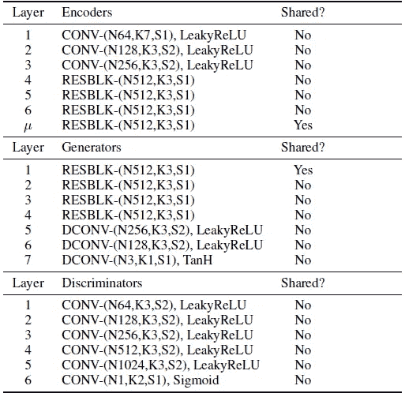

**图像到图像翻译的网络架构**

*   每个小批量由来自第一域的一个图像和来自第二域的一个图像组成。
*   对于网络架构，**编码器**由作为前端的 **3 个卷积层**和作为后端的 **4 个基本残差块**组成。
*   **生成器**由作为前端的 **4 个基本残差块**和作为后端的 **3 个转置卷积层**组成。
*   **鉴别器**由**叠卷积层**组成。
*   **LeakyReLU** 用于非线性。

## 4.1.消融研究的地图数据集

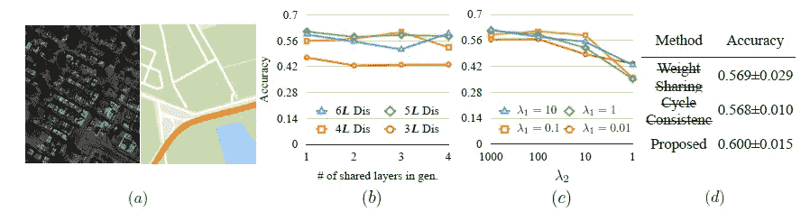

**地图数据集结果**

*   **(a)**:**地图数据集**的图示。左图:卫星图像。右图:地图。
*   如果色差在地面真实颜色值的 16°以内，则像素转换被认为是正确的。

> 测量**平均像素精度**。

*   **(b)** :重量分担层数从 1 层变更为 4 层。鉴别器使用不同的层数。
*   **最浅的鉴别器**架构导致了**最差的性能**。
*   发现**重量分担层数影响不大。**这是由于使用了残余块。

> 基于这个结果，在剩余的实验中，使用具有 1 个共享层的**VAEs**和 5 个层的**鉴别器**。

*   **(c)** :翻译准确度与不同超参数值的关系。
*   一般来说，**负对数似然项**的较大权重值产生了**更好的翻译准确性**。
*   还发现将 KL 项的权重设置为 0.1 会导致持续良好的性能。

> 因此设定 *λ* 1 = *λ* 3 = 0.1， *λ* 2 = *λ* 4 = 100。

*   **(d)** :权重分配和周期一致性约束对翻译准确性的影响。
*   **当移除权重共享约束**(因此，框架中的重建流被移除)**框架被简化为 CycleGAN 架构**。该模型实现了 0.569 的平均像素精度。
*   (希望未来可以回顾一下 CycleGAN。)
*   当**去除循环一致性约束**并且仅使用权重共享约束时，它实现了 **0.568 平均像素精度**。
*   但是当使用**全型号**时，单元达到了 **0.600 平均像素精度**的最佳性能。

> 对于不适定的联合分布恢复问题，**更多的约束是有益的。**

## 4.2.定性结果

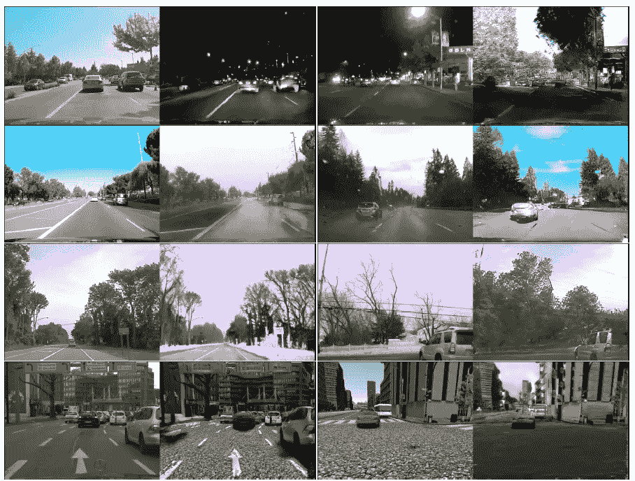

**街景图像翻译结果。对于每一对，左边是输入，右边是翻译的图像。**

*   UNIT 应用于几个无人监管的街景图像翻译任务，包括**晴天到雨天，白天到夜晚，夏天到下雪**，反之亦然。
*   为了把**真实转化为合成**翻译，单位把城市景观图像做成卡通状。对于**合成到真实**的转换，UNIT 在建筑、天空、道路和汽车区域取得了比人类区域更好的效果。

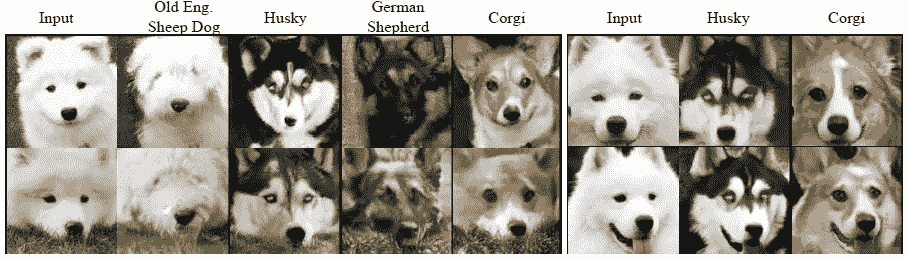

**狗狗品种翻译结果。**

*   ImageNet 中的狗狗图片用于学习**在不同品种**之间翻译狗狗图片。

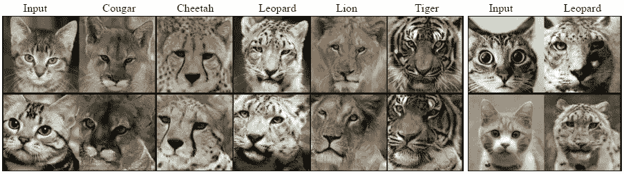

**猫种翻译结果**

*   同样，ImageNet 数据集中的猫图像被用来学习**在不同物种之间翻译猫图像**。

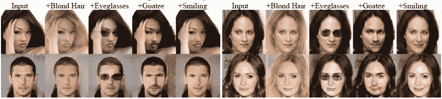

**基于属性的人脸翻译结果**

*   CelebA 数据集用于**基于属性的人脸图像翻译**。
*   这些属性包括金发、微笑、山羊胡子和眼镜。
*   翻译后的人脸图像是真实的。

# 5.领域适应结果

> 单元应用于**的问题，调整使用一个域(源域)中的标记样本训练的分类器，以分类新域(目标域)中的样本，其中新域中的标记样本在训练期间不可用。**

*   该框架被训练成在源域和目标域之间翻译图像，并使用由源域中的鉴别器提取的特征对源域中的样本进行分类。

> **高级层 *D* 1 和 *D* 2 的权重并列。**这允许在源域中训练的分类器适应目标域。
> 
> 同样，对于不同域中生成的一对图像，**由最高层鉴别器提取的特征之间的 L1 距离被最小化**，这进一步**鼓励 *D* 1 和 *D* 2 以相同的方式解释一对对应的图像。**

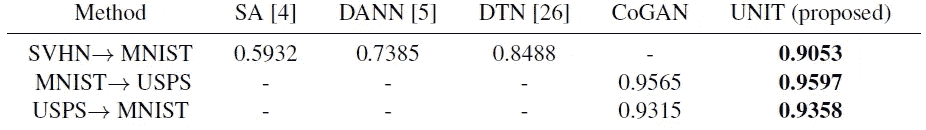

**无监督域自适应性能**

*   该单元适用于多项任务，包括**从街景门牌号码(SVHN)数据集到 MNIST 数据集**的适配，以及**在 MNIST 和美国邮政数据集**之间的适配。
*   **该装置在 SVHN→MNIST 任务**中实现了 0.9053 的精度，这比之前最先进的方法【26】实现的 0.8488 的精度要好得多。
*   对于 MNIST→SVHN 任务，单元**也比最先进的** [**CoGAN**](https://sh-tsang.medium.com/review-cogan-coupled-generative-adversarial-networks-gan-273f70b340af) 取得了更好的性能
*   数字图像的分辨率很低。因此，**使用了小型网络**。
*   还发现**周期一致性约束对于该任务不是必需的**。

## 参考

[2017 NIPS] [UNIT]
[无监督的图像到图像翻译网络](https://papers.nips.cc/paper/6672-unsupervised-image-to-image-translation-networks.pdf)

## 生成对抗网络

**图像合成** [ [甘](/@sh.tsang/review-gan-generative-adversarial-nets-gan-e12793e1fb75) ] [ [CGAN](/@sh.tsang/review-cgan-conditional-gan-gan-78dd42eee41) ] [ [拉普甘](/@sh.tsang/review-lapgan-laplacian-generative-adversarial-network-gan-e87200bbd827)[[DCGAN](/@sh.tsang/review-dcgan-deep-convolutional-generative-adversarial-network-gan-ec390cded63c)][[CoGAN](https://sh-tsang.medium.com/review-cogan-coupled-generative-adversarial-networks-gan-273f70b340af)]
**图像到图像平移** [ [Pix2Pix](https://sh-tsang.medium.com/review-pix2pix-image-to-image-translation-with-conditional-adversarial-networks-gan-ac85d8ecead2) ] [ [单元](https://sh-tsang.medium.com/review-unit-unsupervised-image-to-image-translation-networks-gan-4a25ced6d078)
**超分辨率**[[SRGAN&SRG
**摄像头篡改检测**](/@sh.tsang/review-srgan-srresnet-photo-realistic-super-resolution-gan-super-resolution-96a6fa19490)[曼蒂尼的 VISAPP’19](https://sh-tsang.medium.com/review-mantinis-visapp-19-generative-reference-model-and-deep-learned-features-camera-f608371c9854) **视频编码**[VC-lap gan](/@sh.tsang/reading-vc-lapgan-video-coding-oriented-laplacian-pyramid-of-generative-adversarial-networks-74daa2d23d3c)[朱 TMM’20](https://sh-tsang.medium.com/review-zhu-tmm20-generative-adversarial-network-based-intra-prediction-for-video-coding-c8a217c564ea)[钟 elec gj’21](https://sh-tsang.medium.com/review-zhong-elecgj21-a-gan-based-video-intra-coding-hevc-intra-9e3486dbca78)

## [我以前的其他论文阅读材料](https://sh-tsang.medium.com/overview-my-reviewed-paper-lists-tutorials-946ce59fbf9e)