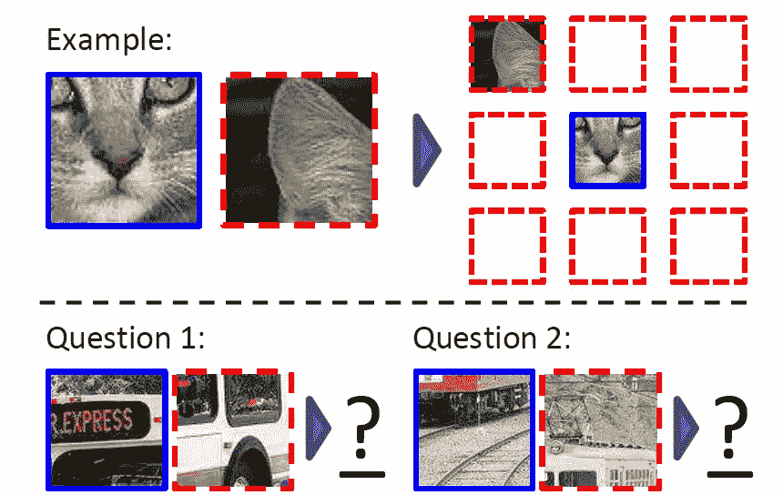
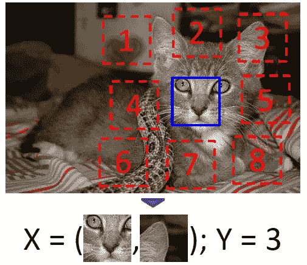
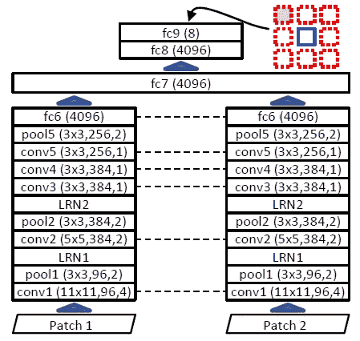
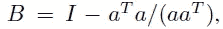
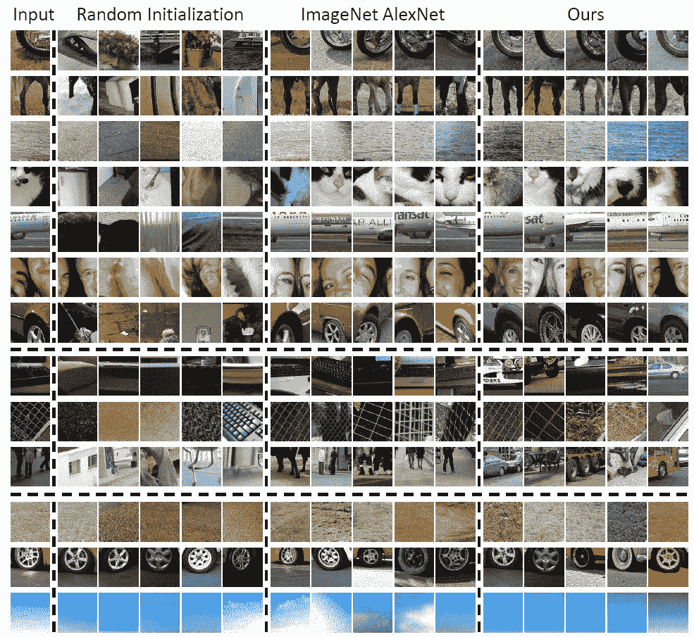
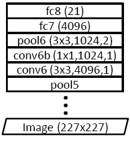
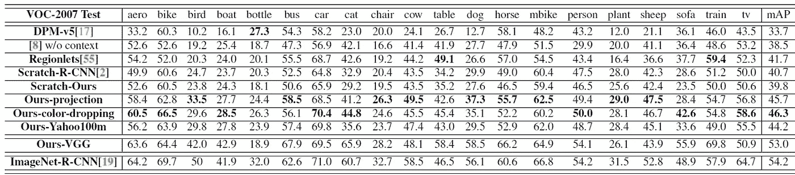
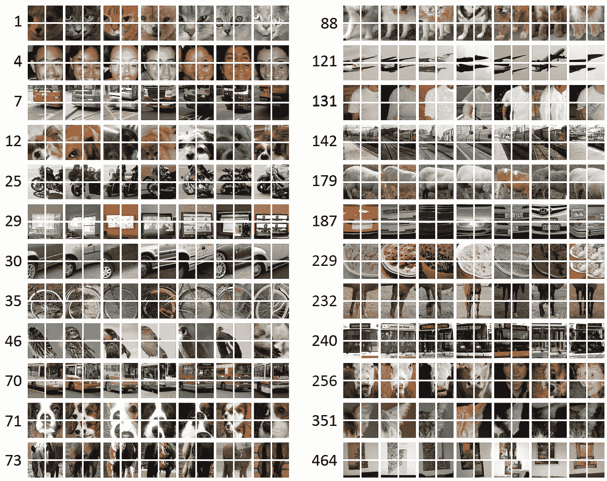
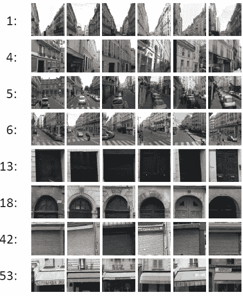

# 回顾-通过上下文预测的无监督视觉表示学习(自我监督)

> 原文：<https://medium.com/nerd-for-tech/review-unsupervised-visual-representation-learning-by-context-prediction-self-supervised-51a1d7ce6aff?source=collection_archive---------3----------------------->

## 自我监督学习:不使用基础事实标签的上下文预测

**学习小块表示的任务包括随机抽样一个小块(蓝色)和八个可能的邻居(红色)中的一个**

在这个故事中，回顾了卡耐基梅隆大学和加州大学的**通过上下文预测**(Context Prediction)进行的无监督视觉表示学习。

> 在标准的监督学习中，网络用基本事实标签进行训练。然而，标注标签通常既昂贵又耗时，尤其是当数据集很大时，例如 ImageNet。

在本文中:

*   **使用图像内上下文**学习的特征表示确实捕捉了图像间的视觉相似性。
*   例如:在上面，你能猜出两对补片的空间结构吗？请注意，一旦您识别了对象，任务就容易多了！
*   这是一种**自我监督学习**。

这是一篇发表在 **2015 ICCV** 的论文，引用超过 **1300 次**。( [Sik-Ho Tsang](https://medium.com/u/aff72a0c1243?source=post_page-----51a1d7ce6aff--------------------------------) @中)

# 概述

1.  **动机&概念想法**
2.  **学习视觉上下文预测**
3.  **实施细则**
4.  **实验结果**

# **1。动机&概念想法**

*   互联网规模的数据集(即数以千亿计的图像)受到所需的人工注释费用的阻碍。
*   解决这一困难的自然方法是采用**无监督学习**。不幸的是，无人监管的方法**还没有被证明能够从大量全尺寸的真实图像中提取有用的信息**。

> 如果没有一个物体被标记，如何编写一个目标函数来鼓励一个表示去捕捉，例如，物体？

*   在**文本领域**中，给定大的文本语料库，想法是训练将每个单词映射到特征向量的模型，使得在给定向量的情况下**容易预测上下文中的单词(即，前面和/或后面的几个单词)**。
*   **这将一个明显无监督的问题**(寻找单词之间良好的相似性度量)**转化为一个“自我监督的”问题**:从一个给定的单词到它周围的单词学习一个函数。
*   本文旨在为图像数据提供一个类似的“自我监督”公式。

**该算法接收这八种可能的空间排列之一的两个小块，没有任何上下文，然后必须分类哪个配置被采样**

> **随机成对的小块**以八种空间配置中的一种进行采样。然后，算法必须**猜测一个补丁相对于另一个补丁的位置。**
> 
> 潜在的假设是，做好**这项任务需要理解场景和物体，即良好的视觉表现。**

# 2.学习视觉上下文预测

## 2.1.一对[Alex net](/coinmonks/paper-review-of-alexnet-caffenet-winner-in-ilsvrc-2012-image-classification-b93598314160?source=post_page---------------------------)般的网络

**一对**[**Alex net**](/coinmonks/paper-review-of-alexnet-caffenet-winner-in-ilsvrc-2012-image-classification-b93598314160?source=post_page---------------------------)**类网络用于对分类**

*   **卷积神经网络(CNN)** 用于学习我们的托词任务的图像表示，即预测图像内小块的相对位置。
*   网络必须**通过几个卷积层馈送两个输入面片**，并且**产生一个输出，该输出为八个空间配置中的每一个分配一个概率。**

> 但是要注意的是，**最终目标**是**学习针对各个小块**的特征嵌入，使得视觉上相似(跨不同图像)的**小块将在嵌入空间中接近。**

*   **一对**[**Alex net**](/coinmonks/paper-review-of-alexnet-caffenet-winner-in-ilsvrc-2012-image-classification-b93598314160?source=post_page---------------------------)**风格的架构**被用来分别处理每个补丁，直到一个深度类似于 [AlexNet](/coinmonks/paper-review-of-alexnet-caffenet-winner-in-ilsvrc-2012-image-classification-b93598314160?source=post_page---------------------------) 中的 **fc6** ，在该点之后**表示被融合。**
*   **权重在网络**的两端绑定/共享(用虚线表示),以便为两个补片计算相同的 fc6 级嵌入函数。

## 2.2.训练样本

*   为了获得给定图像的训练样本，**在不参考图像内容的情况下，对第一个小块进行均匀采样**。
*   给定第一个小块的位置，**第二个小块是从八个可能的邻近位置随机抽样的。**

## 2.3.避免“琐碎”的解决方案

## 2.3.1.低级线索

*   必须小心确保任务迫使网络提取所需的信息(高级语义)，而不走“琐碎”的捷径。
*   **像**边界图案**或**纹理在面片之间延续**这样的低级线索**可以被当作快捷方式。

> 在补片之间留出间隙(大约是补片宽度的一半)是很重要的。**每个补丁位置最多随机抖动 7 个像素。**

## 2.3.2.C **色差**

*   另一个问题是**色差**。
*   透镜聚焦不同波长的光。在一些相机中，一个颜色通道(通常是绿色)相对于其他通道向图像中心收缩。
*   **网络可以通过检测绿色和品红色(红色+蓝色)的分离来学习平凡解，这是一种我们不希望网络学习的捷径。**
*   为了处理这个问题，**尝试了两种类型的预处理**。
*   一种是将绿色和品红色向灰色转移(“投影”)。
*   具体来说，假设*a*=[1，2，1](RGB 空间中的“绿-洋红色轴”)。

*   *B* 是**减去一种颜色在绿-品红颜色轴上的投影**的矩阵。每个像素值由 *B* 相乘。
*   另一种方法是**从每个补丁中随机丢弃 3 个颜色通道中的 2 个(“颜色丢弃”)**，用高斯噪声替换丢弃的颜色(标准偏差为剩余通道标准偏差的 1/100)。

# **3。实施细节**

*   **ImageNet 2012 训练集** (1.3M 图片)，但是**丢弃标签**。
*   每张图像都被调整到 150K 到 450K 的总像素数，保持宽高比。
*   **面片**以分辨率 **96×96** 采样，呈**网格状。**
*   **网格中采样的小块之间有 48 个像素**的间隙，而且**抖动**网格中每个小块的位置在每个方向上有**7 到 7 个像素**。
*   通过(1)均值减法(2)投影或丢弃颜色，以及(3)随机地将一些小块向下采样到总共 100 个像素，然后向上采样，对小块进行预处理，以建立对像素化的鲁棒性。
*   [批量归一化](https://sh-tsang.medium.com/review-batch-normalization-inception-v2-bn-inception-the-2nd-to-surpass-human-level-18e2d0f56651)用于那些不使用 LRN 的 conv 图层。(据本 [Github](https://github.com/abhisheksambyal/Self-supervised-learning-by-context-prediction/blob/master/Self_supervised_learning_by_context_prediction.ipynb) 。)

# 4.实验结果

*   经过训练的网络应用于两个领域。
*   首先，**预训练**，用于只有有限训练数据的标准视觉任务:特别是 VOC 2007 对象检测。
*   第二，**视觉数据挖掘**，目标是从一个未标记的图像集合开始，发现对象类别。
*   最后，在布局预测“借口任务”上分析性能，以查看还有多少要从监控信号中学习。

## 4.1.**最近邻居**

**最近邻居获得的补丁簇示例(fc6** 来自我们架构的**随机初始化**的特征，[**Alex net**](/coinmonks/paper-review-of-alexnet-caffenet-winner-in-ilsvrc-2012-image-classification-b93598314160?source=post_page---------------------------)**fc7**在**标记的 ImageNet** 上训练后，以及 **fc6** 从**提出的方法**中学习到的特征)

*   目标是了解补丁有多相似。
*   fc7 和更高层被删除。 **NN 被应用在 fc6 特性上。**
*   上面显示了一些补丁程序(从 1000 个随机查询中选出)的结果。
*   **提出的上下文预测算法表现良好。**
*   对于中间的 [AlexNet](/coinmonks/paper-review-of-alexnet-caffenet-winner-in-ilsvrc-2012-image-classification-b93598314160?source=post_page---------------------------) ，它优于提出的上下文预测方法。因为这个 [AlexNet](/coinmonks/paper-review-of-alexnet-caffenet-winner-in-ilsvrc-2012-image-classification-b93598314160?source=post_page---------------------------) 是监督学习的。

> 通过可视化由 NN 分组的小块，预测的上下文预测能够学习没有标签的图像表示。

## 4.2.采用进入 [R-CNN](/coinmonks/review-r-cnn-object-detection-b476aba290d1?source=post_page---------------------------) 进行目标检测

**物体探测网络**

*   [**R-CNN**](/coinmonks/review-r-cnn-object-detection-b476aba290d1?source=post_page---------------------------) **管道使用。**
*   但是，使用的是 227×227 输入，而不是 96×96。网络需要修改。
*   pool5 在空间上执行 7×7。
*   新的“conv6”层是通过将 fc6 层转换为卷积层而创建的。
*   conv6 层有 4096 个通道，每个单元连接到 pool5 的一个 3×3 区域。
*   conv6 之后的另一层(称为 conv6b)使用 1×1 内核，可将维度降至 1024 个通道。
*   输出通过一个汇集层馈送到一个全连接层(fc7 ),该层又连接到一个最终的 fc8 层，该层馈送到 softmax。
*   conv6b、fc7 和 fc8 以随机权重开始。
*   fc7 被用作最终表示。

**PASCAL VOC-2007 的 AP 和 mAP 结果(%)**

*   **Scratch-Ours** :从零开始训练(随机初始化)的架构表现略差于从零开始训练的[AlexNet](/coinmonks/paper-review-of-alexnet-caffenet-winner-in-ilsvrc-2012-image-classification-b93598314160?source=post_page---------------------------)(**Scratch-**[**R-CNN**](/coinmonks/review-r-cnn-object-detection-b476aba290d1?source=post_page---------------------------)**)**。

> **Ours-projection/Ours-color-dropping:预训练将从零开始的数量提升 6% mAP，并优于在 Pascal 上从零开始训练的一个**[**AlexNet**](/coinmonks/paper-review-of-alexnet-caffenet-winner-in-ilsvrc-2012-image-classification-b93598314160?source=post_page---------------------------)**风格的模型 5%以上。**
> 
> **只比** **落后 8% ImageNet-**[**R-CNN**](/coinmonks/review-r-cnn-object-detection-b476aba290d1?source=post_page---------------------------)**，**即 [R-CNN](/coinmonks/review-r-cnn-object-detection-b476aba290d1?source=post_page---------------------------) 预训练有 ImageNet 标签。这是**VOC 2007 在不使用数据集外标签的情况下(当时)的最佳结果。**

*   Ours-Yahoo100m :随机选择的 Yahoo/Flickr 1 亿数据集[51]的 2M 子集被使用，它完全是自动收集的。微调后的性能**略差于 Ours-projection/Ours-color-dropping**，但**仍比从头模型有相当大的提升。**
*   **Ours-**[**VGG**](/coinmonks/paper-review-of-vggnet-1st-runner-up-of-ilsvlc-2014-image-classification-d02355543a11?source=post_page---------------------------):[VGG](/coinmonks/paper-review-of-vggnet-1st-runner-up-of-ilsvlc-2014-image-classification-d02355543a11?source=post_page---------------------------)网试，地图关闭 ImageNet- [R-CNN](/coinmonks/review-r-cnn-object-detection-b476aba290d1?source=post_page---------------------------) one。

## 4.3.可视化数据挖掘

**发现的物体群**

*   视觉数据挖掘或无监督对象发现旨在**使用大型图像集合来发现恰好描述相同语义对象的图像片段。**
*   首先，**从一幅图像中采样四个相邻片**的星座。
*   然后，**查找对所有四个小块具有最强匹配的前 100 个图像，忽略空间布局。**
*   (过滤掉四个匹配在几何上不一致的图像。)
*   每个聚类旁边的数字表示其排名，由几何验证的最高匹配分数确定。
*   上面显示了一些生成的补丁簇。

**从巴黎街景数据集发现的聚类**

*   提议的表示捕捉场景布局和建筑元素。

> **与有监督的预训练策略相比，使用提出的上下文预测的预训练优于随机初始化，同时不需要地面真实标签。**

## 参考

【2015 ICCV】【上下文预测】
[通过上下文预测的无监督视觉表征学习](https://arxiv.org/abs/1505.05192)

## 自我监督学习

[ [上下文预测](https://sh-tsang.medium.com/review-unsupervised-visual-representation-learning-by-context-prediction-self-supervised-51a1d7ce6aff) ]

## [我之前的其他论文阅读](https://sh-tsang.medium.com/overview-my-reviewed-paper-lists-tutorials-946ce59fbf9e)