# 回顾—使用 ConvLSTM(摄像机篡改检测)的视频帧插值

> 原文：<https://medium.com/nerd-for-tech/review-video-frame-interpolation-using-convlstm-camera-tampering-detection-5b07dec0fb52?source=collection_archive---------11----------------------->

## 使用 ConvLSTM 的视频帧插值用于摄像机篡改检测

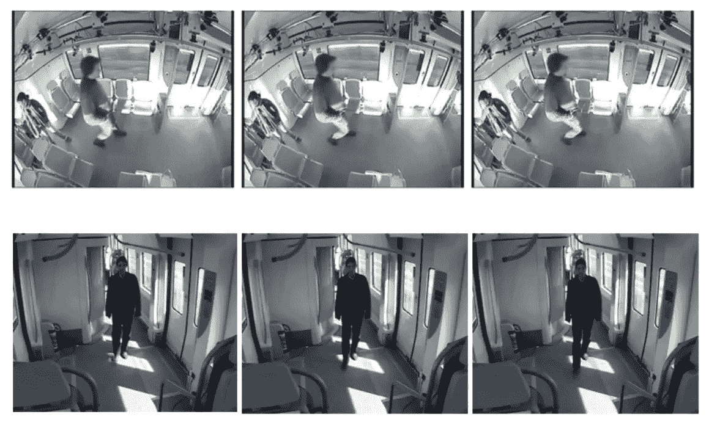

**行驶列车上的监控摄像头**

在这个故事中，回顾了南洋理工大学的**基于深度学习的视频帧插值**对监控摄像机的物理完整性攻击检测。在本文中:

*   **使用 ConvLSTM 的视频帧插值**用于预测视频帧。
*   将预测帧与当前帧进行比较，以确定是否发生了(网络或物理)篡改。

这是 **2019 IoTaIS** 的一篇论文。( [Sik-Ho Tsang](https://medium.com/u/aff72a0c1243?source=post_page-----5b07dec0fb52--------------------------------) @中)

# 概述

1.  **针对监控摄像头的网络攻击和物理篡改**
2.  **建议使用 ConvLSTM 进行视频帧插值**
3.  **实验结果**

# **1。针对监控摄像头的网络攻击和物理篡改**

*   像所有物联网(IoT)设备一样，监控摄像头也面临着各种网络威胁的风险。
*   未经授权的特权远程访问这些监控摄像机可能**改变易受攻击的摄像机**的配置，阻止它们执行其预期的监控功能或覆盖范围。
*   物理攻击还会导致监控摄像头无法正常工作。
*   这些篡改攻击对摄像机视野产生负面影响，从而对监控系统功能产生负面影响。
*   **遮挡摄像机的视角**通过用黑色图像遮挡视频镜头进行模拟。

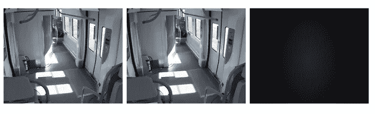

**最右边的视频帧模拟被遮挡的视图**

*   **调整通过裁剪特定视频帧模拟的摄像机**的变焦配置。

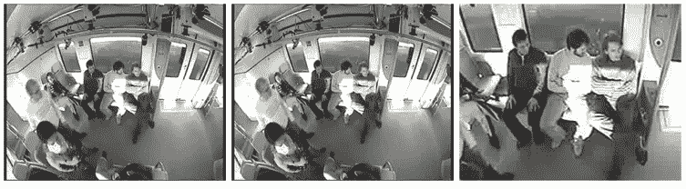

**最右边的视频帧模拟放大**

*   **改变摄像机的焦点**通过对特定视频帧应用图像过滤器(模糊)进行模拟。

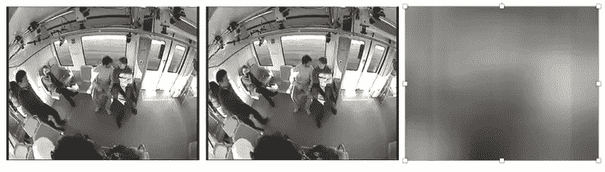

**最右边的视频帧模拟模糊效果**

*   **调整摄像机的视角**，通过移动录制的视频画面的观看区域来模拟。

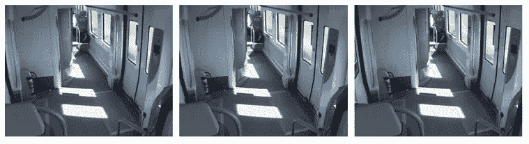

**最右边的视频帧模拟小左移**

# 2.**使用 ConvLSTM 的建议视频帧插值**

*   为了检测上述篡改攻击，提出了使用 con vltm 的**视频帧插值。**

## 2.1.**摄像机篡改检测的视频帧插值**

**视频帧插值**

*   假设我们在时刻 *t* 得到了**当前帧*θt*T5。**
*   而我们也得到了**前几帧 *θt* -1、 *θt* -2、…、 *θt* -5** 。
*   将当前帧 *θt* 和先前帧 *θt* -2、…、 *θt* -5 输入视频帧插值网络，得到插值帧^ *θt* -1。
*   如果预测的^ *θt* -1 与实际的 *θt* -1 相差很大，则检测到相机篡改。
*   否则，它处于正常状态，即没有摄像头篡改。

## 2.2.利用 ConvLSTM 进行视频帧插值

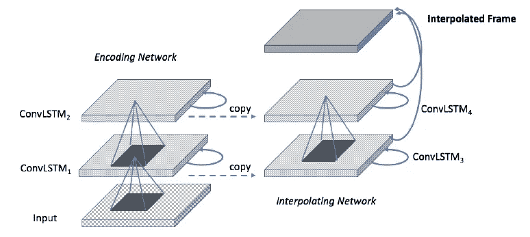

*   编码 ConvLSTM 网络将来自 *t* - *J* 、…、 *t* -2 以及 *t* 的视频帧输入序列摄取到其 ConvLSTM 的隐藏层中，其中一个视频帧不包括在 *t* -1 处的帧。
*   插值 ConvLSTM 网络将展开隐藏状态，通过插值来重建丢失的视频帧。
*   简而言之，ConvLSTM 是 LSTM，但使用卷积层，而不是完全连接的层。
*   (有关 ConvLSTM 的详细信息，请随意阅读 [MsFEM+MsBEN](/swlh/review-msfen-msben-defocus-blur-detection-by-fusing-multiscale-deep-features-with-conv-lstm-b31d6c23758d) ，或者阅读 [ConvLSTM](https://papers.nips.cc/paper/2015/file/07563a3fe3bbe7e3ba84431ad9d055af-Paper.pdf) 论文。)

# 3.实验结果

*   所有模型都用四组测试场景进行了训练和测试。
*   收集基于**真阳性**、**真阴性**、**假阳性**、**假阴性**的评价标准。
*   此外，还计算了 **F1** 、**精度**和**召回**值。
*   因此，使用**四个测试场景**和**两组之前未见过的摄像机视频**收集了总共 **32 个测试评估结果**，包括我们的插值异常检测器模型。
*   (但数据集并不公开。)
*   比较了预测模型(预测器)、VAE(变分自动编码器)和 AE(自动编码器)。

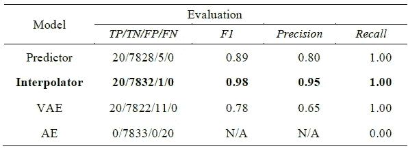

**挡住摄像机的视野**

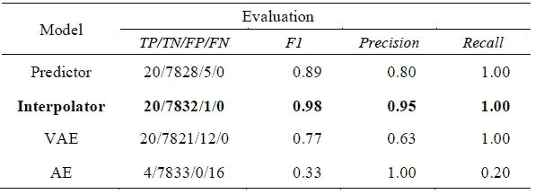

**调整相机的变焦**

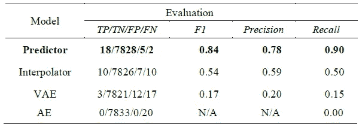

**改变相机的焦点**

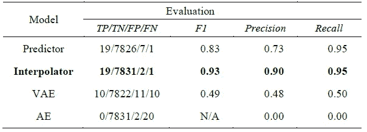

**移动摄像机—摄像机 1**

*   TP/TN/FP/FN 的数字，我相信就是帧数。(文中并未明确。)
*   测试结果表明，对于四个测试场景中的三个**，与其他物理攻击模型相比，具有**视频帧插值**的异常检测器表现最佳。**
*   在**调节相机焦距**的模拟测试中，**第二好**。

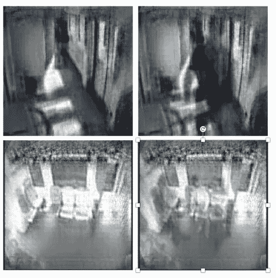

**当列车车厢为空(左)且有乘客(右)时，由我们的 ConvLSTM 插值器重建的视频帧**

## 参考

【2019 iota is】【VFI-康维尔斯】
[基于深度学习的视频帧插值的监控摄像头物理完整性攻击检测](https://ieeexplore.ieee.org/abstract/document/8980385)

## 摄像机篡改检测

[[VFI-康维尔斯特姆](https://sh-tsang.medium.com/review-video-frame-interpolation-using-convlstm-camera-tampering-detection-5b07dec0fb52) ] [ [UHCTD](https://sh-tsang.medium.com/review-uhctd-a-comprehensive-dataset-for-camera-tampering-detection-camera-tampering-detection-f2a132eb7aca) ]

## [我以前的其他论文阅读材料](https://sh-tsang.medium.com/overview-my-reviewed-paper-lists-tutorials-946ce59fbf9e)