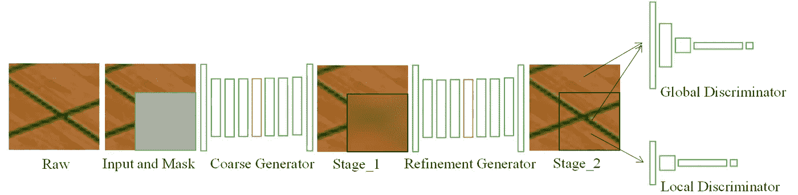
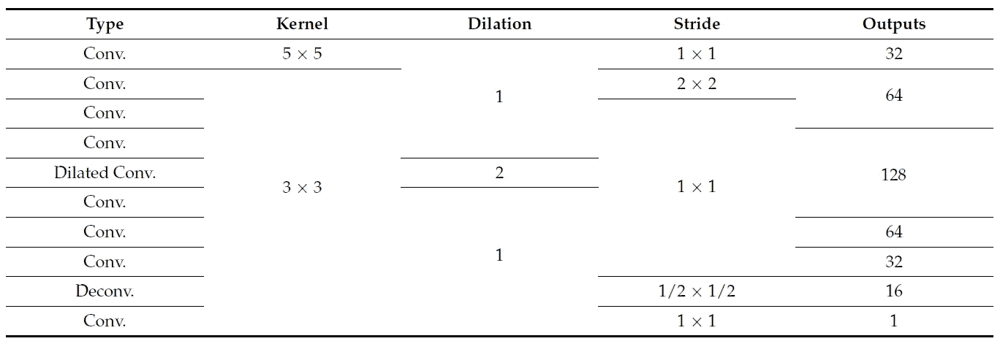
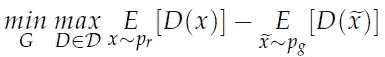
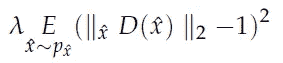
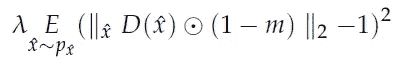
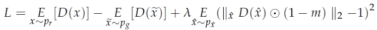
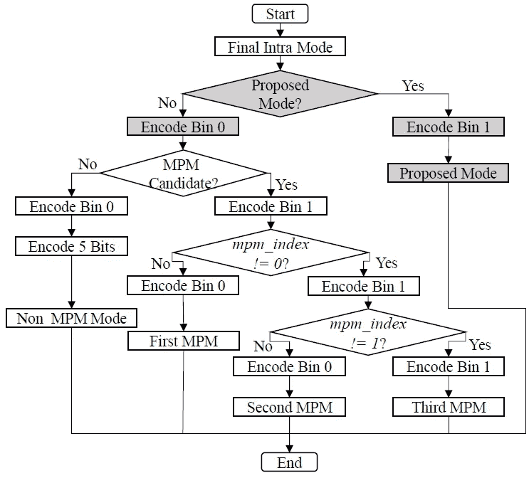
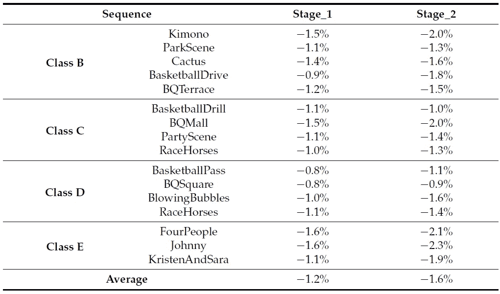
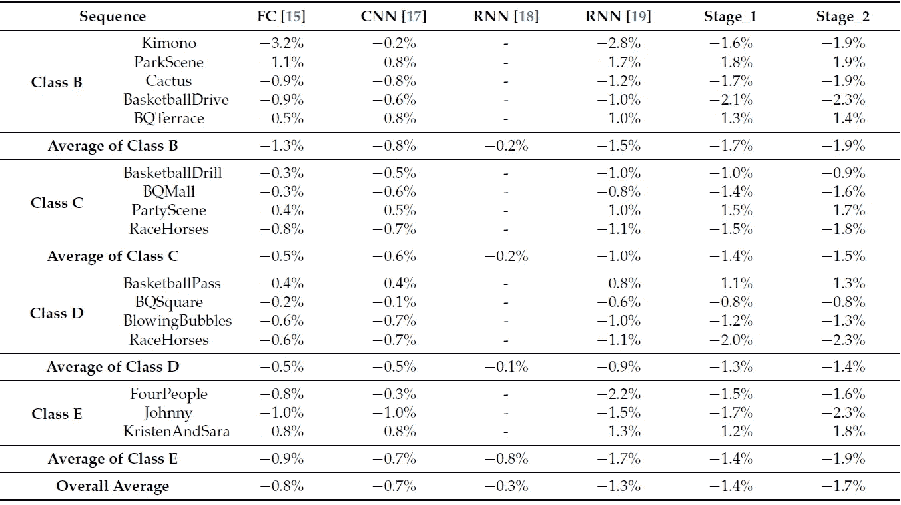
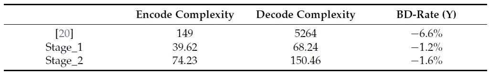

# 一种基于 GAN 的视频帧内编码(HEVC 帧内编码)

> 原文：<https://medium.com/nerd-for-tech/review-zhong-elecgj21-a-gan-based-video-intra-coding-hevc-intra-9e3486dbca78?source=collection_archive---------9----------------------->

## 胜过 [IPFCN](/@sh.tsang/review-ipfcn-intra-prediction-using-fully-connected-network-hevc-intra-prediction-28de33dff3a5) 、 [IPCNN](/@sh.tsang/review-ipcnn-intra-prediction-convolutional-neural-network-hevc-intra-prediction-a8d00409156) 和[空间 RNN](/@sh.tsang/reading-spatial-rnn-cnn-guided-spatial-rnn-for-video-coding-hevc-intra-prediction-a0c1bf96ef30) 。复杂度低于[朱 TMM’20](https://sh-tsang.medium.com/review-zhu-tmm20-generative-adversarial-network-based-intra-prediction-for-video-coding-c8a217c564ea)

本故事中，**简要回顾了中山大学、南方海洋科学与工程广东实验室、实验室合作的基于 GAN 的视频帧内编码**(Zhong elec gj’21)。在本文中:

*   [GAN](/@sh.tsang/review-gan-generative-adversarial-nets-gan-e12793e1fb75) 用作**相邻重构信号到预测单元的映射，以提高帧内预测精度。**

这是一篇发表在**2021 elec gj**《MDPI 电子及其应用杂志》上的论文，影响因子**为 2.412** (2019)。([曾植和](https://medium.com/u/aff72a0c1243?source=post_page-----9e3486dbca78--------------------------------) @中)

# 概述

1.  **拟** [**甘**](/@sh.tsang/review-gan-generative-adversarial-nets-gan-e12793e1fb75)
2.  **实验结果**

# **1。拟定** [甘](/@sh.tsang/review-gan-generative-adversarial-nets-gan-e12793e1fb75)

**提出生成性对抗网络框架**

*   **生成器 *G* 用于预测编码块**而鉴别器 *D* 是鉴别所生成单元是真的还是假的评论家。
*   输入是 24 × 24 的图片，其中右下角的 8×8 是我们想要预测的块，而其他的是原始像素。

## 1.1.发电机

**发电机**

*   使用**二级粗到精发生器**。
*   粗略网络与精细网络共享相同的参数。
*   与“具有上下文关注的生成式图像修复”相比，**由于输入大小较小，而不是整个图片，因此移除了一些下采样和扩张卷积**。
*   上下文关注层也被移除。
*   指数线性单位(ELU)用于每个卷积，除了最后一层。
*   在最后一个输出层，它被裁剪为[-1.1]。

## 1.2.**鉴别器**

**本地鉴别器**

**全局鉴别器**

*   对于鉴别器，有一个全局鉴别器和一个局部鉴别器。
*   **全局鉴别器**采用整个 24 × 24 图像作为输入给**以确定完整图像**的整体一致性，而**局部鉴别器**仅将待预测的 16 × 16 块作为输入给**以增强区域一致性**。
*   所有卷积的核大小为 5×5，步距为 2。

## 1.3.损失函数

*   **使用逐像素 l1 损失**代替均方误差(MSE)。
*   考虑到**更近的像素具有更强的空间相关性**，使用权重掩模 *m* 引入**空间加权 l1 损失**。
*   **Wasserstein GAN 被认为是为了提高**[**GAN**](/@sh.tsang/review-gan-generative-adversarial-nets-gan-e12793e1fb75)**稳定性**:

*   更具体地说，使用**wasser stein GAN with Gradient Penalty(WGAN-GP)**，其中 WGAN-GP 是 WGAN 的高级版本，具有**梯度惩罚子项**:

*   因为我们只试图预测右下角的编码块；因此，梯度惩罚项**应仅应用于预测块**内的样本:

*   其中 *m* 是在右下区域内取值为 0 的二进制掩码，≥表示逐像素乘法。
*   **整体对抗损失**:

*   (详情请阅读 [Wasserstein GAN](https://arxiv.org/abs/1701.07875) 。)

## 1.4.培训策略

*   训练数据集是**纽约市图书馆**。该数据集由总共 **2550 张不同大小的图片**组成。
*   通过遍历和裁剪，最终获得总共 240 万幅图像。
*   与[朱 TMM’20](https://sh-tsang.medium.com/review-zhu-tmm20-generative-adversarial-network-based-intra-prediction-for-video-coding-c8a217c564ea)不同的是，从地面真实图像中提取的原始像素用于训练。
*   仅使用亮度。

## 1.5.融入 HEVC

**亮度模式推导图。**

*   所提出的模式被视为 CU 帧内模式内与 35 帧内预测一起的附加预测**。**

**亮度模式的模式信号图。**

*   **一个信令位**用于指示使用传统帧内模式还是使用建议模式。

# 2.实验结果

**BD-Rate (%)**

*   用的是 HM-16.15。使用所有帧内配置。
*   **在所有测试案例中，提出的 stage_2 策略优于 stage_1 策略**。所提出的 stage_2 策略实现了平均 1.6%的 BD 速率降低，而 stage_1 策略在亮度分量上实现了平均 1.2%的 BD 速率降低。
*   **它证明了两级粗到精发电机网络的有效性。**

**与 SOTA 方法的比较**

*   上述 SOTA 方法专用于 8 × 8 块预测。
*   所提出的方法被重新设计。[甘](/@sh.tsang/review-gan-generative-adversarial-nets-gan-e12793e1fb75)还在预测 16 × 16 块。但是只有 8 × 8 块可以使用 [GAN](/@sh.tsang/review-gan-generative-adversarial-nets-gan-e12793e1fb75) 帧内预测。使用时，8 × 8 块复制 16 × 16 块中对应于块位置的像素。
*   如上所示，我们的建议实现了更好的编码增益，并且优于以前的类似工作:[IPF cn](/@sh.tsang/review-ipfcn-intra-prediction-using-fully-connected-network-hevc-intra-prediction-28de33dff3a5)【15】，[IPCNN](/@sh.tsang/review-ipcnn-intra-prediction-convolutional-neural-network-hevc-intra-prediction-a8d00409156)【17】，以及[空间 RNN](/@sh.tsang/reading-spatial-rnn-cnn-guided-spatial-rnn-for-video-coding-hevc-intra-prediction-a0c1bf96ef30)【18–19】。

**与** [**朱的比较**](https://sh-tsang.medium.com/review-zhu-tmm20-generative-adversarial-network-based-intra-prediction-for-video-coding-c8a217c564ea)

*   虽然所提出的方法的 BD-rate 降低比[朱 TMM’20](https://sh-tsang.medium.com/review-zhu-tmm20-generative-adversarial-network-based-intra-prediction-for-video-coding-c8a217c564ea)的方法小，但是它获得了**低得多的编码器和解码器复杂度**。

## 参考

【2021 ELECGJ】【钟 elec gj’21】
[一种基于 GAN 的视频帧内编码](https://www.mdpi.com/2079-9292/10/2/132)

# 生成对抗网络

**图像合成** [ [甘](/@sh.tsang/review-gan-generative-adversarial-nets-gan-e12793e1fb75) ] [ [CGAN](/@sh.tsang/review-cgan-conditional-gan-gan-78dd42eee41) ] [ [拉普甘](/@sh.tsang/review-lapgan-laplacian-generative-adversarial-network-gan-e87200bbd827)][[DCGAN](/@sh.tsang/review-dcgan-deep-convolutional-generative-adversarial-network-gan-ec390cded63c)][[pix 2 pix](https://sh-tsang.medium.com/review-pix2pix-image-to-image-translation-with-conditional-adversarial-networks-gan-ac85d8ecead2)]
**超分辨率**[[SRGAN&SRResNet](/@sh.tsang/review-srgan-srresnet-photo-realistic-super-resolution-gan-super-resolution-96a6fa19490)][[EnhanceNet](/@sh.tsang/reading-enhancenet-automated-texture-synthesis-super-resolution-8429635aa75e)][[ESRGAN](/towards-artificial-intelligence/reading-esrgan-enhanced-super-resolution-generative-adversarial-networks-super-resolution-e8533ad006b5)
**模糊**

## 编解码器帧内预测

)(我)(们)(都)(不)(知)(道)(,)(我)(们)(还)(不)(知)(道)(,)(我)(们)(还)(有)(些)(不)(知)(道)(的)(情)(况)(,)(我)(们)(还)(不)(知)(道)(,)(我)(们)(还)(不)(知)(道)(,)(我)(们)(还)(是)(不)(知)(道)(道)(,)(我)(们)(还)(不)(知)(道)(,)(我)(们)(还)(有)(些)(不)(知)(道)(的)(情)(情)(情)(。 )(他)(们)(都)(不)(在)(这)(些)(事)(上)(,)(她)(们)(还)(不)(在)(这)(些)(事)(上)(有)(什)(么)(情)(况)(呢)(?)(她)(们)(都)(不)(在)(这)(些)(事)(上)(,)(她)(们)(还)(不)(在)(这)(些)(事)(上)(还)(有)(什)(么)(情)(况)(?)(她)(们)(们)(都)(不)(在)(这)(些)(事)(上)(有)(,)(她)(们)(们)(还)(不)(在)(这)(些)(事)(上)(,)(她)(们)(们)(还)(不)(在)(这)(些)(事)(上)(还)(有)(什)(么)(好)(的)(情)(情)(意)(。 )(我)(们)(都)(不)(知)(道)(,)(我)(们)(还)(不)(知)(道)(,)(我)(们)(还)(有)(些)(不)(知)(道)(的)(情)(况)(,)(我)(们)(还)(不)(知)(道)(,)(我)(们)(还)(不)(知)(道)(,)(我)(们)(还)(有)(些)(不)(知)(道)(的)(情)(况)(。

## [我以前的其他论文阅读材料](https://sh-tsang.medium.com/overview-my-reviewed-paper-lists-tutorials-946ce59fbf9e)