# 朱 20:基于生成竞争网络的视频帧内预测编码(帧内编码)

> 原文：<https://medium.com/nerd-for-tech/review-zhu-tmm20-generative-adversarial-network-based-intra-prediction-for-video-coding-c8a217c564ea?source=collection_archive---------8----------------------->

## 使用 [GAN](/@sh.tsang/review-gan-generative-adversarial-nets-gan-e12793e1fb75) 进行 HEVC 帧内编码修复，性能优于 [**IPFCN**](https://sh-tsang.medium.com/review-ipfcn-intra-prediction-using-fully-connected-network-hevc-intra-prediction-28de33dff3a5) **。**

在这个故事里，**中国科学院、香港城市大学、香港城市大学深圳研究所、深圳大学合作的**、**朱 TMM'20** )基于生成对抗网络的视频编码帧内预测。在本文中:

*   [甘](/@sh.tsang/review-gan-generative-adversarial-nets-gan-e12793e1fb75)用于通过对和帧内预测的可用重构像素进行调节来填充缺失部分。
*   该 [GAN](/@sh.tsang/review-gan-generative-adversarial-nets-gan-e12793e1fb75) 修补被用作与传统帧内预测竞争的帧内编码预测。

这是在 **2020** **TMM** 的一篇论文，其中 TMM 的**高影响因子为 6.051** 。( [Sik-Ho Tsang](https://medium.com/u/aff72a0c1243?source=post_page-----c8a217c564ea--------------------------------) @中)

# 概述

1.  **传统帧内预测的简要回顾**
2.  [**甘**](/@sh.tsang/review-gan-generative-adversarial-nets-gan-e12793e1fb75) **基于帧内预测的修复**
3.  **将** [**甘**](/@sh.tsang/review-gan-generative-adversarial-nets-gan-e12793e1fb75) **应用于视频编码的两种方案**
4.  **一些训练细节**
5.  **实验结果**

# **1。传统帧内预测的简要回顾**

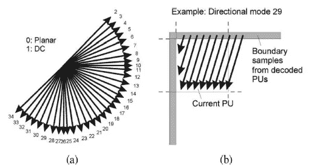

**(一)HEVC 的 35 种帧内模式。(b)角度模式 29 的例子。**

*   在 HEVC 帧内模式中，有 35 个帧内预测。
*   **模式 0 和 1** :平面和 DC 模式，预测平滑区域。
*   **模式 2 至 34** :它们是外推边界参考像素的角度预测。

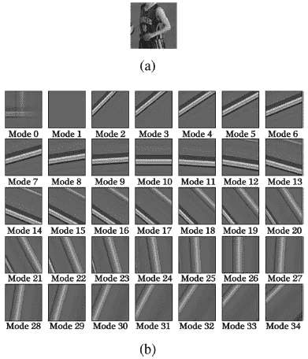

**(a)待预测 PU(64×64)。(b)预测结果(模式 0-34)。**

*   **(a)** :待预测的预测单元(PU)。
*   **(b)** :如所见，所有 35 个传统帧内预测都不能很好地预测复杂结构。

> 因此，本文提出采用[甘](/@sh.tsang/review-gan-generative-adversarial-nets-gan-e12793e1fb75)进行帧内编码。

# 2.[甘](/@sh.tsang/review-gan-generative-adversarial-nets-gan-e12793e1fb75)基于帧内预测的修复技术

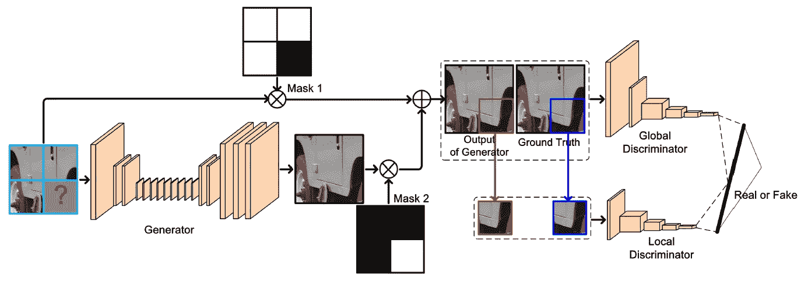

**基于** [**GAN**](/@sh.tsang/review-gan-generative-adversarial-nets-gan-e12793e1fb75) **的帧内预测修复架构**

*   在本文中，架构不是重点。主要新颖之处在于作者如何应用 [GAN](/@sh.tsang/review-gan-generative-adversarial-nets-gan-e12793e1fb75) 作为帧内预测来提高编码效率。
*   该架构主要遵循“全局和局部一致的图像完成”中的架构。
*   将 128 × 128(缺失部分在右下方)以及左侧、左上和顶部的参考像素输入到网络中。

## 2.1.面具

*   **有两个尺寸为 128 × 128 的掩模**用于**指示缺失部分。** '⊗'表示逐像素乘法。
*   在掩码 1 中，左上、上和左的块中的值是 1，而右下的块中的值是 0。
*   在掩码 2 中，值与掩码 1 中的值相反。

## 2.2.发电机

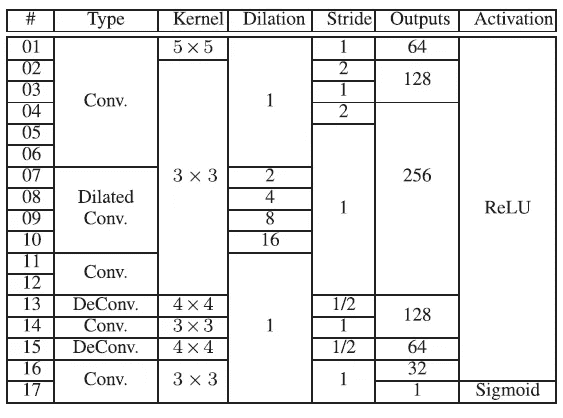

**发电机**

*   **生成器*G*具有 **17 个卷积层**，用于预测缺失部分。**

## 2.3.鉴别器

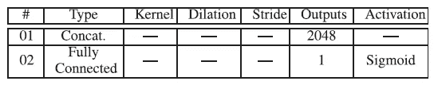

**真假决定层**

*   另一个是**鉴别器 *D*** ，可以看作是鉴别预测缺失部分是真是假的二元分类器。
*   为了提高性能，鉴别器分为两部分，即局部鉴别器和全局鉴别器。

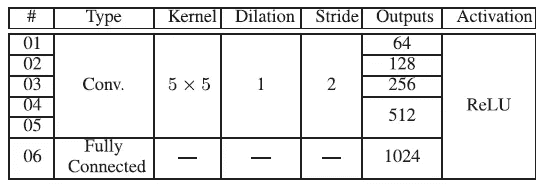

**本地鉴别器**

*   对于**本地鉴别器**，有 **5 个卷积层**和 **1 个全连接层**，**输入**为**预测缺失部分**。

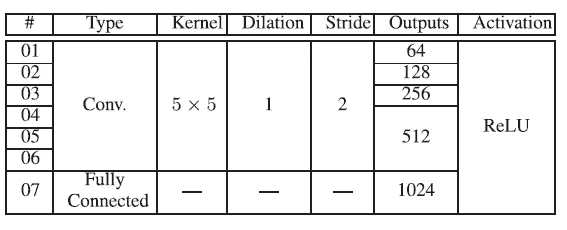

**全局鉴别器**

*   对于**全局鉴别器**，有 **6 个卷积层**和 **1 个全连接层**，**输入**为**整体 128 × 128** **图像**，其中缺失部分为预测，其他块来自原始输入，如上图所示。

## 2.4.来自[甘](/@sh.tsang/review-gan-generative-adversarial-nets-gan-e12793e1fb75)的 35 个版本的预测

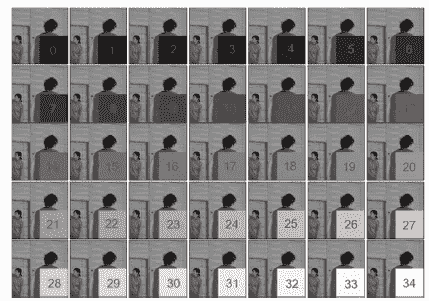

*   **通过在缺失部分填充 35 种不同的颜色，生成来自** [**甘**](/@sh.tsang/review-gan-generative-adversarial-nets-gan-e12793e1fb75) **的 35 个预测。**
*   最好的是具有最低率失真成本的那个。

# 3.将 [GAN](/@sh.tsang/review-gan-generative-adversarial-nets-gan-e12793e1fb75) 应用于视频编码的两种方案

*   基于 [GAN](/@sh.tsang/review-gan-generative-adversarial-nets-gan-e12793e1fb75) 的帧内预测修复有两种方案。
*   **方案一**:一个是 **1** [**甘**](/@sh.tsang/review-gan-generative-adversarial-nets-gan-e12793e1fb75) **型号**为 64 × 64 块。对于 32 × 32、16 × 16 和 8 × 8 块，块预测由 [GAN](/@sh.tsang/review-gan-generative-adversarial-nets-gan-e12793e1fb75) 根据块大小和位置从 64 × 64 块预测中复制。
*   **方案二**:另一个是 **4** [**甘**](/@sh.tsang/review-gan-generative-adversarial-nets-gan-e12793e1fb75) **型号**用于 64 × 64、32 × 32、16 × 16、8 × 8 块。
*   下面显示了这两种方案的优缺点:

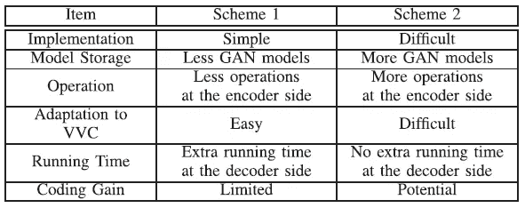

**两种方案对比**

> 最后，**方案一采用**，因为其实现简单， [GAN](/@sh.tsang/review-gan-generative-adversarial-nets-gan-e12793e1fb75) 模型少，编码器端运算量少，易于适应 VVC。

# 4.一些训练细节

## 4.1.训练数据集和输入

*   **训练数据集**由来自**未压缩彩色图像数据库**的分辨率为 **512 × 384** 的 **800 幅图像**组成。
*   它们使用 QP 22 编码。
*   这个样本和它对应的没有任何编码失真的基础事实形成一个训练对。
*   只提取亮度分量用于训练。
*   在训练阶段，为每个样本随机设置缺失部分的初始像素值:

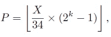

*   其中⌊ ⋅ ⌋是地板舍入运算的函数， *X* 从{0，1，2，…，34}中随机选择， *k* 表示位深度。

## 4.2.损失函数

*   **通过均方误差损失函数( **MSE** )对发生器的前几个时期**进行训练:

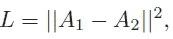

*   其中 *A* 1 和 *A* 2 为局部信息，即地面真实和预测块的缺失部分。
*   几个纪元后，整个 [GAN](/@sh.tsang/review-gan-generative-adversarial-nets-gan-e12793e1fb75) 网络就可以训练好了。对于每次训练迭代，生成器和鉴别器将被逐一重复更新。这是一个极小极大优化问题:

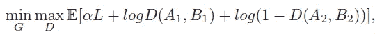

*   其中 *B* 1 和 *B* 2 为全局信息，即整个 128 × 128 图像。
*   *α* = 2500 以平衡 MSE 损失和二值交叉熵损失。

# 5.实验结果

*   用的是 HM-16.17。使用所有帧内配置。
*   不同于训练数据的测试序列在普通测试条件(CTC)下用四个 qp 编码，包括{22，27，32，37}。

## 5.1.帧内预测比较

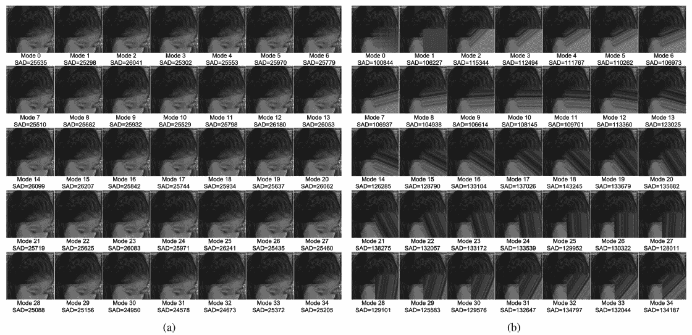

**帧内预测比较。** [**【甘】**](/@sh.tsang/review-gan-generative-adversarial-nets-gan-e12793e1fb75) **基于帧内预测。(b)基于角度的帧内预测。**

*   来自基于 [GAN](/@sh.tsang/review-gan-generative-adversarial-nets-gan-e12793e1fb75) 的帧内预测的结果更加一致并且具有更低的 sad。
*   最好的是模式 31，最小 SAD 值为 24578。

## 5.2.敌对术语的影响

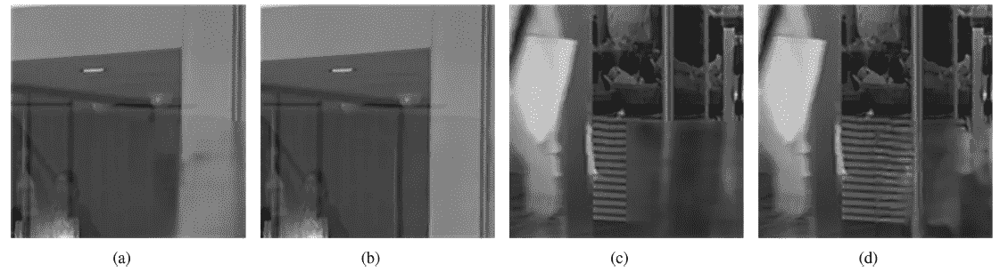

**(a) & (c):无对抗性项，(b) & (d):有对抗性项**

*   **有对抗项的结果比没有对抗项的结果更清晰**，并且 **MSE 值也小得多。**
*   原因是局部和全局鉴别器使得预测的像素信息在局部和全局中一致。

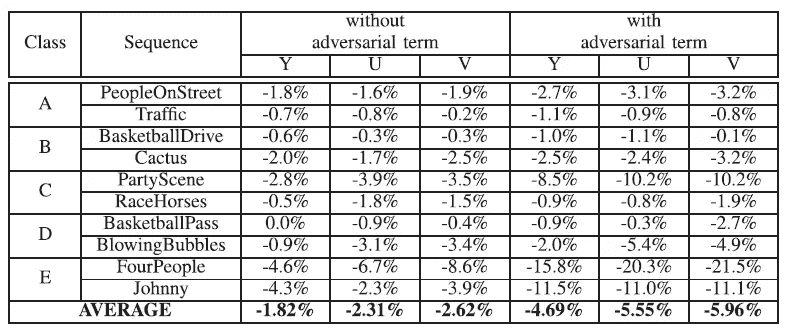

**BD-率(%)**

*   针对具有对立项的帧内预测的修补可以**实现更多编码增益。**

## 5.3.与 SOTA 方法的比较

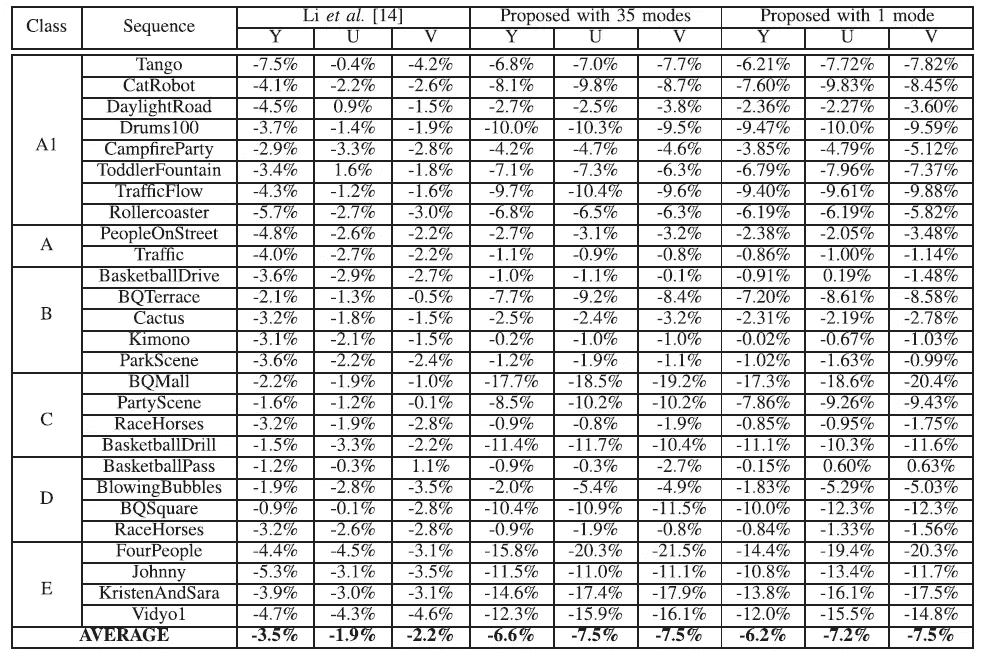

*   对于具有 35 种模式和 1 种模式的**，对于亮度**和两种色度分量，它们分别可以实现平均 **6.6%** ，7.5%，7.5%和 **6.2%** ，7.2%，7.5%的比特率降低，优于[**【IPF cn**](https://sh-tsang.medium.com/review-ipfcn-intra-prediction-using-fully-connected-network-hevc-intra-prediction-28de33dff3a5)**【14】**。****
*   这是因为基于 [GAN](/@sh.tsang/review-gan-generative-adversarial-nets-gan-e12793e1fb75) 的修复依赖于相邻可用块的结构信息，如人脸、桌子等物体。

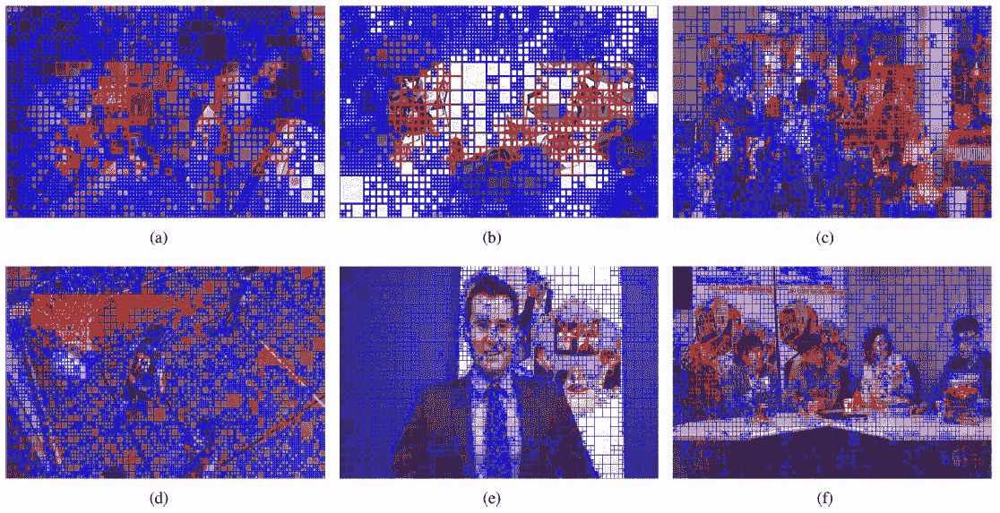

**蓝色:常规帧内预测，红色:** [**甘**](/@sh.tsang/review-gan-generative-adversarial-nets-gan-e12793e1fb75) **基于帧内预测**

*   基于 [GAN](/@sh.tsang/review-gan-generative-adversarial-nets-gan-e12793e1fb75) 帧内预测的块主要位于纹理区域。

> 相邻块中的结构信息越多，选择基于 [GAN](/@sh.tsang/review-gan-generative-adversarial-nets-gan-e12793e1fb75) 的帧内预测的概率就越高。

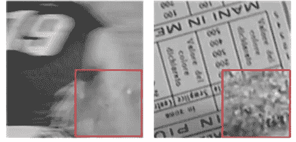

**失败案例**

*   高速的动作，还有人物，是[甘](/@sh.tsang/review-gan-generative-adversarial-nets-gan-e12793e1fb75)无法预测的。

## 5.4.小型 QP 集和大型 QP 集

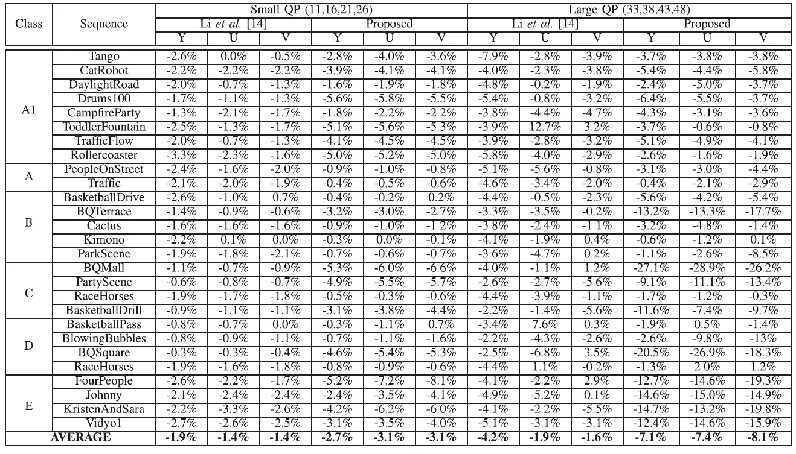

**使用不同 QP 范围的 BD-Rate(%)**

*   使用相同的模型，但将其应用于不同的 QP 范围，也有 BD-rate 减少。

## 5.5.适应 VVC

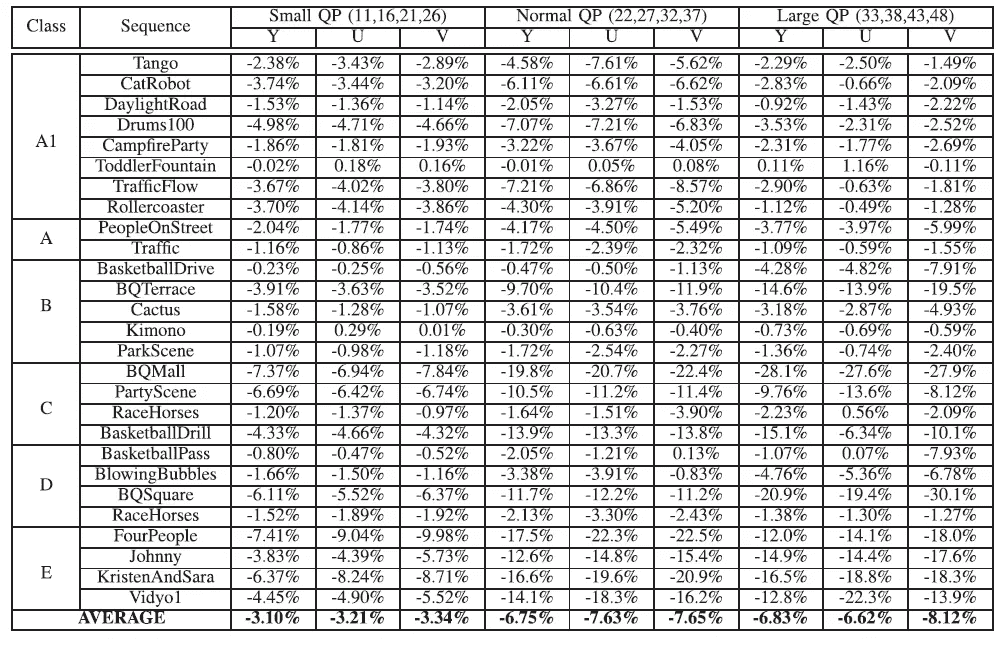

*   在小、正常和大 QP 设置下，对于亮度分量，所提出的方法分别实现了 3.10%、6.75%和 6.83%的比特率降低。

## 5.6.计算复杂性分析

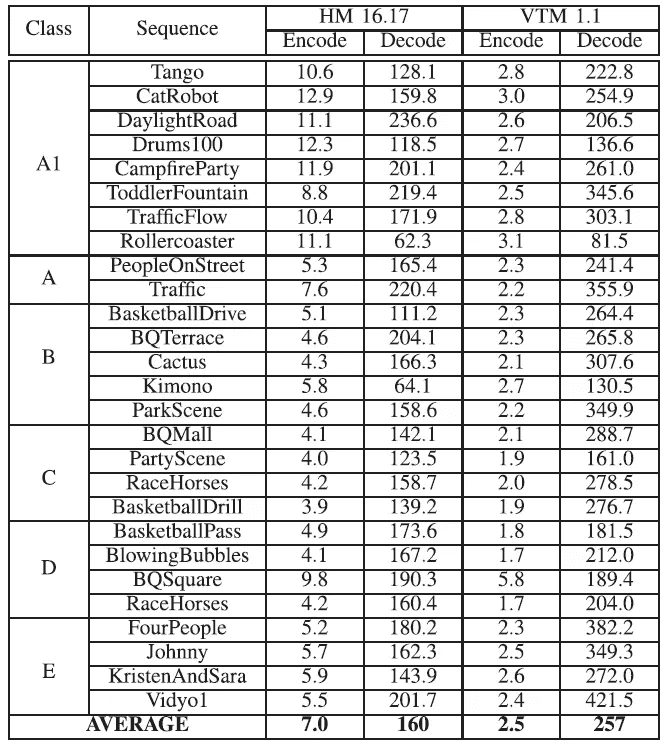

**计算复杂度分析**

*   **使用 CPU+GPU** ，在 **HM(VTM)** 下，对于**编码**和**解码**，该方法的计算复杂度与原 HM(VTM)相比，平均为 **7(2.5)** 和 **160(257)** 倍。
*   **使用 CPU** ， [**IPFCN**](https://sh-tsang.medium.com/review-ipfcn-intra-prediction-using-fully-connected-network-hevc-intra-prediction-28de33dff3a5) 和该方法的计算复杂度与原 HM 相比，对于**编码**平均为 **86** 和 **149** 次，对于**解码**平均为 **201** 和 **5264** 次。

## 参考

【2020 TMM】【朱 TMM ' 20】
[基于生成对抗性网络的视频编码帧内预测](https://ieeexplore.ieee.org/abstract/document/8744274)

## 生成对抗网络

**图像合成** [ [甘](/@sh.tsang/review-gan-generative-adversarial-nets-gan-e12793e1fb75) ] [ [CGAN](/@sh.tsang/review-cgan-conditional-gan-gan-78dd42eee41) ] [ [拉普甘](/@sh.tsang/review-lapgan-laplacian-generative-adversarial-network-gan-e87200bbd827)][[DCGAN](/@sh.tsang/review-dcgan-deep-convolutional-generative-adversarial-network-gan-ec390cded63c)][[pix 2 pix](https://sh-tsang.medium.com/review-pix2pix-image-to-image-translation-with-conditional-adversarial-networks-gan-ac85d8ecead2)]
**超分辨率**[[SRGAN&SRResNet](/@sh.tsang/review-srgan-srresnet-photo-realistic-super-resolution-gan-super-resolution-96a6fa19490)][[EnhanceNet](/@sh.tsang/reading-enhancenet-automated-texture-synthesis-super-resolution-8429635aa75e)][[ESRGAN](/towards-artificial-intelligence/reading-esrgan-enhanced-super-resolution-generative-adversarial-networks-super-resolution-e8533ad006b5)
**模糊**

## 编解码器帧内预测

)(我)(们)(都)(不)(知)(道)(,)(我)(们)(还)(不)(知)(道)(,)(我)(们)(还)(有)(些)(不)(知)(道)(的)(情)(况)(,)(我)(们)(还)(不)(知)(道)(,)(我)(们)(还)(不)(知)(道)(,)(我)(们)(还)(是)(不)(知)(道)(道)(,)(我)(们)(还)(不)(知)(道)(,)(我)(们)(还)(有)(些)(不)(知)(道)(的)(情)(情)(情)(。 )(他)(们)(都)(不)(在)(这)(些)(事)(上)(,)(她)(们)(还)(不)(在)(这)(些)(事)(上)(有)(什)(么)(情)(况)(呢)(?)(她)(们)(都)(不)(在)(这)(些)(事)(上)(,)(她)(们)(还)(不)(在)(这)(些)(事)(上)(还)(有)(什)(么)(情)(况)(?)(她)(们)(们)(都)(不)(在)(这)(些)(事)(上)(有)(,)(她)(们)(们)(还)(不)(在)(这)(些)(事)(上)(,)(她)(们)(们)(还)(不)(在)(这)(些)(事)(上)(还)(有)(什)(么)(好)(的)(情)(情)(意)(。 )(我)(们)(都)(不)(知)(道)(,)(我)(们)(还)(不)(知)(道)(,)(我)(们)(还)(有)(些)(不)(知)(道)(的)(情)(况)(,)(我)(们)(还)(不)(知)(道)(,)(我)(们)(还)(不)(知)(道)(,)(我)(们)(还)(有)(些)(不)(知)(道)(的)(情)(况)(。

## [我以前的其他论文阅读材料](https://sh-tsang.medium.com/overview-my-reviewed-paper-lists-tutorials-946ce59fbf9e)