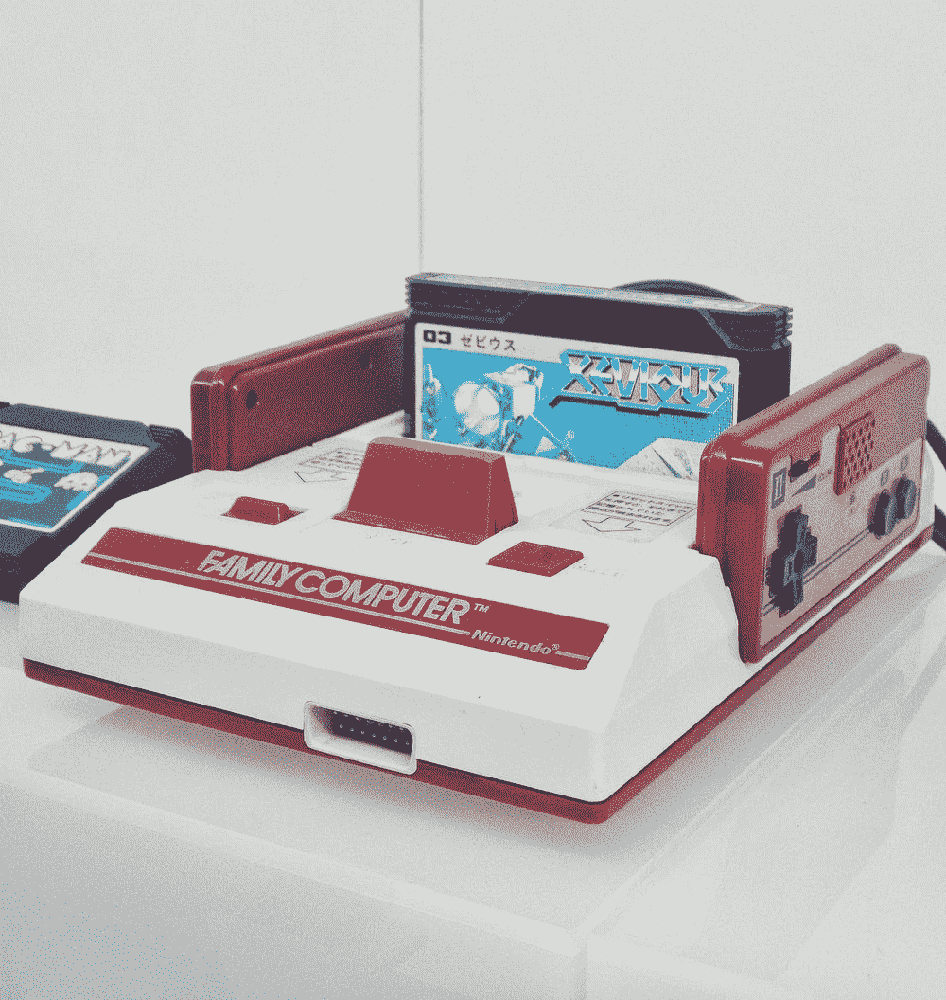
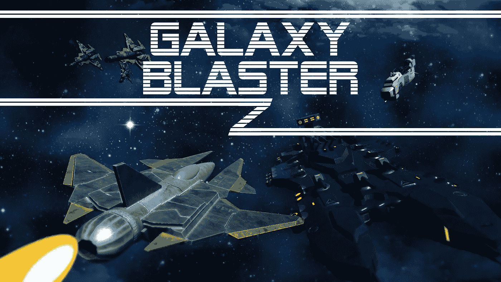

# 重温街机射手

> 原文：<https://medium.com/nerd-for-tech/revisiting-the-arcade-shooter-2f8482164910?source=collection_archive---------22----------------------->

## 下一个新事物实际上是一个新的旧事物

我从零开始制作的第一个完整游戏是[银河爆破手](https://emeldi.itch.io/galaxy-blaster)——一个复古的 2D 太空射击游戏，讲述如何幸存一波又一波随机的敌人并摧毁同名的[巨型无畏舰](/nerd-for-tech/scripting-a-multi-stage-boss-battle-86fb1c3b984d)。如果你读了我当时写的博客，你会发现我在这个过程中一直在摸索，没有太多考虑写好代码。例如:

是啊，别这样。

但是成功了！有时候这就是我们所关心的，对吗？尽管如此，我并没有充分利用 Unity 和 C#。所有敌人的行动都是用一行又一行的数学脚本编写的。我有一个庞大臃肿的类来处理游戏中所有的敌人形态。我在更新中多次使用 FindGameObject 和 FindGameObjectWithTag

不管怎样，我比以前更有经验了。我不需要随机的波形——我有可脚本化的对象。我不需要一个塞满了六个不同实体的行为的超类——我已经有了类继承。我不需要比较标签字符串来找出我刚刚碰撞了哪种对象——我有接口。我不需要编写复杂的空间曲线方程，我只需要录制一个动画。我可以利用代理和事件、抽象类、软件设计模式等等。

所以，考虑到这些，我们要再来一次。更用力。更快。更强。欢迎来到 ***银河激射 Z！***

你可以看出它已经比第一部好了，因为它的结尾有一个 Z。

不仅《引擎盖下》会有所不同，而且我们会彻底改造视觉效果。这将是一个 2.5D 的侧滚游戏，有*更多的 boss*，*更多的武器，更多的敌人，更多的一切！*

我会在一周内完成。祝我好运，并关注我的项目每日更新！