# 奖励视频广告| Unity

> 原文：<https://medium.com/nerd-for-tech/rewarded-video-ads-unity-28a9baebaa91?source=collection_archive---------0----------------------->

## 统一指南

## 关于如何在 Unity 中实现奖励视频广告的快速指南

**目标**:在我们的 2D 手机游戏中使用 Unity 实现奖励视频广告。

在上一篇文章中，我介绍了[如何用 Unity](/nerd-for-tech/cross-platform-input-controller-unity-9b76545a4aa0) 实现移动输入。现在，是时候实现奖励视频广告了，以便在广告被观看时给予玩家一定的奖励。

# 选择构建平台

首先，让我们确保为我们的游戏选择了正确的构建平台。要在我们的游戏中实现 Unity 广告，我们需要在 Android 或 iOS 之间做出选择。在我们的例子中，我们将选择 Android，因此，让我们打开构建设置并确保切换构建平台:

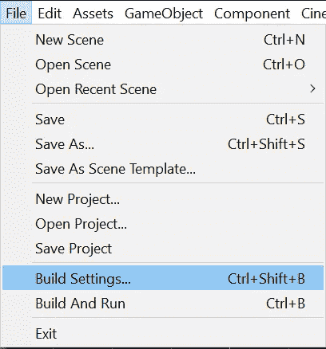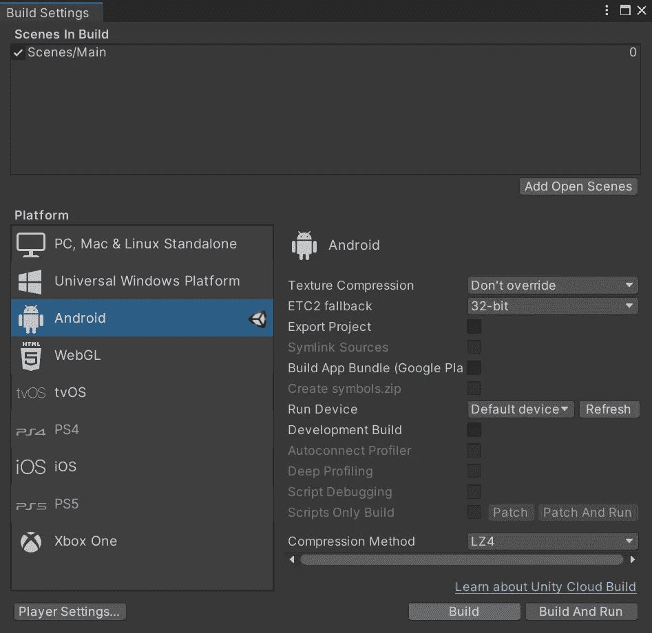

# 导入广告包

然后，为了能够实现 Unity ads，让我们通过使用**包管理器**从 Unity Technologies 导入相应的包。确保打开包管理器，在 **Unity 注册表**中查找广告包，点击 ***安装*** 按钮:

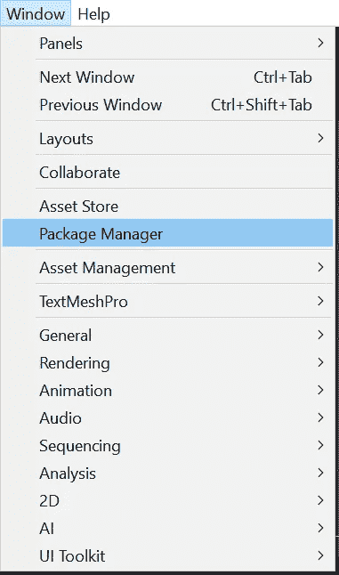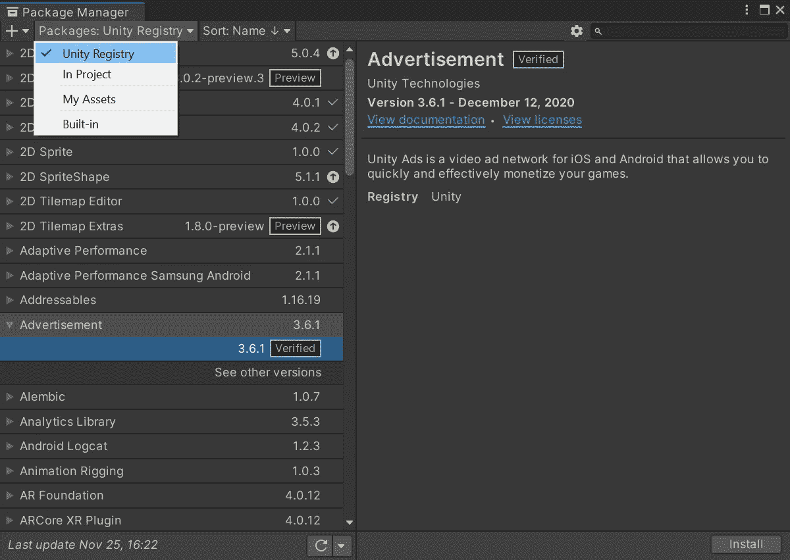

# Unity 项目 ID

接下来，让我们确保创建一个 Unity 项目 ID，以便能够使用 Unity 广告并将其与我们的帐户相关联。为此，让我们打开**项目设置**，在**服务**选项卡中，我们将能够选择我们客户的组织:

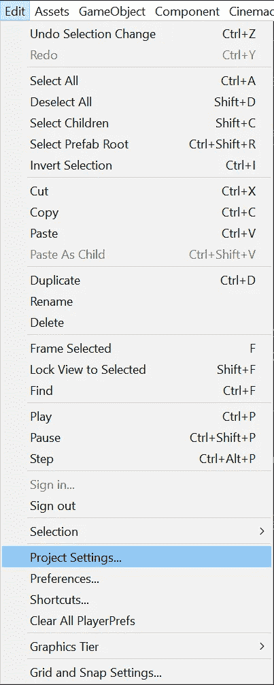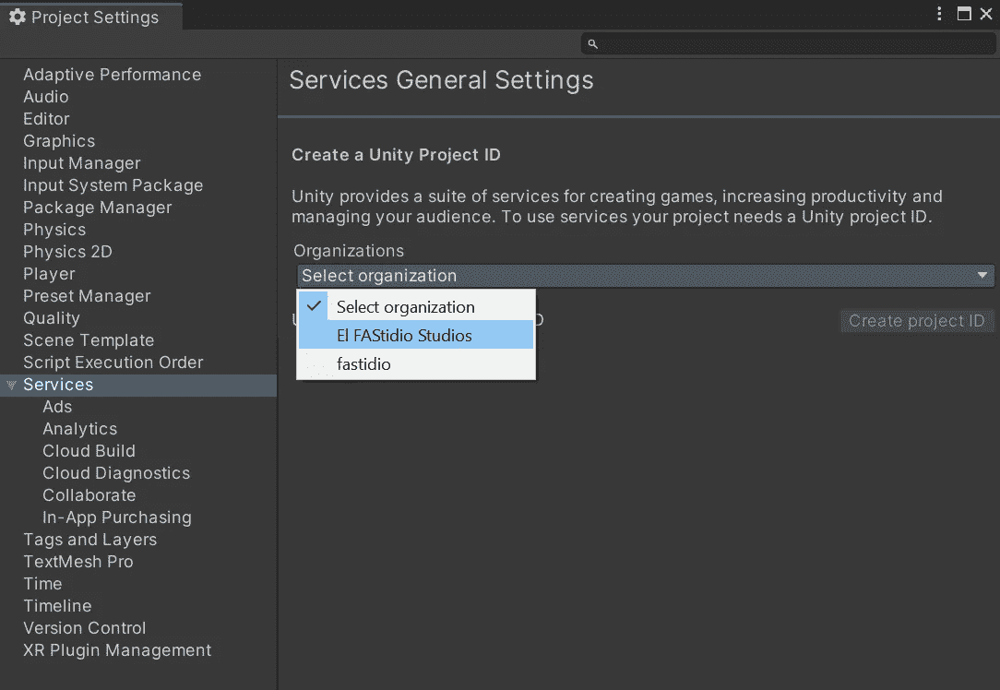

# 启用广告

一旦项目与一个组织相关联，让我们通过打开**服务**窗口并点击**广告**部分来为项目启用广告:

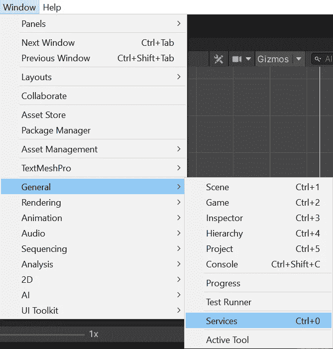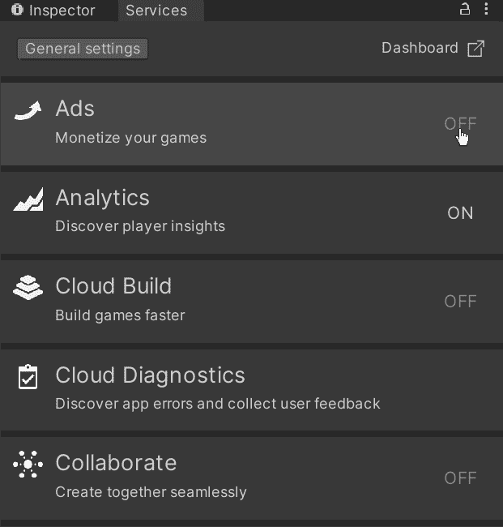

然后，让我们确保定义该项目的 COPPA 合规性，以确定广告是否适合 13 岁以下的儿童。完成后，我们将能够看到广告部分现已启用:

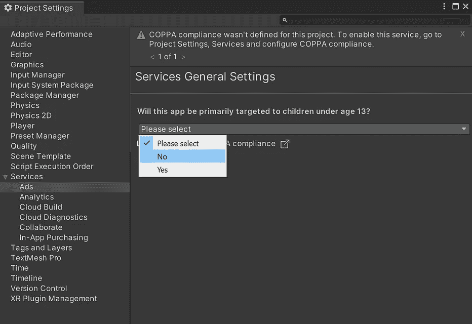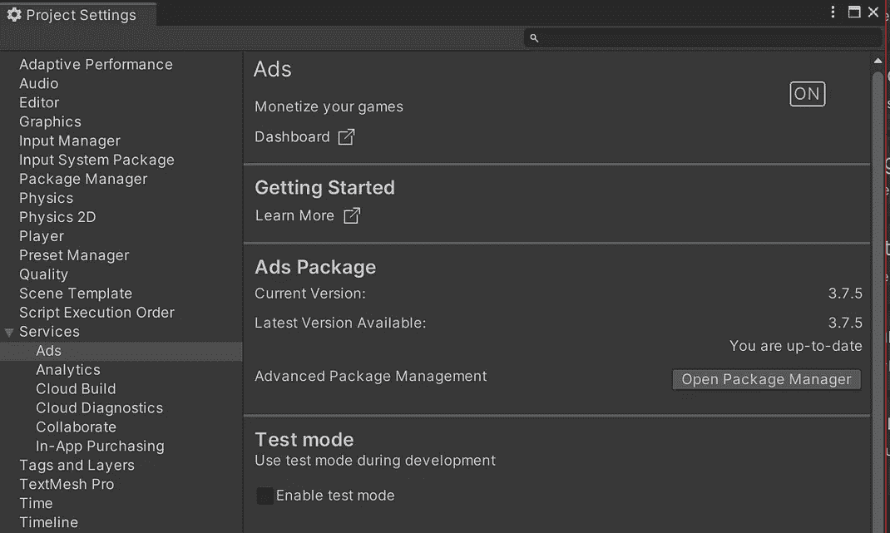

接下来，让我们在同一部分启用测试模式，以测试我们的广告是否有效(并避免被标记为欺诈):

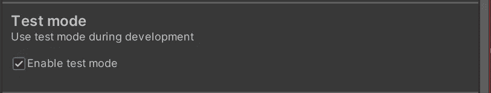

最后，让我们转到 [**Unity 仪表盘**](https://dashboard.unity3d.com/) 并确保完成各自项目中的广告激活。我们将在游戏中只使用 **Unity 广告**和**而不是** Unity 中介:

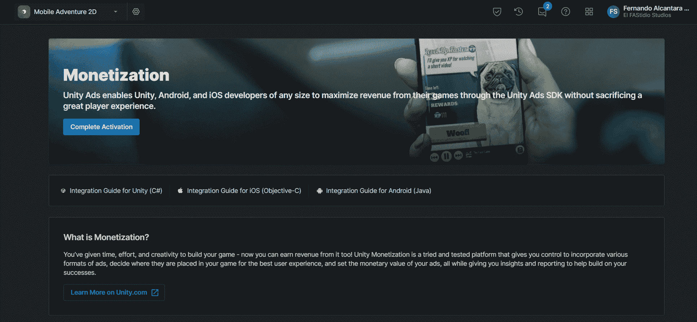

一旦启用广告，我们将看到广告单元，这对于选择我们将在游戏中使用哪种类型的广告非常重要。在这种情况下，当我们实现奖励视频时，我们将使用**奖励 Android** 广告单元。注意广告单元上方的游戏 ID(这是唯一的)也很重要，因为将显示的广告与我们的帐户相关联很重要。

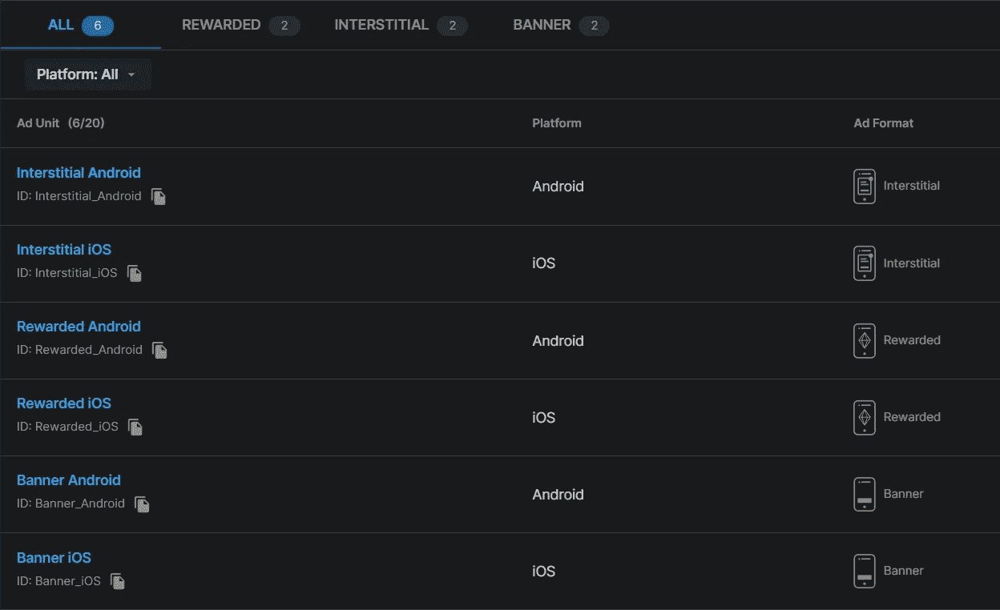

> 一个广告单元是一个广告格式设置的集合，用于在游戏中的单个表面点提供的内容。使用它们来指定表面点，以提供奖励或间隙广告。您还可以使用广告单元来配置高级设置，如广告类型和是否允许跳过。

# 创建广告按钮

一旦我们的项目准备好测试 Unity 广告，我们需要一个按钮来测试奖励视频。如果你一直在关注[我的最新帖子](https://fas444.medium.com/)，那么你会记得[已经为我们的游戏实现了一个商店](/nerd-for-tech/onclick-events-unity-f4805203b039)，所以，让我们使用各自的商店按钮来测试我们的奖励视频:

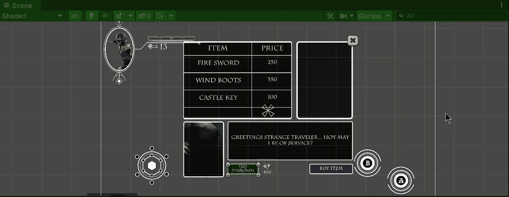

# 实现广告包

现在，为了开始在我们的游戏中使用 Unity 广告，让我们从打开处理商店的商店脚本开始。那么，让我们:

*   添加 **UnityEngine。Advertisements** 名称空间位于顶部，以便能够在此脚本中使用 Unity ads SDK。
*   实现下一个接口(这将允许我们处理广告):

1.  **IUnityAdsInitializationListener**
2.  **IUnityAdsLoadListener**
3.  **IUnityAdsShowListener**

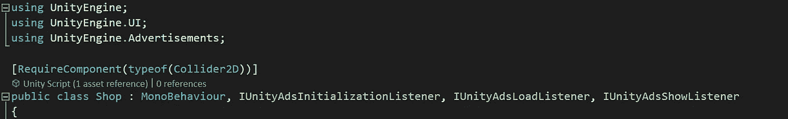

每个接口实现以下方法:

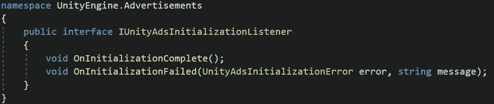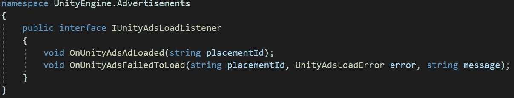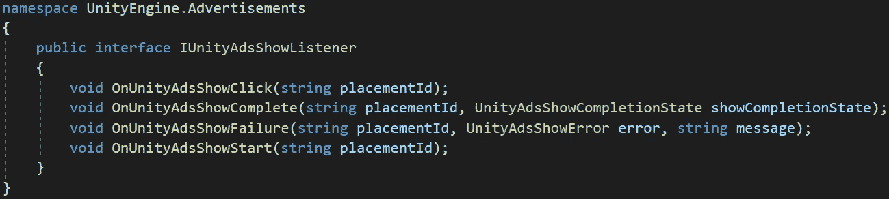

如果你想了解更多关于这些方法的信息，你可以查看官方的 Unity API 参考:

 [## Unity API 参考

### 使用广告名称空间来实现基本的广告内容，如有奖或无奖视频、插播广告等

unityads.unity3d.com](https://unityads.unity3d.com/help/unity/api-unity) 

接下来，让我们添加下一个变量，我们将使用它来处理 Unity ads SDK:

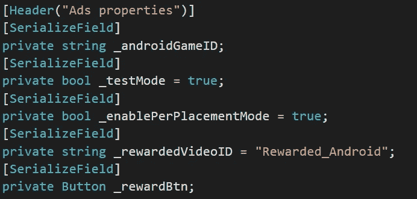

*   Android 游戏 id

该变量将存储 Android 的游戏 ID，以将其与您组织中的项目相关联。您可以在您的 [Unity 仪表盘](https://dashboard.unity3d.com/)上找到此 ID。

*   测试模式

该变量将指示广告是否应在测试模式下显示。

*   启用每次放置模式

此变量将指示 SDK 是否应该使用 Load API 生命周期进行初始化。

*   奖励视频 ID

该变量将存储奖励视频的**广告单元 ID** 。

*   奖励按钮

该变量将存储对 ad 按钮的引用，以便根据 SDK 初始化和加载过程启用或禁用它。

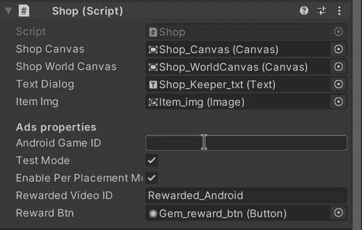

一旦变量定义了各自的值，让我们创建一个新的方法，使用各自的值作为参数来初始化 Unity ads SDK:

> 注意:在我们的游戏中加载任何广告之前，必须初始化 Unity ads SDK。

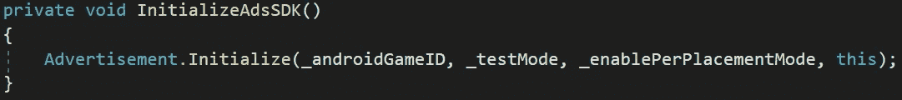

然后，让我们调用 **Awake** 方法上的方法，以确保 SDK 在最开始时初始化:

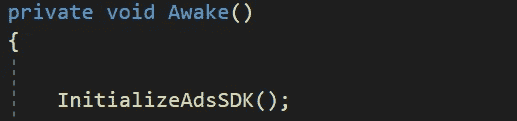

接下来，让我们创建一个新的方法来加载奖励视频广告。我们需要使用广告。使用各自的 **Ad 单元 ID** 和对我们正在实现的 **IUnityAdsLoadListener** 接口的引用来加载方法:

然后，我们将使用由**IUnityAdsInitializationListener**接口实现的方法之一调用上述方法，以确保 Unity ads SDK 在加载广告之前得到初始化:

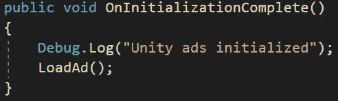

在由**IUnityAdsInitializationListener**接口实现的另一个方法中，我们将确保在 SDK 初始化失败的情况下打印错误:

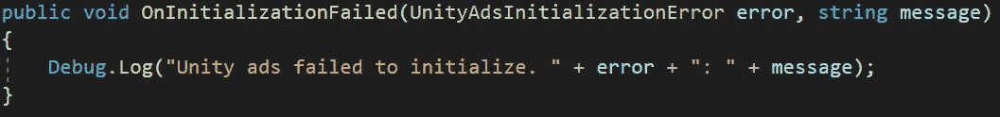

现在，让我们定义由 **IUnityAdsLoadListener** 接口实现的方法。首先，我们将使用 **OnUnityAdsAdLoaded** 方法来启用广告按钮的使用，如果广告加载成功的话:

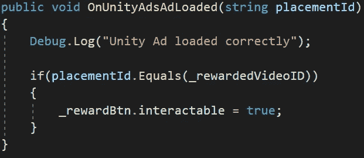

另一方面，如果广告没有成功加载，我们将只打印错误:

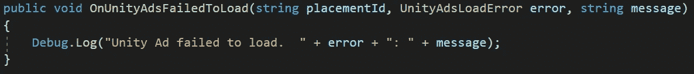

然后，让我们创建一个新的公共方法，该方法将被 ad 按钮的 **OnClick** 事件调用。在此方法中，我们将禁用按钮，并通过使用**广告来显示加载的广告。显示**方法，将各自的 **Ad 单元 ID** 和 **IUnityAdsShowListener** 引用(我们正在实现的接口)作为参数:

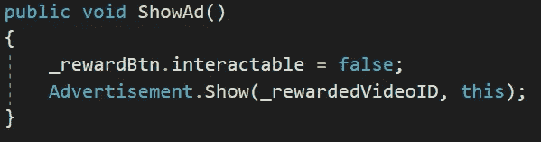

> **重要提示**:一旦方法被创建，确保通过检查器窗口在 ad 按钮的 **OnClick** 事件中引用它。

最后，为了验证奖励视频是否被完整观看，让我们使用由 **IUnityAdsShowListener** 接口实现的回调方法:

*   **OnUnityAdsShowStart** 处理广告开始播放的逻辑。
*   **OnUnityAdsShowClick** 处理用户点击广告的逻辑。

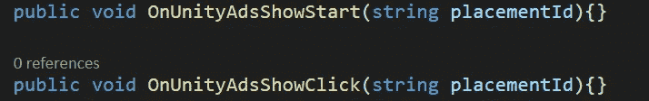

我们暂时不使用这些方法。

*   **OnUnityAdsShowComplete** 处理广告结束的逻辑，因此我们将确保比较**UnityAdsShowCompletionState**枚举参数，以检查视频是否成功完成，并授予我们想要的奖励:

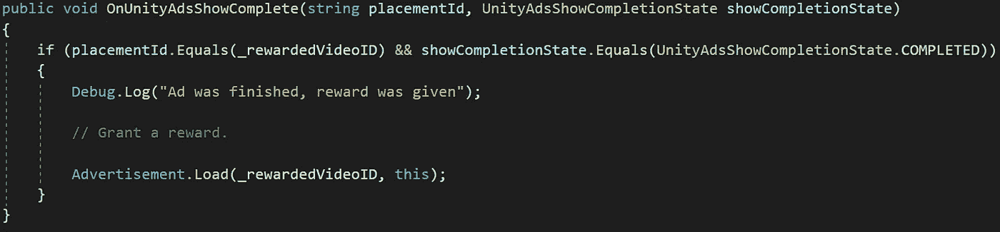

一旦奖励被授予，请确保**加载另一个广告**，以便广告按钮继续按预期工作。

*   **OnUnityAdsShowFailure** 处理广告单元显示失败的逻辑，因此我们将打印这种情况下的错误并加载另一个广告。

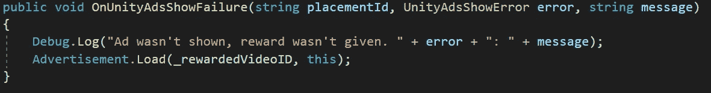

现在，如果我们用 Unity 运行游戏，我们会看到 Unity ads SDK 按预期进行了初始化:

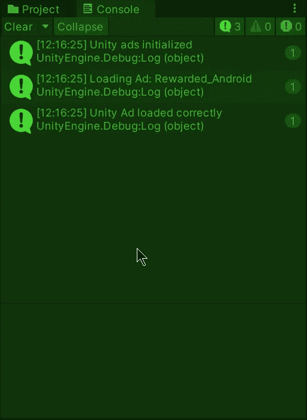

如果我们在商店中使用该按钮，我们将能够在使用测试模式时看到相应的测试广告:

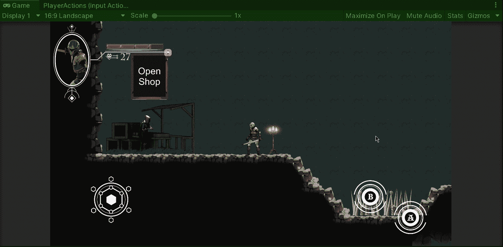

当您的广告准备就绪时，请确保在 Unity 的两侧(代码和仪表板)禁用测试模式。

就这样，我们用 Unity 为我们的游戏实现了奖励视频！:d .我会在下一篇帖子中看到你，在那里我将展示如何向谷歌 Play 商店发布我们的 Unity 游戏。

> *如果你想更多地了解我，欢迎登陆*[***LinkedIn***](https://www.linkedin.com/in/fas444/)**或访问我的* [***网站***](http://fernandoalcasan.com/) *:D**