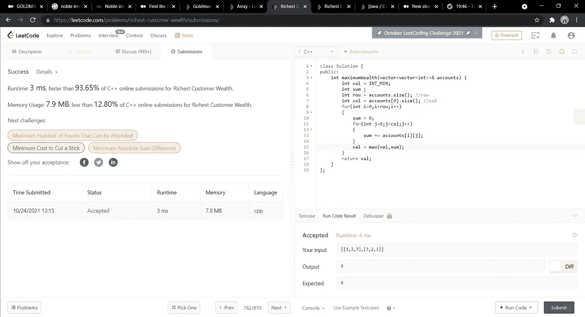

# 最丰富的客户财富

> 原文：<https://medium.com/nerd-for-tech/richest-customer-wealth-5ea0cd2fc2e7?source=collection_archive---------3----------------------->

(LeetCode 易题)


给你一个整数网格`accounts`，其中`accounts[i][j]`是`i​​​​​​​​​​​th​​​​`客户在`j​​​​​​​​​​​th`银行的存款金额。返回最富有的客户拥有的 ***财富*****。**

客户的财富是他们所有银行账户中的钱数。最富有的顾客是拥有最多财富的顾客。

**例 1:**

```
**Input:** accounts = [[1,2,3],[3,2,1]]
**Output:** 6
**Explanation:**
1st customer has wealth = 1 + 2 + 3 = 6
2nd customer has wealth = 3 + 2 + 1 = 6
Both customers are considered the richest with a wealth of 6 each, so return 6.
```

**例 2:**

```
**Input:** accounts = [[1,5],[7,3],[3,5]]
**Output:** 10
**Explanation**: 
1st customer has wealth = 6
2nd customer has wealth = 10 
3rd customer has wealth = 8
The 2nd customer is the richest with a wealth of 10.
```

**例 3:**

```
**Input:** accounts = [[2,8,7],[7,1,3],[1,9,5]]
**Output:** 17
```

**约束:**

*   `m == accounts.length`
*   `n == accounts[i].length`
*   `1 <= m, n <= 50`
*   `1 <= accounts[i][j] <= 100`

1.  **蛮力方法:**

我将讨论的第一种方法是暴力方法。我将简单地遍历每一行和每一列；对于每一行的总和，我会不断比较，以获得最大值。

**时间复杂度— O(m*n)** 其中 m 是行数，n 是列数。

**空间复杂度— O(1)** 因为我没有使用任何额外的空间。

```
**class Solution {
public:
    int maximumWealth(vector<vector<int>>& accounts) {
        int val = INT_MIN;
        int sum ;
        int row = accounts.size(); //row
        int col = accounts[0].size(); //col
        for(int i=0;i<row;i++)
        {
            sum = 0;
            for(int j=0;j<col;j++)
            {
                sum += accounts[i][j];
            }
            val = max(val,sum);
        }
        return val;
    }
};**Dry Run : 
accounts = [[1,2,3],[3,2,1]]
For every customer I will add the wealth , 
here row1 wealth  = 1+2+3 = 6 
row 2 wealth = 3+2+1 = 6 
so the maximum value in each of the cases will be 6.
So 6 is returned as the answer. 
```



**强力方法**

希望这有所帮助！！

**继续编码，继续学习！！**💻🙌

既然你喜欢看我的博客，为什么不请我喝杯咖啡，支持我的工作呢！！[https://www.buymeacoffee.com/sukanyabharati](https://www.buymeacoffee.com/sukanyabharati)☕