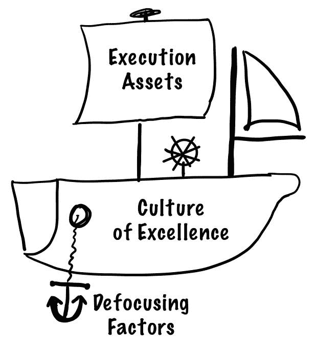

# 将船扶正

> 原文：<https://medium.com/nerd-for-tech/righting-the-ship-a13c65b71fff?source=collection_archive---------7----------------------->

对于专门致力于使 R&D 组织显著加速交付的人来说，当团队面临明显的障碍时，没有什么比被召集起来更容易的了。当你看的时候，你看到前面有一座冰山，不需要太多的新奇:你把你所有的力量和注意力放在解决那个突出的问题上，就是这样。当一个看起来做得很好并且想做得更好的团队接近我时，这变得更有挑战性——也更令人兴奋。

和许多其他事情一样，当你面对没有清晰的前进道路时，你可能会陷入困境，被大量可能的选择所麻痹。我试图帮助我的客户系统地评估需要关注的最重要的因素，而不是呆在橱窗前，考虑选择哪种糕点。在这篇文章中，我将分享这个系统和它所关注的因素——执行资产、卓越文化和散焦因素——以及为了改进它们可以使用的不同杠杆。

没有适用于所有公司的单一优先顺序。尽管如此，我还是会尝试按照默认的合理顺序列出它们:除非列表中较低的项目明显有问题，或者有直接的低挂果实，否则选择一个较高的项目，在那里你可以看到一个杠杆。这样，你可以确保你的船是正确的，或者让它朝着正确的方向前进。没有一些客观，没有风就是好风！(抱歉，伙计们，我似乎在这里滥用了船的比喻。)

# 卓越文化

卓越文化是你的团队的信念、价值观和愿景。它构成了使你的组织独一无二的核心——例如，与对所有公司几乎都一样的技术精通相反。作为基础，你必须确保他们是坚固和维护良好。这里的一个小问题，像船体的一个小漏洞，很少是紧急的，但从长远来看可能是毁灭性的。

## 愿景和路线图

第一件事是确保整个团队在大局和公司目标上保持一致。否则，组织往往会慢慢偏离正确的方向，直到被发现为时已晚。探索愿景和路线图意味着团队将能够做出与公司可能前进的方向一致的持续的微观决策。

*杠杆*:这是自上而下的，你必须确保你[向上游](https://avivbenyosef.com/moving-upstream/)移动，并在路线图上获得可见性和影响力。[产品掌握](https://www.techexecpodcast.com/episodes/product-mastery)也有助于将愿景与实际结果结合起来(对于本文中的许多其他项目来说，这也是一个有价值的杠杆)。

## 价值观和表现形式

如果愿景是你想要得到的，公司的价值观应该指出你的团队成员应该如何沿途做决定。我们都见过一些公司拿出精心制作的信息图表来详细说明他们的价值观，但它们实际上并没有反映出日常生活中的任何真正变化。我见过 IBM 在墙上贴着巨大的“激励价值”海报，这些海报刚刚被嘲笑过。

*杠杆*:第一步是对组织中领导的价值驱动行为和决策进行建模。这同样适用于当你面对几种做事的方式，并在过程中注入要考虑的价值时。看到价值观不仅仅是墙上的标志，而是被积极地运用，这是很有力量的。

## 人才成长

如今，我们花费了巨大的努力来培养优秀的人才，仅仅希望他们自己变得更好是一种巨大的浪费。最好的团队将此视为管理和领导的关键部分，并加速每个员工的成长和提高。想象一下，如果团队中的每个人都定期改进，比如复利，会发生什么。

*杠杆*:确保你积极跟踪你的[彼得潘计数](https://avivbenyosef.com/peter-pan-employees/)。[针对每位员工的积极辅导](https://avivbenyosef.com/the-demise-of-coaching/)，以及针对每个人的需求量身定制的改进目标和辅导计划。你也应该通过面试来让你的生活变得更轻松。

## 领导力

没有卓越的领导力，任何一个团体都无法保持正确的方向，与时俱进地快速成长。现在的一个大问题是我们对待管理不够认真。集成电路花费数年时间磨练他们的工程师技能，但经理们幸运地得到了两天的入职培训和几本书。确保你有一个坚实的管理层是至关重要的。

*杠杆*:在你的组织中，管理被视为一种[职业](https://avivbenyosef.com/management-as-a-profession/)。按照该链接中的描述建立支持系统，并将您的经理设置为[接替](https://avivbenyosef.com/setting-up-new-managers-to-succeed/)。

# 执行资产

这些领域直接转化为更有效地实现的目标、积累的业务优势和差异以及持续的质量。由于这些更具战术性，许多领导者更喜欢从这些开始，因为它们可能更容易掌握和评估。然而，更具战术性也意味着，与优秀文化下列出的那些相比，它们的影响力更小。因此，在决定从这个列表中选择之前，请务必仔细阅读这些内容。

## 科技资本

我创造了术语 *Tech Capital* 来谈论在组织中产生积极影响的技术，它实际上是一种资产，而不是另一种特征(见示例[这里](https://www.techexecpodcast.com/episodes/tech-capital))。实际上，我的每一个接受这种思维方式的客户都看到了巨大的投资回报。棘手的部分是让团队意识到这一点，并通过为其提供空间，将您的资金投入到您所说的地方。

*杠杆*:教导你的领导和集成电路将工程视为创新中心，而不是成本中心。通过实施[间歇](https://avivbenyosef.com/managing-non-feature-work-part-3suggested-approach/)，有规律的习惯性创新是可能的。在谈论[失败](https://www.techexecpodcast.com/episodes/failing-spectacularly)和风险时，确保你的文化提供了安全性。

## 影响焦点

我们都倾向于过度工程化，添加太多的一线希望，开发超出必要范围的解决方案。对影响的关注意味着团队总是努力准确地做需要做的事情，以实现其目标，并减少任何不需要的额外好处。这是快速增加你对每个工程师的影响的一个可靠的方法:如果每个功能都被剥离到核心并且没有填充，我们的时间会被更好地利用。不需要打字更快！

*杠杆*:首先让你的团队同意推回。事实上，让它成为预期的行为。如果一个工程师想知道某个特定的边缘情况是否需要处理，或者某个特征的某个方面是否可以推迟，不应该伤害任何人的自尊心。这往往意味着你需要培养和开放。当人们找到使事情变得更简单、更精简的方法时，一定要重视它，确保你的所有高级职员都坚持不懈地问*为什么需要*东西，而不是默认为理所当然。

## 质量

在一天结束时，你的团队生产的东西必须工作并且工作得很好。这可能是你的团队理解并掌握的东西，但我发现随着公司的成熟和发展，它可能需要更新。

*杠杆*:定期调整你的招聘，使之与团队的现状相匹配。您的人才成长努力可以包括执行能力和技能，例如为工程师提供指导、培训和教育。

## 力量倍增器

你的团队由多层[工程增效器](https://www.techexecpodcast.com/episodes/engineering-force-multipliers)组成。确保人们的潜力得到发挥，确保他们能够留在“天才区”，确保每个人都能有效地帮助他人。

*杠杆*:一些科技资本对工程团队的其他成员来说是一种力量倍增器，比如开发项目是为了工程速度而测量的。为您的团队提供自主决策的权利。创建[指南](https://avivbenyosef.com/guidelines-not-solutions/)来释放瓶颈。

# 散焦因素

最后，有些问题会给团队带来沉重的负担，让团队陷入停滞。这些通常表现为我在开始提到的冰山，但有时它们不太明显。

## 科技债务

没有一篇关于工程组织健康的文章不提到技术债务。当你让它长得太大时，就像背上绑着 40 磅的袋子去跑步一样。虽然我经常说我们不应该纠结于科技债务，但有时候它会变得太大。

*杠杆*:我在这些[文章](https://avivbenyosef.com/managing-non-feature-work-part-1failed-approaches/)中介绍了一个管理非功能性工作的框架，包括技术债务。

## 营业额

另一个可能看起来像漏洞、可能很快失控的问题是过度流动。自然减员可能是领导力、士气或薪酬不佳的滞后指标。有时，它作为与愿景和价值观不一致的领先指标。如果人们不明白他们工作的目的，他们最终会离开。

*杠杠*:离职面谈，最好是能从人那里得到真相的外部人士。是否有不同类型的人会离开，比如某个特定的团队或在公司的某个任期？这可能有助于你发现有问题的经理或薪酬没有竞争力的团队。

## 筒仓和政治

有些问题在整个公司的运营方式中更为常见。一种文化坚持把人放在特定的盒子里，在那里需要政治来完成任何事情，筒仓将官僚主义引入每一步，这将是一种非常难以扩展的文化。

*杠杆*:在执行层面，获得对合作和协作概念的认同，把自我和政治放在一边。例如，拥抱你的[最重要的合作伙伴](https://avivbenyosef.com/the-most-important-partnership/):你的产品对手。许多人在建立跨职能和授权团队方面取得了成功，这些团队可以在最大限度减少外部依赖的情况下完成工作。

实际上，以上每一个话题都会在 [*技术执行操作系统*](https://techexecutiveoperatingsystem.com) 中进行更深入的讨论。我没有重复提到它，而是在这里提醒你，如果你想更深入地挖掘，更好地领导你的组织，你应该拿一本。

*Aviv Ben-Yosef 2021 —最初发表在* [*面向科技高管的最佳时事通讯*](https://avivbenyosef.com/newsletter/)