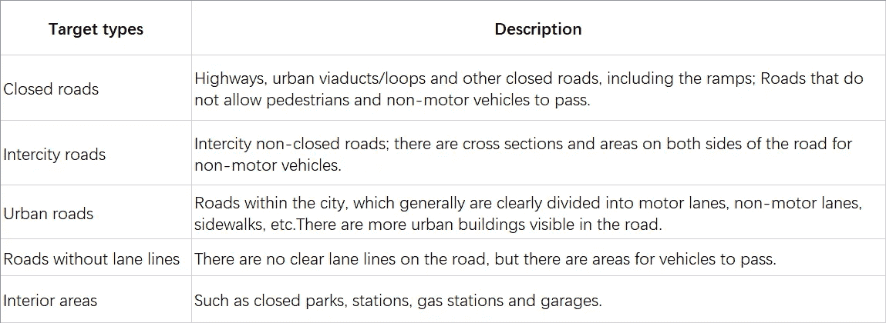
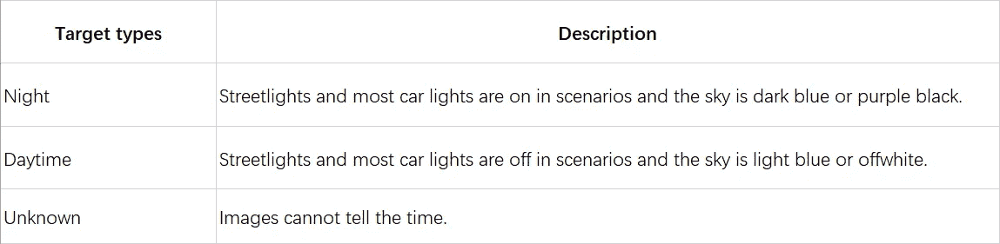
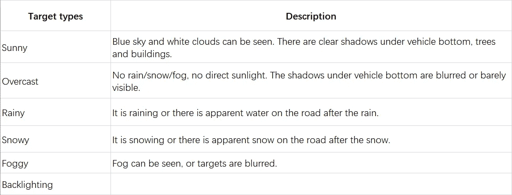
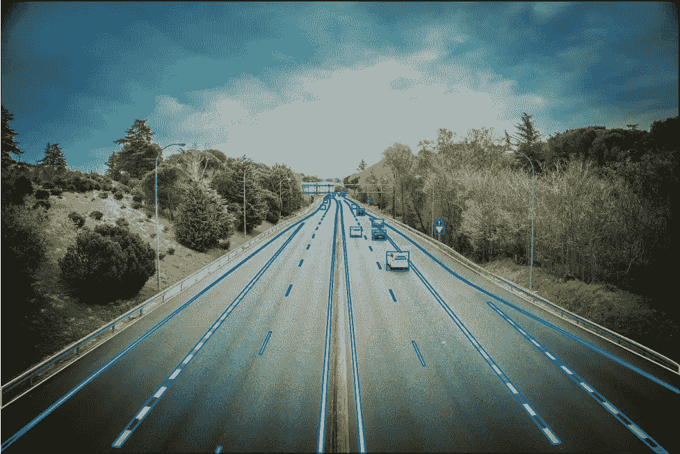

# 道路护栏数据标注案例研究

> 原文：<https://medium.com/nerd-for-tech/road-guardrails-data-annotation-case-study-cfb2930b3cdf?source=collection_archive---------1----------------------->

自动驾驶系统是指由驾驶员执行的工作完全自动化和高度集中的车辆操作系统。要实现自动驾驶，需要解决三个基本问题:车辆往哪里开，往哪里开，怎么开。

感知的目的是告诉自动驾驶系统车辆周围的环境，哪些区域可以通行，哪些区域有障碍物。

我们来看一个道路护栏图像数据标注案例。

道路护栏:位于道路两侧，主要是高速路、城市道路、城际道路两侧的栏杆和护栏。

当车辆在一定条件下行驶时，护栏可以实现以下功能:

一是防止车辆越过中央分隔带进入对面车道；

二是防止车辆在桥梁等危险路段避让，撞断护栏板或从护栏板上钻出；

第三，适当引导驾驶员的视线和行驶轨迹；

第四，当发生轻微碰撞时，车辆能成功导出到正确的行驶方向或回到正常行驶状态。

## **1。项目要求:**

**类型分类**

**剧情时间**

**天气场景**

## 2.标签要求 **:**

可视范围内的所有栏杆和对象的轮廓都应标有多边形。

如果目标中间有被遮挡的部分，就要标注不可见的部分。

## 3.输出

# 结束

将您的数据标注任务外包给 [ByteBridge，](https://tinyurl.com/5ez33e8w)您可以更便宜、更快地获得高质量的 ML 训练数据集！

*   无需信用卡的免费试用:您可以快速获得样品结果，检查输出，并直接向我们的项目经理反馈。
*   100%人工验证
*   透明和标准定价:[有明确的定价](https://www.bytebridge.io/#/?module=price)(含人工成本)

## 为什么不试一试？