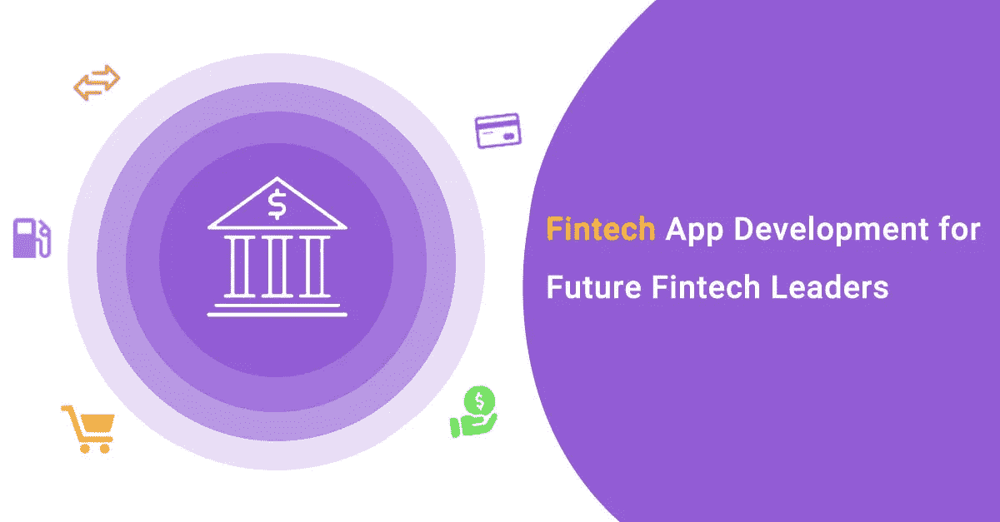
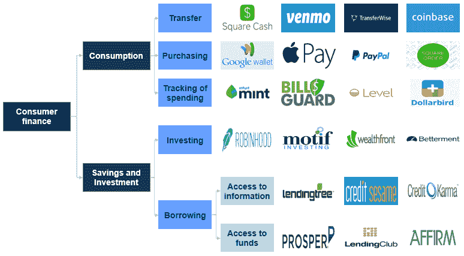
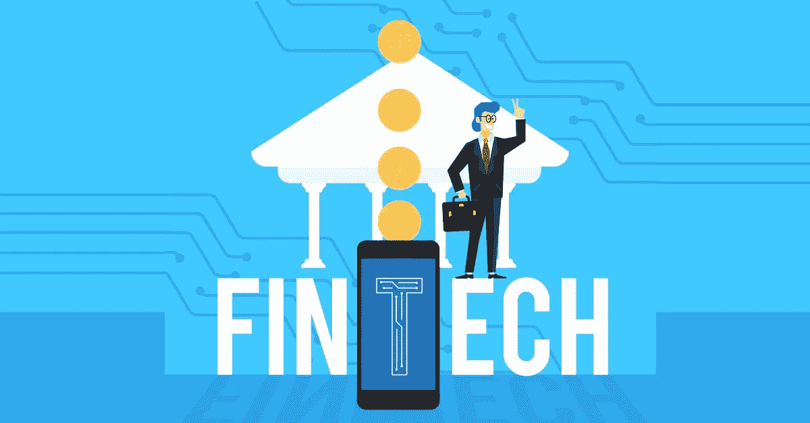

# 未来金融科技领导者的金融科技应用开发路线图

> 原文：<https://medium.com/nerd-for-tech/roadmap-to-fintech-app-development-for-future-fintech-leaders-c3ef01e6e60f?source=collection_archive---------3----------------------->

# **简介**

技术总是打破我们过去遵循的传统惯例。然后，历史上出现了一个“互联网”席卷全球的例子。这为每个部门打开了一个巨大的市场。互联网和技术赋予了每个人在全球平台上选择和表达自己需求和愿望的权利。

我们注意到，随着科技对金融行业造成冲击，金融服务行业也出现了同样的轨迹。这篇博客旨在增强你对金融科技应用如何带来一波显著变化的理解，这些变化永久性地扰乱了金融服务行业。

让学习开始吧！

# **什么是金融科技？**

金融科技是注入创新技术的金融服务的设计和交付。这是术语“金融技术”的缩写。金融科技是对金融服务行业产生了巨大影响的无数技术、产品和商业模式的集合。

它邀请了从众筹到无现金支付，到虚拟货币，再到机器人顾问的每一个金融领域。每当你转移资金或网上购物时，这就是金融科技。

# **金融科技如何改变了金融服务业？**

自 20 世纪 50 年代以来，金融科技一直是金融业的一部分。我们在使用自动取款机和信用卡时使用它。很明显，在前几年，银行主导了金融科技行业。但在 90 年代后，随着网络和电子商务等基于互联网的服务的使用增加，科技公司有机会逐步取代旧的基于手机的零售商品模式。

世界见证了金融科技的两个版本。让我们了解他们今天是如何为我们服务的。

1.  Fintech 1.0 更侧重于在线支付系统、交易和借贷。它也让投资者转向理财产品。
2.  **Fintech 2.0
    但它更专注于重新定义和创造新的金融科技解决方案。**

# **为什么金融科技公司会占上风？**

*   金融科技公司取得了指数级增长，因为它们成功填补了客户预期和银行传统科技产品之间的差距。他们设法使金融交易更加快捷、方便，并将用户体验提升到一个全新的水平。
*   金融科技公司还享受着决定自己希望涉足的银行业领域的独立性。因此，有效地解决一个问题就能产生巨大的回报。
*   金融科技革命为很大一部分没有银行账户的人群提供了金融包容性。尽管如此，全球仍有大约 20 亿人完全没有银行账户。他们省钱的唯一方法是把钱藏在床垫下。人工智能还将银行业和金融科技推向了新的高度。

# **金融科技公司占领的市场**

*   加密/区块链
*   银行业务
*   支付
*   放款
*   资本市场
*   财富管理
*   保险

让我们来看一些描绘金融科技过去、现在和未来的统计数据。

# **统计**

*   2018 年，金融科技投资激增 **18%** 。从事借贷和支付技术的初创公司获得的资金最多。
*   在这个星球上的 20 个主要经济体中，至少有三分之一的人使用金融科技服务。
*   2018 年，大约 70%的银行高管同意，与金融科技合作是最简单的未来投资之一，也是银行的必需品。
*   2018 年金融科技公司获得了大约**120 亿**美元的投资。
*   在 **2020** 年，贡献最大的部分之一将是**数字支付**，交易总额高达**44，064 . 31 亿美元**。
*   全球 27%的企业预计将在 2019 年保持目前对金融科技服务的使用，而另外 24%的企业计划在下一年进行同样的推广。
*   **61%** 的美国人在 **2018** 使用金融科技解决方案，预计到 **2022** 这一数字将达到 **65.3%。**
*   fin tech*[***按需应用开发***](https://www.technource.com/on-demand-app-development/) 的统计数据看起来很健康。让我们来研究几个最成功的金融科技应用程序。*

# ***排名前三的金融科技应用***

**

## ***罗宾汉***

*Robinhood 通过推出面向千禧一代的免佣金应用程序，改变了在线股票交易的面貌。他们帮助初学者以及业余个人投资于股票市场。*

*Robinhood 打破了传统的以佣金为基础的做法，并使他们的竞争对手也这样做，以便与 Robinhood 竞争。它暗示了“热门投资”机会，并允许付费和未付费用户进行交易，而无需等待他们的资金结算。*

*它向用户提供关于他们即将到来的红利的提醒。它还会在你第一次注册后提供一只免费股票，以及过去五年内与股票相关的完整信息。该公司目前价值 112 亿美元。*

## ***M-Pesa***

*M-Pesa 是肯尼亚 Safaricom 于 2007 年推出的一项点对点移动汇款服务。移动汇款模式如此成功，以至于在推出后的 5 年内就拥有了大约 1950 万用户。*

*M-Pesa 允许其用户通过 SMS 转移电子现金以及将电子现金转换成实际现金。现金操作发生在离用户最近的 M-Pesa 零售店。这些被称为 M-Pesa 的“代理人”。*

*多年来，M-Pesa 处理了肯尼亚国内生产总值的 48.76%。这相当于 290 亿欧元或 3.6 万亿先令。M-Pesa 在肯尼亚的成功归功于其快速便捷的转账。对于在城市工作的肯尼亚人来说，向农村地区汇款是一项繁琐的任务。Safaricom 看到了这种需求，并通过 M-Pesa 加以利用。*

## ***Paytm***

*Paytm 是一家总部位于印度的金融科技公司，已经成为电子钱包、移动支付和电子商务领域的领跑者。Paytm 于 2010 年进入市场。随后的去货币化诱使人们使用 Paytm，并成为现金极度有限的经济中的一个启蒙者。*

*用户可以存储和转移钱包里的钱。他们可以用它来支付电费、煤气费或电话费，购物，还可以把钱转回到他们的银行账户。*

*Paytm 目前价值 80 亿美元，拥有 2.5 亿注册用户，并且还在增加。去货币化过程极大地推动了公司所需的扩张，并使 Paytm 成为印度家喻户晓的名字。*

# ***金融科技应用开发必备功能***

*   *轻松登录/注册*
*   *直观的仪表板*
*   *安全支付网关*
*   *账户管理*
*   *用户概要*
*   *推送通知*
*   *生物安全系统*

*在构建一个基本的功能性金融科技应用程序时，上述功能是必不可少的。随着从顶部选择 [***app 开发框架***](https://www.technource.com/blog/top-10-mobile-app-development-frameworks/) ，集成其他工业 4.0 技术如人工智能可以[显著改善用户体验](https://bootcamp.uxdesign.cc/common-ux-mistakes-that-you-can-avoid-while-designing-a50a73720f0e)。*

*当我们谈论构建金融科技应用时，我们必须明白，创建这样一个复杂的应用需要一个技术娴熟、经验丰富的开发团队，他们将在不同的领域工作，如编码、设计、测试等。应用程序的构建成本会因需求的不同而有很大差异。*

*让我们来看看建立一个金融科技应用程序的预算范围。*

# *开发一个金融科技应用的成本？*

*如果没有选择正确的 IT 服务提供商，银行移动应用程序开发可能会成为一个成本高昂的过程。尤其是在像美国和欧洲这样每小时开发成本超过 150 美元的地区。像印度这样的国家每小时工资很低，在 25-50 美元之间。*

*一个具有简单功能的 Android 或 iOS 应用程序可能会花费超过 10，000 美元，需要大约 2 个月的时间来开发。一个功能一般的相同应用程序的价格在 40，000-80，000 美元之间，可能需要 2 到 4 个月的时间来准备部署。而一个具备所有功能的高级应用程序的价格在 70，000 美元到 1，50，000 美元之间，需要 4 到 8 个月才能部署就绪。*

*应用程序开发过程实际上是一个动态过程。随着技术、功能和开发区域的变化，价格和开发时间会有令人震惊的波动。如果一个人需要使用混合或跨平台技术开发类似的应用程序，他们将在 [***应用程序开发成本***](https://www.technource.com/blog/mobile-app-development-cost-complete-guide/) 和时间内经历巨大的变化。*