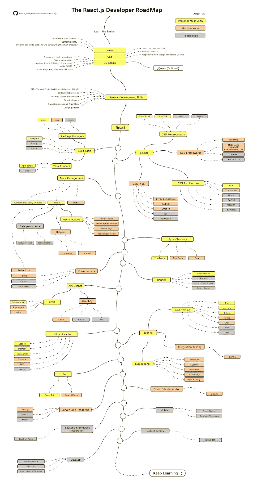

# ReactJS 开发人员路线图

> 原文：<https://medium.com/nerd-for-tech/roadmap-to-reactjs-developer-c4f1c8f0f9a4?source=collection_archive---------10----------------------->

查看 ReactJS 开发人员的完整人生旅程

照片由[捕捉人心。](https://unsplash.com/@dead____artist?utm_source=medium&utm_medium=referral) on [Unsplash](https://unsplash.com?utm_source=medium&utm_medium=referral)

免责声明:写这篇博客的原因是让 ReactJS 的新手知道从哪里开始，你应该学习什么来更快地成长和掌握你的知识。

你可以看到[**GitHub**](https://github.com/adam-golab/react-developer-roadmap)**repo 在哪里我要跟你说一下。**

****

**[https://github.com/adam-golab/react-developer-roadmap](https://github.com/adam-golab/react-developer-roadmap)**

**如果你想了解 REACTJS 的要点，[看看这个](https://arunkashyap199.medium.com/key-points-of-react-5b394068c98d?source=your_stories_page-------------------------------------)！**

**如果你要去面试，请关注[我最近的博客](/nerd-for-tech/beat-every-reactjs-interview-with-these-questions-15971921d9f8)，我在博客中描述了 JavaScript 和 ReactJS 的所有要点。**

*****感谢阅读，快乐编码我的朋友！*****