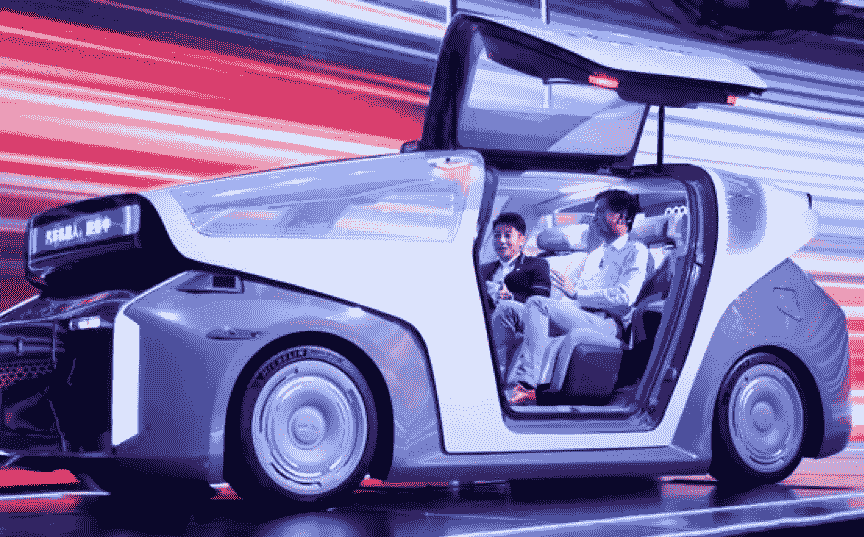
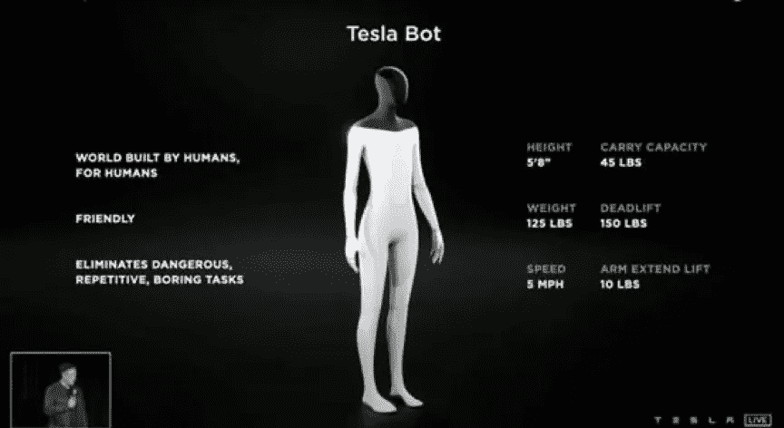
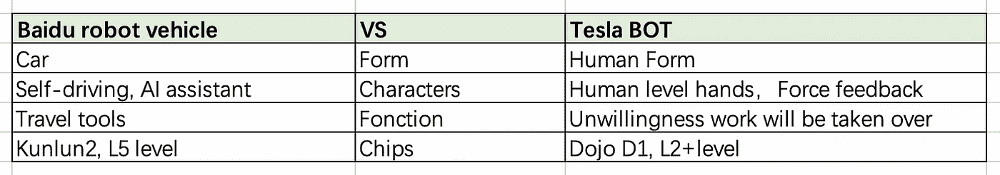

# 机器人 PK:百度“阿波罗”自动驾驶机器人车辆 VS 特斯拉 bot 机器人

> 原文：<https://medium.com/nerd-for-tech/robot-pk-baidu-apollo-self-driving-robot-vehicle-vs-tesla-bot-robot-794a17dd0a?source=collection_archive---------2----------------------->

# “机器人”的概念火了

李彦宏刚刚在百度世界大会上发布了百度“阿波罗”自动驾驶机器人车辆。两天后，大洋彼岸的硅谷“狂人”也心照不宣地在特斯拉 AI 日宣布，特斯拉正在研发一款特斯拉 BOT。

百度机器人汽车

李彦宏发布了“汽车机器人”，它看起来像一辆汽车，可以实现 L5 级无人自动驾驶，配备了人工智能对话系统。一旦接到订单，“汽车机器人”就可以带你去目的地。

马斯克的人形机器人身高 1.73 米，体重 56.7 公斤。它有一只人手，由超轻材料制成，可以扫描有用的信息。它的移动速度为 8 km / h，看起来很像科幻电影里的机器人。

在特斯拉 AI 日，为了展示特斯拉 BOT 机器人，马斯克请了一名舞蹈演员来“伪装”机器人。舞者穿着机器人的衣服，开始是机械动作，后来变成了流畅的舞蹈。在会议中，马斯克介绍了机器人的概念。原型要到明年才会出现。

特斯拉机器人

李彦宏的百度“阿波罗”自动驾驶机器人车在百度世界生命大会上正式发布。在构建机器人的思维和逻辑方面，这两个家伙有不同的观点。李彦宏的是一家人工智能公司制造的人工智能机器人，马斯克的是一家汽车公司制造的人工智能机器人。

然而，R & D 的底层逻辑是基于人工智能技术的。在核心技术数据处理方面，特斯拉机器人的驾驶能力是“L2 +”级别。搭载 7NM 制程 AI 芯片 Dojo D1 为基础，训练其 L2 级别自动驾驶 FSD。百度的机器人具备 L5 自动驾驶能力，搭载百度自研芯片——7nm AI 芯片昆仑 2。

李彦宏也非常相信技术。马斯克从汽车到火箭不断创新，通过高科技产品完成工业拼图。李彦宏雄心勃勃，有耐心，而且耐得住寂寞。从芯片到车载机器人，一步步突破，持续的高强度投入。

对于机器人与人的关系，两者“英雄所见略同”，即**让技术为人服务**。李彦宏表示，百度的“阿波罗”自动驾驶机器人车辆“能够自动驾驶，智能助理，忠诚的伴侣，并能自我学习。人工智能制造的技术和产品必须服务和帮助人，而不是伤害和控制人。

马斯克表示，特斯拉机器人“由人类世界制造并为人类世界服务”，“友好且无威胁”。特斯拉推出这款机器人，是希望它能代替人类完成一些枯燥、危险、重复的工作。未来，所有人类不想做的事情都将交给特斯拉机器人。

# 数据、算法和处理是人工智能不可或缺的三个要素

数据是起点。人工智能系统的性能更多地取决于训练数据，而不是代码。

## 数据是人工智能应用的第二大障碍

Alegion 的一项调查报告称，目前从事人工智能和人工智能项目的企业中，近 80%已经停滞不前。研究还显示，81%的受访者承认，用数据训练人工智能的过程比他们之前预期的更困难。

这不是一个特例。根据 O ' Reilly 2019 年的一份报告，数据问题是人工智能采用的第二大障碍。Gartner 预测，由于标记数据、算法、R&D 团队的管理等方面的偏差，85%的人工智能项目将交付错误的结果。

## 机器学习中的数据限制包括但不限于:

**数据收集:**

数据不准确、代表性不足、观点偏颇、漏洞和数据模糊等问题影响了 ML 的决策和精度。特别是在新冠肺炎期间，一些人工智能企业的某些数据还不可用。

**数据质量:**

由于大多数机器学习算法使用监督方法，ML 工程师需要一致、可靠的数据，以便创建、验证和维护高性能机器学习模型的生产。低质量的标记数据实际上可能会适得其反两次:在训练模型建立过程和未来决策过程中。

## 效率:

在机器学习项目开发过程中，25%的时间用于数据标注。只有 5%的时间花在训练算法上。在数据标注上花费大量时间的原因如下:

*   算法工程师需要经过反复测试，才能确定哪个标签数据更适合训练算法。
*   训练一个模型需要几万甚至上百万的训练数据，需要花费大量的时间。例如，由 10 名贴标机和 3 名 QA 检查员组成的内部团队可以在 8 天内完成 10000 张左右的自动驾驶车道图像贴标。

# 结束

将您的数据标注任务外包给[字节桥](https://tinyurl.com/2k7ee5t9)，您可以更便宜、更快速地获得高质量的 ML 训练数据集！

*   无需信用卡的免费试用:您可以快速获得样品结果，检查输出，并直接向我们的项目经理反馈。
*   100%人工验证
*   透明和标准定价:[有明确的定价](https://www.bytebridge.io/#/?module=price)(包含人工成本)

为什么不试一试呢？

来源:https://baijiahao.baidu.com/s？id=1708703504326707519