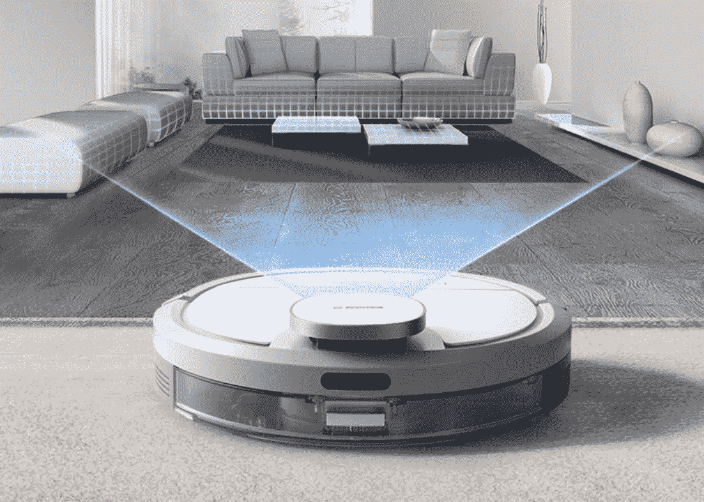

# 机器人扫地是未来智能家居的入口

> 原文：<https://medium.com/nerd-for-tech/robot-sweeping-is-an-access-to-future-smart-home-a7369fe248ee?source=collection_archive---------5----------------------->

## 资本市场看好扫地机器人

[https://zhuanlan.zhihu.com/p/133937902](https://zhuanlan.zhihu.com/p/133937902)

2020 年，机器人行业融资 242 起，总金额 267 亿人民币(41.8 亿美元)，其中扫地机器人占 13%。2021 年 10 月，扫地机器人发生十余起融资案例。据我们所知，清洁机器人每月完成超过 1000 万人民币(157 万美元)的融资。

## 扫地机器人爆炸的原因

**1 大需求**

所有 Z 世代 80 后和 90 后的低级欲望和需求都是一样的。**他们需要变得“更懒”，需要解放双手**。当产品力有所提升时，比如抹布服务出现，价格可以提得更高，同样会出现供不应求的现象。

**2 供应链成熟**

经过大规模的工业应用，一些核心部件的成本已经迅速降低。例如，自动驾驶汽车和零部件等先进技术可以应用到扫地机器人等产品中。

**3 次产品升级迭代**

新一代技术引发的大规模降本和产品升级迭代，催化了行业的爆发。

## 在很多情况下，价格决定了产品力

“现在的价格还是太高了。从我们投入的很多消费产品来看，价格之间的差距(20%或 30%)对最终销售的结果影响很大。”一位投资人说。此外，机器人吸尘器未来还有更多功能可以开发。

很多物联网都是用 WiFi 连接各种家电，大部分都是伪需求，包括智能音箱。在未来，只有两个入口——一个是扫地机器人，因为它可能每天都在使用，并且有足够的家庭数据，另一个是机器人宠物。

## 机器人扫地仍然是明天的产物

扫地机器人和很多产品是有区别的。综合门槛很高，必须超越算法和导航的门槛才能合格。

扫地机器人的核心原则是满足用户的需求。除了拖地，还有很多功能性痛点，比如，角落的清洁。这些功能痛点需要克服，需要创新。所以扫地机器人的成熟还有很长的路要走。

# 对数据标签的需求持续增长

从人工智能技术的研究方向来看，无论是在传统机器学习领域还是深度学习领域，基于训练数据的**监督学习仍然是一种主要的模型训练方法**。尤其是在深度学习领域，需要更多的标记数据来提高模型的有效性。

目前，各行业对最优质的 AI 训练数据需求迫切。人工智能应用于各个领域，如教育、法律、智能驾驶、银行和金融等。每个领域都有细分和专业化的要求。

其中，尤其是智能转型的传统企业和科技企业，更需要有丰富项目经验的培训数据服务商的协助，帮助整理数据标注指令，获取更适合的数据。在特殊场景下使用高质量的数据，减少研发周期，加速实施过程，帮助企业更快更好地进行智能化转型。

## NLP 服务

我们在电子商务、零售、搜索引擎、社交媒体等领域提供不同类型的自然语言处理。我们的服务包括语音分类、情感分析、文本识别和文本分类(聊天机器人相关性)。

ByteBridge 与全球 30 多个不同的语言社区合作，现在提供[数据收集和文本注释服务](https://tinyurl.com/bddbnsy9)，涵盖**英语、中文、西班牙语、韩语、孟加拉语、越南语、印度尼西亚语、土耳其语、阿拉伯语、俄语等语言**。

# 结束

将你的数据标注任务外包给 [ByteBridge](https://tinyurl.com/bddbnsy9) ，你可以更便宜更快的获得高质量的 ML 训练数据集！

*   无需信用卡的免费试用:您可以快速获得样品结果，检查输出，并直接向我们的项目经理反馈。
*   100%人工验证
*   透明和标准定价:[有明确的定价](https://www.bytebridge.io/#/?module=price)(包括人工成本)

为什么不试一试？

来源:[https://www.robot-china.com/news/202111/23/68486.html](https://www.robot-china.com/news/202111/23/68486.html)