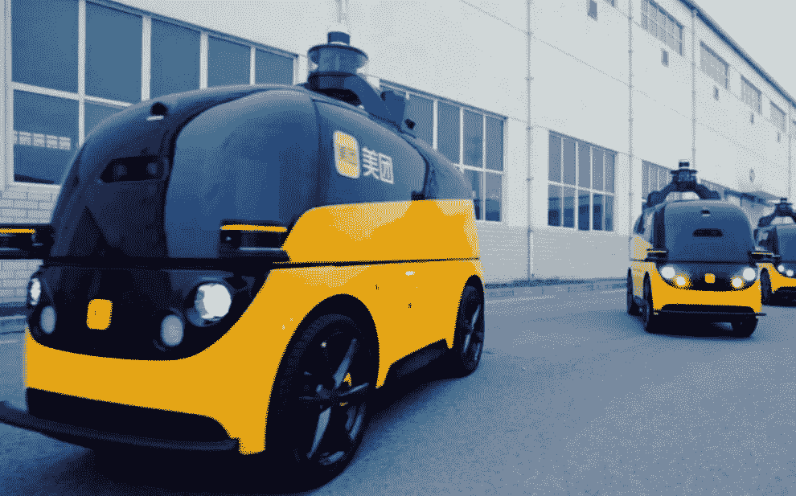

# 数据标注服务如何赋能自主物流？

> 原文：<https://medium.com/nerd-for-tech/robotaxi-seems-to-be-getting-closer-part2-ab96a1f48f42?source=collection_archive---------10----------------------->

## 2021 年自动驾驶进入下半场

www.sohu.com

很多人说 2021 年自动驾驶进入下半场，说的是商业化运营和大规模推广。但正如驭势科技联合创始人、董事长、CEO 吴甘沙所说，“大规模上市**辅助驾驶**，是因为辅助驾驶的错误成本是可控的:**车上有司机**”。

“如果是无人驾驶，**你必须把今天的开放、无边界、不收敛的问题变成有边界、有收敛的问题**，否则不可能实现无人驾驶。”

融合边界的另一边是业务扩张，尤其是专注于 Robotaxi 的企业。

# **受疫情影响，自主物流的投资显然更受欢迎**

罗兰·贝格合伙人武曌告诉记者，商用车领域的优势正在逐步显现。与乘用车相比，物流应用领域相对有限，任务目的明确。

**阅读更多:** [**百度 Apollo 无人驾驶汽车加入抗疫科技助力广州市民物资配送出行**](https://tinyurl.com/tyfat5by)

**在现有条件下更容易实现自动驾驶**，在法律法规及其对城市生活的影响方面相对较少。物流车是推动自动驾驶商业化非常好的一个点。

此前，谷歌旗下的自动驾驶公司 Waymo 和 Pony。中国无人驾驶公司 AI 已经从无人驾驶出租车跨越到自动物流。

**阅读更多:** [**巨型自动驾驶公司 Waymo 介绍**](https://tinyurl.com/2vxfj9d9)

Pony.ai 副总裁、PonyTron 负责人李表示，干线物流将成为 PonyTron 的重点应用场景。随着各地政策的开放，高速、快速场景也逐渐纳入各地路测范围。未来将有机会在大兴机场高速、京台高速、京津高速等路段进行路试。

另一方面，许多 Robotaxi 初创公司认为他们可以压倒其他公司。

WeRide CEO 韩旭今年表示，“未来谁掌握了真正的自动驾驶平台技术，谁就是王道。拥有这种强大技术能力的自动驾驶公司将能够实现维度崩溃。

在他看来，如今低速慢物流园区的企业，很可能在未来 3–5 年内，被强势的 L4 自动驾驶公司占领战略市场而受到冲击。

## **在某种程度上，维度坍塌是存在的**

“自动驾驶技术无非就是感知、决策、执行。无论是开放的道路还是封闭的公园，乘用车，还是商用车，通用的软件和算法还是存在的。

“对我们来说，技术迁移的成本并不高。感知、融合、计算、决策等软件和算法可以在很大程度上共享。”一家专注 ADAS 的公司管理层坦言，高管控制水平是他们需要进一步学习和提高的。

与此同时，ZF 集团(ZF Friedrichshafen AG)商用车控制系统事业部副总裁兼亚太区总裁于告诉记者，得益于完整的技术体系，ZF 的战略更加灵活，其产品将覆盖更高级别的自动驾驶。“我们可以是零件供应商、子系统供应商或模块供应商。我们也可以只提供一些应用场景的软件服务或解决方案。”

## **然而，次元崩溃并不是那么容易**

有限的场景也有壁垒。这不仅仅是一个技术问题。Robotaxi 初创公司的一些高管表示，其技术能力向下迁移没有问题，**，但这些场景中竞争的关键实际上是资源障碍和主要场景**。

无论是公园、机场、港口，还是矿区，如果大规模采用某种自动驾驶技术，其被取代的成本会更高。在这个前提下，相对封闭的场景数量也是有限的。

现阶段的自动驾驶更像丘吉尔说的“这不是终点。但这可能是开始的结束。”

# 自驾车行业中的数据标注服务

自动驾驶的主流算法模型主要基于有监督的深度学习。它是一种算法模型，推导出已知变量和因变量之间的函数关系。需要大量的结构化标记数据来训练和调整模型。

在此基础上，要想让自动驾驶汽车变得更加“智能”，形成可在不同垂直落地场景下复制的自动驾驶应用商业模式闭环，模型需要有海量、高质量的真实道路数据支撑。

## 常见的数据标注类型包括:

*   2D 包围盒
*   [车道标线](https://tinyurl.com/u7u4me)
*   [视频跟踪标注](http://tinyurl.com/wmu4yfhh)
*   点标注
*   [语义分割](https://tinyurl.com/48w576p7)
*   三维物体识别
*   3D 分割
*   传感器融合:传感器融合长方体/传感器融合分割/传感器融合长方体跟踪

# 结束

将你的数据标注任务外包给 [ByteBridge](https://tinyurl.com/3tj9dmyt) ，你可以更便宜更快的获得高质量的 ML 训练数据集！

*   无需信用卡的免费试用:您可以快速获得样品结果，检查输出，并直接向我们的项目经理反馈。
*   100%人工验证
*   透明和标准定价:[有明确的定价](https://www.bytebridge.io/#/?module=price)(包括人工成本)

为什么不试一试？

来源:https://baijiahao . Baidu . com/sid = 1706449735578091670