# 机器人过程自动化🤖

> 原文：<https://medium.com/nerd-for-tech/robotic-process-automation-97b18621d629?source=collection_archive---------1----------------------->

一种难以置信的节省时间的方法🙂🔥

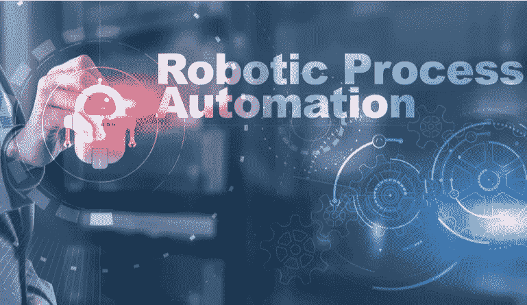

# RPA 是什么？

正如全球公认的那样，RPA 代表机器人流程自动化，无论哪里有机器人流程自动化，它都被称为 RPA。

大家好，我带来了最有趣的新技术之一，RPA，这是我在 IT 行业最喜欢的技术之一。作为一名开发人员，我非常喜欢与 RPA 一起工作，让我们进入这个有趣的故事。

RPA 是一种自动化与软件程序相关的人工任务的方法。如果一个人坐在电脑前做重复性的工作，我们可以在 RPA 的帮助下解放这个人。

在一个特定的公司中，手工业务流程有多大或多小并不重要。我们可以在软件机器人的帮助下自动完成这些任务，这将节省员工的宝贵时间和精力。

任何商业组织都可以从软件机器人做出的结果中获得业务级别的决策，因为 RPA 提供了最高的准确性。

这就是 RPA 的简要内容😀

# 我们不应该将什么视为 RPA？

正如我上面提到的，这些机器人是软件机器人，它们执行过程自动化，但我们需要明白，我们不能完全用软件机器人取代人类，因为软件机器人没有人类智能。那些机器人不能像人类一样思考并做出决定。他们按照人类/ RPA 开发人员创建的预定义指令集工作。

简而言之，我们不能用机器人流程自动化完全取代人类，这是 RPA 的主要缺点之一，并且可能会有一个自动化场景仅用 RPA 无法完全完成。

# 有人值守自动化与无人值守自动化

当谈到使用 RPA 开发的自动化时，它们可以属于有人值守或无人值守。

在有人值守的自动化中，为了从头到尾完成自动化，在某个点/多个点需要一个人/许多人的值守。

示例—考虑一种自动化，它根据用户给定的时间段创建公司的年度时间分析报告。在这样的场景中，用户与自动化交互，在特定点输入报告的开始日期和结束日期，因此这是一个有人值守的自动化。

在无人值守自动化中，整个自动化不需要人工交互。机器人将自始至终独自进行自动化。

示例—考虑这样一种自动化，它通过从 MS Excel 表中提取用户帐户所需的信息来创建特定 web 服务的用户帐户。在这种情况下，我们不需要干预自动化，一旦我们开始自动化过程，机器人将继续创建用户帐户。这就是无人值守自动化。

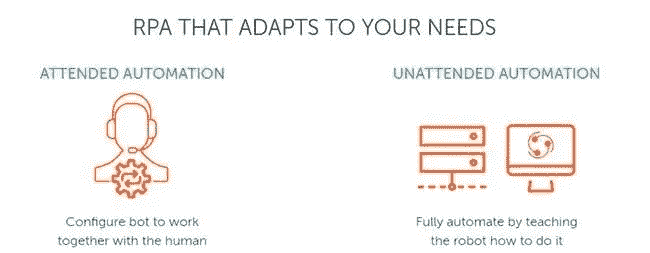

所有这些都有道理，机器人和人类总是在一起😀

# RPA 的优势

*   RPA 非常快，无论自动化的实施部分有多复杂，自动化都将以无缝的方式执行。
*   RPA 将减少手动和重复性任务，从而降低特定公司的成本。
*   由于 RPA 负责手动重复性任务，它鼓励员工通过进入更有趣的角色来提高工作效率，而他们的典型任务则由软件机器人处理。
*   RPA 获得了更好的客户服务。
*   RPA 通过数字化已处理的数据来提高效率，这有助于审核这些数据。
*   RPA 将在几秒钟内进行数学运算。

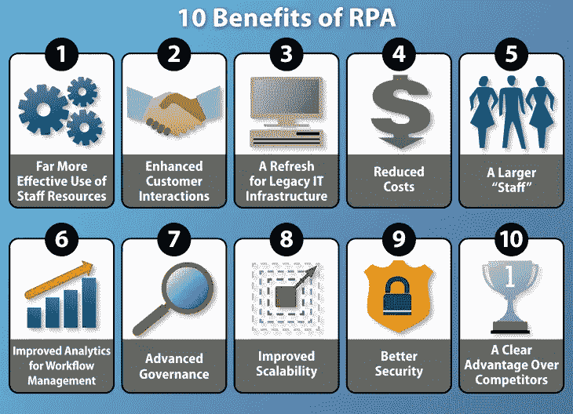

# 谁使用 RPA？

RPA 现在被大多数行业使用。保险、银行、金融、医疗保健和电信等具有重复性任务的大多数行业都将使用 RPA

下图代表了 RPA 主要应用的一些行业

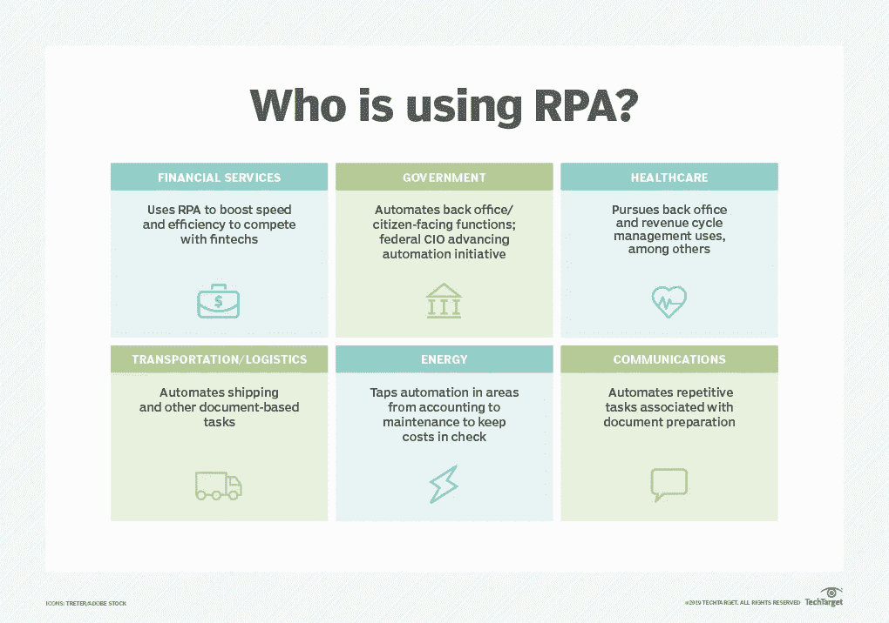

# 主要使用工具/ide 来开发 RPA

在 RPA 行业中，主要使用 3 种工具/ide 来开发自动化。这些工具是，

*   UiPath
*   自动化无处不在
*   蓝色棱镜

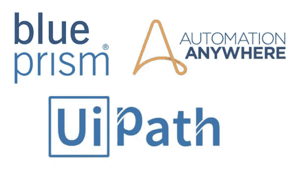

作为一个从学术上开始学习 RPA 的人，您需要从这些工具/ide 中的一个开始。

选择其中一个工具并开始您的旅程，您不需要在多个工具上开始工作，您可以在特定工具/ IDE 的自学帮助下继续学习 RPA 的工作方式。

作为一名软件工程本科生，我用 UiPath 开始了我的 RPA 之旅，用 Ui Path 学习 RPA 非常容易和方便。我已经使用 UiPath 六个多月了，我对使用 UiPath studio 实现自动化非常有信心。我想提一下，UiPath studio 是由 UiPath 平台提供的 IDE。

在 UiPath 中，有一个单独的学院，叫做 UiPath 学院，在这里你可以很容易地从学术上开始学习 RPA，那里提供的学术内容对任何人来说都是非常容易理解的，任何人都可以通过不断地实践它来自信地开展 RPA。

我建议您开始使用 UiPath，下面的链接将引导您进入 UiPath 网站。

 [## 自动化平台领先的 RPA 公司| UiPath

### 利用领先的机器人过程自动化平台重塑您的工作场所，并了解 UiPath 如何帮助您的公司…

www.uipath.com](https://www.uipath.com/) 

# 如何成为一名 RPA 开发者？

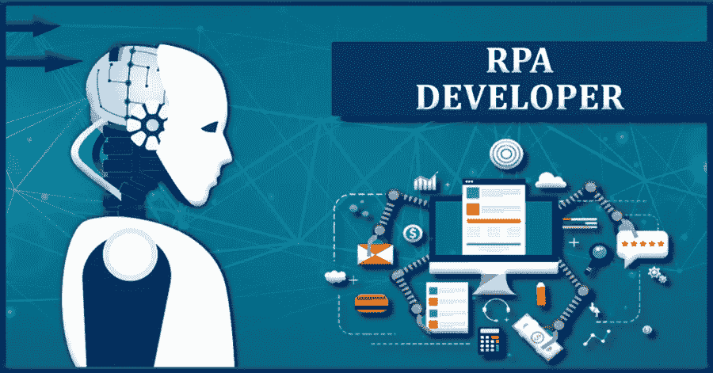

RPA 开发人员是通过使用行业中可用的自动化 ide，在学术上学会了设计和实现自动化的人。

他们在一家特定的公司从事 RPA 项目，他们设计并实现 RPA 自动化，以满足客户的自动化需求。

就我个人而言，我也是一名 RPA 开发人员，利用我的分析技能开发自动化，我会让你知道如何成为和我一样的人😀

让我们来看看成为 RPA 开发人员时需要考虑的一些要点。

*   要开始您的 RPA 之旅，您需要接触一种用于开发 RPA 自动化的主要工具/ide。(Uipath、自动化无处不在、Blueprism)
*   你需要提高开发技能。Net”、“C#”和“VB 脚本”编程语言。
*   你必须有良好的记录技巧。
*   您需要获得从工作流图中勾画出业务流程自动化的能力，并且应该能够将它提升到一个全功能的自动化解决方案。
*   你需要获得诊断问题的技能和创造性解决问题的技能。
*   您需要获得您的代码审查技能，并且您需要使用测试驱动开发。
*   你需要有很强的故障排除和调试技能。
*   SQL 数据库经验。
*   良好的沟通和分析能力。

这些是 RPA 开发人员工作描述中主要考虑的要点。

我鼓励您开始使用 RPA IDE，并不断练习创建有用的自动化，以便逐步成为一名成功的 RPA 开发人员。

一旦你从大学毕业，你可以考虑进入一个在 RPA 开发方面拥有最高实践经验的组织的 RPA 工作角色。因此，为了对 RPA 开发有信心，请继续在 UiPath 或其他平台上学习。

实践是唯一能成功的事情，作为一个初学者，不断练习为更小的任务开发自动化，提高你的技能，一步一步地为大规模自动化任务开发自动化，相信我，你会成功的😀

# 获得认证

正如我之前提到的，我是 UiPath 平台服务的粉丝。我通过参考 UiPath academy，每天为较小的任务创建自动化来提高我的 UiPath studio 开发技能。

在 UiPath，一旦你对他们在 UiPath 学院的课程有了信心，你就可以考虑从他们提供的证书中获得认证。

他们提供两种认证，现在一旦你获得了他们的任何一种认证，证书的有效期将是终身的。

*   UiPath 认证 RPA 助理(UiRPA)
*   UiPath 认证高级 RPA 开发人员(UiARD)

UiRPA 是一种认证考试，一旦你在 UiPath academy 中学习了基础课程部分，你就可以参加，作为第二步，你可以参加 UiARD 考试，你需要学习理论并实践 REFramework。

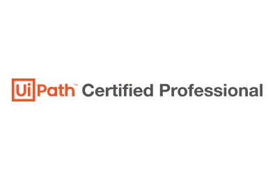

为了了解 UiPath 学院及其课程认证，请参考以下链接，并了解如何获得 UiPath 认证😀

 [## UiPath 学院

### 这是一个分析，设计，部署和维护机器人过程自动化的过程介绍…

academy.uipath.com](https://academy.uipath.com/static-page/5)  [## RPA 认证—高级 RPA 开发人员| UiPath

### UiPath 认证专家是一个高风险的认证计划，旨在帮助您推进您的职业生涯在…

www.uipath.com](https://www.uipath.com/learning/certification) 

这些认证将是你未来 RPA 之旅的一个很好的学术成就😀

# RPA 开发人员角色

RPA 开发完全是关于设计和开发小规模到大规模的自动化，但是在 RPA 行业中，所有这些任务都经历了许多角色，其中大多数如下。

*   RPA 开发人员
*   RPA 工程师
*   RPA 技术主管
*   RPA 解决方案高级开发人员
*   RPA 顾问
*   RPA 管理员
*   RPA 业务分析师

为了更详细地了解 RPA 开发人员角色，您可以在互联网上研究更多细节，我希望以下资源对您有用。

 [## RPA 开发人员的主要角色和职责——intelli paat 博客

### 机器人流程自动化(RPA)是一种广泛使用的技术，主要集中在自动化重复性业务…

intellipaat.com](https://intellipaat.com/blog/major-rpa-developer-roles-and-responsibilities/) 

# UiPath 入门

现在让我们看看如何使用 UiPath 开始您的自动化之旅。

1.  **在 UiPath 上注册**

作为第一步，您需要在 UiPath 中创建一个帐户，并按照下面的链接创建您的帐户。

 [## 继续使用 UiPath

account.uipath.com](https://account.uipath.com/login?state=hKFo2SBTb2N5dUxMUmpVeHA5QmNjSFE3Z1NWSUpONUN4RHB6VqFupWxvZ2luo3RpZNkgRlVfempVYy1NY1FrUTlCazZWOXlVMGR4el9lZXFYSlWjY2lk2SAyeXQ5SGRGNDVPMDA2SDlxZFBjUDlhczVjZEdibkNXcw&client=2yt9HdF45O006H9qdPcP9as5cdGbnCWs&protocol=oauth2&audience=https%3A%2F%2Fuipath.eu.auth0.com%2Fapi%2Fv2%2F&scope=openid%20profile%20email%20read%3Acurrent_user&redirect_uri=https%3A%2F%2Fcloud.uipath.com%2Fportal_%2FauthCallback&type=signup&platform_name=UiPath%20Platform&selected_language=en&ecommerceRedirect=false&retryUrl=%2Fportal_%2Fenterprisesso&product_name=UiPath%20Automation%20Cloud&company_code=B2B_CP&enable_marketing_fields=true&cloudrpa_signup_subdomain=%2Fportal_&register_endpoint=%2Fregister&use_local_registration=false&response_type=code&response_mode=query&nonce=RDdVbWVVNUdZdFFBalFEbTJodS1SUzIwd0xiX1VyQUsyQ2pweFVMcHRRQg%3D%3D&code_challenge=OoPHAJmOYDpkATgqski7wD8D18VADl45FKqVxVCr5VQ&code_challenge_method=S256&auth0Client=eyJuYW1lIjoiYXV0aDAtcmVhY3QiLCJ2ZXJzaW9uIjoiMC40LjAifQ%3D%3D) 

你可以用你喜欢的方式注册 UiPath，这没什么好奇怪的。

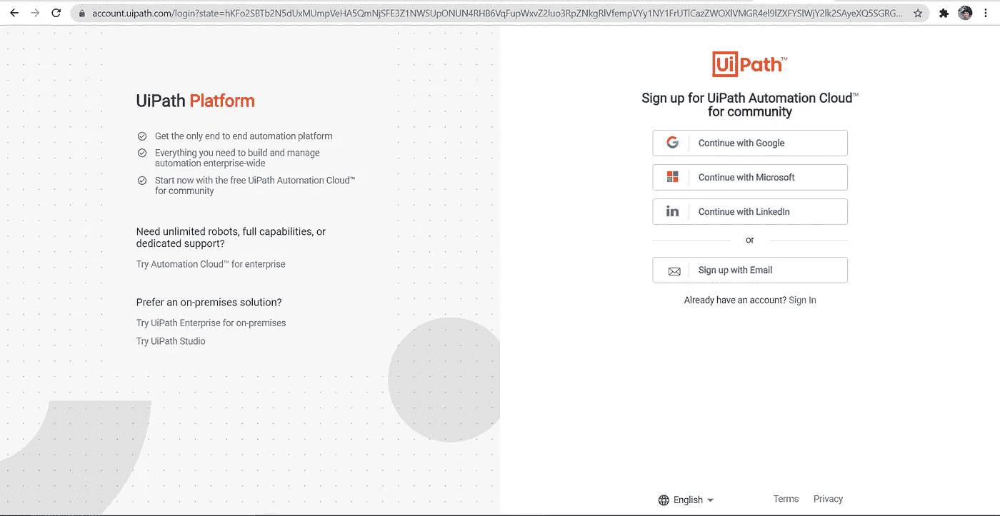

**ui path 注册页面**

2.**完成后，登录你的账户**

你会发现登录路径一旦你注册如下

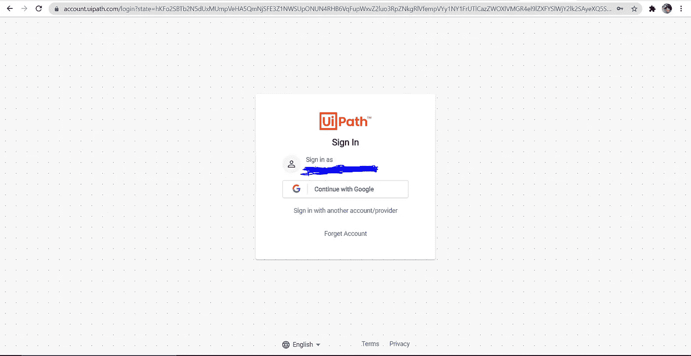

**ui path 登录页面**

3.**将 UiPath studio 安装到您的电脑中**

登录后，您将被导航至 UiPath automation cloud 页面。你可以下载他们的 IDE，UiPath studio 并安装。

UiPath studio 将是您作为 RPA 开发人员的工作环境。

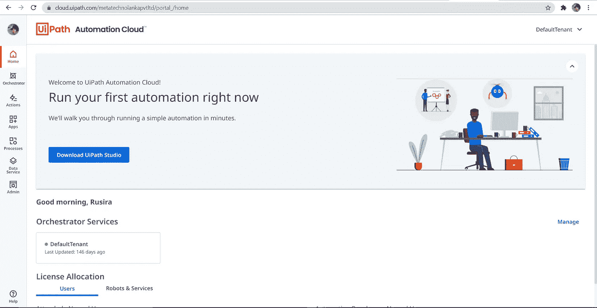

**点击下载 UiPath Studio**

一旦您成功安装了 UiPath studio，它的文件路径将是—**C:\ Program Files \ ui path \**

4.**使用 UiPath 开始学习 RPA**

为了开始学习，您需要导航到 UiPath 学院，那里的课程可供您学习。

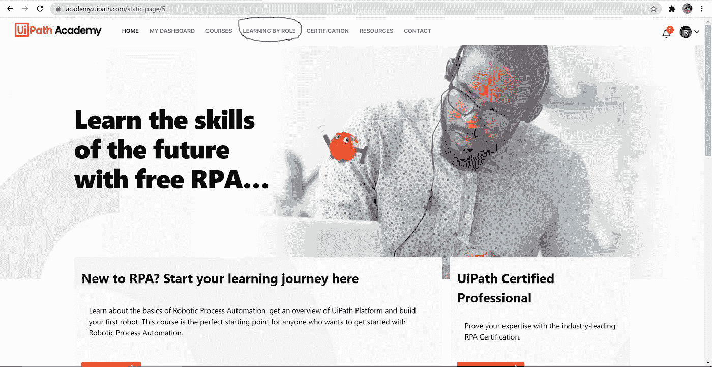

**UiPath 学院主页**

单击“按角色学习”开始学习“RPA 开发人员基础”部分，我建议您按顺序学习下面的部分。

RPA 开发人员基础→ RPA 开发人员持续学习→ RPA 开发人员高级

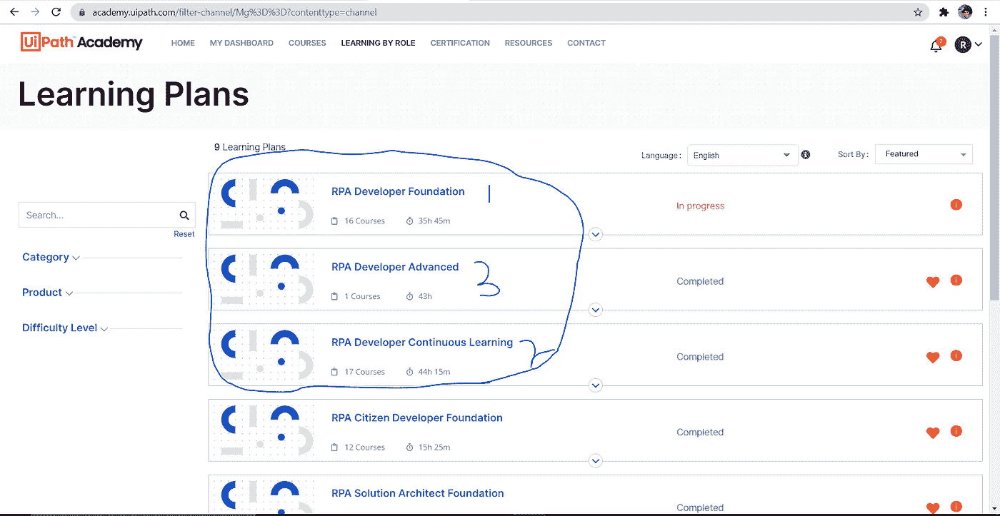

慢慢来，开始学习吧。学习完这些部分后，您已经掌握了作为 RPA 开发人员所需的所有基本知识，请确保使用 UiPath 尝试您在这里获得的实验练习。

这就是如何开始使用 UiPath 的方法😀

# UiPath 社区论坛

当你在尝试实践练习的时候按照课程进行，你可能会在某一点上卡住，你可能需要一些帮助来弄清楚如何做那个特定的实现。

通过社区论坛，您可以看到示例解决方案，或者您可以在论坛中发布您的问题，并从您的同事那里获得帮助。

点击下面的链接开始吧

 [## UiPath 社区论坛

### 寻找解决方案，提出问题，帮助他人，了解我们产品和社区活动的最新动态。

forum.uipath.com](https://forum.uipath.com/) 

# 结论

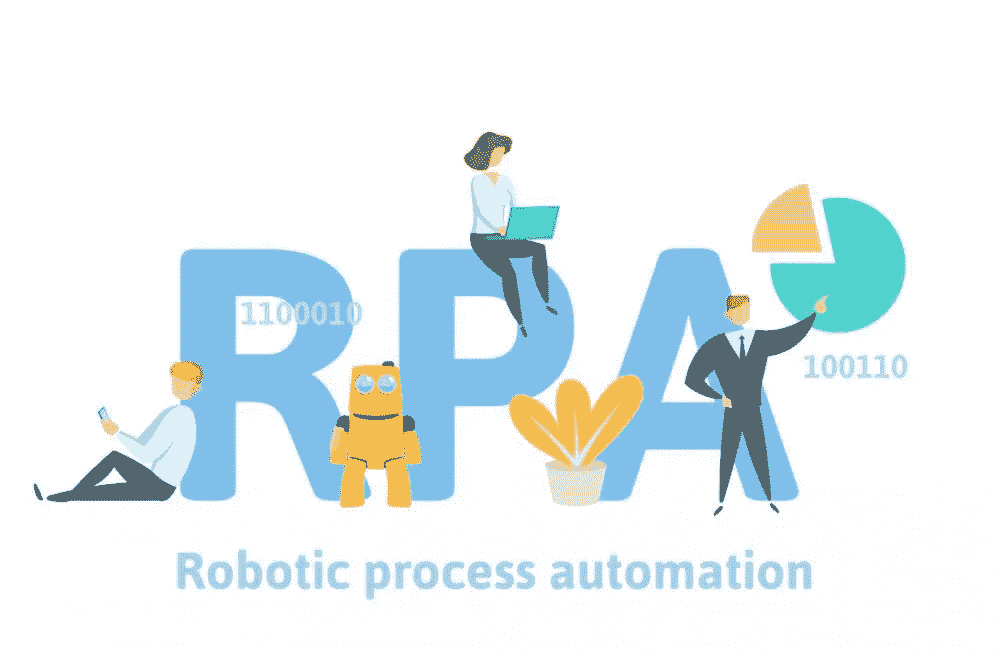

在本文中，我们对机器人流程自动化有了基本的了解，作为 RPA 行业的初学者，您完全知道如何开始使用它。

在我们结束之前，让我们看看我们在这篇文章中学到了什么。

*   RPA 是什么？
*   我们不应该将什么视为 RPA？
*   有人值守自动化与无人值守自动化。
*   RPA 的优势。
*   谁使用 RPA？
*   主要使用工具/ide 来开发 RPA。
*   如何成为一名 RPA 开发者？
*   获得认证。
*   RPA 开发人员角色。
*   UiPath 入门。
*   UiPath 社区论坛。

**参考文献**

*   https://www.uipath.com/rpa/robotic-process-automation
*   【https://www.uipath.com/rpa/journey 
*   [https://www.uipath.com/automation/ai-and-rpa](https://www.uipath.com/automation/ai-and-rpa)
*   [https://en.wikipedia.org/wiki/Robotic_process_automation](https://en.wikipedia.org/wiki/Robotic_process_automation)

我希望这篇文章对你有用，并在我即将发表的关于信息技术和软件工程的文章中与我保持联系。

在我的下一篇博客文章中再见，在那之前，

**快乐自动化😎😉**