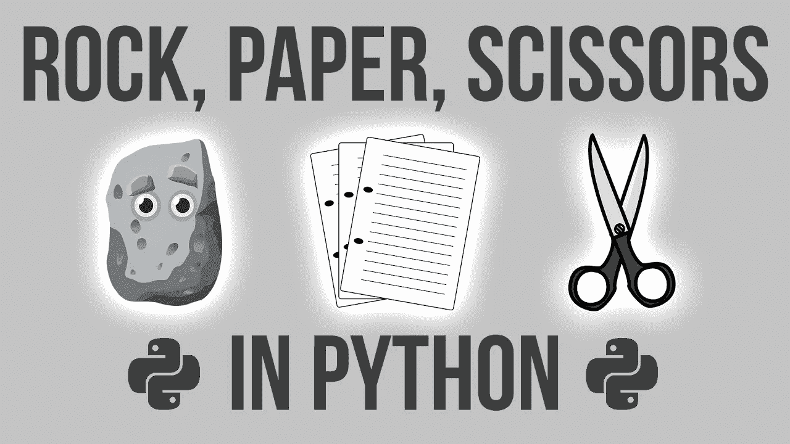
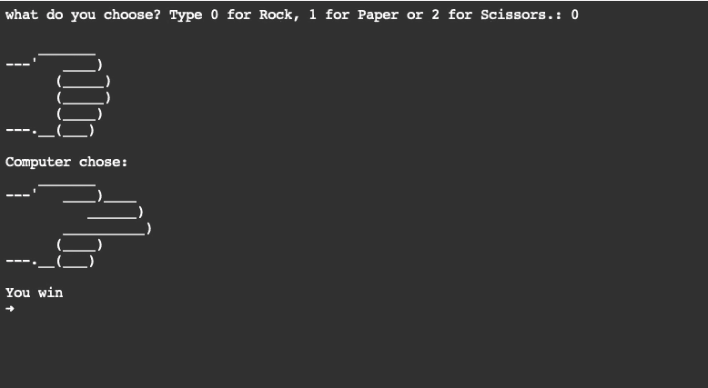
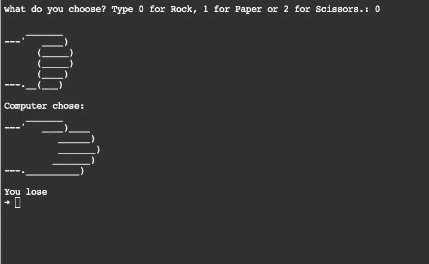
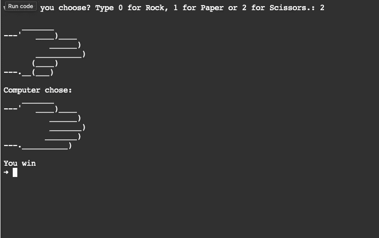

# Python 中的石头、剪子、布游戏

> 原文：<https://medium.com/nerd-for-tech/rock-paper-scissors-game-in-python-f621c42173a6?source=collection_archive---------2----------------------->

用电脑玩 RPS 游戏的简单 python 程序



**目标:**用 python 编程创建一个 RPS 游戏。

```
Pre-Requisite
1\. Python Installed
2\. Python Knowledge(print-function, if-else, Random function, lists)
```

这将会非常有趣，为了更好地理解和编写代码，我们可以将问题分成小步骤。

```
1\. Declared the variables with values as sign for rock, paper and scissors 
2\. Logic to take input from players and display their choice
3\. Logic for displaying what computer chose
4\. Logic to declare the result basis of selection between you and the computer
```


**考虑下面的要点，看看我是如何将程序分成 4 个部分的。**

**输出**



场景 1



场景 2



场景 3

感谢您阅读并浏览该计划！复制代码来检查您的系统，玩得开心！