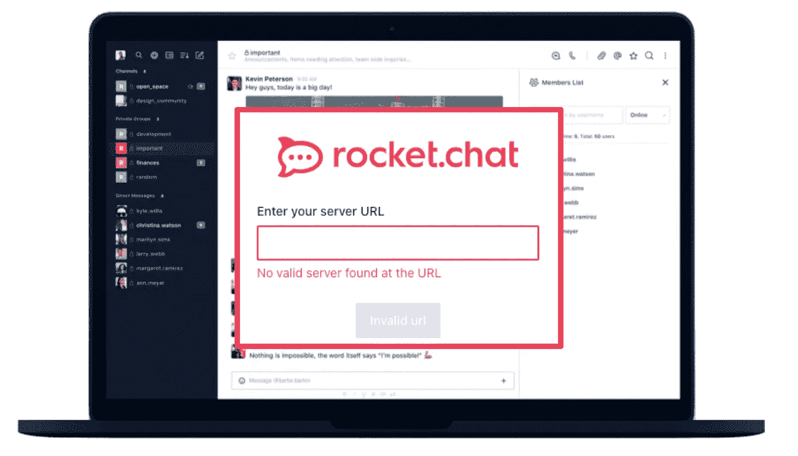
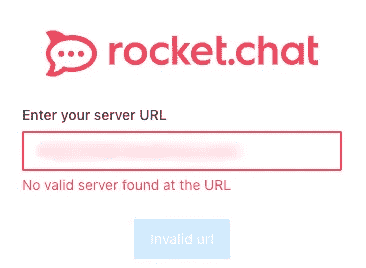
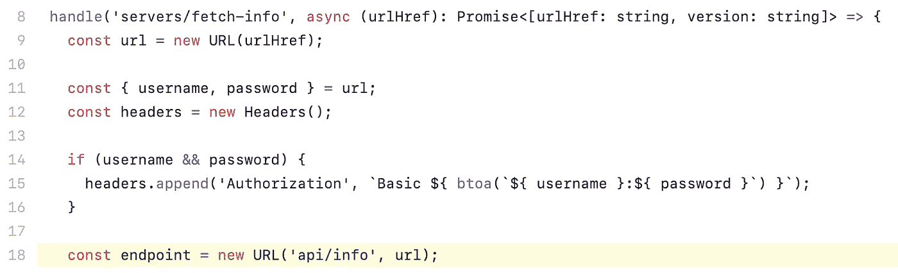
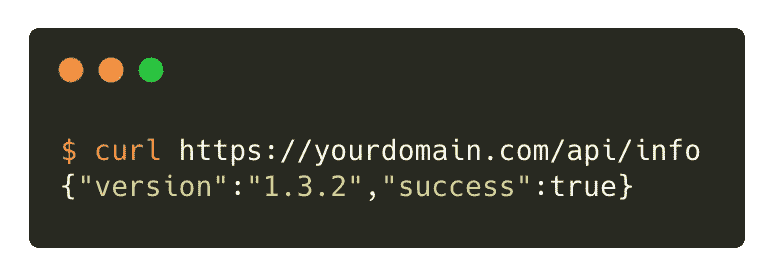
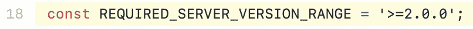
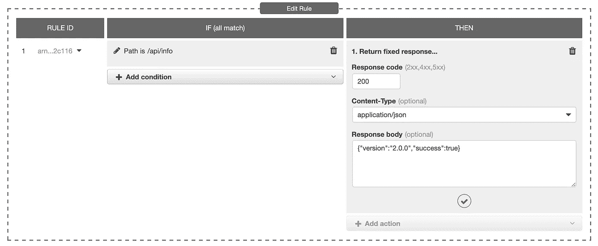
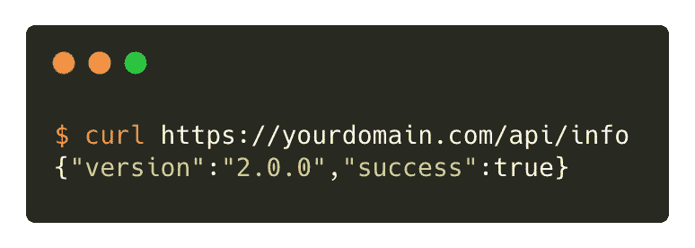

# 火箭。聊天桌面:在 URL 上没有找到有效的服务器…等等什么？！

> 原文：<https://medium.com/nerd-for-tech/rocket-chat-desktop-no-valid-server-found-at-the-url-wait-what-bde80748152a?source=collection_archive---------1----------------------->

T2，奥克特。聊天桌面最近[发布了 3.0.2 版本](https://github.com/RocketChat/Rocket.Chat.Electron/pull/1770)。在这个释放火箭里。聊天团队引入了**服务器验证**，并硬编码了最低要求的 Rocket。聊天服务器版本为 2.0.0 **。**

有了这个突破性的改变，火箭。聊天桌面将不再在火箭上工作。运行版本< 2.0.0\. If you try connecting to Rocket.Chat server running on older version, you’ll be prompted with the following message.

Fig: No valid server found at the URL

Firstly, the message is vague and unclear, and at first, the user will try to double-check if they have entered the correct URL. Secondly, this message has nothing to do with the server version. A more appropriate message would have been:

> “Y的聊天服务器您正在连接运行旧版本且不再受支持的服务器。请升级你的火箭。聊天服务器。"

很多运行 Rocket 的用户和公司。聊天服务器版本< 2.0.0 in production is suddenly left with one option, **升级！**

然而，一夜之间升级服务器对任何生产软件来说都是不可能的，当然，除非是 [Heartbleed](https://en.wikipedia.org/wiki/Heartbleed) 。

一个可能的解决方法是要求最终用户重新安装一个旧版本的 Rocket。聊天桌面< 3.0.0, which doesn’t perform the Server Validation. But in reality, this is not feasible when you have 100s of users!

# Let’s buy us some time!

Alright, we know the upgrade is mandatory but not possible overnight. So now what!

I began drilling into the Rocket.Chat Desktop source code to figure out how Server validation is actually performed under the hood.

Source: [Rocket.Chat.Electron/src/servers/renderer.ts](https://github.com/RocketChat/Rocket.Chat.Electron/blob/master/src/servers/renderer.ts#L18)

在第 18 行，通过请求`api/info`端点获取服务器版本信息。如果您`curl`这个端点，它将返回服务器版本信息作为 JSON 响应:

嗯…那很有趣。然后从 JSON 响应中解析版本信息，并与硬编码的**REQUIRED _ SERVER _ VERSION _ RANGE 进行比较。**

来源:[Rocket.Chat.Electron/src/servers/main.ts](https://github.com/RocketChat/Rocket.Chat.Electron/blob/master/src/servers/main.ts#L18)

那么，如果我们在不升级服务器的情况下，动态修改 JSON 响应，返回一个版本≥ 2.0.0 会怎么样呢？如果你部署了火箭。AWS 负载均衡器后面的聊天服务器，然后我们可以添加一个自定义规则，并使用 AWS ALB 的固定响应特性创建一个自定义 JSON 响应。

*图 AWS ALB 增加的固定响应规则*

瞧啊。我们升级了火箭眼中的服务器。聊天桌面。

通过这个简单的改变，如果你现在尝试使用最新的 Rocket 连接到服务器。聊天桌面版。毫不奇怪，即使服务器仍在运行旧版本，它也会连接。

您的用户现在应该能够连接到服务器并使用最新的 Rocket。正常聊天桌面。

**警告！**不要将这种“破解”作为永久的解决方案。当你开始计划升级火箭时，这种“入侵”可以给你的团队一些喘息的机会。聊天服务器版本。

# 结论

火箭。聊天团队应该保持与旧服务器版本的向后兼容性，并给出行动的最后期限。相反，他们走了另一条路线，强迫所有人立即升级。无论如何，如果你还在运行一个旧的服务器版本，那么现在是你计划升级的时候了！

**P.S.** 火箭。聊天是一个非常好的开源交流和协作工具。如果你还没有查看: [https://rocket.chat](https://rocket.chat)