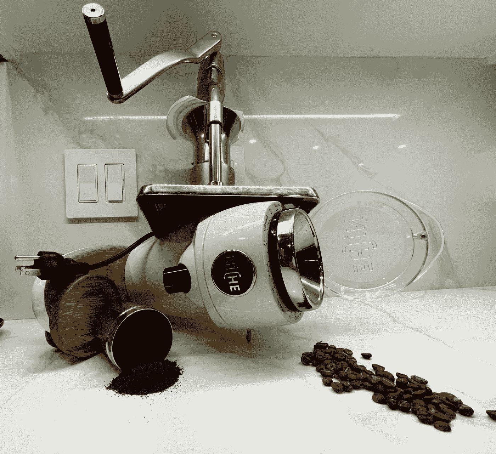
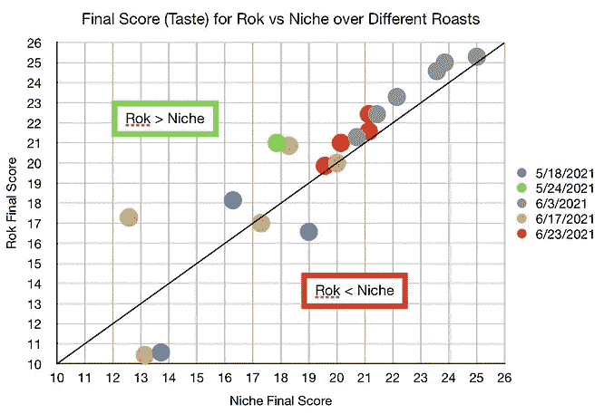
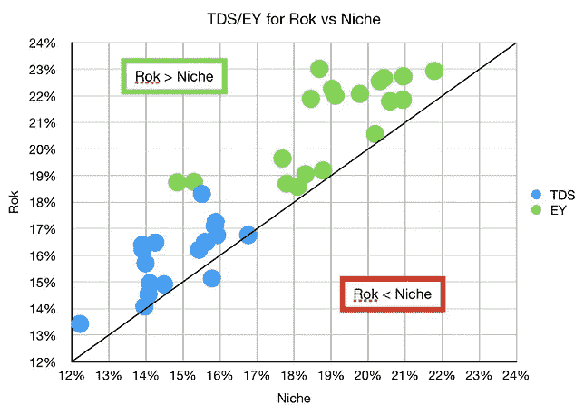
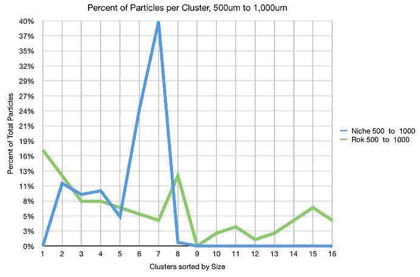
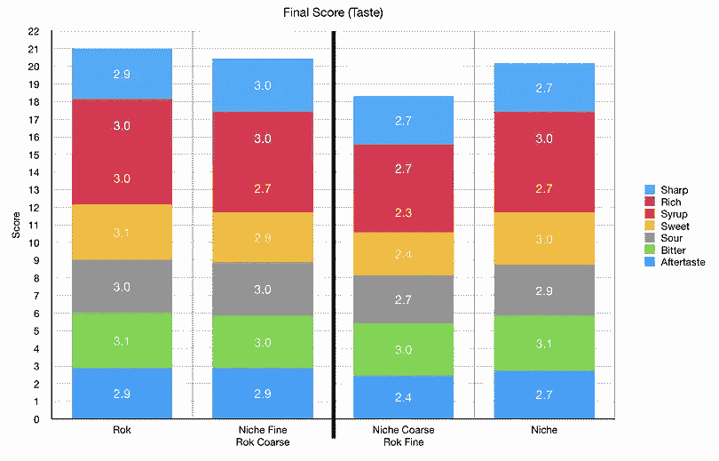
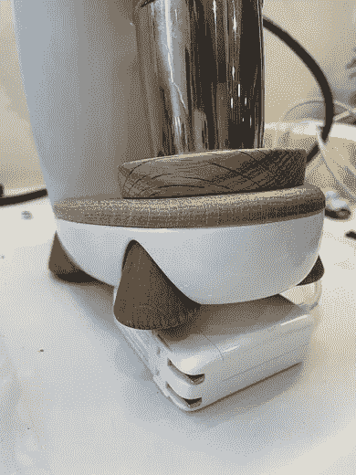
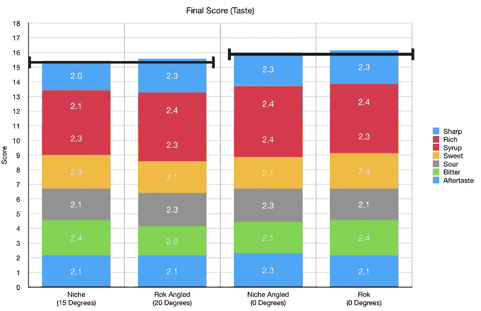

# 韩国击败利基:咖啡研磨机比较总结

> 原文：<https://medium.com/nerd-for-tech/rok-beats-niche-a-summary-of-a-coffee-grinder-comparison-ffcca38d0753?source=collection_archive---------5----------------------->

## 咖啡数据科学

## 从一个来源收集所有信息

我写了四篇关于比较 ROK grinder 和小生 Zero 的文章。所以我把它们放在一起。

**视频摘要**:

# 文章:

[**韩国击败小生零:上集**](https://towardsdatascience.com/rok-beats-niche-zero-part-1-7957ec49840d?source=your_stories_page----------------------------------------)

[**韩国击败小生零:第二部**](https://towardsdatascience.com/rok-defeats-niche-zero-part-2-acdbae134018?source=your_stories_page----------------------------------------)

[**咖啡的形状**](https://towardsdatascience.com/the-shape-of-coffee-fa87d3a67752?source=your_stories_page----------------------------------------)

[**韩国击败小生零三部**](https://towardsdatascience.com/rok-defeats-niche-zero-part-3-2fbcc18397af?source=your_stories_page----------------------------------------)

[**Rok 击败小生？另一个角度来磨咖啡**](https://towardsdatascience.com/rok-beats-niche-another-angle-to-grind-coffee-645e46102891?source=your_stories_page----------------------------------------)

所有图片由作者提供

如果你愿意，可以在 [Twitter](https://mobile.twitter.com/espressofun?source=post_page---------------------------) 、 [YouTube](https://m.youtube.com/channel/UClgcmAtBMTmVVGANjtntXTw?source=post_page---------------------------) 和 [Instagram](https://www.instagram.com/espressofun/) 上关注我，我会在那里发布不同机器上的浓缩咖啡照片和浓缩咖啡相关的视频。你也可以在 [LinkedIn](https://www.linkedin.com/in/dr-robert-mckeon-aloe-01581595) 上找到我。也可以关注我在[中](https://towardsdatascience.com/@rmckeon/follow)和[订阅](https://rmckeon.medium.com/subscribe)。

# [我的进一步阅读](https://rmckeon.medium.com/story-collection-splash-page-e15025710347):

[我未来的书](https://www.kickstarter.com/projects/espressofun/engineering-better-espresso-data-driven-coffee)

[我的链接](https://rmckeon.medium.com/my-links-5de9eb69c26b?source=your_stories_page----------------------------------------)

[浓缩咖啡系列文章](https://rmckeon.medium.com/a-collection-of-espresso-articles-de8a3abf9917?postPublishedType=repub)

[工作和学校故事集](https://rmckeon.medium.com/a-collection-of-work-and-school-stories-6b7ca5a58318?source=your_stories_page-------------------------------------)