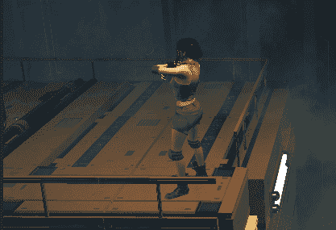
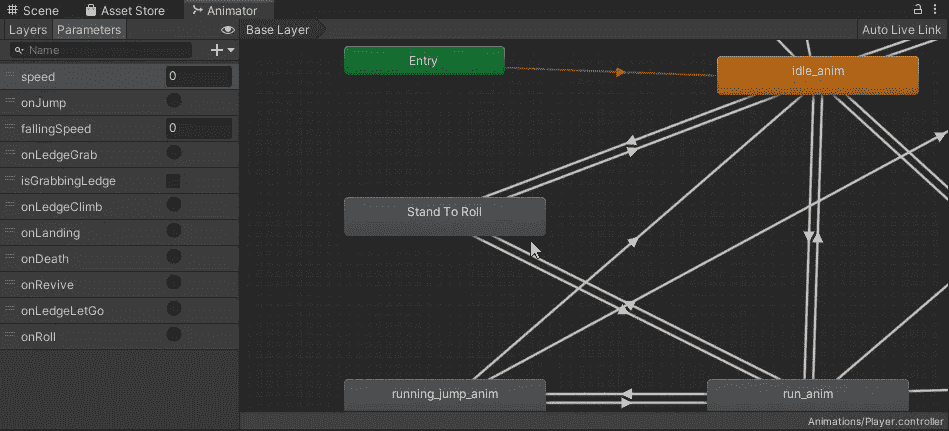
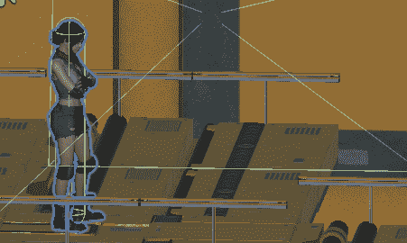
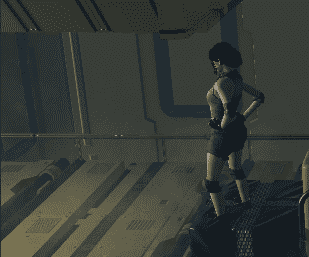

# 滚动动画 Update()方法的优缺点

> 原文：<https://medium.com/nerd-for-tech/roll-animation-joys-and-pains-of-the-update-method-5a82e6f797a?source=collection_archive---------11----------------------->

**目标**:实现一个翻滚功能，让角色向前跳跃并进入狭窄的空间

在这个教程中，我将展示我如何将一个**滚动动画**压缩到这个项目中。像往常一样，我从 Mixamo.org 进口动画，就地烘焙。

当角色滚动时，我们希望播放动画，提升水平速度，并有可能通过**狭窄的**路径挤压角色。

一旦动画被导入，我就把它放到 animator 网站上，试图找出如何把它和其他状态联系起来。转换到滚动状态非常容易:必须用键盘输入设置一个“onRoll”触发器。

相反，转换回空闲或运行状态(唯一与滚动相关的状态)是很棘手的。

但是让我们从第一步开始。

## 接受输入(正确)

正如文章的标题所暗示的那样，让它按预期的那样工作绝非易事。最大的障碍是获取输入的方式，或者更多的输入，每帧**。**

**如果你浏览以前的文章，你会发现每一帧都有运动输入，从**水平输入轴**转换成水平速度。然后，如果一个跳跃可以被执行，垂直速度被设置，重力将会使它越来越小，为负，当角色再次落地时最终为零。在所有这些过程中，玩家可以连续提供(水平)输入并移动角色**而不影响**跳跃/下落程序。**

**滚动时不能这样做，因为它影响水平速度。我举一个简单的例子:让我们把翻滚当作水平跳跃，让我们使用相同的逻辑，唯一的例外是翻滚设置一个值给`velocity.z`。**

**这样做，我们仍然有一个类似于每帧执行**的命令。结果将是只有在从空转状态滚动的情况下速度才能正确工作，而从运行状态滚动的速度**将被输入的**超越。****

**为了解决这个问题，我不得不重新思考收集信息的方式。**

**我们不只是收集输入，而是要检查角色**是否在滚动**:如果不是，我们可以接受输入(不再覆盖)。然后，如果它能滚动，就调用 roll 方法。**

**如果角色被固定(很明显)并且还没有翻滚，那么它可以翻滚。Roll 方法与 Jump 非常相似:设置速度，使用面向方向的角色，rolling boolean 设置为 true 并触发动画。**

****

## **用于完成任务的状态机器行为**

**那么，现在这个角色`isRolling`，我们什么时候怎么能说它是**而不再是**？**

**正如本系列中多次发生的那样，我们将使用动画行为。我们还将完成我们的目标，并赋予角色挤进隧道的能力！**

**在**进入**状态时，我们抓取了一个角色控制器和运动脚本的参考:我们降低了控制器碰撞器的高度，并修改了中心以保持最低的部分在模型的脚下。拥有一个更小的碰撞器，这个角色将会比以前更适合更窄的空间。**

**在**更新**状态时，我们只是保持设置速度，以确保角色在整个动画中移动。**

**在**退出**状态时，我们重置所有值，包括`isRolling` bool。**

****

**让我们在一个狭窄的区域里试试吧！**

****