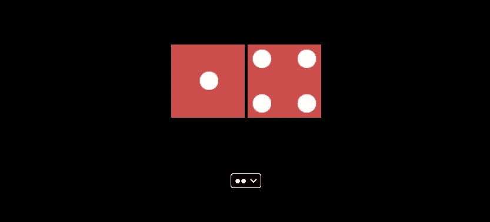

# 掷色子

> 原文：<https://medium.com/nerd-for-tech/roll-dice-162e7a3e3079?source=collection_archive---------4----------------------->

## 使用掷骰子示例应用程序，以有趣的方式学习 React 基础知识

## React 的初学者教程



图 1:掷骰子，React 内置的示例应用程序

React 是一个流行的用于 UI(用户界面)的 JavaScript 库。这是一个由脸书推动的开源项目。它是基于组件的、声明性的，因此更适合为 web 和移动设备构建用户界面。

这里，我有一个掷骰子的小 React 应用程序。该页面显示了掷一个或两个骰子的两个选项。骰子有六个面。React 组件为每个骰子生成一个介于 1 和 6 之间的随机数。如果你在玩棋盘游戏，可以在手机或 iPad(甚至是台式机)上随意打开[这一页](http://jsfiddle.net/kvkirthy/726wvay5/531/show)，掷骰子。

JS 小提琴，掷骰子样品

然而，这个应用程序的主要目的是解释以下 React 基础知识，

*   React 中的组件
*   使用 props 在组件之间传递数据
*   演示 useState 和 useEffect 挂钩。

# 成分

组件是独立的 UI 元素。在掷骰子的例子中，骰子是呈现六个面之一的组件。它是可重用的，因此可以在应用程序的任何地方使用。

在 React 中创建组件非常简单。在 16.8 版本之前，组件必须是类。现在，一个组件可以是一个函数。函数组件使用 pascal 大小写名称，并返回 React 元素/ JSX。


图 2:骰子的第五面

考虑下面的代码片段。我们创建一个函数 *Dice()* 。该函数是一个组件，它返回用于呈现骰子的 React 元素。React 元素或 JSX 与 HTML 非常相似，几乎没有细微的差别。例如，注意，我们没有使用 CSS 类的*类*。JSX 使用 *className* ，在 HTML DOM 中被翻译成*class。*

```
function Dice(){
  return <div className="dice face-1"></div>;
}
```

注意，类名是 face-1。它代表骰子的一面。有关 CSS 类的定义，请参见下面的代码片段。目前，这个组件正在返回单侧。我们将进一步发展组件，以显示所有六个方面。

```
.img-1{
  background-image: url('[https://imgur.com/a005G8C.png'](https://imgur.com/a005G8C.png'));
}/*
   It is rather a simplistic approach to show a side of a dice. Created six images, each representing a number. The CSS class sets it as the background for the HTML element.See below, the HTML element matches height and width of the element to the image's width and height.
*/.dice {
  width: 100px;
  height: 100px;
}
```

要在应用程序的其余部分使用组件 Dice，请将其编写为(不同组件的)JSX 中的一个元素。

```
<Dice /> // sample Dice element in JSX of a different component.
```

# Props:将数据从父组件传递到子组件

我们知道组件返回 React 元素，这是组件的输出。另一方面，props(properties 的缩写)是输入。一个函数组件可以有一个参数。它封装了其他组件可能传入的所有属性。

让我们更新骰子组件以显示所有六个面。但是，在任何时间点显示哪一面是由父组件(使用骰子的组件)决定的。它将边值作为道具传入。考虑下面的代码示例。

```
function Dice(props){
 if(props.draw === 1){
   return <div className="dice img-1"></div>;
  } else if(props.draw === 2){
   return <div className="dice img-2"></div>;
  } else if(props.draw === 3){
   return <div className="dice img-3"></div>;
  } else if (props.draw === 4) {
  return <div className="dice img-4"></div>;
  } else if (props.draw === 5){
   return <div className="dice img-5"></div>;
  } else if (props.draw === 6) {
   return <div className="dice img-6"></div>;
  } else {
   return <div className="dice ">!!!</div>;
  }
}
```

该组件现在使用一个函数参数 props。目前我们只有一个名为 *draw* 的道具。它支持六种可能的值。最后的 *else* 处理错误情况，如果父组件提供不正确的值，比如 10 或一个字符串，或者根本不提供属性。

> 在 JavaScript 中===强制数据类型检查。如果我们使用==，我们可以使用 props.draw == "2 "，对于数值 2，它仍然返回 true。因此，使用前者(===)进行精确的条件检查是一个很好的实践。

考虑下面的代码片段，它显示了父组件为道具 *draw 提供一个值。*这里，我们传递一个值 5。因此骰子显示的是第五面。

```
<Dice draw={5} />
```

注意，这个值用花括号括起来，表示一个表达式。这里，我们传递一个字面量。然而，我们可以传递一个变量。骰子根据变量的值动态显示边。见下文。

```
<Dice draw={drawVariable} />
```

让我们更深入地研究 dice 代码示例。除了骰子组件，还有两个附加组件。下面是对每个组件的意图和功能的简要介绍。

**骰子**——可以画六个面。显示任意时间点的六个面之一。

**掷骰子** —它是实际掷骰子的组件。它会生成一个介于 1 和 6 之间的随机数。它使用上面的组件 Dice 来显示给定的抽签。

**游戏棋盘** —很少有游戏使用单个骰子。很少有人用两个骰子。游戏板组件允许用户选择一个或两个骰子来抽奖。选中后，使用上面的“掷骰子”组件掷骰子。

# 钩住

钩子是 React 版本中添加的新特性。与功能组件挂钩一起，React 简化了组件的构建。它们是用于构建真实 React 应用程序的附加特性。我们将在本文中看到几个钩子的例子。

## 使用状态

大多数组件维护一个内部状态，它是表示组件在某个时间点的状态的数据。让我们考虑一下游戏板组件。它允许用户选择一个或两个骰子滚动。用户选择为组件设置状态。在某个时间点，组件可以滚动单个骰子(状态 1)或两个骰子(状态 2)。考虑下面的代码片段，它显示了用于选择一个或两个骰子的下拉菜单。根据用户在下拉列表中的选择，为组件设置状态。

```
function GameBoard(){  

 **const [diceCount, setDiceCount] = useState(2);**  const updateDiceCount = (evt) => setDiceCount(parseInt(evt.target.value));// The component returns elements for a dropdown
return <div className="go-center">
           <select name="dice-count" defaultValue={diceCount} onChange={ updateDiceCount } id="dice-count" >
            <option value="1">●</option>
            <option value="2">●●</option>
        </select>
       </div>;
}
```

注意，组件为下拉列表返回*选择*和*选项*元素。考虑到下面关于*的细节，useState()* 函数以粗体显示。

*   我们传递一个默认值 2。当组件第一次挂载时，意味着要掷出两个骰子。
*   我们将返回值命名为 diceCount 和 setDiceCount。前者是国家的名称。后者是一个设置值的函数。在 React 组件中，不要直接设置状态变量的值(diceCount)。使用 set <state variable="" name="">重新渲染组件，更新用户界面。</state>

```
❌ diceCount = 1✅ setDiceCount(1)
```

注意，*选择游戏板组件中的*元素。在下拉选择改变时，我们调用一个函数， *updateDiceCount()。*它为组件设置骰子计数状态。

```
const **updateDiceCount** = (evt) => setDiceCount(parseInt(evt.target.value));<select **onChange={ updateDiceCount }** >
   ...
</select>
```

让我们更新游戏板组件，使用下拉菜单设置的状态。请记住，游戏板组件的责任只是选择一个或两个骰子。然后，它使用 Draw Dice 组件来掷骰子，而掷骰子又使用 Dice 组件来显示它选择的一方。考虑下面代码片段中的粗体代码行。

```
function GameBoard(){  

  const [diceCount, setDiceCount] = useState(2);
  const updateDiceCount = (evt) => setDiceCount(parseInt(evt.target.value) || 2);return  <div className="flex-column-container">
 **{ diceCount === 1 ? <div className="flex-row-container"><RollDice isIsolated={false}/></div>
            :  <div className="flex-row-container"><RollDice single={true}/><div>&nbsp;</div> <RollDice isIsolated={true}/></div>}**

        <div className="go-center">
           <select name="dice-count" defaultValue="2" onChange={ updateDiceCount } id="dice-count" >
            <option value="1">●</option>
            <option value="2">●●</option>
        </select>
        </div></div>;
}
```

注意，我们对 diceCount 状态变量执行条件检查。设置状态后，组件会重新呈现。根据状态，它返回 *roll dice* 组件的一个或两个元素。

## 使用效果

这是 React 中另一个非常有用的钩子。效果(或副作用)超出了组件主要功能的范围。例如，一个效果从一个远程服务或一个 Web 套接字的订阅中检索数据，等等。组件主要执行演示。然而，由不同的 JavaScript 对象检索的数据会影响组件及其表示；因此产生了副作用。

在当前示例的范围内，我们使用这个钩子在组件安装后以及每次组件发生变化时执行一个动作。效果钩子在组件第一次安装后被调用，每次组件中发现一个变化时被调用，这样就可以执行清除操作了。

掷骰子组件为骰子生成随机数。它需要在每次父组件游戏板呈现变化时发生。如上所述，每当组件识别出一个变化时，就会调用一个效果挂钩。考虑以下从 Roll Dice 组件复制的代码片段。

```
1\. useEffect(() => {
2\.  setDraw(Math.round((Math.random()*5) + 1));    
3\. }, [props.isIsolated]);
```

*   useEffect 的第一个参数是一个函数。我们用调用效果时需要运行的代码行来定义这个函数。React 在适当的时候调用这个函数作为效果。
*   在上面的例子中，effect 调用了一个 *setDraw()* 函数，该函数为变量 *draw 设置状态。*我们稍后将看到在 JSX 从组件返回时，状态变量 *draw* 为骰子的一面保存一个数字。每次改变时，骰子滚动一面。
*   随机数是使用数学函数生成的。它生成一个介于 0 和 1 之间的浮点数。第 2 行确保它被转换为值 1 到 6 中的一个。
*   useEffect 的第二个参数是一个预期会改变的变量数组。React 仅在识别到这些变量的变化时调用效果。

> 如果您只需要在组件挂载后调用一个效果，并且不再调用(在组件的生命周期中调用一次)，请为第二个参数传递一个空数组。

或者，我们可以从效果中返回一个函数，在组件卸载时调用该函数进行清理。考虑下面的代码片段，

```
useEffect(() => {
 setDraw(Math.round((Math.random()*5) + 1));  
 **return () => console.log ("clean up happens here");**
}, [props.isIsolated]);
```

到目前为止，在本节中，我们已经看到了 Roll Dice 组件中的核心逻辑。然而，骰子在最终显示一个值(或一面)之前滚动了几次。为了模拟这种行为，我修改了示例，使其在显示数字之前滚动任意 15 次。请参见下面的最后一个组件。

```
function RollDice(props){
  const [draw, setDraw] = useState(1);  
  let counter= 0;

  useEffect(() => {
 **const interval = setInterval(() => {
      counter += 1;
      if(counter >= 15)
        clearInterval(interval);****setDraw(Math.round((Math.random()*5) + 1));     
    }, 100);**}, [props.isIsolated]);

  return <Dice draw={draw} />;
}
```

注意，我们使用 *setInterval* () JavaScript 函数来运行每隔几毫秒(准确地说是一百毫秒)掷骰子的语句。一旦计数器达到 15，即掷骰子的次数，我们就清除间隔并显示骰子的最终抽签结果。

请记住，掷骰子的主要功能是生成一个随机数并将该值传递给骰子组件，以便它在骰子上显示给定的数字。注意，返回语句。它在 draw 时传递生成的随机数作为骰子组件的道具。

有关组件代码示例，请参考下面的 jsdild。

JS 小提琴，掷骰子样品

# 结论

在本文中，我们创建了一个掷骰子的 React 示例应用程序。我们创建了三个组件。

a.骰子组件呈现骰子以显示骰子的六个面之一。

b.Roll Dice 组件，它生成一个随机数，并使用上述组件在骰子上显示随机数。

c.游戏板组件，允许用户选择滚动一个或两个骰子。

使用这个代码示例，我们讨论了 React 的基础知识

*   成分
*   小道具
*   使用状态挂钩
*   使用效果挂钩

> *编码快乐！顺便在这里多了解一下我和我的看法，*[*CodeVenkey*](https://codevenkey.com/)*/*[*Twitter*](https://twitter.com/keertikotaru)

# 参考资料和有用的链接

*   React 文档—[https://reactjs.org/docs/](https://reactjs.org/docs/getting-started.html)
*   为了呈现骰子，代码示例使用了一个图像。你可以选择用 CSS 构建骰子。参考 JavaScript Jeep 关于*在 CSS 中的 Flexbox 中创建骰子的文章—*[https://better programming . pub/Creating-Dice-in-Flexbox-in-CSS-a02a 5d 85 e 516](https://betterprogramming.pub/creating-dice-in-flexbox-in-css-a02a5d85e516)