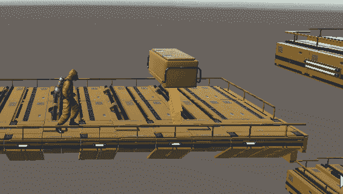
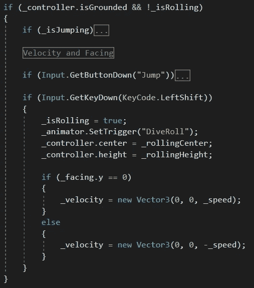
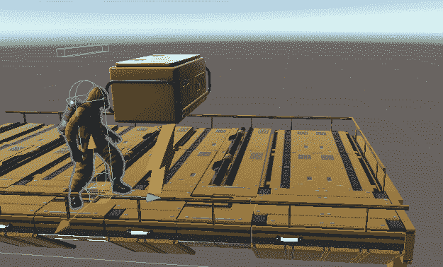
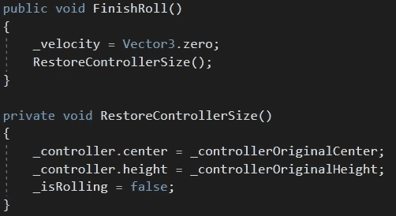

# 在障碍物下滚动

> 原文：<https://medium.com/nerd-for-tech/rolling-under-obstacles-aa9029db3969?source=collection_archive---------11----------------------->

**目的:**让玩家在他们无法行走的障碍物下翻滚。

在玩家的*计算移动*的方法中，*如果*玩家触地*并且*他们*没有*当前滚动，那么我们将寻找玩家何时按下左移按钮。这将设置 *_isRolling* 为 *true* ，触发滚动动画状态，修改角色控制器的大小，并设置角色的朝向和水平速度。

对角色控制器大小的修改允许角色通过障碍物。它从一个高的圆柱体变成一个短的圆柱体。

当玩家被标记为 *_isRolling* 时，我们不会改变水平速度，这意味着玩家将在翻滚过程中保持他们的速度和朝向。一堵墙*会*阻止滚动的前进势头，但*不会*阻止动画——玩家致力于完成整个滚动。我们将继续应用重力，所以如果玩家滚出边缘，他们会继续滚下去。

滚动动画状态的结束就是调用播放器的 *FinishRoll* 方法。这个方法停止玩家的速度并调用*restorecontrolize*方法，这个方法确实是这样做的，并将 *_isRolling* 标记为 *false* 。游戏现在照常进行。

