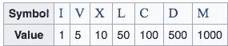
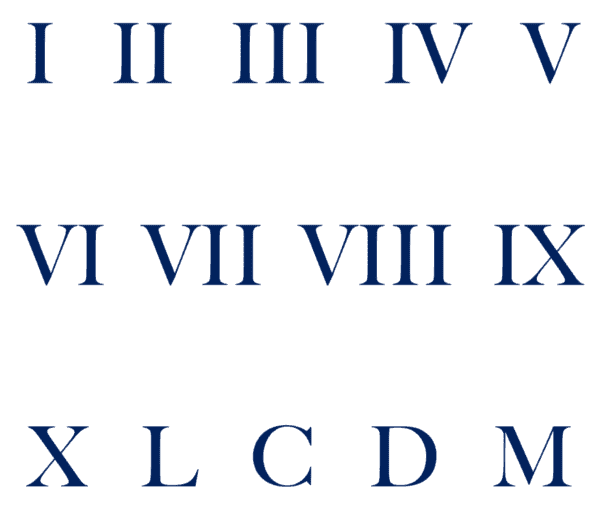
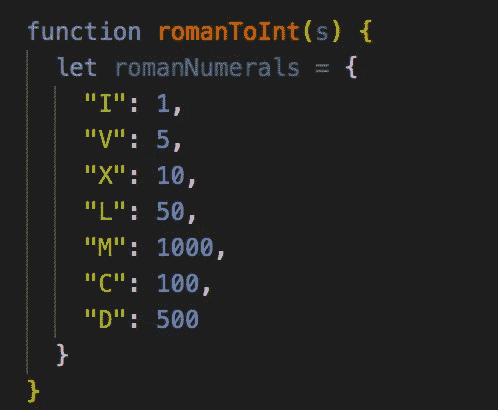
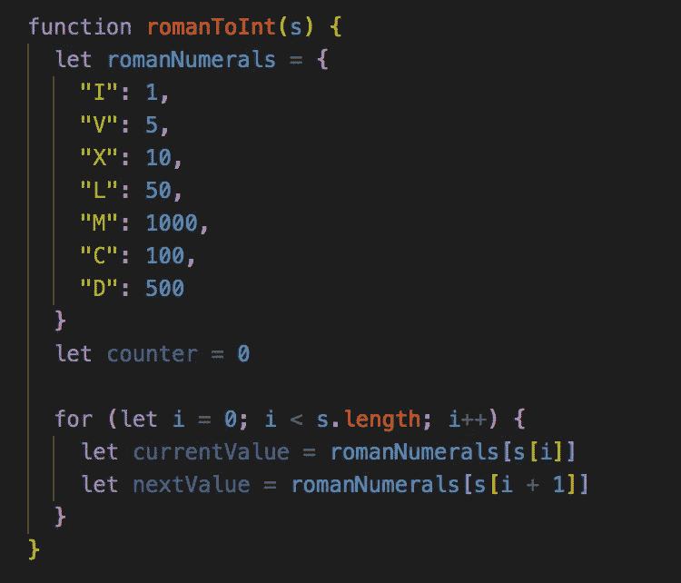
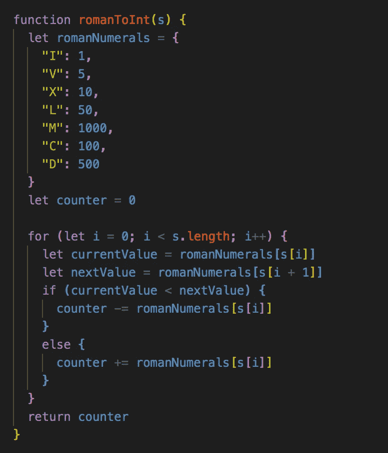

# 罗马数字到整数:如何使用散列表求解

> 原文：<https://medium.com/nerd-for-tech/roman-numeral-to-integer-how-to-solve-using-a-hashmap-35e655059ca0?source=collection_archive---------7----------------------->

## 关于我们如何通过使用哈希映射来解决这一编码练习的演练

罗马数字由七种不同的符号代表。以下符号及其值如下:

先说几个简单的例子。数字“3”在罗马数字中写成 III，我们把三个 1 加在一起。数字“7”写成 VII，我们在 II 上加上“V”即 5，II 是 2，结果是 5+2 = 7。数字“11”写成 XI，我们把“X”加上“I”，X 是 10，I 是 1，结果是 10+1 = 11。

在上面的例子中，我们按照从左到右从大到小的顺序写值。然而，有些情况并非如此。

比如“4”不写成“IIII”。代表 4 的罗马数字被写成 IV。在这种情况下，因为 1 在 5 之前，所以我们用减法而不是加法来得到 4。同样的原理也适用于“9”，在罗马数字中写为 IX。

这一原则适用于六种不同的情况:

1.  我可以放在 V (4)之前
2.  我可以放在 X (9)之前
3.  x 可以放在 L (40)之前
4.  x 可以放在 C (90)之前
5.  c 可以放在 D (400)之前
6.  c 可以放在 M (900)之前

因此，除了这些例外，我们不能简单地实现一个将所有数字相加的解决方案——有些情况下，我们必须减去这些数字。

那么我们可以用什么来帮助我们呢？哈希图！

给定一个罗马数字，将其转换为整数

让我们试一试！

*注意这个问题在 Leetcode 上(问题#13)。问题链接:*[*【https://leetcode.com/problems/roman-to-integer/】*](https://leetcode.com/problems/roman-to-integer/)

# 伪代码

在我们深入研究代码之前，让我们看看用简单的英语怎么说。

1.  创建一个散列，将每个键设置为罗马数字，并将值设置为相应的值。
2.  创建一个名为 counter 的变量，它将在每次迭代后保存该值。我们将在函数结束时返回计数器
3.  设置一个 for 循环来迭代输入字符串(或罗马数字)的长度。我们需要在每次迭代中创建两个变量来保存当前值和下一个值，以便进行比较
4.  如果当前值小于下一个值(例如 IV)，计数器将减少当前值。这是我们上面提到的例外规则。
5.  否则，我们将当前值添加到计数器中(当前值大于下一个值(例如，VI)

# 解决方案

我们开始吧！我们的第一步是创建散列图，这样我们就可以在每次迭代中查找我们的值。因为我们已经知道我们需要使用什么罗马数字以及与每个数字相关的值，所以我们可以很容易地用键值对建立一个散列！

设置计数器变量后，我们需要设置 for 循环，并将 currentValue 和 nextValue 变量分别设置为当前迭代的值和下一次迭代的值。我们可以通过上面设置的罗马数字散列来访问这些值。

接下来，我们使用 if 语句设置条件语句。记住，我们需要检查 currentValue 是否小于 nextValue。如果是的话，我们就达到了之前设定的一个原则&用当前值减去 counter。另一方面，如果当前值等于或大于下一个值，我们用当前值增加计数器。

我们的最终代码如下所示:

# 结论

你有它！我们必须处理的一个棘手的问题已经通过使用 hash 很容易地解决了。在每次迭代中，我们可以简单地用我们创建的散列查找值&根据罗马数字的顺序适当地增加或减少值。

如果你想出了另一种方法，我很想听听。让我知道你的想法&如果你有任何问题，请随时联系我。

下次见！