# React 中的路由

> 原文：<https://medium.com/nerd-for-tech/routing-around-in-react-a3e9af38742b?source=collection_archive---------10----------------------->

## 使用 React 路由器浏览组件视图的构建

正如你们许多人所知，React 应用程序由许多不同的组件组成。这些组件中的一些可以在整个用户体验中保持静态，例如标题或导航栏。我认为这些组件是静态的，因为它们的位置、大小或内容不会随时间而改变。另一方面，也有一些组件是动态的或流动的，可以随着时间的推移而改变，例如用户的 home feed 和应用程序博客或新闻页面。

你可能想知道，这和在我的 React 应用中导航有什么关系？简而言之，我们将创建一个在用户体验中保持静态或不变的导航栏。然后，我们的链接会将我们路由到保存应用程序内容的更动态的组件视图。我们在这里的主要目标是这些路线，并获得我们的其他观点。

## 构建导航栏

在我们开始浏览 React 应用程序之前，我们首先需要创建导航栏。首先，我们将在 source (src)文件夹中创建一个 components 文件夹。然后我们将创建 Navbar.js，它应该是一个功能组件，以及 Main.js，它应该是一个类组件。我们还需要在源文件夹中创建一个名为 pages 的文件夹。我们将创建 Home.js、Blogs.js、News.js 和 Favorites.js，它们都是功能组件。然后，每个组件都需要导入到我们的 Main.js 中。我们还需要将我们的 navbar 和主要组件导入到我们的 App.js 中。

咻！这真的是很多，只是让我们的样板开始，但这里有一些你的组件和文件结构应该是什么样子的视觉效果。此外，如果您需要，您可以在此处 找到锅炉板回购 [**的副本。**](https://github.com/TheRealKevBot/ReactRouterBoilerPlate)

Navbar.js:

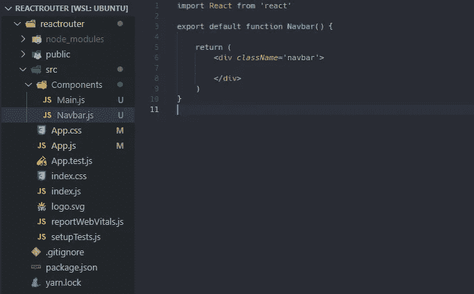

Main.js

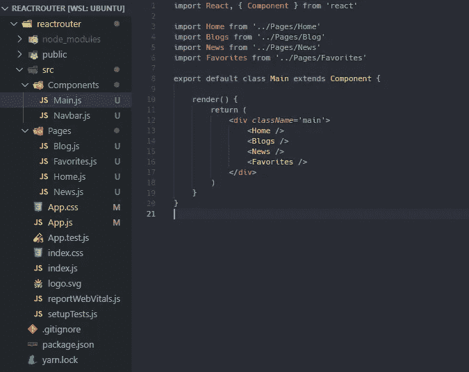

(注意:我决定让 Main.js 成为类组件的原因是因为这是我个人放置生命周期方法的地方。)

App.js:

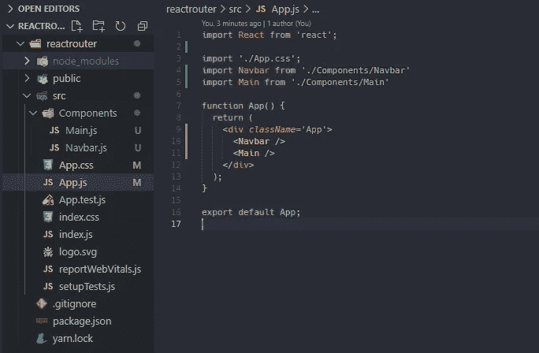

页面组件示例:

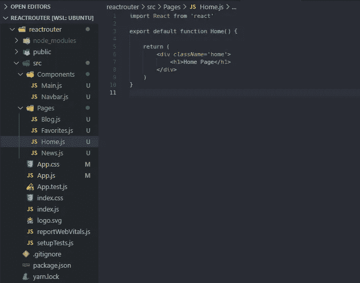

(注意:你的每一页都应该有一个 h1 来解释它是哪一页，这样我们就可以知道我们已经转到了正确的页面。)

您会注意到我们的 Navbar.js 当前返回一个空的 div。为了启动我们的导航栏，我们将创建一个无序列表，每个页面都有列表项。如果您目前在本地服务器上加载应用程序，您会注意到它需要一些更新的样式。

下面的 CSS 应该有助于做到这一点。您还会注意到，我们所有的页面组件都在一个接一个地呈现。别担心，补救办法就在前面。

Navbar.js

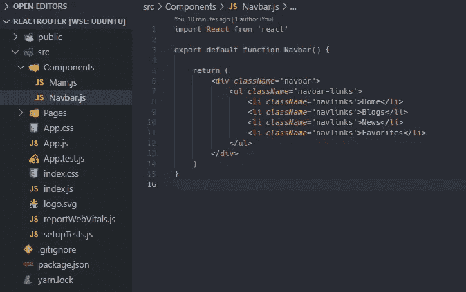

App.css

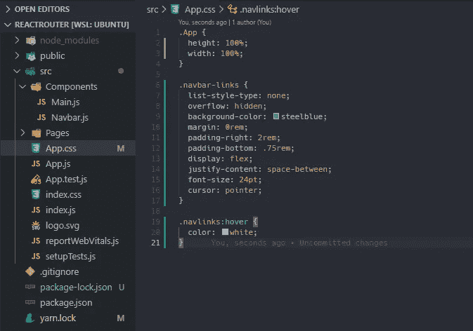

## 反应路由器

现在我们已经建立了我们的导航栏，我们应该设置我们的路线，这样我们的组件也可以在我们需要的时候呈现出来。 [React Router](https://reactrouter.com/) 将为我们完成所有繁重的工作，并使我们在整个应用程序中轻松导航。首先，我们需要使用以下命令安装 react。

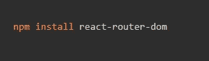

安装后，让我们前往我们的 index.js，因为需要进行一些更改。创建 React 应用程序后，您的当前和“股票”index.js 应该如下所示。

index.js:

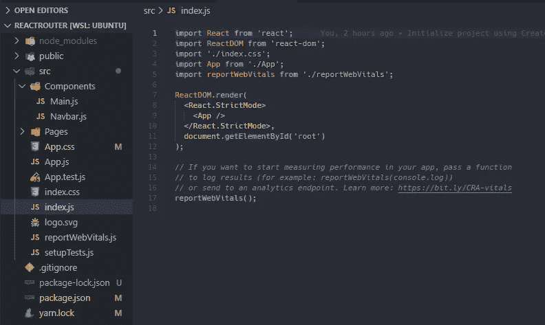

我们将需要从 react 路由器导入浏览器路由器，以及用路由器包装我们的应用程序，而不是 React 严格模式。这样做将允许我们在 App.js 及其子组件中创建路线。更新后的 index.js 应该如下所示。

index.js:

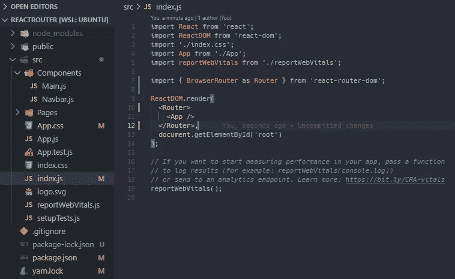

现在，我们的应用程序已经准备好了，让我们前往 Main.js 并开始这些路线。我们首先需要从 react 路由器导入重定向、路由和交换。这是我们将为基本路由实施的三个组件。为了开始，我们将简单地用 switch 包装我们导入的页面组件，就像这样。

Main.js

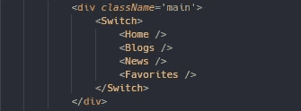

Switch 将查看当前 URL 及其子路由，并向您显示第一个匹配的视图或页面。这将有助于我们在需要时渲染路线，尤其是当我们一次只想显示一条路线时。这使我们处于建立路线的首要位置，这正是我们将要做的。

我们将在 route 中包装每个导入的页面组件，并确保包含路径。这将是页面所在位置的实际路径。例如，您的博客页面的路径将是/Blogs，因为它将是 yourwebsite.com/Blogs.

主页. js

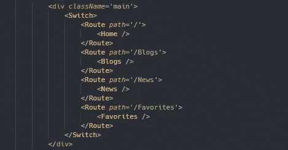

您可能会注意到，我们将主页的路径保留为空白，而不是在路径前添加/Home 和 exact。这是因为在大多数情况下，当用户访问您的站点时，您的主页将是第一个加载的页面，它代表站点的基本 URL。我们还使用精确路径来保证我们自己的家乡路径将总是带我们回家，因为 react 路由器在路由时使用部分匹配。

我们在 Main.js 中的最后一步是添加一个重定向，这也将有助于我们的部分路由。如果路径不存在，重定向会将用户发送到您指定的任何地方。在这种情况下，我们将重定向用户回到主页。您完成的 Main.js 应该是这样的。

Main.js

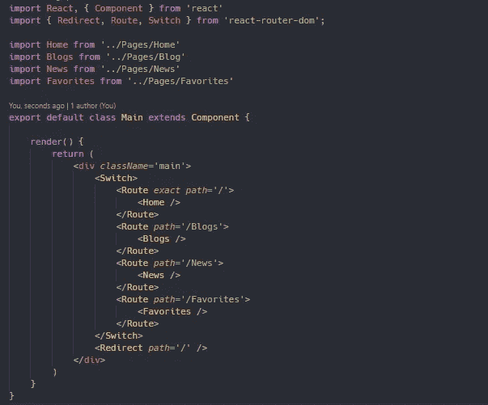

现在，我们已经创建了我们的路线，并设置了它们的路径，我们需要使我们的导航栏链接实际上，链接到我们不同的页面。为此，我们首先需要访问我们的 Navbar.js 并从 react router 导入链接，因为这是我们将使用的单一组件。

正如我们之前对路由器所做的那样，我们将使用 link 包装我们的每个导航链接。我们不是添加一条路径，而是添加到我们想去的地方。比如我们想去/博客。你更新后的 Navbar.js 看起来应该和一些 CSS 一样，以保持这些链接看起来不错。

Navbar.js:

App.css:

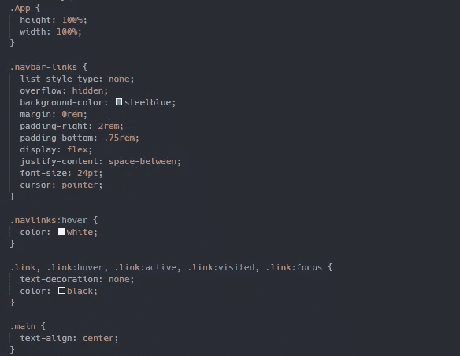

恭喜你！如果你一直跟随，你已经成功地在你的四个不同的显示页面之间创建了路线。您会注意到，每个页面都是单独呈现的，导航栏在整个用户体验中保持不变。您还可以通过查看当前 URL 来注意到您在访问博客、收藏夹或新闻时创建的路径。

如果您想查看一份已完成的回购副本，供您自己参考，您可以在此处找到它。

我要感谢你的阅读，并希望你学到了新的东西！