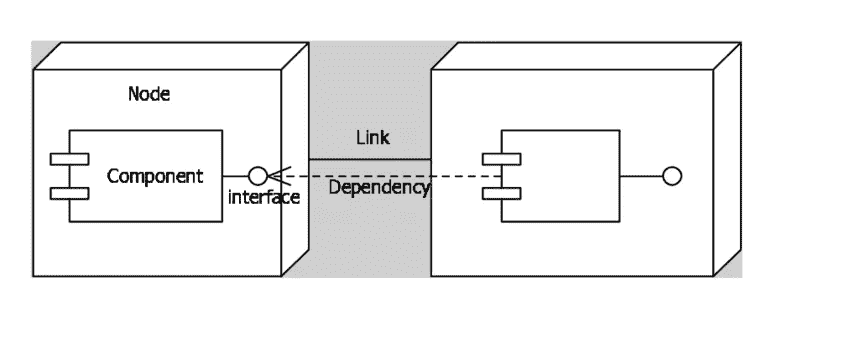
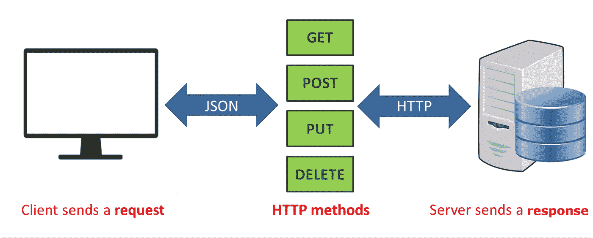
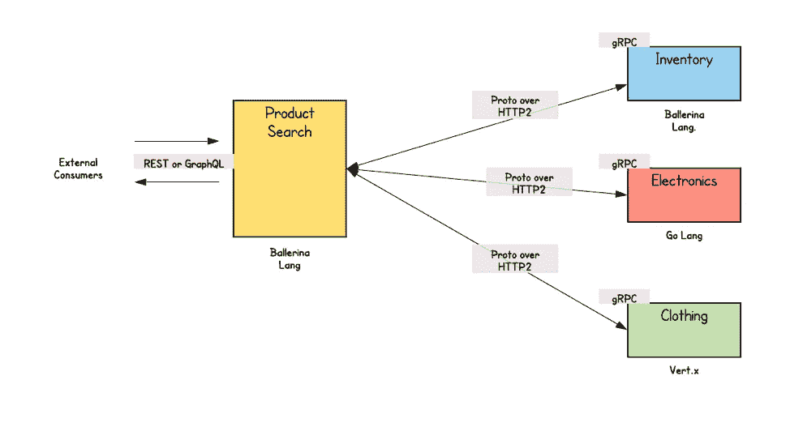
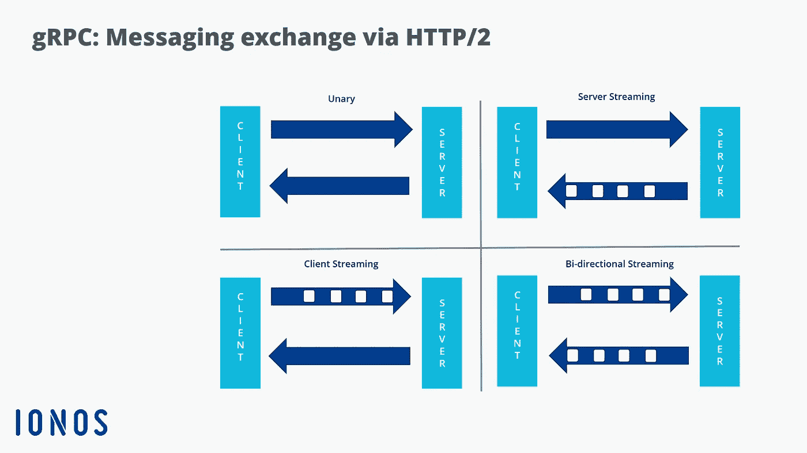
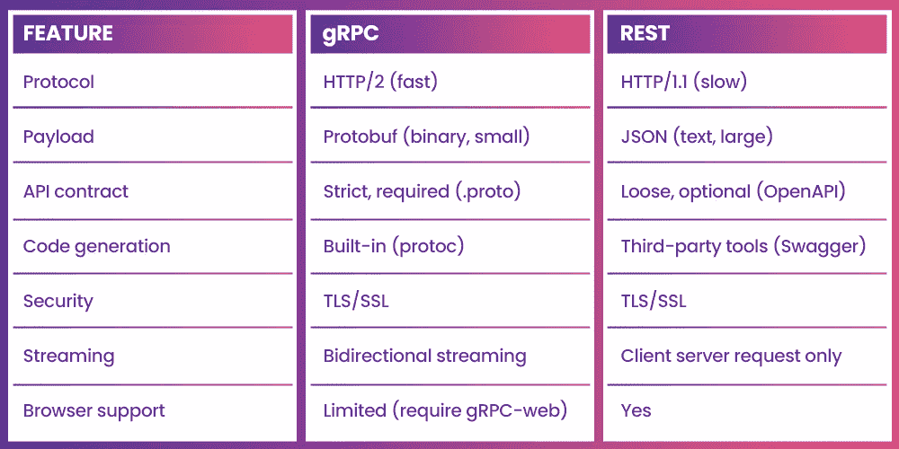

# (RPI)微服务通信模式

> 原文：<https://medium.com/nerd-for-tech/rpi-microservices-communication-pattern-693399942357?source=collection_archive---------1----------------------->

> 微服务必须与多个微服务通信，以便完成任何复杂的功能。为此，服务使用进程间通信协议。解决方法是利用 RPI 进行任何服务间的交流和协作。客户端使用同步协议向服务发出请求。

RPI 技术有很多例子

*   [休息](https://en.wikipedia.org/wiki/Representational_state_transfer)
*   [gRPC](http://www.grpc.io/)
*   [阿帕奇节俭](https://thrift.apache.org/)

但是我们将更多地讨论 REST 和 gRPC

# 什么是休息？

**REST(表述性状态转移)**是一种服务结构，支持客户端和服务器之间简单快速的通信。它是作为 SOAP 和基于 WSDL 的 Web 服务的替代品而开发的。

# REST 的指导原则:

*   无状态:无状态要求从客户端到服务器的每个请求必须包含理解和完成请求所需的所有信息。服务器不能利用任何先前存储在服务器上的上下文信息。
*   **统一接口**:通过将通用性原则应用于组件接口，我们可以简化整个系统架构，并提高交互的可见性。
*   **可缓存**:可缓存约束要求响应应该隐式或显式地将自己标记为可缓存或不可缓存。
*   **客户机-服务器**:客户机-服务器设计模式加强了关注点的分离，这有助于客户机和服务器组件独立发展。
*   **分层系统:**分层系统风格通过约束组件行为，允许一个架构由分层的层组成。
*   **按需编码** : REST 还允许通过下载和执行 applets 或脚本形式的代码来扩展客户端功能。

# 什么是 RESTful APIs？

现在是我们的定义。REST 是一组指导原则，软件可以使用它们通过互联网进行通信，以使集成变得简单和可伸缩。REST API(也称为“RESTful”API)是遵循这些准则的特定类型的 API。

为了理解 REST，我们需要首先回顾这些术语:

*   客户:使用 API 的个人或程序。客户端向 API 发出请求，以便检索某些信息或更改某些内容。
*   **资源**:API 可以提供给客户端的任何信息。每个资源都有一个唯一的名称，称为资源标识符。
*   **服务器**:由接收客户端请求的应用使用，包含客户端想要的资源。

# gRPC 是什么？

gRPC 是一个现代的开源高性能远程过程调用(RPC)框架，可以在任何环境中运行。借助对负载平衡、跟踪、健康检查和身份验证的可插拔支持，它可以高效地连接数据中心内和跨数据中心的服务。它也适用于分布式计算的最后一英里，将设备、移动应用程序和浏览器连接到后端服务(官方定义)。

它专注于高性能，并使用 **HTTP/2** 协议来传输二进制消息。它依靠**协议缓冲语言**来定义服务契约。协议缓冲区，也称为 **Protobuf** ，允许您定义在服务到服务的通信中使用的接口，而不考虑编程语言。

# **什么是协议缓冲语言？**

协议缓冲区是 Google 的语言中立、平台中立、可扩展的机制，用于序列化结构化数据——想想 XML，但是更小、更快、更简单。一旦定义了数据的结构化方式，就可以使用专门生成的源代码，使用各种语言轻松地将结构化数据写入各种数据流或从中读取。

# gRPC 是如何工作的？

在 **GRPC** 中，客户端应用程序可以直接调用不同机器上的服务器应用程序上的方法，如果它是一个本地对象的话，这让你很容易构建**分布式应用程序**和服务。

与许多 RPC 系统一样， **gRPC** 基于定义一个服务的思想，该服务指定可以用它们的参数和返回类型远程调用的方法。在服务器端，服务器实现这个接口并运行一个 **gRPC** 服务器来处理客户端调用。在客户端，客户端有一个存根，它提供与服务器相同的方法。

## gRPC 方法类型

gRPC 允许您定义四种服务方法:

**一元 RPC:** 客户端向服务器发送一个请求，然后返回一个响应，就像普通的函数调用一样。

**服务器流 RPC:** 客户端向服务器发送一个请求，得到一个流来读回一系列消息。客户端从返回的流中读取，直到不再有消息。

**客户端流 RPC:** 客户端编写一系列消息，并将其发送到服务器，同样使用提供的流。一旦客户端写完消息，它就等待服务器读取消息并返回响应。

**双向流 RPC:** 双方使用读写流发送一系列消息。这两个流独立运行，因此客户端和服务器可以按照他们喜欢的任何顺序进行读写。

# gRPC 与 REST

网上对比感谢 https://marutitech.com/rest-vs-grpc/

# HTTP 1.1 与 HTTP 2

**REST API**遵循通信的**请求-响应模型，该模型通常构建在 **HTTP 1.1** 之上。不幸的是，这意味着如果一个微服务接收到来自多个客户端的多个请求，该模型必须一次处理一个请求，从而降低整个系统的速度。**

gRPC 没有面临类似的障碍。它建立在 HTTP 2 之上，而是遵循一个**客户端-响应通信模型**。这些条件支持双向通信和流式通信，因为 gRPC 能够从几个客户端接收**多个请求，并通过不断流式传输信息来同时处理这些请求。**

# 有效载荷数据结构

gRPC 默认使用**协议缓冲区**来序列化有效载荷数据。这种解决方案更轻便，因为它支持高度压缩的格式，并减小了消息的大小。进一步说， [**Protobuf**](https://developers.google.com/protocol-buffers) 是二进制的；因此，它序列化和反序列化结构化数据，以便进行通信和传输。

相比之下，REST 主要依靠 JSON 或 XML 格式来发送和接收数据。事实上，尽管 JSON 没有强制要求任何结构，但它是最流行的格式，因为它具有灵活性和发送动态数据的能力，而不必遵循严格的结构。使用 JSON 的另一个重要好处是它的可读性，这是 Protobuf 还无法与之竞争的。尽管如此，在数据传输方面，JSON 并没有那么轻便和快速。

# 代码生成功能

与 gRPC 不同，REST API 不提供内置的代码生成功能，这意味着开发人员必须使用像 [Swagger](https://www.imaginarycloud.com/blog/flask-python/) 或 Postman 这样的第三方工具来为 API 请求生成代码。

相比之下， **gRPC 拥有本机代码生成特性**,这是由于它的 protoc 编译器，它与几种编程语言兼容。这对集成了用不同语言和平台开发的各种服务的**微服务系统**尤其有利。总而言之，内置的代码生成器也有利于创建 **SDK** (软件开发工具包)。

# **微服务哪个好？**

这是我的看法，但是根据下面的定义和比较，当我们谈论微服务架构内服务之间的通信时，我更喜欢使用 gRPC 而不是 REST APIs，因为:

*   比基于 JSON 的 RESTful API 更快
*   强类型和定义良好的接口
*   流支持
*   支持弹性
*   内置认证
*   加密
*   压缩
*   负载平衡
*   错误处理

# 接下来呢？

您可以看看微服务中的异步通信，尽管我们可以在请求者期望立即响应时进行同步请求/响应调用，我们在本文中讨论了基于事件和异步消息传递的集成模式提供了最大的可伸缩性和弹性。为了构建可扩展的架构。

# 参考资料:

*   [RESTful web API 设计](https://learn.microsoft.com/en-us/azure/architecture/best-practices/api-design)
*   [微服务架构](https://microservices.io/index.html)
*   [grpc.io](https://grpc.io/)