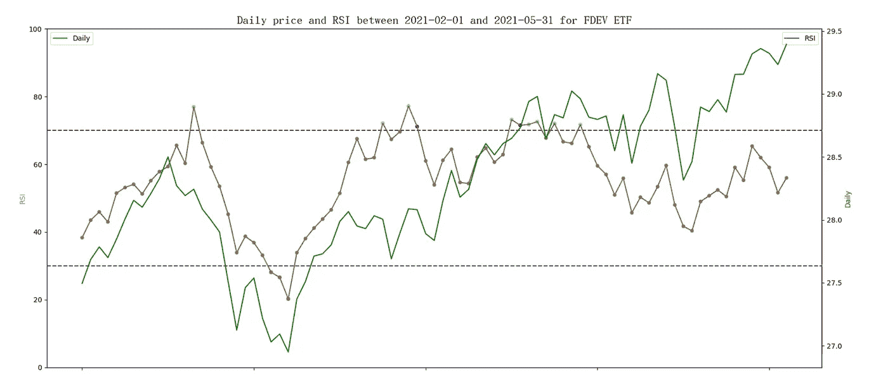
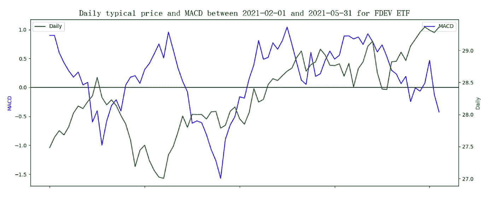
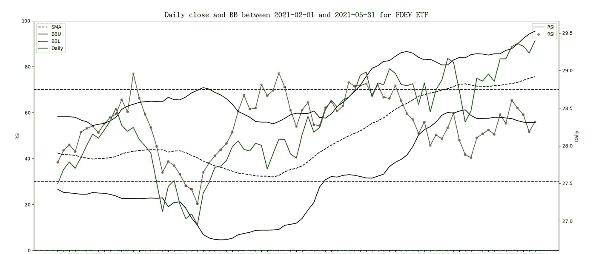
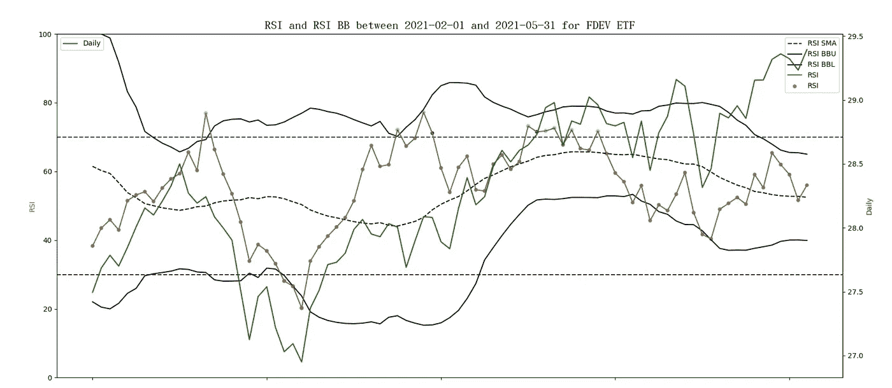

# RSI BB 还是 RSI & BB？简单，我们用 Elasticsearch 测试一下。

> 原文：<https://medium.com/nerd-for-tech/rsi-bb-or-rsi-bb-easy-lets-test-it-with-elasticsearch-51129e8819e5?source=collection_archive---------10----------------------->

相对强弱指数(RSI)是 J. Walles Widler Jr .在 1978 年提出的一个古老的技术分析指标。这是一个流行的指标，主要用于股票或商品的超买或超卖情况。像移动平均线的收敛和发散(MACD)，RSI 是一个趋势跟踪的动量指标。不同的是，它衡量的是盈亏的移动平均线，而不是价格变化的移动平均线。RSI 值在近期涨幅增大时增大，在近期跌幅增大时减小。

在我之前的文章“当 MACD 和 BB 在 Elasticsearch 中结合时”，我们知道 MACD 和 BB 是紧密结合在一起的。MACD BB 的计算是基于 MACD 值，而不是每日价格。然而，网络上出现的大多数同时使用 RSI 和 BB 的文章都是基于价格来构建 BB 的。根据文章“[,我如何创建布林线和 RSI 的交易策略？](https://www.investopedia.com/ask/answers/121014/how-do-i-create-trading-strategy-bollinger-bands-and-relative-strength-indicator-rsi.asp)”，笔者建议使用 RSI 作为补充，支持或消除 BB 提供的可能的价格走势。当价格到达布林带下轨(BBL)且 RSI 低于 30 时，超卖信号给人更多信心。当 RSI 读数为 70+且价格穿越布林带上轨(BBU)时，超买信号加强。在这篇文章中，我们将遵循 MACD BB 方法来快速检查 RSI BB，看看它是否有帮助。我们将使用 Elasticsearch 来演示实现，因为它展示了无缝集成，并且易于理解。推荐读者阅读我之前的文章，快速对 MACD BB 和使用 Elasticsearch 的实现细节有一个基本的了解。

如前所述，RSI 的计算涉及两类数据，近期总收益和近期总损失，周期通常为 14。收益被定义为当前价格高于先前价格时的差额。否则，增益为 0。同样，当当前价格小于先前价格时，亏损被定义为差额的绝对值。否则，损失为 0。对于一个窗口 *n* ，总近期收益除以总近期亏损等于总近期收益的简单移动平均(SMAgain， *n* )除以总近期亏损的简单移动平均(SMAloss，n)。这里需要提到的一点是，简单的移动平均线计算默认为过去的数据，但 RSI 包括当前数据。因此，我们需要将 SMA 右移 1 个数据，表示为 SMAgain， *n* ，1 和 SMAloss， *n* ，1。因此，RSI 的等式可以写成如下:


根据文章“[通过 Elasticsearch](https://wtwong316.medium.com/calculate-bollinger-band-width-through-elasticsearch-39f7f3a1ceff) 计算布林线宽度”，BB 是基于每日价格的 SMA 和标准差(SD)来构建 BBU 和 BBL 的。BB 的中线就是 SMA。滑动窗口是 20 或 26，标准偏差(n)的数量通常是 1 或 2。


如果使用 MACD BB 的相同概念，RSI BB 将定义如下:


在本文中，我们尝试将 RSI & BB 和 RSI BB 应用于免佣金的交易所交易基金(ETF)，并将 Elasticsearch 作为分析工具。下面的例子随机选择“富达国际多因子 ETF”。它的股票代码是 FDEV。数据选自 IEX 投资者交易所提供的 2021 年 2 月 1 日至 2021 年 5 月 31 日之间的时间范围。RSI 的窗口是 14。SMA 的窗口是 20，标准差的个数是 2。用图表来观察数值的变化要容易得多。在下面的两个图表中，RSI 首先与每日收盘价(每日)一起绘制。与之后显示的 MACD 对日线相比，RSI 似乎是一个更好的价格趋势跟踪指标。当然，这可能要视情况而定。超过 70 的点标记为水蓝色，低于 30 的点标记为红色。还观察到，所有的 RSI 在最后阶段都在 30 和 70 之间，所以 RSI 在那里不能提供任何帮助。



现在，让我们看看 RSI 如何帮助 BB 支撑或消除可能的价格趋势。下面的图表显示了使用与之前相同的时间框架的每日收盘价的 BB。当每日价格第一次到达 BBU 时，RSI 读数没有达到 70，这意味着超买的情况还没有到来。第一个蓝点(RSI 读数超过 70)出现在几个交易日之后，但是，价格低于前一个 BBU 交叉点。对于第一个 BBL 交叉点，RSI 读数不低于 30。所以超卖信号并没有被 RSI 强化。RSI 值在第二个 BBL 交叉点达到 30，价格比前一个低。这意味着它确实有助于贸易商以更低的价格购买。RSI & BB 还在最后阶段附近提供了两个 BBL 十字路口，以提供更多信息。



在我们考察了 RSI & BB 之后，我们来看看 RSI BB 的表现如何。下图显示了 RSI_BB，并使用了与之前相同的时间框架。基本上我们对 RSI_BBU 和 RSI_BBL 的第一个交叉点的结论和我们对 RSI & BB 得出的结论是相当一致的。在中间阶段，一个水蓝色的点到达 RSI_BBU，这可能反映了后来的价格下跌；然而，没有一个每日价格触及上图中的 BBU。嗯，很难猜测这意味着什么，因为价格线随着随后的上升趋势上下反弹。在最后阶段，由于 RSI BB 生成许多 RSI_BBL 交叉点，RSI & BB 似乎为上升趋势提供了更干净的信号。值得进一步研究相对强弱指标的布林线挤压，因为与相对强弱指标相比，它似乎提供了更早、更长的通道。



最后，让我们描述一下使用 Elasticsearch 的实现。假设有一个用数据填充的 Elasticsearch 索引，使用的数据映射与上一篇论文中描述的相同。以下步骤演示了 REST API 请求体的代码。

> 通过搜索操作收集所有相关文件

使用带有“must”子句的“bool”查询来收集符号为 FDEV 且日期在 2021–02–01 和 2021–05–31 之间的文档。由于 20 个交易日移动平均线的计算，额外数据调整 1 个月(从 2021 年 1 月 1 日至 2021 年 1 月 31 日)。

```
{
    "query": {
        "bool": {
            "must": [
                {"range": {"date": {"gte": "2021-01-01", "lte": "2021-05-31"}}},
                {"term": {"symbol": "FDEV"}}
            ]
        }
    },
```

> 提取基金的收盘价值

使用名为 RSI_BB 的“date_histogram”聚合，参数“field”为“date ”,参数“interval”为“1d ”,提取基金每天的价格。然后是名为 Daily 的“平均”聚合，以检索收盘价，因为后续的管道聚合不能直接使用文档字段。

```
 "aggs": {
        "RSI_BB": {
            "date_histogram": {
                "field": "date",
                "interval": "1d",
                "format": "yyyy-MM-dd"
            },
            "aggs": {
                "Daily": {
                    "avg": {"field": "close"}
                },
```

> 提取桶的日期

由于存在额外的数据，后续操作需要过滤掉超出范围的部分。一个名为“DateStr”的“min”聚合将获取存储桶的日期。在 Elasticsearch 服务器中，日期字段以纪元时间存储。时间单位是毫秒，时区是 UTC。

```
 "DateStr": {
                    "min": {"field": "date"}
                },
```

> 选择包含 1 个以上文档的存储桶

为了过滤掉空的时段(非交易日)，使用一个名为 SDaily 的“bucket_selector”聚合来选择文档计数大于 0 的时段。

```
 "SDaily": {
                    "bucket_selector": {
                        "buckets_path": {"count":"_count"},
                        "script": "params.count > 0"
                    }
                },
```

> 计算每日差异

使用名为 Diff 的“衍生”聚合，并使用参数“buckets_path”来指定每日收盘值，以计算与前一个值的差异。

```
 "Diff": {
                    "derivative": {
                        "buckets_path": "Daily" 
                     }
                },
```

> 确定每日值相对于之前的数据是盈利还是亏损

使用两个名为 Gain 和 Loss 的“bucket_script”聚合，并使用参数“buckets_path”来指定 Diff 聚合的结果以确定值。两个值都必须是正数。

```
 "Gain": {
                    "bucket_script": {
                        "buckets_path": {"Diff": "Diff"},
                        "script": "(params.Diff > 0) ? params.Diff : 0"
                    }
               }, 
               "Loss": {
                    "bucket_script": {
                        "buckets_path": {"Diff": "Diff"}, 
                        "script": "(params.Diff < 0) ? -params.Diff : 0"
                   }
               },
```

> 计算总收益和总损失的每日简单移动平均线

使用两个“移动 _fn”聚合，命名为 GainSMA 和 LossSMA，参数 window 为 14，参数“buckets_path”分别为增益和损耗。参数“shift”设置为 1，以包括当天和过去 13 个交易日的数据。SMA 是使用未加权平均函数(MovingFunctions.unweightedAvg)计算的。

```
 "GainSMA": {
                    "moving_fn": {
                        "script": "MovingFunctions.unweightedAvg(values)", 
                        "window": 14, "buckets_path": "Gain", "shift":1
                    }
                },
                "LossSMA": {
                    "moving_fn": {
                        "script": "MovingFunctions.unweightedAvg(values)", 
                        "window": 14, "buckets_path": "Loss", "shift":1
                    }
                },
```

> 计算 RSI

使用名为 RSI 的“bucket_script”聚合和参数“buckets _ path”来指定 GainSMA 和 LossSMA 的结果。然后根据脚本中的等式计算 RSI 指标。

```
 "RSI": {
                    "bucket_script": {
                        "buckets_path": {
                            "GainSMA": "GainSMA", "LossSMA": "LossSMA"}, 
                            "script": "100 - 100/(1+params.GainSMA/params.LossSMA)"
                        }
                },
```

> 识别 RSI 值的类型

a)使用名为 RSI_Diff 的“衍生”聚合，并带有参数“buckets_path”来指定 RSI 的值，以确定它是相对于前面时间戳的 RSI 的增量还是减量。

```
 "RSI_Diff": {
                    "derivative": {"buckets_path": "RSI"}
                },
```

b)使用名为 RSIType 的“bucket_script”聚合，并使用参数“buckets_path”来指定 RSI_Diff 聚合的结果，以对 RSI 值的类型进行分类。
➤类型 1 如果 RSI < = 30 和 RSI_Diff < 0
➤Type 2 如果 RSI < = 30 和 RSI_Diff > 0
➤Type 3 如果 RSI > = 70 和 RSI_Diff > 0
➤Type 4 如果 RSI > = 70 和 RSI_Diff < 0
➤Type 0 其他情况

```
 "RSIType": {
                    "bucket_script": {
                        "buckets_path": {"RSI": "RSI", "RSI_Diff": "RSI_Diff"},
                        "script": "(params.RSI >= 70) ? (params.RSI_Diff > 0 ? 3:4) : (params.RSI <= 30) ? (params.RSI_Diff > 0 ? 2:1):0"
                    }
                },
```

c)计算 RSI_SMA、RSI_SD、RSI_BBU 和 RSI_BBL

参考 MACD BB 的实现，使用两个“移动 _fn”聚合，命名为 RSI_SMA 和 RSI_SD，计算 RSI 值的 20 天简单移动平均线和标准差。然后根据 BB 上带和下带的定义写两个“bucket_script”聚合，RSI_BBU 和 RSI_BBL。

```
 "RSI_SMA": {
                    "moving_fn": {
                        "script": "MovingFunctions.unweightedAvg(values)", 
                        "window": 20, "buckets_path": "RSI"
                    }
                }, 
                "RSI_SD": {
                    "moving_fn": {
                        "script": "MovingFunctions.stdDev(values, MovingFunctions.unweightedAvg(values))", 
                        "window": 20, "buckets_path": "RSI"
                    }
                }, 
                "RSI_BBU": {
                    "bucket_script": {
                        "buckets_path": {"SMA": "RSI_SMA", "SD": "RSI_SD"}, 
                        "script": "params.SMA + 2 * params.SD"
                    }
                }, 
                "RSI_BBL": {
                    "bucket_script": {
                        "buckets_path": {"SMA": "RSI_SMA", "SD": "RSI_SD"}, 
                        "script": "params.SMA - 2 * params.SD"
                    }
                },
```

d)计算形状记忆合金、标准差、BBU 和 BBL

参考 BB 的实现，使用两个“移动 _fn”聚合，命名为 SMA 和 SD，计算日收盘价的 20 天简单移动平均和标准差。然后根据 BB 上带和下带的定义写两个“bucket_script”聚合，BBU 和 BBL。

```
 "SMA": {
                    "moving_fn": {
                        "script": "MovingFunctions.unweightedAvg(values)", 
                        "window": 20, "buckets_path": "Daily"
                    }
                }, 
                "SD": {
                    "moving_fn": {
                        "script": "MovingFunctions.stdDev(values, MovingFunctions.unweightedAvg(values))", 
                        "window": 20, "buckets_path": "Daily"
                    }
                }, 
                "BBU": {
                    "bucket_script": {
                        "buckets_path": {"SMA": "SMA", "SD": "SD"}, 
                        "script": "params.SMA + 2 * params.SD"
                    }
                }, 
                "BBL": {
                    "bucket_script": {
                        "buckets_path": {"SMA": "SMA", "SD": "SD"}, 
                        "script": "params.SMA - 2 * params.SD"
                    }
                },
```

> 筛选出要输出的附加文档

使用“bucket_selector”聚合，名为 SRSI_BB，参数“buckets_path”为“DateStr ”,以选择“script”语句中指定的正确存储桶。选择标准是那些日期在 2021 年 2 月 1 日或之后的存储桶(纪元时间 1612137600000 毫秒)。

```
 "SRSI_BB": {
                    "bucket_selector": {
                        "buckets_path": {"DateStr":"DateStr"},
                        "script": "params.DateStr >= 1612137600000L"
                    }
                }
            }
        }
    },
    "size": 0
}
```

> 收集完结果后，我们就可以画出如图所示的图形了。类型 3 的点颜色是水蓝色，类型 4 是蓝色，类型 1 是红色，类型 2 是橙色，其他是灰色。

读者可以进一步参考 GitHub 上的开源项目(RSI _ BB)[https://github.com/wtwong316/RSI_BB](https://github.com/wtwong316/RSI_BB.git)

备注:
一、感谢 IEX(投资者交易所)提供 ETF 数据，GitHub 提供开源项目存储。
二。本文基于一种技术思路，不构成任何投资建议。读者在使用时必须承担自己的责任。
三世。文章可能还有错误，恳请读者指正。
四。感兴趣的读者可以参考作者撰写的《弹性搜索的基本技巧》一书。《高级弹性搜索 7.0》，2019 年 8 月，Packt，ISBN: 9781789957754。