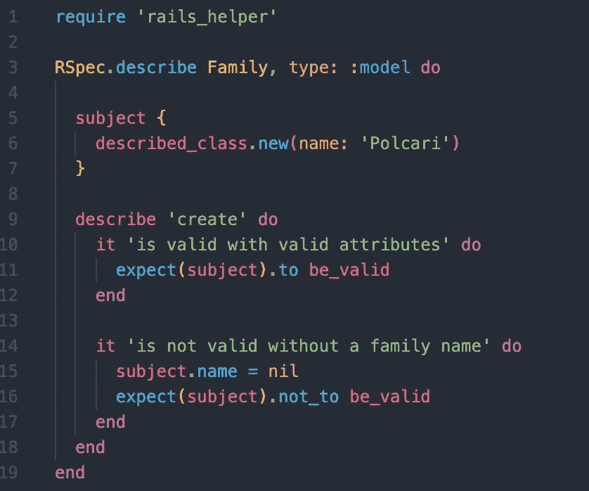
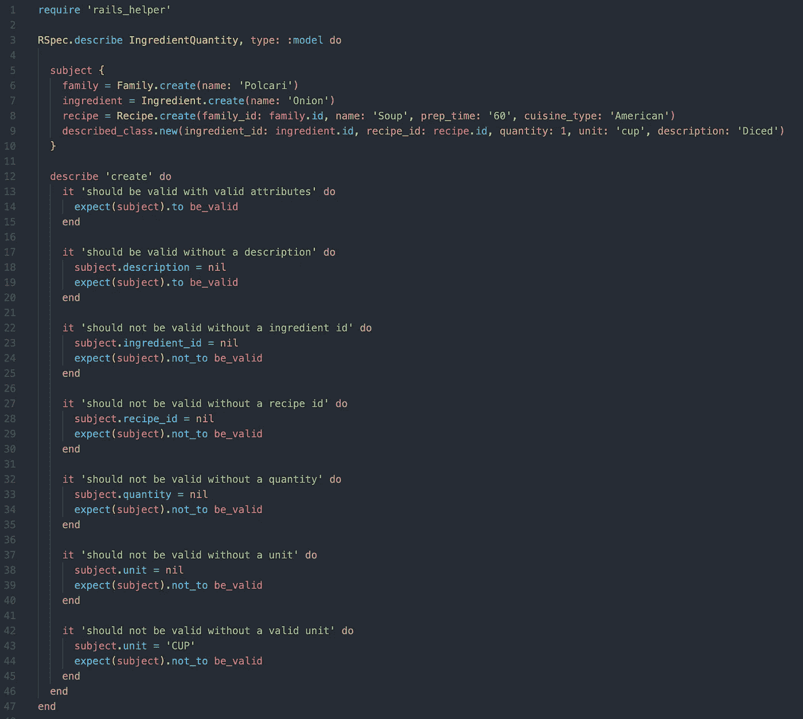
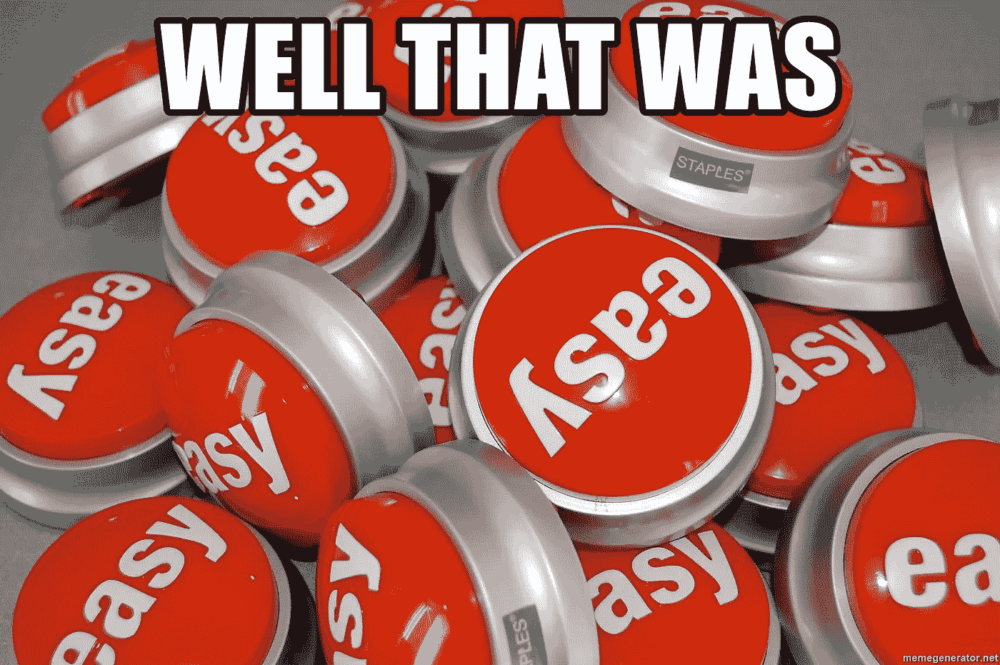

# RSpec:使用主题测试模型

> 原文：<https://medium.com/nerd-for-tech/rspec-using-subject-to-test-models-92be4a093d7e?source=collection_archive---------5----------------------->

照片由[路易斯·里德](https://unsplash.com/@_louisreed)经由[unsplash.com](https://unsplash.com/photos/pwcKF7L4-no)拍摄

过去几周我一直在做一个新项目，并决定学习如何使用 RSpec 并为我的 Rails 后端编写测试。事实证明，这比我想象的要容易得多，尤其是在我了解了 RSpec 的主题之后。

我写的第一个测试围绕着我在 Rails 中的模型。我想确认我写的关系和验证工作正常。现在我知道这不符合正常的红灯，绿灯，重构方法论，但这是我的第一次，所以我希望你能给我一个通行证。

我第一次尝试写测试时非常草率，一点也不枯燥。我为每个测试创建单独的变量，因此每个测试重复四到五行代码。真是一团糟。当我去重构这些测试时，我发现了 RSpec 提供的主题。

希望这篇文章能帮助你了解更多关于 RSpec 的知识，并使你能像我一样编写更干燥的测试。

我从一个名为 [RelishApp](https://relishapp.com/rspec/) 的网站上发现了 Subject 关键字，这个网站上有很多关于 RSpec 的有用资料。根据这个网站:

> 如果一个示例组的第一个参数是一个类，那么这个
> 类的一个实例通过`subject`
> 方法暴露给这个示例组中的每个示例。— RelishApp

在 Rails 中测试我们的模型时，我们实际上是在测试一个 Ruby 类，这意味着我们可以访问这个类的一个实例。现在 RSpec 将隐式地给我们这个类的一个实例，但是如果我们想要操作那个实例呢？

我们可以显式地定义该实例看起来像什么，这允许我们通过 ActiveRecord 利用关系。看看下面的例子。

显示主题关键字使用的简单示例。

如您所见，我们可以使用 subject 关键字定义 subject，并使用`described_class.new`方法创建一个新实例，类似于我们使用类名创建一个新实例的方式。`described_class`在这个例子中引用了 Family 类。我们在这里所做的就是让我们编写的每个测试访问一个名为 Polcari 的家族实例。

这是一个非常简单的例子，没有任何关系。让我们来看一个具有多个关系的更复杂的实例。

使用 Subject 关键字显示 ActiveRecord 关系的示例。

在这个例子中，我们创建了几个不同类的实例，作为我们的主题实例将依赖的变量。这样，我们可以在我们的主题实例中引用它们各自的 id。

我想指出的另一点是，以一种有效的方式创建你的主题是非常有帮助的。这使得编写隔离缺失变量的单独测试变得容易得多。

我们不是为每个测试创建一个新的实例并忽略一个变量，而是创建一个有效的主题，然后在运行测试之前更改我们想要隔离的一个参数。请看从第 17 行开始的测试。

我们在模型中的验证要求描述参数存在。既然我们有一个有效的 subject 实例，我们所要做的就是将描述重新分配给一个无效的输入，比如 nil，然后我们就可以测试我们的验证是否正常工作。

这是因为每个测试都会接收到一个与 subject 关键字定义的主题相匹配的新实例。正如您所看到的，使用这种方法会产生非常枯燥的测试，可以用来准确、轻松地测试我们所有的验证。

如果你有任何其他使用 RSpec 编写测试的酷技巧，我很乐意在下面的评论中听到。