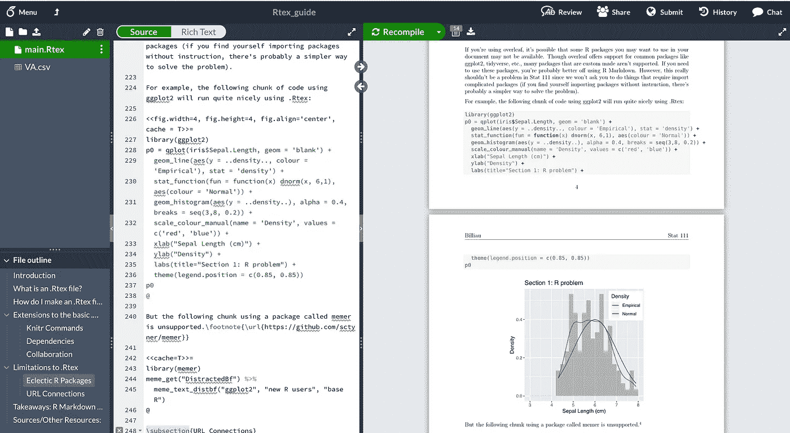

# 带背面的 rtex:Rmd 的完美替代方案

> 原文：<https://medium.com/nerd-for-tech/rtex-with-overleaf-a-beautiful-alternative-to-rmd-b2872ee70b6f?source=collection_archive---------1----------------------->

带背面的 Rtex

> 关于 Rtex 文件，如何制作它们，以及 Rtex 与 R Markdown 相比如何，你需要知道的一切

# 一封致统计学同学的公开信，

我决定在大二秋季主修统计学，同时选修 *Stat 110:概率介绍*，因为我喜欢解决有趣的问题。抛硬币！赌博…