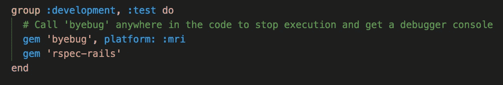
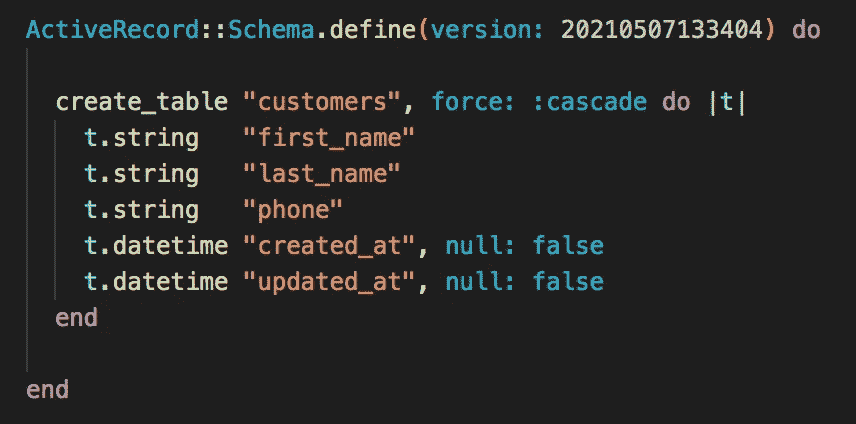
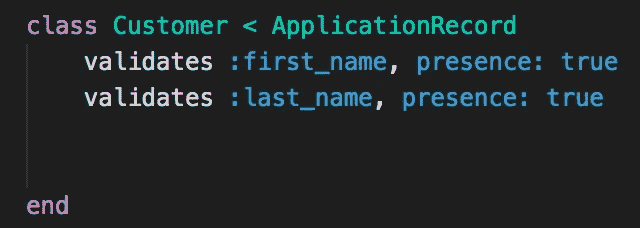
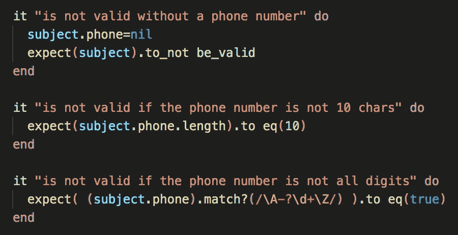

# 用 RSpec 测试 Ruby on Rails:编写您的第一个测试

> 原文：<https://medium.com/nerd-for-tech/ruby-on-rails-testing-with-rspec-writing-your-first-tests-6330920928fd?source=collection_archive---------1----------------------->

## 考试并不总是很难或者很可怕。作为一名开发人员，如何在早期编写自己的测试对您有长期的好处

如果你和我一样，那么当我说我有*总是*可怕的评估时，你就会明白我从何而来。也许是焦虑，缺乏知识，或者是在压力下表演(*或者也许是所有这些…* )。不管怎样，这是一种我从未克服的恐惧，至今仍未克服。

然而，随着年龄的增长，我越来越能接受考试和考试背后的目的。是的，他们仍然很可怕，并将永远如此，但如果我们不把他们看作，“*明白了！你仍然不够聪明*”更重要的是，作为一个衡量你进步如何和你需要改进的地方的标尺 ***，这并不坏。***


至少从这里只有一条路可走！

测试你的代码应该以同样的方式来看待。

是的，一次失败的测试仍然可能是令人生畏的(我仍然不能克服看起来可怕和刻薄的红色文本)，但它使我们免于进一步的困难。将测试视为检查点——每个测试都可以检查特定的特性是否仍然通过。当我们扩展应用程序并添加越来越多的功能时，我们希望确保我们以前的功能仍然有效。否则，我们会有一个烂摊子。

想象一下，如果我们不断地添加功能，但没有在过程中测试我们的代码，却发现我们的代码被破坏了，我们不能准确地指出它在何时何地被破坏。我们将不得不一步一步地返回并测试*所有的东西—* 这将是超级低效的&让开发人员感到沮丧！

事实上，围绕这个概念有一整套软件开发方法，叫做**测试驱动开发**。

# 测试驱动开发(TDD)

根据网站 Guru99 的定义:

*“TDD 是一种软件开发方法，在这种方法中，开发测试用例来指定和验证代码将做什么。简而言之，首先创建并测试每个功能的测试用例，如果测试失败，则编写新代码以通过测试，使代码简单且无错误"*

如上所述，我们为应用程序的每个功能编写测试用例，甚至是一个小功能。如果一个测试失败了，我们作为开发人员应该回去写新的代码来解决这个问题。

值得注意的是，这个概念围绕着我们在开发(或编写新代码)之前编写和纠正代码*的想法。这确保了我们保持代码的整洁，每次编写少量的代码，并避免重复的代码。*

# RSpec 和通用测试类型

在本文中，我们将介绍 RSpec gem，它是测试 Rails 应用程序最常用的工具。

作为开发人员，在您的旅程中会遇到一些常见的测试类型。它们是:

1.  模型测试:模型应该验证的测试，并且所有的方法都有效。
2.  请求测试:测试控制器是否做了它应该做的事情，无论是处理 HTTP 请求还是 API 端点
3.  功能测试:测试 web 应用程序执行浏览器操作、在字段中输入数据、点击按钮和其他功能
4.  系统测试:应用程序的端到端测试

在本文中，我们将关注模型测试。

# 正在设置

在开始之前，我们需要将 rspec-rails gem 添加到我们的 Gemfile 中。在添加这个 gem 之后，我们还需要做一个包安装。这个 gem 可以添加到 gem 文件的:development::test 部分下。



添加后别忘了捆绑安装！

将您的模式设置为如下所示——我们将使用一个具有 first_name、last_name 和 phone 属性的客户模型。



在您的终端中输入以下命令来完成 rspec 的设置并设置测试数据库

```
bin/rails generate rspec:install
bin/rails db:migrate db:test:prepare
```

然后，输入这些命令来为客户模型和客户控制器设置测试类的外壳。

```
bin/rails generate rspec:model Customer
bin/rails generate rspec:request Customer
```

在这些命令之后，将会生成两个测试用例文件的外壳。这些是:

```
./spec/models/customer_spec.rb
./spec/request/customer_spec.rb
```

我们现在可以通过在命令行中键入“rspec”来运行 rspec！

# 编写我们的第一个测试

现在我们已经设置好了，让我们向您介绍一些 rspec 特定的语法并编写一些测试

```
require 'rails_helper'RSpec.describe Customer, type: :model do
  subject { Customer.new(first_name: "Jack", last_name: "Smith", phone: "8889995678", email: "jsmith@sample.com" )} it "is valid with valid attributes" do
    expect(subject).to be_valid
  end
  it "is not valid without a first_name" do
    subject.first_name=nil
    expect(subject).to_not be_valid
  end
  it "is not valid without a last_name" do
    subject.last_name=nil
    expect(subject).to_not be_valid
  endit "is not valid without a phone number"    
it "is not valid if the phone number is not 10 chars"   
it "is not valid if the phone number is not all digits"end
```

让我们来分析一下上面的片段中发生了什么:

1.  Rspec.describe do…end 块*描述*对象的类型(在我们的例子中，是一个模型类，*应该*做*)。*
2.  主题设置好了，就是一段样本数据。在我们的例子中，我们有一个样本客户对象
3.  “it”块陈述了测试用例的预期结果。
4.  “expect”关键字陈述了测试的预期结果，因此每个测试用例都有一个或多个预期结果。

如果我们编写一个没有 do…end 的“it”块，那么它就是一个*挂起*的测试用例，这意味着测试还没有被编写。

让我们看看有书面预期结果的前三个测试。第一个测试只是测试我们的客户是否具有所有有效的属性。

接下来的两个测试客户是否有名字和姓氏。如果缺少其中一项(或两项)，客户将无效。

那么我们如何检查这个呢？我们可以在我们的客户模型中编写验证！

搜索 Rails 文档，我们可以使用 *presence* 来检查它是否存在:



在我们的命令行中运行 rspec，我们应该看到除了 3 个待定测试之外，所有的测试都通过了。我们现在就解决这个问题。

我们的第一个未决测试与我们看到的类似，因为我们想要检查一个电话号码是否存在。我们可以再次使用相同的语法，也就是说，如果值=nil，我们期望对象是无效的。

至于剩下的两个测试，我们可以使用内置的 length 方法来检查那个属性是否等于 10 个字符，使用正则表达式来检查所有的字符是否都是数字。



再次查看 Rails 文档，我们可以在客户模型中使用*数值*和*长度*编写一些额外的验证


在您的终端中再次运行 rspec。我们所有的测试现在都应该通过了！

# 结论

祝贺您编写了第一个测试！希望介绍一些简单的测试将有助于消除你对编写和通过测试的恐惧。在开发生涯的早期被介绍给测试当然可以帮助你成为一个更好的开发人员，并改变你对如何使用测试的观点。

请记住，编写大量的测试来测试每一个特性将有助于您在扩展应用程序时进行调试。

# 来源

什么是测试驱动开发(TDD)？举例教程【https://www.guru99.com/test-driven-development.html】T5

# 额外资源

Semaphore:如何用 RSpec
[测试 Rails 模型 https://semaphore ci . com/community/tutorials/How-to-Test-Rails-Models-with-RSpec](https://semaphoreci.com/community/tutorials/how-to-test-rails-models-with-rspec)